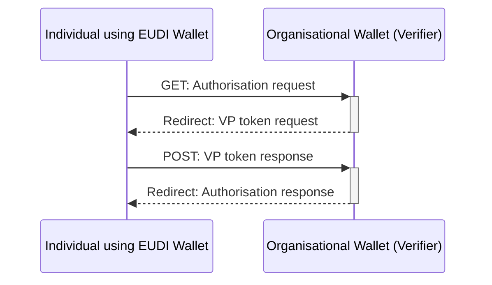

# EWC RFC002: Present Verifiable Credentials - v1.0

**Authors:** 
* Mr George Padaytti (iGrant.io, Sweden)
* Mr Lal Chandran (iGrant.io, Sweden)

<Please add if you wish to be an author>

**Reviewers:** 

* Dr Nikos Triantafyllou (University of the Aegean, Greece)
* Mr Florin Coptil (Bosch, Germany)
* Mr Matteo Mirabelli (Infocert, Italy)
* Dr Mikael Linden (Vero, Finland) 
* Mr Andreas Abraham (ValidatedID, Spain)
* Mr Renaud Murat (Archipels, France)
* Mr. Sebastian Bickerle (Lissi ID, Germany)

<Please add your name as a reviewer once you review>

**Status:** Work in Progress, Ready for review by 12-Feb-2024

**Table of Contents**

- [EWC RFC002: Present Verifiable Credentials - v1.0](#ewc-rfc002-present-verifiable-credentials---v10)
- [1.0	Summary](#10summary)
- [2.0	Motivation](#20motivation)
- [3.0	Messages](#30messages)
  - [3.1	Authorisation request](#31authorisation-request)
  - [3.2	Authorisation response](#32authorisation-response)
- [4.0	Alternate response format](#40alternate-response-format)
- [5.0	Implementors](#50implementors)
- [6.0	Reference](#60reference)


# 1.0	Summary

This specification implements the OID4VCI workflow for any verifier (relying party) as per reference specification [1]. This minimises risks towards interoperability across the European Wallet Ecosystem with a standard specification in the EUDI wallet ecosystem as per the ARF [2] requirements. 

# 2.0	Motivation

The EWC LSP must align with the standard protocol for issuing credentials. This is the basis of interoperability between Verifies (Relying Parties) and Holders across the EWC LSPs. The assumption is that the user is familiar with the EWC-chosen protocols and standards and can refer to original standards references when necessary.

# 3.0	Messages


Figure 1: Authorisation Code Flow based on [1]

## 3.1	Authorisation request

Authorisation requests can be presented to the wallet by verifying in two ways. 1) by value 2) by reference as defined in JWT-Secured Authorization Request (JAR) [3]. The custom URL scheme for authorisation requests is `openid4vp://`. An  example is given below:

```
openid4vp://?client_id=https://example.verifier.com&response_type=vp_token&scope=openid&redirect_uri=https://example.verifier.com/direct_post&request_uri=https://example.verifier.com/verifiable-presentation/e93c7ff6-c5b7-4619-8060-2ef4a66b0bb2&response_mode=direct_post&state=100b8521-461e-4f79-931e-ea5710c4fa5c&nonce=e6759e72-37e4-42f7-ab48-a9368971620f&presentation_definition={"id":+"2e3975b7-4834-4650-a97b-5c4f1cdf5f57",+"format":+{"jwt_vc":+{"alg":+["ES256"]},+"jwt_vp":+{"alg":+["ES256"]}},+"input_descriptors":+[{"id":+"841fd89b-f987-4052-88fc-30affccfd99c",+"constraints":+{"fields":+[{"path":+["$.type"],+"filter":+{"type":+"array",+"contains":+{"const":+"VerifiablePortableDocumentA1"}}}]}}]}
```

The authorisation request will contain the following fields:

<table>
  <tr>
   <td><code>client_id</code>
   </td>
   <td>Verifier identifier for .e.g URI / DID. This value must be present in <code>sub</code> field of the verifiable presentation JWT
   </td>
  </tr>
  <tr>
   <td><code>response_type</code>
   </td>
   <td>The value must be <code>vp_token</code>
   </td>
  </tr>
  <tr>
   <td><code>scope</code>
   </td>
   <td>The value must be <code>openid</code>
   </td>
  </tr>
  <tr>
   <td><code>response_uri</code>
   </td>
   <td>This should be present when the <code>response_mode</code> is <code>direct_post</code>. 
   </td>
  </tr>
  <tr>
   <td><code>response_mode</code>
   </td>
   <td>The value must be <code>direct_post</code>
   </td>
  </tr>
  <tr>
   <td><code>state</code>
   </td>
   <td>The client uses an opaque value to maintain the state between the request and callback.
   </td>
  </tr>
  <tr>
   <td><code>nonce</code>
   </td>
   <td>Securely bin verifiable presentations provided by the wallet to a particular transaction
   </td>
  </tr>
  <tr>
   <td><code>presentation_definition</code>
   </td>
   <td>The verifier requires proof. It must conform to the DIF Presentation Exchange specification [4].
   </td>
  </tr>
</table>

If `request_uri` field is present in the authorisation request, it means the authorisation request is presented by reference. Request URI has to be resolved to obtain the JWT, which contains the above fields in the claims.

## 3.2	Authorisation response

Authorisation response is sent by constructing the VP token and presentation submission values. Verifiable credentials matching the input descriptor constraints are embedded in the VP token. Presentation submission contains the descriptor map conveying which verifiable credentials are satisfying corresponding input descriptor constraints. Both `vp_token` and `presentation_submission` are sent by HTTP POST to the direct post endpoint. 

```
HTTP POST https://example.verifier.com/direct_post
application/x-www-form-urlencoded&vp_token=eyJraWQiOiJk...Z-1_msCBcxh7XEA
&presentation_submission={"definition_id":"9a044aea-275d-43d6-8ec4-0ae88df46256","descriptor_map":[{"format":"jwt_vp","id":"2cfa0952-76ae-4172-a1c1-d223a8c00ce8","path":"$","path_nested":{"format":"jwt_vc","id":"2cfa0952-76ae-4172-a1c1-d223a8c00ce8","path":"$.verifiableCredential[0]"}}],"id":"f7a98fa3-23b8-4d01-a656-b7f9f95ee470"}
&state=475e634e-2633-4235-953d-eb879334cae7
```
# 4.0	Alternate response format

Standard HTTP response codes shall be supported. Any additional ones can 

```json
{
  "error": "invalid_request",
  "error_description": "Verification failed"
}
```
Some of the identifier deviations from success responses are as given:

<table>
  <tr>
   <td><strong>Response format</strong>
   </td>
   <td><strong>Description</strong>
   </td>
  </tr>
  <tr>
   <td>invalid_request
   </td>
   <td>Verification failed
   </td>
  </tr>
</table>

# 5.0	Implementors

<table>
  <tr>
   <td><strong>Wallet</strong>
   </td>
   <td><strong>Link, if any</strong>
   </td>
   <td><strong>ITB compliance</strong>
   </td>
  </tr>
  <tr>
   <td>Amadeus
   </td>
   <td><a href="https://tid-wallet-dev.azurewebsites.net/">https://tid-wallet-dev.azurewebsites.net/</a> 
   </td>
   <td>
   </td>
  </tr>
  <tr>
   <td>iGrant.io Enterprise Wallet
   </td>
   <td><a href="https://business.igrant.io/">https://business.igrant.io/</a> 
   </td>
   <td>Planned Mar’23
   </td>
  </tr>
  <tr>
   <td>iGrant.io Data Wallet
   </td>
   <td><a href="https://apple.co/2Mz9nJp">iOS</a>, <a href="https://play.google.com/store/apps/details?id=io.igrant.mobileagent">Android</a>
   </td>
   <td>Planned Mar’23
   </td>
  </tr>
  <tr>
   <td>ValidatedID
   </td>
   <td>
   </td>
   <td>
   </td>
  </tr>
  <tr>
   <td>UAegean 
   </td>
   <td>
   </td>
   <td>
   </td>
  </tr>
</table>

# 6.0	Reference

1. OpenID Foundation (2023), 'OpenID for Verifiable Presentations (OID4VP)', Available at: [https://openid.net/specs/openid-4-verifiable-presentations-1_0.html](https://openid.net/specs/openid-4-verifiable-presentations-1_0.html) (Accessed: February 1, 2024).
2. European Commission (2023) The European Digital Identity Wallet Architecture and Reference Framework (2023-04, v1.1.0)  [Online]. Available at: [https://github.com/eu-digital-identity-wallet/eudi-doc-architecture-and-reference-framework/releases](https://github.com/eu-digital-identity-wallet/eudi-doc-architecture-and-reference-framework/releases) (Accessed: October 16, 2023).
3. RFC 9101 OAuth 2.0 Authorization Framework: JWT-Secured Authorization Request (JAR) [https://www.rfc-editor.org/rfc/rfc9101.html#name-request-using-the-request_u](https://www.rfc-editor.org/rfc/rfc9101.html#name-request-using-the-request_u)  (Accessed: February 05, 2024)
4. DIF Presentation Exchange:  [https://identity.foundation/presentation-exchange](https://identity.foundation/presentation-exchange)  (Accessed: February 07, 2024)