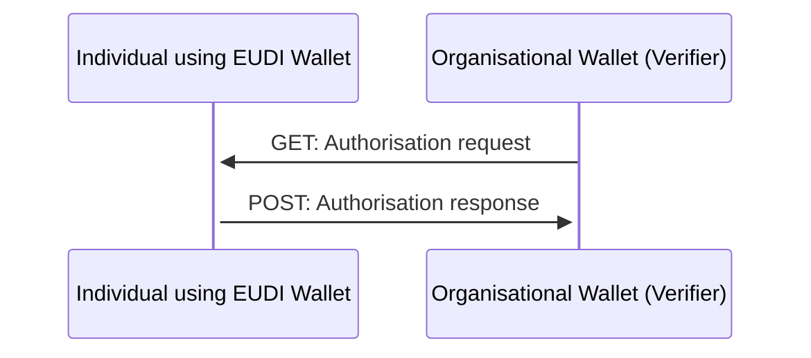
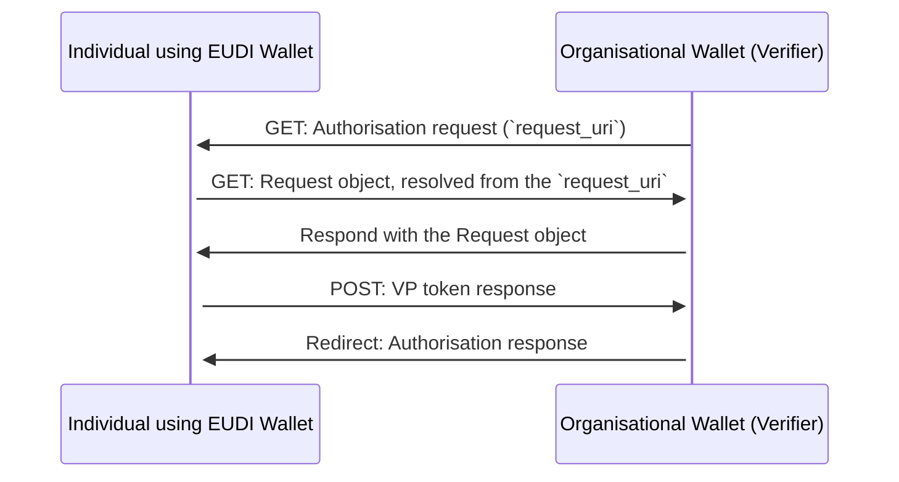

# EWC RFC002: Present Verifiable Credentials - v1.0

**Authors:** 
* Mr George Padaytti (iGrant.io, Sweden)
* Mr Lal Chandran (iGrant.io, Sweden)
* Dr Andreas Abraham (ValidatedID, Spain)

<Please add if you wish to be an author>

**Reviewers:** 

* Dr Nikos Triantafyllou (University of the Aegean, Greece)
* Mr Florin Coptil (Bosch, Germany)
* Mr Matteo Mirabelli (Infocert, Italy)
* Dr Mikael Linden (Vero, Finland) 
* Mr Renaud Murat (Archipels, France)
* Mr. Sebastian Bickerle (Lissi ID, Germany)
<Please add your name as a reviewer once you review>

**Status:** Work in Progress, Ready for review by 12-Feb-2024

**Table of Contents**

- [EWC RFC002: Present Verifiable Credentials - v1.0](#ewc-rfc002-present-verifiable-credentials---v10)
- [1.0	Summary](#10summary)
- [2.0	Motivation](#20motivation)
- [3.0	Messages](#30messages)
  - [3.1	Authorisation request](#31authorisation-request)
  - [3.2	Authorisation response](#32authorisation-response)
- [4.0	Alternate response format](#40alternate-response-format)
- [5.0	Implementors](#50implementors)
- [6.0	Reference](#60reference)

# 1.0	Summary

This specification implements the OIDC4VP workflow for any verifier (relying party) as per reference specification [1]. This minimises risks towards interoperability across the European Wallet Ecosystem with a standard specification in the EUDI wallet ecosystem as per the ARF [2] requirements. 

# 2.0	Motivation

The EWC LSP must align with the standard protocol for issuing credentials. This is the basis of interoperability between Verifiers (Relying Parties) and Holders across the EWC LSPs. The assumption is that the user is familiar with the EWC-chosen protocols and standards and can refer to original standards references when necessary.

# 3.0	Messages

As shown in Figure 1 below, a individual using the wallet presents a credential to a verifier on the same device that the device the wallet resides on.


Figure 1: Same Device Verification Flow based on [1]

For cross device verification, there is an extra step to resolve the authoritsation request object from `request_uri` as given Figure 2 below:


Figure 2: Cross Device Verification Flow based on [1]

## 3.1	Authorisation request

Authorisation requests can be presented to the wallet by verifying in two ways: 1) by value 2) by reference as defined in JWT-Secured Authorization Request (JAR) via use of `request_uri` [3]. The custom URL scheme for authorisation requests is `openid4vp://`. An  example by value is as given below:

```sh
openid4vp://?client_id=https://example.verifier.com
&response_type=vp_token
&scope=com.example.passport_credential_presentation
&response_uri=https://example.verifier.com/direct_post
&response_mode=direct_post
&state=100b8521-461e-4f79-931e-ea5710c4fa5c
&nonce=e6759e72-37e4-42f7-ab48-a9368971620f
&presentation_definition={"id":+"2e3975b7-4834-4650-a97b-5c4f1cdf5f57",+"format":+{"jwt_vc":+{"alg":+["ES256"]},+"jwt_vp":+{"alg":+["ES256"]}},+"input_descriptors":+[{"id":+"841fd89b-f987-4052-88fc-30affccfd99c",+"constraints":+{"fields":+[{"path":+["$.type"],+"filter":+{"type":+"array",+"contains":+{"const":+"VerifiablePortableDocumentA1"}}}]}}]}
```

If `request_uri` field is present in the authorisation request, it means the authorisation request is presented by reference. Request URI has to be resolved to obtain the JWT, which contains the above fields in the claims. An example is as given below:

```sh
openid4vp://?request_uri=https://server.example.com/presentation-request
```

> [!NOTE]
> The above authorisation request can be presented to the holder wallet as a QR code, a link or as NFC blip. For QR code based presentation, it is recommended to use the `request_uri` as **it makes the QR code compact**. 

The authorisation request will contain the following fields:

<table>
  <tr>
   <td><code>client_id</code>
   </td>
   <td>Verifier identifier for .e.g URI / DID. This value must be present in <code>sub</code> field of the verifiable presentation JWT
   </td>
  </tr>
  <tr>
   <td><code>response_type</code>
   </td>
   <td>The value must be <code>vp_token</code>
   </td>
  </tr>
  <tr>
   <td><code>scope</code>
   </td>
   <td>Optional value, details are specified in [Section 3.1.1](#3.1.1-scope-parameter-usage)
   </td>
  </tr>
  <tr>
   <td><code>response_uri</code>
   </td>
   <td>This should be present when the <code>response_mode</code> is <code>direct_post</code>. 
   </td>
  </tr>
  <tr>
   <td><code>response_mode</code>
   </td>
   <td>The value must be <code>direct_post</code>
   </td>
  </tr>
  <tr>
   <td><code>state</code>
   </td>
   <td>The client uses an opaque value to maintain the state between the request and callback.
   </td>
  </tr>
  <tr>
   <td><code>nonce</code>
   </td>
   <td>Securely bin verifiable presentations provided by the wallet to a particular transaction
   </td>
  </tr>
  <tr>
   <td><code>presentation_definition</code>
   </td>
   <td>The verifier requires proof. It must conform to the DIF Presentation Exchange specification [4].
   </td>
  </tr>
</table>

> [!NOTE]
> The authorisation request within EWC context only supports `direct_post` as `response_mode` due to security concerns that come with the alternative method using redirect URIs. 

### [3.1.1 Scope Parameter Usage](#3.1.1-scope-parameter-usage)

According to OIDCVP draft version >= 18, the scope parameter can be used as an optional parameter to request verifiable presentations using the scope parameter. When this parameter is presented, it must fulfill the following requirements: 

1. The scope value MUST serve as an alias for a well-defined Presentation Definition, which will be referenced in the `presentation_submission` response parameter.
2. Scope value definition MUST enable Verifiers to determine: 
    * **Presentation definition** `definition_id` and **Input Descriptor(s)** `descriptor_map.id` in the `presentation_submission` response parameter
    * **Credential formats and types** in the `vp_token` response parameter
3. It is RECOMMENDED to use collision-resistant scope values.
4. An example could be: `scope=com.example.passport_credential_presentation`
5. The specific scope values and their mapping to Presentation Definitions are not defined in this specification. 

## 3.2	Authorisation response

Authorisation response is sent by constructing the `vp_token` and `presentation_submission` values. An example `vp_token` is as given:

```jwt
eyJraWQiOiJkaWQ6a2V5OnoyZG16RDgxY2dQeDhWa2k3SmJ1dU1tRllyV1BnWW95dHlrVVozZXlxaHQxajlLYnJXd2pEYnJ2eDlIaHpBNWJlNEplaFJ2WlRvRGpRb0g4V0hkQURVeDlQeFpYRXVLUURYdDVkdXQ4QlpMaGpoaFNIanZtanROM3gyZzRqZlFNUXhjVWVZbzV3RTRTUmd0QTVDUWt6b3VjUVk5eVpjR0pLTXk4ZVVzQUZHZnpZNnBtNVcjejJkbXpEODFjZ1B4OFZraTdKYnV1TW1GWXJXUGdZb3l0eWtVWjNleXFodDFqOUticld3akRicnZ4OUhoekE1YmU0SmVoUnZaVG9EalFvSDhXSGRBRFV4OVB4WlhFdUtRRFh0NWR1dDhCWkxoamhoU0hqdm1qdE4zeDJnNGpmUU1ReGNVZVlvNXdFNFNSZ3RBNUNRa3pvdWNRWTl5WmNHSktNeThlVXNBRkdmelk2cG01VyIsInR5cCI6IkpXVCIsImFsZyI6IkVTMjU2IiwiandrIjp7Imt0eSI6IkVDIiwiY3J2IjoiUC0yNTYiLCJ4IjoiZTZsZXVsQThCS3otQ1lDVHMyUkowbzhjSDZTb1h0QXY2MmIwRUV5WDN4dyIsInkiOiJiRG10anZCYmlfRktBbEdCRFM5bkVfWUN2bF9pbjNsQ19nbkpDNHU5bkgwIn19.eyJhdWQiOiJodHRwczpcL1wvc3dlZGVuLWV1ZGktd2FsbGV0LmlncmFudC5pbyIsInN1YiI6ImRpZDprZXk6ejJkbXpEODFjZ1B4OFZraTdKYnV1TW1GWXJXUGdZb3l0eWtVWjNleXFodDFqOUticld3akRicnZ4OUhoekE1YmU0SmVoUnZaVG9EalFvSDhXSGRBRFV4OVB4WlhFdUtRRFh0NWR1dDhCWkxoamhoU0hqdm1qdE4zeDJnNGpmUU1ReGNVZVlvNXdFNFNSZ3RBNUNRa3pvdWNRWTl5WmNHSktNeThlVXNBRkdmelk2cG01VyIsIm5iZiI6MTcwNzEzMjYzNywiaXNzIjoiZGlkOmtleTp6MmRtekQ4MWNnUHg4VmtpN0pidXVNbUZZcldQZ1lveXR5a1VaM2V5cWh0MWo5S2JyV3dqRGJydng5SGh6QTViZTRKZWhSdlpUb0RqUW9IOFdIZEFEVXg5UHhaWEV1S1FEWHQ1ZHV0OEJaTGhqaGhTSGp2bWp0TjN4Mmc0amZRTVF4Y1VlWW81d0U0U1JndEE1Q1Frem91Y1FZOXlaY0dKS015OGVVc0FGR2Z6WTZwbTVXIiwidnAiOnsiaG9sZGVyIjoiZGlkOmtleTp6MmRtekQ4MWNnUHg4VmtpN0pidXVNbUZZcldQZ1lveXR5a1VaM2V5cWh0MWo5S2JyV3dqRGJydng5SGh6QTViZTRKZWhSdlpUb0RqUW9IOFdIZEFEVXg5UHhaWEV1S1FEWHQ1ZHV0OEJaTGhqaGhTSGp2bWp0TjN4Mmc0amZRTVF4Y1VlWW81d0U0U1JndEE1Q1Frem91Y1FZOXlaY0dKS015OGVVc0FGR2Z6WTZwbTVXIiwiaWQiOiJ1cm46dXVpZDo3OGQ3NjY1ZC00NWEzLTQwZTgtYWEzYS1mZTAwYjlhNTkxMWMiLCJ0eXBlIjpbIlZlcmlmaWFibGVQcmVzZW50YXRpb24iXSwiQGNvbnRleHQiOlsiaHR0cHM6XC9cL3d3dy53My5vcmdcLzIwMThcL2NyZWRlbnRpYWxzXC92MSJdLCJ2ZXJpZmlhYmxlQ3JlZGVudGlhbCI6WyJleUpoYkdjaU9pSkZVekkxTmlJc0ltdHBaQ0k2SW1ScFpEcHJaWGs2ZWpKa2JYcEVPREZqWjFCNE9GWnJhVGRLWW5WMVRXMUdXWEpYVUdkWmIzbDBlV3RWV2pObGVYRm9kREZxT1V0aWMyTllZVEYxUjI5bGJubG1iVlY1V1V0a1RWQldRMmRDVWtwQmQwVkdhVWd5UTFscWRIbG1abXRNVERGelpGTlRXbTVRY2twdGIwZE9abTE2UzFoR04yMDJTMEZ4TVZkalpYVkxVbFpUU2tWeGNYVnZRa2g2UVdWcFptMXpUVzFHZG1GSWFWVmFjRWh5Um1ab2EyaHplR1puVWxabmNXUlNkamwzYVdFM1pEVlpPQ042TW1SdGVrUTRNV05uVUhnNFZtdHBOMHBpZFhWTmJVWlpjbGRRWjFsdmVYUjVhMVZhTTJWNWNXaDBNV281UzJKelkxaGhNWFZIYjJWdWVXWnRWWGxaUzJSTlVGWkRaMEpTU2tGM1JVWnBTREpEV1dwMGVXWm1hMHhNTVhOa1UxTmFibEJ5U20xdlIwNW1iWHBMV0VZM2JUWkxRWEV4VjJObGRVdFNWbE5LUlhGeGRXOUNTSHBCWldsbWJYTk5iVVoyWVVocFZWcHdTSEpHWm1ocmFITjRabWRTVm1keFpGSjJPWGRwWVRka05WazRJaXdpZEhsd0lqb2lTbGRVSW4wLmV5SmxlSEFpT2pFM01EY3hNell4T1RBc0ltbGhkQ0k2TVRjd056RXpNalU1TUN3aWFYTnpJam9pWkdsa09tdGxlVHA2TW1SdGVrUTRNV05uVUhnNFZtdHBOMHBpZFhWTmJVWlpjbGRRWjFsdmVYUjVhMVZhTTJWNWNXaDBNV281UzJKelkxaGhNWFZIYjJWdWVXWnRWWGxaUzJSTlVGWkRaMEpTU2tGM1JVWnBTREpEV1dwMGVXWm1hMHhNTVhOa1UxTmFibEJ5U20xdlIwNW1iWHBMV0VZM2JUWkxRWEV4VjJObGRVdFNWbE5LUlhGeGRXOUNTSHBCWldsbWJYTk5iVVoyWVVocFZWcHdTSEpHWm1ocmFITjRabWRTVm1keFpGSjJPWGRwWVRka05WazRJaXdpYW5ScElqb2lkWEp1T21ScFpEbzFPV1k0TWpOa01TMHdNakl5TFRRMU0yUXRPR00yWlMwMU1XVXdNalUxTm1KaU1EWWlMQ0p1WW1ZaU9qRTNNRGN4TXpJMU9UQXNJbk4xWWlJNklpSXNJblpqSWpwN0lrQmpiMjUwWlhoMElqcGJJbWgwZEhCek9pOHZkM2QzTG5jekxtOXlaeTh5TURFNEwyTnlaV1JsYm5ScFlXeHpMM1l4SWwwc0ltTnlaV1JsYm5ScFlXeFRZMmhsYldFaU9sdDdJbWxrSWpvaWFIUjBjSE02THk5aGNHa3RZMjl1Wm05eWJXRnVZMlV1WldKemFTNWxkUzkwY25WemRHVmtMWE5qYUdWdFlYTXRjbVZuYVhOMGNua3Zkakl2YzJOb1pXMWhjeTk2TTAxblZVWlZhMkkzTWpKMWNUUjRNMlIyTlhsQlNtMXVUbTE2UkVabFN6VlZRemg0T0ROUmIyVk1TazBpTENKMGVYQmxJam9pUm5Wc2JFcHpiMjVUWTJobGJXRldZV3hwWkdGMGIzSXlNREl4SW4xZExDSmpjbVZrWlc1MGFXRnNVM1ZpYW1WamRDSTZleUpwWkNJNmJuVnNiQ3dpYzJWamRHbHZiakVpT25zaVpHRjBaVUpwY25Sb0lqb2lNVGsyT0MweE1pMHlPU0lzSW1admNtVnVZVzFsY3lJNklrTm9ZWEpzYjNSMFpTSXNJbTVoZEdsdmJtRnNhWFJwWlhNaU9sc2lVMFVpWFN3aWNHVnljMjl1WVd4SlpHVnVkR2xtYVdOaGRHbHZiazUxYldKbGNpSTZJakU1TmpneE1qSTVMVEUwTVRJaUxDSndiR0ZqWlVKcGNuUm9JanA3SW1OdmRXNTBjbmxEYjJSbElqb2lVMFVpTENKeVpXZHBiMjRpT2lKVGRHOWphMmh2YkcwaUxDSjBiM2R1SWpvaVUzUnZZMnRvYjJ4dEluMHNJbk5sZUNJNklrWmxiV0ZzWlNJc0luTjBZWFJsVDJaU1pYTnBaR1Z1WTJWQlpHUnlaWE56SWpwN0ltTnZkVzUwY25sRGIyUmxJam9pVTBVaUxDSndiM04wUTI5a1pTSTZJalF4T0NBM09DSXNJbk4wY21WbGRFNXZJam9pUjNWdWJtRnlJRVZ1WjJWc2JHRjFjeUIyWVdjZ09Dd2dPVEVnTVVJaUxDSjBiM2R1SWpvaVUzUnZZMnRvYjJ4dEluMHNJbk4wWVhSbFQyWlRkR0Y1UVdSa2NtVnpjeUk2ZXlKamIzVnVkSEo1UTI5a1pTSTZJbE5GSWl3aWNHOXpkRU52WkdVaU9pSTBNVGdnTnpnaUxDSnpkSEpsWlhST2J5STZJa2QxYm01aGNpQkZibWRsYkd4aGRYTWdkbUZuSURnc0lEa3hJREZDSWl3aWRHOTNiaUk2SWxOMGIyTnJhRzlzYlNKOUxDSnpkWEp1WVcxbElqb2lRVzVrWlhKemIyNGlMQ0p6ZFhKdVlXMWxRWFJDYVhKMGFDSTZJa0Z1WkdWeWMyOXVJbjBzSW5ObFkzUnBiMjR5SWpwN0ltTmxjblJwWm1sallYUmxSbTl5UkhWeVlYUnBiMjVCWTNScGRtbDBlU0k2ZEhKMVpTd2laR1YwWlhKdGFXNWhkR2x2YmxCeWIzWnBjMmx2Ym1Gc0lqcG1ZV3h6WlN3aVpXNWthVzVuUkdGMFpTSTZJakl3TWpRdE1EY3RNRE1pTENKdFpXMWlaWEpUZEdGMFpWZG9hV05vVEdWbmFYTnNZWFJwYjI1QmNIQnNhV1Z6SWpvaVNWUWlMQ0p6ZEdGeWRHbHVaMFJoZEdVaU9pSXlNREl6TFRBNUxUSXhJaXdpZEhKaGJuTnBkR2x2YmxKMWJHVnpRWEJ3YkhsQmMwVkRPRGd6TWpBd05DSTZabUZzYzJWOUxDSnpaV04wYVc5dU15STZleUpqYVhacGJFRnVaRVZ0Y0d4dmVXVmtVMlZzWmtWdGNHeHZlV1ZrSWpwbVlXeHpaU3dpWTJsMmFXeFRaWEoyWVc1MElqcG1ZV3h6WlN3aVkyOXVkSEpoWTNSVGRHRm1aaUk2Wm1Gc2MyVXNJbVZ0Y0d4dmVXVmtRVzVrVTJWc1prVnRjR3h2ZVdWa0lqcG1ZV3h6WlN3aVpXMXdiRzk1WldSVWQyOVBjazF2Y21WVGRHRjBaWE1pT21aaGJITmxMQ0psZUdObGNIUnBiMjRpT21aaGJITmxMQ0psZUdObGNIUnBiMjVFWlhOamNtbHdkR2x2YmlJNklpSXNJbVpzYVdkb2RFTnlaWGROWlcxaVpYSWlPbVpoYkhObExDSnRZWEpwYm1WeUlqcG1ZV3h6WlN3aWNHOXpkR1ZrUlcxd2JHOTVaV1JRWlhKemIyNGlPbVpoYkhObExDSndiM04wWldSVFpXeG1SVzF3Ykc5NVpXUlFaWEp6YjI0aU9uUnlkV1VzSW5ObGJHWkZiWEJzYjNsbFpGUjNiMDl5VFc5eVpWTjBZWFJsY3lJNlptRnNjMlVzSW5kdmNtdHBibWRKYmxOMFlYUmxWVzVrWlhJeU1TSTZabUZzYzJWOUxDSnpaV04wYVc5dU5DSTZleUpsYlhCc2IzbGxaU0k2Wm1Gc2MyVXNJbVZ0Y0d4dmVXVnlVMlZzWmtWdGNHeHZlV1ZrUVdOMGFYWnBkSGxEYjJSbGN5STZXeUl4T0RnNU1URXpNalEwSWwwc0ltNWhiV1ZDZFhOcGJtVnpjMDVoYldVaU9pSldiMngyYnlJc0luSmxaMmx6ZEdWeVpXUkJaR1J5WlhOeklqcDdJbU52ZFc1MGNubERiMlJsSWpvaVUwVWlMQ0p3YjNOMFEyOWtaU0k2SWpReE9DQTNPQ0lzSW5OMGNtVmxkRTV2SWpvaVIzVnVibUZ5SUVWdVoyVnNiR0YxY3lCMlhIVXdNR1UwWnlBNExDQXhOalFnUVNJc0luUnZkMjRpT2lKSGIzUmxZbTl5WnlKOUxDSnpaV3htUlcxd2JHOTVaV1JCWTNScGRtbDBlU0k2ZEhKMVpYMHNJbk5sWTNScGIyNDFJanA3SW01dlJtbDRaV1JCWkdSeVpYTnpJanBtWVd4elpTd2lkMjl5YTFCc1lXTmxRV1JrY21WemMyVnpJanBiZXlKaFpHUnlaWE56SWpwN0ltTnZkVzUwY25sRGIyUmxJam9pU1ZRaUxDSndiM04wUTI5a1pTSTZJak0wTVRNeUlpd2ljM1J5WldWMFRtOGlPaUpRYVdGNmVtRWdSSFZqWVNCa1pXZHNhU0JCWW5KMWVucHBJRElzSURRME1DSXNJblJ2ZDI0aU9pSlVjbWxsYzNSbEluMHNJbk5sY1c1dklqb3hmVjBzSW5kdmNtdFFiR0ZqWlU1aGJXVnpJanBiZXlKamIyMXdZVzU1VG1GdFpWWmxjM05sYkU1aGJXVWlPaUpCYzNOcFkzVnlZWHBwYjI1cElFZGxibVZ5WVd4cElGTXVjQzVCSWl3aWMyVnhibThpT2pGOVhYMHNJbk5sWTNScGIyNDJJanA3SW1Ga1pISmxjM01pT25zaVkyOTFiblJ5ZVVOdlpHVWlPaUpDUlNJc0luQnZjM1JEYjJSbElqb2lNVEF3TUNJc0luTjBjbVZsZEU1dklqb2lUV0ZwYmlCVGRISmxaWFFnTVNJc0luUnZkMjRpT2lKQ2NuVnpjMlZzY3lKOUxDSmtZWFJsSWpvaU1qQXlNeTB3T1Mwd055SXNJbVZ0WVdsc0lqb2lhVzVtYjBCdWMzTnBMV0psTG1WMUlpd2lhVzV6ZEdsMGRYUnBiMjVKUkNJNklrNVRVMGt0UWtVdE1ERWlMQ0p1WVcxbElqb2lUbUYwYVc5dVlXd2dVMjlqYVdGc0lGTmxZM1Z5YVhSNUlFOW1abWxqWlNJc0ltOW1abWxqWlVaaGVFNXZJam9pTURnd01DQTVPRGMyTlNJc0ltOW1abWxqWlZCb2IyNWxUbThpT2lJd09EQXdJREV5TXpRMUlpd2ljMmxuYm1GMGRYSmxJam9pVDJabWFXTnBZV3dnYzJsbmJtRjBkWEpsSW4xOUxDSmxlSEJwY21GMGFXOXVSR0YwWlNJNklqSXdNalF0TURJdE1EVlVNVEk2TWprNk5UQmFJaXdpYVdRaU9pSjFjbTQ2Wkdsa09qVTVaamd5TTJReExUQXlNakl0TkRVelpDMDRZelpsTFRVeFpUQXlOVFUyWW1Jd05pSXNJbWx6YzNWaGJtTmxSR0YwWlNJNklqSXdNalF0TURJdE1EVlVNVEU2TWprNk5UQmFJaXdpYVhOemRXVmtJam9pTWpBeU5DMHdNaTB3TlZReE1Ub3lPVG8xTUZvaUxDSnBjM04xWlhJaU9pSmthV1E2YTJWNU9ub3laRzE2UkRneFkyZFFlRGhXYTJrM1NtSjFkVTF0UmxseVYxQm5XVzk1ZEhsclZWb3paWGx4YUhReGFqbExZbk5qV0dFeGRVZHZaVzU1Wm0xVmVWbExaRTFRVmtOblFsSktRWGRGUm1sSU1rTlphblI1Wm1aclRFd3hjMlJUVTFwdVVISktiVzlIVG1adGVrdFlSamR0Tmt0QmNURlhZMlYxUzFKV1UwcEZjWEYxYjBKSWVrRmxhV1p0YzAxdFJuWmhTR2xWV25CSWNrWm1hR3RvYzNobVoxSldaM0ZrVW5ZNWQybGhOMlExV1RnaUxDSjBlWEJsSWpwYklsWmxjbWxtYVdGaWJHVkRjbVZrWlc1MGFXRnNJaXdpVm1WeWFXWnBZV0pzWlVGMGRHVnpkR0YwYVc5dUlpd2lWbVZ5YVdacFlXSnNaVkJ2Y25SaFlteGxSRzlqZFcxbGJuUkJNU0pkTENKMllXeHBaRVp5YjIwaU9pSXlNREkwTFRBeUxUQTFWREV4T2pJNU9qVXdXaUo5ZlEuTVpaajNJLThlcDQyd05CT0tZVkxIdWhaN3BvdnJkSjl2T216RHBWVktyQWtNR2VHRFN4SFB5aVBGcXpaaWk0bUw3VzlkYWtJaUx6eXNJWHNZbWRKUmciXX0sImV4cCI6MTcwNzEzMjY5NywiaWF0IjoxNzA3MTMyNjM3LCJub25jZSI6IjlhYTgyYmQ5LTkyYTgtNDE2Zi04NTc0LTJhMDIxMTE4MWMyOCIsImp0aSI6InVybjp1dWlkOjc4ZDc2NjVkLTQ1YTMtNDBlOC1hYTNhLWZlMDBiOWE1OTExYyJ9.cBFkT_--HcEbzS4mLnt_NdiPZo0mk9ndG-A1QUsg1arK2JUYSMObJvJQbqr-fzBmbTIOW8kZ-1_msCBcxh7XEA
```

An example `presentation_submission` values is as given:

```json
{
  "definition_id": "841fd89b-f987-4052-88fc-30affccfd99c",
  "descriptor_map": [
    {
      "format": "jwt_vp",
      "id": "2cfa0952-76ae-4172-a1c1-d223a8c00ce8",
      "path": "$",
      "path_nested": {
        "format": "jwt_vc",
        "id": "2cfa0952-76ae-4172-a1c1-d223a8c00ce8",
        "path": "$.verifiableCredential[0]"
      }
    }
  ],
  "id": "f7a98fa3-23b8-4d01-a656-b7f9f95ee470"
}
```

Verifiable credentials matching the input descriptor constraints are embedded in the VP token. Presentation submission contains the descriptor map conveying which verifiable credentials are satisfying corresponding input descriptor constraints. Both `vp_token` and `presentation_submission` are sent by HTTP POST to the direct post endpoint. 

```http
POST https://example.verifier.com/direct_post
Content-Type: application/x-www-form-urlencoded

&vp_token=eyJraWQiOiJk...Z-1_msCBcxh7XEA
&presentation_submission={"definition_id":"9a044aea-275d-43d6-8ec4-0ae88df46256","descriptor_map":[{"format":"jwt_vp","id":"2cfa0952-76ae-4172-a1c1-d223a8c00ce8","path":"$","path_nested":{"format":"jwt_vc","id":"2cfa0952-76ae-4172-a1c1-d223a8c00ce8","path":"$.verifiableCredential[0]"}}],"id":"f7a98fa3-23b8-4d01-a656-b7f9f95ee470"}
&state=475e634e-2633-4235-953d-eb879334cae7
```

# 4.0	Alternate response format

Standard HTTP response codes shall be supported. Any additional ones can 

```json
{
  "error": "invalid_request",
  "error_description": "Verification failed"
}
```
Some of the identifier deviations from success responses are as given:

<table>
  <tr>
   <td><strong>Response format</strong>
   </td>
   <td><strong>Description</strong>
   </td>
  </tr>
  <tr>
   <td>invalid_request
   </td>
   <td>Verification failed
   </td>
  </tr>
</table>

# 5.0	Implementors

<table>
  <tr>
   <td><strong>Wallet</strong>
   </td>
   <td><strong>Link, if any</strong>
   </td>
   <td><strong>ITB compliance</strong>
   </td>
  </tr>
  <tr>
   <td>Amadeus
   </td>
   <td><a href="https://tid-wallet-dev.azurewebsites.net/">https://tid-wallet-dev.azurewebsites.net/</a> 
   </td>
   <td>
   </td>
  </tr>
  <tr>
   <td>iGrant.io Enterprise Wallet
   </td>
   <td><a href="https://business.igrant.io/">https://business.igrant.io/</a> 
   </td>
   <td>Planned Mar’23
   </td>
  </tr>
  <tr>
   <td>iGrant.io Data Wallet
   </td>
   <td><a href="https://apple.co/2Mz9nJp">iOS</a>, <a href="https://play.google.com/store/apps/details?id=io.igrant.mobileagent">Android</a>
   </td>
   <td>Planned Mar’23
   </td>
  </tr>
  <tr>
   <td>ValidatedID
   </td>
   <td>
     <a href="https://apps.apple.com/us/app/vidwallet/id1554340592">VIDwallet for iOS</a>, <a href="https://play.google.com/store/apps/details?id=com.validatedid.wallet">VIDwallet for Android</a>
   </td>
   <td>
     Planned Mar’23
   </td>
  </tr>
  <tr>
   <td>UAegean 
   </td>
   <td>
   </td>
   <td>
   </td>
  </tr>
  <tr>
   <td>Lissi ID-Wallet
   </td>
   <td><a href="https://testflight.apple.com/join/9AWbZISv">Testflight (iOS)</a>, <a href="https://play.google.com/store/apps/details?id=io.lissi.mobile.android.beta">Android</a>
   </td>
   <td>
   </td>
  </tr>
  <tr>
  <tr>
   <td>Lissi ID-Wallet Connector
   </td>
   <td><a href="https://www.lissi.id/for-organisations">https://lissi.id</a>
   </td>
   <td>
   </td>
  </tr>
  <tr>
</table>

# 6.0	Reference

1. OpenID Foundation (2023), 'OpenID for Verifiable Presentations (OID4VP)', Available at: [https://openid.net/specs/openid-4-verifiable-presentations-1_0.html](https://openid.net/specs/openid-4-verifiable-presentations-1_0.html) (Accessed: February 1, 2024).
2. European Commission (2023) The European Digital Identity Wallet Architecture and Reference Framework (2023-04, v1.1.0)  [Online]. Available at: [https://github.com/eu-digital-identity-wallet/eudi-doc-architecture-and-reference-framework/releases](https://github.com/eu-digital-identity-wallet/eudi-doc-architecture-and-reference-framework/releases) (Accessed: October 16, 2023).
3. RFC 9101 OAuth 2.0 Authorization Framework: JWT-Secured Authorization Request (JAR) [https://www.rfc-editor.org/rfc/rfc9101.html#name-request-using-the-request_u](https://www.rfc-editor.org/rfc/rfc9101.html#name-request-using-the-request_u)  (Accessed: February 05, 2024)
4. DIF Presentation Exchange:  [https://identity.foundation/presentation-exchange](https://identity.foundation/presentation-exchange)  (Accessed: February 07, 2024)
