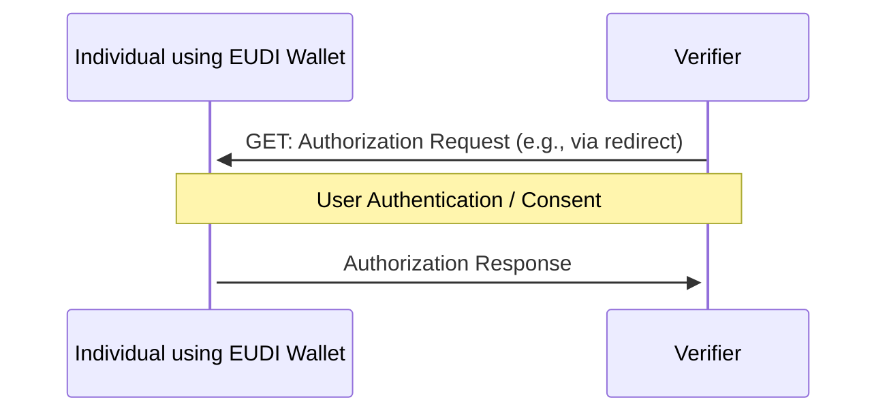
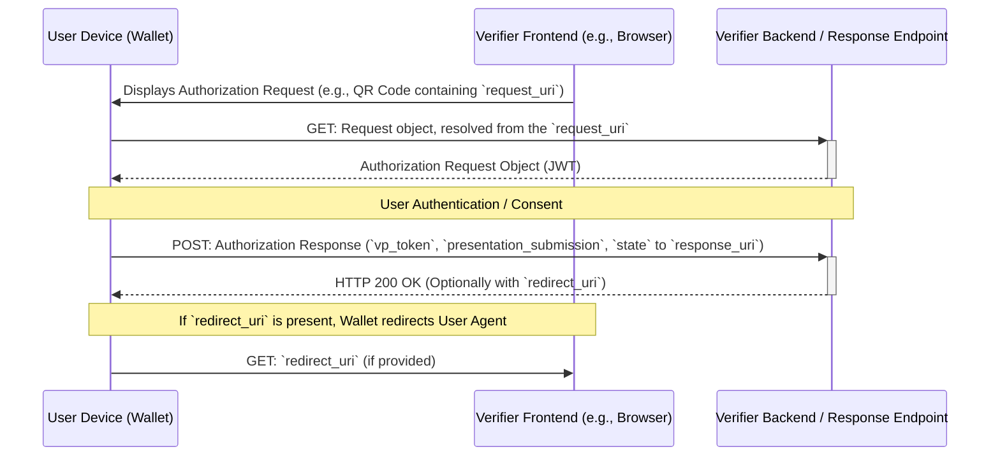

# EWC RFC002: Present Verifiable Credentials - v3.0

**Authors:**
* Mr George Padaytti (iGrant.io, Sweden)
* Mr Lal Chandran (iGrant.io, Sweden)
* Dr Andreas Abraham (ValidatedID, Spain)
* Mr. Edward Curran (Lissi ID, Germany)

**Reviewers:**

* Dr Nikos Triantafyllou (University of the Aegean, Greece)
* Mr Florin Coptil (Bosch, Germany)
* Mr Matteo Mirabelli (Infocert, Italy)
* Dr Mikael Linden (Vero, Finland)
* Mr Renaud Murat (Archipels, France)
* Mr. Sebastian Bickerle (Lissi ID, Germany)

**Status:** Approved

**Table of Contents**

- [EWC RFC002: Present Verifiable Credentials - v3.0](#ewc-rfc002-present-verifiable-credentials---v20)
- [1.0 Summary](#10-summary)
- [2.0 Motivation](#20-motivation)
- [3.0 Messages](#30-messages)
  - [3.1 Authorisation request](#31-authorisation-request)
    - [3.1.1 Request Parameters](#311-request-parameters)
    - [3.1.2 Client Identifier Schemes](#312-client-identifier-schemes)
    - [3.1.3 Passing the Request](#313-passing-the-request)
      - [By value](#by-value)
      - [By reference (GET)](#by-reference-get)
      - [By reference (POST)](#by-reference-post)
      - [Using the Digital Credentials API](#using-the-digital-credentials-api)
    - [3.1.4 Scope Parameter Usage](#314-scope-parameter-usage)
    - [3.1.5 Requesting Credentials](#315-requesting-credentials)
      - [Using `presentation_definition`](#using-presentation_definition)
      - [Using `presentation_definition_uri`](#using-presentation_definition_uri)
      - [Using `dcql_query`](#using-dcql_query)
      - [Using `scope`](#using-scope)
    - [3.1.6 Transaction Data](#316-transaction-data)
  - [3.2 Authorisation response](#32-authorisation-response)
    - [3.2.1 Response Parameters](#321-response-parameters)
    - [3.2.2 Response Modes](#322-response-modes)
      - [Direct Post (`direct_post`)](#direct-post-direct_post)
      - [Direct Post JWT (`direct_post.jwt`)](#direct-post-jwt-direct_postjwt)
      - [Digital Credentials API (`dc_api`, `dc_api.jwt`)](#digital-credentials-api-dc_api-dc_apijwt)
    - [3.2.3 Signed Response (JARM)](#323-signed-response-jarm)
    - [3.2.4 Transaction Data in Response](#324-transaction-data-in-response)
    - [3.2.5 VP Token Validation](#325-vp-token-validation)
  - [3.3 Error response](#33-error-response)
- [4.0 Metadata](#40-metadata)
  - [4.1 Wallet Metadata (Authorization Server Metadata)](#41-wallet-metadata-authorization-server-metadata)
  - [4.2 Verifier Metadata (Client Metadata)](#42-verifier-metadata-client-metadata)
- [7.0 Credential Format Specifics](#70-credential-format-specifics)
- [8.0 Implementers](#80-implementers)
- [9.0 Reference](#90-reference)
- [Appendix A: Public key resolution](#appendix-a-public-key-resolution)

# 1.0 Summary

This specification implements the OIDC4VP workflow for any verifier (relying party) as per reference specification [1]. This minimises risks towards interoperability across the European Wallet Ecosystem with a standard specification in the EUDI wallet ecosystem as per the ARF [2] requirements.

# 2.0 Motivation

The EWC LSP must align with the standard protocol for issuing credentials. This is the basis of interoperability between Verifiers (Relying Parties) and Holders across the EWC LSPs. The assumption is that the user is familiar with the EWC-chosen protocols and standards and can refer to original standards references when necessary.

# 3.0 Messages

As shown in Figure 1 below, a individual using the wallet presents a credential to a verifier on the same device that the device the wallet resides on.


Figure 1: Same Device Verification Flow (Conceptual, based on [1])

For cross device verification, or when the response size is large, the `direct_post` response mode combined with passing the request by reference (`request_uri`) is common, as shown in Figure 2.


Figure 2: Cross Device / Direct Post Verification Flow (Conceptual, based on [1])

Alternatively, The digital credentials api can be used to request a presentation. The underlying platform (i.e. browser, android, ios) will take care of performing this securely in same device and cross device scenarios.

## 3.1 Authorisation request

### 3.1.1 Request Parameters

The authorisation request is based on OAuth 2.0 [RFC6749] and includes the following parameters relevant to OIDC4VP [1]:

| Parameter                     | Description                                                                                                                                                                                                                                                                                                       |
| :---------------------------- | :---------------------------------------------------------------------------------------------------------------------------------------------------------------------------------------------------------------------------------------------------------------------------------------------------------------- |
| `client_id`                   | **REQUIRED**. Verifier identifier (e.g., URI / DID). Interpreted according to the Client Identifier Scheme. This value MUST be used by the Wallet as the audience for the Verifiable Presentation and verified by the Verifier. Must be present in the `aud` claim) of the Verifiable Presentation JWT/structure. |
| `client_metadata`             | OPTIONAL. A JSON object containing Verifier metadata values, passed by value. Used primarily when metadata cannot be obtained via the `client_id`. Includes parameters like  `vp_formats` (Verifier supported formats) e.t.c.                                                                                     |
| `nonce`                       | **REQUIRED**. String value used to associate a Client session with the VP Token and mitigate replay attacks. It MUST be included in the Verifiable Presentation (e.g., `nonce` claim in JWT VPs). Values MUST only contain ASCII URL safe characters.                                                             |
| `presentation_definition`     | CONDITIONAL. A JSON object conforming to the DIF Presentation Exchange specification [4], describing the required credentials.                                                                                                                                                                                    |
| `presentation_definition_uri` | CONDITIONAL. An HTTPS URL referencing a resource containing the `presentation_definition` JSON object.                                                                                                                                                                                                            |
| `dcql_query`                  | CONDITIONAL. A JSON-encoded object representing a query using the Digital Credentials Query Language (DCQL). See OIDC4VP [1] Spec Section 6 [1].                                                                                                                                                                  |
| `scope`                       | CONDITIONAL. OAuth 2.0 scope parameter. Can be used as an alias for a pre-defined credential request. If `openid` is included, it becomes an OpenID Connect request potentially combined with SIOPv2.                                                                                                             |
| `response_type`               | **REQUIRED**. Must include `vp_token`. May be combined with `id_token` (for SIOPv2) or `code` (for Auth Code flow, where VP Token is returned at Token Endpoint). EWC mandates only `vp_token`.                                                                                                                   |
| `response_mode`               | OPTIONAL. Specifies how the Authorization Response is returned. OIDC4VP defines `direct_post` and supports JARM modes like `direct_post.jwt`. The default for `response_type=vp_token` is `fragment` (not recommended by EWC). EWC RFC002 context only supports `direct_post`, `direct_post.jwt`, `dc_api` or `dc_api.jwt`.          |
| `response_uri`                | **REQUIRED** when `response_mode` is `direct_post` or `direct_post.jwt`. The URL where the Wallet sends the Authorization Response via HTTP POST. MUST NOT be present if `redirect_uri` is used.                                                                                                                  |
| `redirect_uri`                | REQUIRED for non-direct_post flows like `fragment` or when using Authorization Code flow (`response_type=code`). MUST NOT be present if `response_uri` is used. EWC context deprecates its use.                                                                                                                   |
| `state`                       | RECOMMENDED. Opaque value used by the Verifier to maintain state between the request and response. The Wallet MUST return this value unmodified. Values MUST only contain ASCII URL safe characters.                                                                                                              |
| `request`                     | OPTIONAL. The request parameters packaged as a Request Object (JWT). See [RFC9101].                                                                                                                                                                                                                               |
| `request_uri`                 | OPTIONAL. An HTTPS URL referencing a Request Object (JWT). See [RFC9101]. Preferred for QR codes.                                                                                                                                                                                                                 |
| `request_uri_method`          | OPTIONAL. HTTP method (`get` or `post`) to use when fetching the Request Object from `request_uri`. Default is `get`. `post` allows the Wallet to send its capabilities. MUST NOT be present if `request_uri` is absent.                                                                                          |
| `transaction_data`            | OPTIONAL. Array of strings, each a base64url encoded JSON object detailing a transaction the user is authorizing (e.g., payment, signature). Binds the VP to a specific transaction.                                                                                                                              |
| `expected_origins`            | **REQUIRED** for signed requests when using the DC API (see Appendix A [1]). Array of strings representing expected Verifier origins.                                                                                                                                                                             |

> **OIDC4VP Constraint:** Exactly one of `presentation_definition`, `presentation_definition_uri`, `dcql_query`, or a `scope` value representing a presentation definition MUST be present in the Authorization Request.

### 3.1.2 Client Identifier Schemes

OIDC4VP [1] defines a mechanism to specify how the `client_id` should be interpreted and validated, enabling different trust models beyond simple pre-registration.

*   **Syntax:** `client_id=<scheme>:<scheme-specific-identifier>`
*   **Detection:** Wallets MUST check for the presence of the first `:` character. If present, interpret the prefix as the scheme.
*   **Fallback:** If no `:` is present, the `client_id` refers to a pre-registered client [RFC6749].
*   **Security:** Wallets MUST use the *full* `client_id` (including the scheme prefix) when validating the audience (`aud`) of the VP Token.
*   **Supported Schemes (Defined in OIDC4VP Draft 23):**
    *   `redirect_uri`: `client_id` is the Verifier's `redirect_uri`. Requires `client_metadata`. MUST NOT be signed.
    *   `did`: `client_id` is a DID. Request MUST be signed using a key from the DID Document. Metadata often via `client_metadata`.
    *   `verifier_attestation`: Request MUST be signed by a key confirmed in a Verifier Attestation JWT provided in the `jwt` JOSE header. See Section 11 [1]. Metadata often via `client_metadata`.
    *   `x509_san_dns`: `client_id` is a DNS name matching an X.509 certificate's Subject Alternative Name (SAN). Request MUST be signed using the certificate's private key (`x5c` header). Metadata often via `client_metadata`.
    *   `x509_san_uri`: `client_id` is a URI matching an X.509 certificate's SAN. Request MUST be signed (`x5c` header). Metadata often via `client_metadata`.
    *   `web-origin`: *Used only with the Digital Credentials API*. The `client_id` is constructed by the Wallet as `web-origin:<origin>`, where `<origin>` is asserted by the underlying platform. See Appendix A [1].

> [!NOTE]
> EWC RFC002 does not explicitly mandate a specific scheme, but Verifiers and Wallets within the EWC ecosystem need to agree on supported schemes for interoperability. `https`, `did`, and `x509_san_*` schemes often imply a higher level of Verifier trust establishment.

### 3.1.3 Passing the Request

Authorisation requests can be presented to the wallet by the Verifier:

1.  **By value:** All request parameters are URL-encoded directly into the invocation URI.

2.  **By reference (using JAR [RFC9101]):** Request parameters are packaged into a JWT (Request Object), and the invocation URI contains either:
    *   `request`: The Request Object JWT itself.
    *   `request_uri`: A URL pointing to the Request Object JWT.

3. Using the Digital Credentials (DC) API. Note that this is optional for EWC phase 03.

> [!NOTE]
> The EWC RFC002 example uses a custom URL scheme `openid4vp://`. Wallet invocation can also use Universal Links / App Links or manual QR code scanning without a specific scheme [1].

#### By value

Authorization request parameters are included directly in the authorization request URI. Suitable for simple requests.

```sh
openid4vp://?client_id=https://example.verifier.com&response_type=vp_token&response_uri=...&response_mode=direct_post&nonce=...&presentation_definition=...&state=...
```

#### By reference (GET)

Passing by reference using `request_uri` (the default `get` method). The Wallet performs an HTTP GET to the `request_uri` to retrieve the Request Object JWT. Recommended for QR codes to keep them small.

```sh
openid4vp://?request_uri=https://server.example.com/presentation-request/tRf739_poiU
```

The Verifier hosting the `request_uri` endpoint MUST expose it via HTTPS without requiring authentication. The resolved Request Object JWT contains the actual authorization parameters (e.g., `client_id`, `nonce`, `presentation_definition`).

#### By reference (POST)

Passing by reference using `request_uri` and `request_uri_method=post` [1].

```sh
POST /authorize?
  client_id=x509_san_dns:client.example.org
  &client_metadata=...
  &request_uri=https://server.example.com/presentation-request/tRf739_poiU
  &request_uri_method=post HTTP/1.1
```

1.  The Wallet sends an HTTP POST to the `request_uri` endpoint.
2.  The POST body is `application/x-www-form-urlencoded` and MAY contain:
    *   `wallet_metadata`: JSON string with Wallet capabilities (e.g., supported formats `vp_formats_supported`, signing algorithms `request_object_signing_alg_values_supported`).
    *   `wallet_nonce`: A nonce generated by the Wallet for replay protection of the Verifier's response.
3.  The Verifier endpoint MUST respond with `Content-Type: application/oauth-authz-req+jwt`.
4.  The response body is the signed Request Object JWT containing the authorization parameters. If the Wallet sent a `wallet_nonce`, the Verifier MUST include it as a claim in the Request Object JWT.

This method allows the Wallet to inform the Verifier about its capabilities *before* the Verifier generates the final Request Object, enabling a more tailored request.

#### Using the Digital Credentials API

> [!NOTE]
> The Digital Credentials APIs are outside the scope of the EWC LSP, but are included here to support early testing and piloting efforts.

When using the Digital Credentials API (DC API) [1, Appendix A], the request parameters are passed as a JSON object to the API call.

*   The exchange protocol identifier MUST be `openid4vp`.
*   `response_mode` MUST be `dc_api` (unsigned response) or `dc_api.jwt` (signed/encrypted JARM response).
*   The `client_id` parameter MUST be omitted in unsigned requests; the Wallet derives it using the `web-origin` scheme from the origin asserted by the platform.
*   For signed requests (e.g., using `request` parameter), the `client_id` (e.g., a DID or HTTPS entity ID) MUST be included *inside* the signed Request Object JWT. The `expected_origins` parameter MUST also be included outside the JWT.

```javascript
// Request credentials
const credentialResponse = await navigator.credentials.get({
    digital: {
        protocol: "openid4vp",
        request: [{
            response_type: "vp_token",
            response_mode: "dc_api",
            nonce: "hcXlreRWiJIyjv3VPp7z5ARuwbhArLFJnYje4XZs4lg",
            dcql_query: ... // see sample DCQL Queries below
        }]
    }
});

// Process the response
const data = credentialResponse.data;

// Send to verifier...
```

### 3.1.4 Scope Parameter Usage

As defined in OIDC4VP [1], the `scope` parameter MAY be used as an alternative to `presentation_definition` or `presentation_definition_uri`.

*   A scope value used for OIDC4VP MUST be an alias for a well-defined Presentation Definition or DCQL query.
*   The definition MUST allow the Verifier to determine the expected identifiers (`definition_id`, `descriptor_map.id`) in the `presentation_submission` response and the expected credential formats/types in the `vp_token`.
*   The specific scope values and their mappings are outside the scope of the OIDC4VP specification (defined by profiles or agreements).
*   It is RECOMMENDED to use collision-resistant scope values (e.g., using reverse domain name notation).

Example usage:

```sh
openid4vp://?client_id=https://example.verifier.com
&response_type=vp_token
&scope=com.example.passport_credential_presentation openid // Also requests SIOPv2 ID Token
&response_uri=https://example.verifier.com/direct_post
&response_mode=direct_post
&state=...
&nonce=...
```

### 3.1.5 Requesting Credentials

OIDC4VP provides multiple ways to specify the credentials the Verifier wants the user to present. Exactly one method must be used.

#### Using `presentation_definition`

The request directly includes the Presentation Definition JSON object [4] as a request parameter.

```sh
...&presentation_definition={"id": "pd_1", "input_descriptors": [...]}...
```

#### Using `presentation_definition_uri`

The request provides an HTTPS URL. The Wallet MUST perform an HTTP GET request to this URL to retrieve the Presentation Definition JSON object. The resource MUST be accessible without authentication [1].

```sh
...&presentation_definition_uri=https://verifier.example.com/defs/pd_1...
```

#### Using `dcql_query`

The request includes a JSON-encoded object representing a query using the Digital Credentials Query Language (DCQL) [1]. This offers a potentially more flexible way to specify credential requirements compared to Presentation Exchange.

The SD JWT DCQL format is defined in Annex B.4.3 of OpenID4VP [1]. Below is a simple example of a SD JWT DCQL Query.

```json
{
  "credentials": [
    {
      "id": "sd_jwt_pid",
      "format": "dc+sd-jwt",
      "meta": {
        "vct_values": ["urn:eu.europa.ec.eudi:pid:1"]
      },
      "claims": [
        {"path": ["given_name"]},
        {"path": ["family_name"]},
      ]
    }
  ]
}
```

The mDoc DCQL format is defined in Annex B.3.1 of OpenID4VP [1]. Below is a simple example of an mDoc DCQL Query.

```json
{
  "credentials": [
    {
      "id": "mdoc_pid",
      "format": "mso_mdoc",
      "meta": {
        "doctype_value": "eu.europa.ec.eudi.pid.1"
      },
      "claims": [
        {"path": ["org.iso.18013.5.1", "family_name"]},
        {"path": ["org.iso.18013.5.1", "given_name"]},
      ]
    }
  ]
}
```

The following is an example of a request for either mDoc or SD JWT. This request would be particularly useful for this pilot program, where you may be requesting against wallets that can support either mDoc or SD-JWT.
```json
{
  "credentials": [
    {
      "id": "sd_jwt_pid",
      "format": "dc+sd-jwt",
      "meta": {
        "vct_values": ["urn:eu.europa.ec.eudi:pid:1"]
      },
      "claims": [
        {"path": ["given_name"]},
        {"path": ["family_name"]},
      ]
    },
    {
      "id": "mdoc_pid",
      "format": "mso_mdoc",
      "meta": {
        "doctype_value": "eu.europa.ec.eudi.pid.1"
      },
      "claims": [
        {"path": ["org.iso.18013.5.1", "family_name"]},
        {"path": ["org.iso.18013.5.1", "given_name"]},
      ]
    },
  ],
  "credential_sets": [
    {
      "purpose": "Identification",
      "options": [
        [ "sd_jwt_pid" ],
        [ "mdoc_pid" ]
      ]
    }
  ]
}
```
Please see Annex C of OpenID4VP [1] for more complex DCQL query examples including all of the DCQL query features.

#### Using `scope`

See Chapter 3.1.4.

### 3.1.6 Transaction Data

OIDC4VP allows binding the presentation request to a specific transaction using the `transaction_data` parameter [1]. This is crucial for high-assurance use cases like payments or document signing.

*   `transaction_data`: Array of strings.
*   Each string is a base64url-encoded JSON object representing details of a transaction.
*   Each JSON object MUST contain:
    *   `type`: REQUIRED. String identifying the transaction type (e.g., `payment_auth`, `document_signature`). Values are profile-specific.
    *   `credential_ids`: REQUIRED. Array of strings referencing the `id` of the Credential(s) requested (in `presentation_definition` or `dcql_query`) that can authorize this transaction.
    *   `transaction_data_hashes_alg`: OPTIONAL. Array of supported hash algorithm identifiers (from IANA "Named Information Hash Algorithm" registry) for hashing the transaction data. Default is `sha-256`. Wallet MUST support `sha-256`.
*   Type-specific parameters (e.g., payment amount, document hash) are defined by the transaction type profile.
*   The Wallet MUST return hashes of the provided `transaction_data` objects in the response.

```sh
...&transaction_data=["eyJ0eXBlIjogInBheW1lbnRfYXV0aCIsICJhbW91bnQiOiAiMTAuMDAiLCAiY3VycmVuY3kiOiAiRVVSIiwgImNyZWRlbnRpYWxfaWRzIjogWyJpZF9jcmVkIl0sICJ0cmFuc2FjdGlvbl9kYXRhX2hhc2hlc19hbGciOiBbInNoYS0yNTYiXX0="]...
```

## 3.2 Authorisation response

### 3.2.1 Response Parameters

Depending on the request and response mode, the response includes:

| Parameter                     | Description                                                                                                                                                                                                                                                                                                                                                                                                                          |
| :---------------------------- | :----------------------------------------------------------------------------------------------------------------------------------------------------------------------------------------------------------------------------------------------------------------------------------------------------------------------------------------------------------------------------------------------------------------------------------- |
| `vp_token`                    | **REQUIRED** if requested. Contains the Verifiable Presentation(s).<ul><li>If Presentation Exchange was used: A single VP (JSON string or object) or an array of VPs (JSON strings/objects). Encoding depends on format (Appendix B [1]). MUST NOT use array for single VP.</li><li>If DCQL was used: A JSON object where keys are the Credential Query `id`s and values are the corresponding VPs (JSON strings/objects).</li></ul> |
| `presentation_submission`     | **REQUIRED** if Presentation Exchange was used in the request. JSON object conforming to DIF Presentation Exchange [4]. Maps requested credentials (input descriptors) to the returned VPs in `vp_token`. Uses `path` (`$` for single VP, `$[n]` for n-th VP in array) and potentially `path_nested`. MUST be a separate parameter alongside `vp_token`.                                                                             |
| `state`                       | **REQUIRED** if present in the request. MUST be the unmodified value from the request.                                                                                                                                                                                                                                                                                                                                               |
| `id_token`                    | Included if `openid` scope and `id_token` response type were requested (SIOPv2 flow).                                                                                                                                                                                                                                                                                                                                                |
| `code`                        | Included if `code` response type was requested (Authorization Code flow). `vp_token` is returned later at the Token Endpoint.                                                                                                                                                                                                                                                                                                        |
| `iss`                         | RECOMMENDED for Self-Issued ID Tokens (SIOPv2). Contains the End-User's DID or other identifier, indicating the Authorization Server is the Wallet itself [RFC9207].                                                                                                                                                                                                                                                                 |
| `transaction_data_hashes`     | **REQUIRED** if `transaction_data` was present in the request. Included within the proof mechanism of the credential used for authorization (format-specific). Contains hashes of the `transaction_data` objects.                                                                                                                                                                                                                    |
| `transaction_data_hashes_alg` | **REQUIRED** if `transaction_data` was present in the request. Included alongside `transaction_data_hashes`. The hash algorithm used.                                                                                                                                                                                                                                                                                                |
| `error`                       | REQUIRED on error.                                                                                                                                                                                                                                                                                                                                                                                                                   |
| `error_description`           | OPTIONAL on error. Human-readable explanation.                                                                                                                                                                                                                                                                                                                                                                                       |
| `error_uri`                   | OPTIONAL on error. URI for human-readable web page with error info.                                                                                                                                                                                                                                                                                                                                                                  |

### 3.2.2 Response Modes

The `response_mode` parameter dictates how the response parameters are sent back to the Verifier.

> [!NOTE]
> EWC RFC002 context only supports `direct_post`, `direct_post.jwt`, `dc_api` or `dc_api.jwt`. The base OIDC4VP specification's default for `response_type=vp_token` is `fragment`, which is not used here.

#### Direct Post (`direct_post`)

[1] The Wallet sends the response parameters via an HTTP POST request to the `response_uri` specified by the Verifier.

*   `Content-Type`: `application/x-www-form-urlencoded`.
*   Body contains URL-encoded response parameters (e.g., `vp_token`, `presentation_submission`, `state`).
*   The Verifier's endpoint at `response_uri` processes this POST.
*   To close the loop and prevent session fixation, the Verifier's endpoint SHOULD respond with HTTP 200 OK and a JSON body containing a `redirect_uri` parameter.
    *   `{"redirect_uri": "https://verifier.example.com/ui/callback?response_code=..."}`
    *   This `redirect_uri` MUST contain a fresh, single-use cryptographic random value (e.g., `response_code`).
    *   The Wallet redirects the user agent to this URI.
    *   The Verifier frontend uses the random value to securely retrieve the VP data associated with the transaction from its backend.
*   If the Verifier's endpoint does *not* return a `redirect_uri`, the flow ends at the Wallet after the POST, which might be desired in some API-based scenarios but lacks session fixation protection.

Example Wallet POST:

```http
POST https://example.verifier.com/direct_post
Content-Type: application/x-www-form-urlencoded

vp_token=eyJraWQiOiJk...Z-1_msCBcxh7XEA
&presentation_submission={...}
&state=475e634e-2633-4235-953d-eb879334cae7
```

Example Verifier Response to Wallet POST:

```http
HTTP/1.1 200 OK
Content-Type: application/json
Cache-Control: no-store

{
  "redirect_uri": "https://verifier.example.com/ui/callback?response_code=091535f699ea575c7937fa5f0f454aee"
}
```

#### Direct Post JWT (`direct_post.jwt`)

[1] This mode works like `direct_post`, but the authorization response parameters are packaged inside a JWT (Response Object) according to JARM [JARM].

*   The Wallet sends an HTTP POST to the `response_uri`.
*   `Content-Type`: `application/x-www-form-urlencoded`.
*   The POST body contains a single parameter: `response=<Response Object JWT>`.
*   The Verifier endpoint receives the JWT, validates its signature/decryption according to JARM, and extracts the parameters (`vp_token`, `presentation_submission`, `state`, etc.).
*   The Verifier's endpoint SHOULD respond with HTTP 200 OK containing a `redirect_uri` as described for `direct_post`.

#### Digital Credentials API (`dc_api`, `dc_api.jwt`)

> [!NOTE]
> The Digital Credentials APIs are outside the scope of the EWC LSP, but are included here to support early testing and piloting efforts.

[1, Appendix A] When the request uses `response_mode=dc_api` or `dc_api.jwt`, the response is returned via the platform's DC API mechanism.

*   The response is an instance of the `DigitalCredential` interface.
*   The `data` attribute of this interface contains the OIDC4VP response parameters as a JSON object.
*   If `dc_api.jwt` was used, the `data` object will contain the `response` parameter holding the JARM JWT, otherwise it contains the parameters directly (e.g., `vp_token`, `presentation_submission`).

### 3.2.3 Signed Response (JARM)

OIDC4VP uses JWT Secured Authorization Response Mode (JARM) [JARM] to sign and/or encrypt responses [1].

*   Uses `response_mode` values like `direct_post.jwt`, `dc_api.jwt`.
*   Response parameters are packaged as claims within a JWT.
*   The JWT should be signed (JWS) and optionally encrypted.
*   Key management (obtaining Wallet keys for signing) uses mechanisms like `jwks` in `client_metadata`.

### 3.2.4 Transaction Data in Response

If the Authorization Request included `transaction_data`, the Wallet MUST include corresponding hashes in the response [1].

*   `transaction_data_hashes`: REQUIRED. An array of hashes. Each hash corresponds to one of the base64url-encoded JSON objects received in the `transaction_data` request parameter. Hashing ensures integrity.
*   `transaction_data_hashes_alg`: REQUIRED. String identifying the hash algorithm used (must be one proposed by the Verifier, or the default `sha-256`).
*   **Inclusion Point:** These parameters MUST be included within the cryptographic proof mechanism of the *specific credential* designated to authorize the transaction (identified via `credential_ids` in the request's `transaction_data`). The exact method is format-specific (see Appendix B [1]). For JWT-based VCs/VPs, these would typically be claims within the VP JWT, signed by the Holder.

### 3.2.5 VP Token Validation

The Verifier MUST validate the received VP Token and its contents thoroughly [1]:

1.  **Format Validation:** Check if the `vp_token` structure matches the expected format based on the query language used (PE vs. DCQL).
2.  **Presentation Submission Check (if PE used):** Parse `presentation_submission` to identify which VPs correspond to which input descriptors.
3.  **VP Integrity, Authenticity, Holder Binding:** Validate *each* Verifiable Presentation within the `vp_token` according to its specific format's rules (e.g., JWS signature, ZKP proof).
4.  **Nonce Binding:** Verify that the `nonce` value received in the request matches the `nonce` (or `challenge`) bound within *each* Verifiable Presentation's proof.
5.  **Audience Binding:** Verify that the Verifier's `client_id` (used in the request) matches the audience (`aud` or `domain`) bound within *each* Verifiable Presentation's proof.
6.  **Credential Schema/Constraint Checks:** Ensure the claims and structure of the presented VCs satisfy the requirements specified in the `presentation_definition` or `dcql_query`.
7.  **Credential Status Check (Revocation):** Perform revocation checks if required by the Verifier's policy (e.g., check CRLs, status lists).
8.  **Trust Framework Validation:** Verify issuer trust, compliance with specific trust framework rules, etc., according to the Verifier's policy.
9.  **Transaction Data Binding (if applicable):** If `transaction_data` was used, verify the presence and correctness of `transaction_data_hashes` within the authorizing credential's proof.

## 3.3 Error response

Error responses follow OAuth 2.0 [RFC6749] and JARM [JARM] conventions. OIDC4VP defines additional error codes [1]:

| Error Code                                  | Description (from OIDC4VP Draft 23)                                                                                                                                                                                                                                                                                                                                             |
| :------------------------------------------ | :------------------------------------------------------------------------------------------------------------------------------------------------------------------------------------------------------------------------------------------------------------------------------------------------------------------------------------------------------------------------------ |
| `invalid_request`                           | Standard OAuth 2.0 error. OIDC4VP specifics: Request includes more than one credential request method (e.g., both `presentation_definition` and `dcql_query`); `vp_token` response type used without any credential request method; PE definition invalid; unsupported Client ID scheme used; Client ID scheme requirements violated (e.g., unsigned request for `did` scheme). |
| `invalid_client`                            | Standard OAuth 2.0 error. OIDC4VP specifics: `client_metadata` provided but Wallet already has metadata for the recognized `client_id`; Verifier's pre-registered metadata found but `client_metadata` also present.                                                                                                                                                            |
| `invalid_scope`                             | Standard OAuth 2.0 error. Requested scope value is invalid, unknown, or malformed.                                                                                                                                                                                                                                                                                              |
| `access_denied`                             | Standard OAuth 2.0 error. Wallet doesn't have matching credentials; User denied consent; User authentication failed.                                                                                                                                                                                                                                                            |
| `vp_formats_not_supported`                  | Wallet does not support any of the VC/VP formats requested by the Verifier (e.g., in `vp_formats` metadata or `format` in Presentation Definition).                                                                                                                                                                                                                             |
| `invalid_presentation_definition_uri`       | The Presentation Definition referenced by `presentation_definition_uri` could not be fetched (network error, invalid URL).                                                                                                                                                                                                                                                      |
| `invalid_presentation_definition_reference` | The resource at `presentation_definition_uri` was fetched, but it did not contain a valid Presentation Definition object or the expected one.                                                                                                                                                                                                                                   |
| `invalid_request_uri_method`                | The value of the `request_uri_method` parameter is neither `get` nor `post`.                                                                                                                                                                                                                                                                                                    |
| `invalid_transaction_data`                  | Error related to the `transaction_data` parameter: unrecognized type, missing fields, invalid values, referenced `credential_ids` don't match request or aren't available.                                                                                                                                                                                                      |
| `wallet_unavailable`                        | Used in specific scenarios (e.g., claimed HTTPS URI invocation) where the user agent cannot invoke the Wallet, but another component (like the Wallet provider backend) handles the request to inform the Verifier.                                                                                                                                                             |

Example error response using `direct_post`:

```http
POST /post HTTP/1.1
Host: client.example.org
Content-Type: application/x-www-form-urlencoded

error=invalid_request&
error_description=unsupported%20client_id_scheme&
state=eyJhb...6-sVA
```

# 4.0 Metadata

Discovering capabilities of Wallets and Verifiers is crucial for interoperability.

## 4.1 Wallet Metadata (Authorization Server Metadata)

Verifiers can discover Wallet capabilities using OAuth 2.0 Authorization Server Metadata [RFC8414]. OIDC4VP defines additional metadata parameters [1]:

| Metadata Parameter                      | Description                                                                                                                                                                                                                                                 |
| :-------------------------------------- | :---------------------------------------------------------------------------------------------------------------------------------------------------------------------------------------------------------------------------------------------------------- |
| `presentation_definition_uri_supported` | OPTIONAL. Boolean indicating if the Wallet supports fetching Presentation Definitions via `presentation_definition_uri`. Default `true`.                                                                                                                    |
| `vp_formats_supported`                  | **REQUIRED**. JSON object listing supported credential formats (keys are format identifiers like `jwt_vc_json`,  `mso_mdoc`, `dc+sd-jwt`, see Appendix B [1]). Values are objects that MAY contain `alg_values_supported` and format-specific capabilities. |
| `client_id_schemes_supported`           | OPTIONAL. Array of strings listing the Client ID schemes the Wallet supports (e.g., `redirect_uri`, `did`, `https`). Default is pre-registration only.                                                                                                      |

Metadata can be obtained dynamically (e.g., via `.well-known/oauth-authorization-server`) or statically (pre-configured).

## 4.2 Verifier Metadata (Client Metadata)

Wallets can obtain Verifier capabilities using OAuth 2.0 Dynamic Client Registration Metadata [RFC7591]. OIDC4VP defines one key parameter:

| Metadata Parameter | Description                                                                                                                                                                                 |
| :----------------- | :------------------------------------------------------------------------------------------------------------------------------------------------------------------------------------------ |
| `vp_formats`       | **REQUIRED**. JSON object defining the VP and VC formats the Verifier supports. Structure is the same as `vp_formats_supported` in Wallet metadata, specifying algorithms, proof types etc. |

Verifier metadata can be passed dynamically using the `client_metadata` request parameter, obtained via EWC Trust List, fetched using Dynamic Client Registration, or statically configured in the Wallet. Data obtained from trusted sources (like EWC Trust List) takes precedence over `client_metadata`.

# 7.0 Credential Format Specifics

OIDC4VP is format-agnostic, but specific formats require particular handling, especially within `presentation_submission` and metadata. See Appendix B [1] for details on:

*   **`path_nested`:** Used in `presentation_submission.descriptor_map` to specify the path *within* a VP where the actual VC can be found, along with the VC's format.
*   **W3C Verifiable Credentials (JWT):** Defines `jwt_vc_json`, `jwt_vp_json` format identifiers. Specifies algorithm parameters.
*   **ISO mdoc (18013-5, 23220):** Defines `mso_mdoc` format. DCQL `meta` object contains `doctype_value`. DCQL uses `namespace` and `claim_name`. `vp_token` contains base64url-encoded `DeviceResponse`. `presentation_submission` is often not used as data is self-contained. (Defined in Annex B.3 of OpenID4VP [1])
*   **IETF SD-JWT VC:** Defines `dc+sd-jwt` format. Verifier and Client metadata includes `sd-jwt_alg_values` and `kb-jwt_alg_values` [1]. DCQL `meta` object contains `vct_values` [1]. `vp_token` contains the combined SD-JWT VC and KB-JWT. (Defined in Annex B.4 of OpenID4VP [1])

# 8.0 Implementers

Please refer to the [implementers table](https://github.com/EWC-consortium/eudi-wallet-rfcs?tab=readme-ov-file#implementers).

# 9.0 Reference

1.  OpenID Foundation (2024), 'OpenID for Verifiable Presentations (OID4VP)', Draft 23, Available at: [https://openid.net/specs/openid-4-verifiable-presentations-1_0-ID3.html](https://openid.net/specs/openid-4-verifiable-presentations-1_0-ID3.html) (Accessed: December 2, 2024). *<- Updated reference to Draft 23*
2.  European Commission (2023) The European Digital Identity Wallet Architecture and Reference Framework (2023-04, v1.1.0) [Online]. Available at: [https://github.com/eu-digital-identity-wallet/eudi-doc-architecture-and-reference-framework/releases](https://github.com/eu-digital-identity-wallet/eudi-doc-architecture-and-reference-framework/releases) (Accessed: October 16, 2023).
3.  RFC 9101 OAuth 2.0 Authorization Framework: JWT-Secured Authorization Request (JAR) [https://www.rfc-editor.org/rfc/rfc9101.html](https://www.rfc-editor.org/rfc/rfc9101.html) (Accessed: February 05, 2024)
4.  DIF Presentation Exchange 2.0.0: [https://identity.foundation/presentation-exchange/spec/v2.0.0/](https://identity.foundation/presentation-exchange/spec/v2.0.0/) (Accessed: February 07, 2024)
5.  RFC 6749 The OAuth 2.0 Authorization Framework: [https://www.rfc-editor.org/rfc/rfc6749](https://www.rfc-editor.org/rfc/rfc6749)
6.  RFC 7591 OAuth 2.0 Dynamic Client Registration Protocol: [https://www.rfc-editor.org/rfc/rfc7591](https://www.rfc-editor.org/rfc/rfc7591)
7.  RFC 8414 OAuth 2.0 Authorization Server Metadata: [https://www.rfc-editor.org/rfc/rfc8414](https://www.rfc-editor.org/rfc/rfc8414)
8.  JARM JWT Secured Authorization Response Mode for OAuth 2.0: [https://openid.net/specs/oauth-v2-jarm-final.html](https://openid.net/specs/oauth-v2-jarm-final.html)
9.  BCP 195 Recommendations for Secure Use of Transport Layer Security (TLS) and Datagram Transport Layer Security (DTLS): [https://www.rfc-editor.org/info/bcp195](https://www.rfc-editor.org/info/bcp195)
10. RFC 6125 Representation and Verification of Domain-Based Application Service Identity... (TLS Server Identity Check): [https://www.rfc-editor.org/rfc/rfc6125](https://www.rfc-editor.org/rfc/rfc6125)
11. OAuth 2.0 Security Best Current Practice: [https://datatracker.ietf.org/doc/html/draft-ietf-oauth-security-topics](https://datatracker.ietf.org/doc/html/draft-ietf-oauth-security-topics)
12. W3C Digital Credentials API: [https://w3c-fedid.github.io/digital-credentials/](https://w3c-fedid.github.io/digital-credentials/)
13. RFC 9207 OAuth 2.0 Authorization Server Issuer Identification: [https://www.rfc-editor.org/rfc/rfc9207](https://www.rfc-editor.org/rfc/rfc9207)

# Appendix A: Public key resolution

Refer [RFC012](/ewc-rfc012-trust-mechanism.md) for key resolution and trust mechanims. 

For a JWT (e.g., Request Object, VP Token, ID Token), there are multiple ways for resolving the public key needed for signature verification:

1.  **`jwk` Header:** The public key JWK is directly embedded in the JOSE header.
2.  **`kid` Header:** The header contains a Key ID. The key needs to be retrieved:
    *   If the `kid` is a DID URL (e.g., `did:example:123#key-1`), use DID resolution to obtain the verification method (public key) from the DID Document.
    *   If the issuer provides an AS Metadata endpoint (`iss` claim), fetch the `jwks_uri` from the metadata and find the key matching the `kid` in the JWK Set.
3.  **`x5c` Header:** The header contains the X.509 certificate chain containing the public key. Validate the chain according to PKI rules.