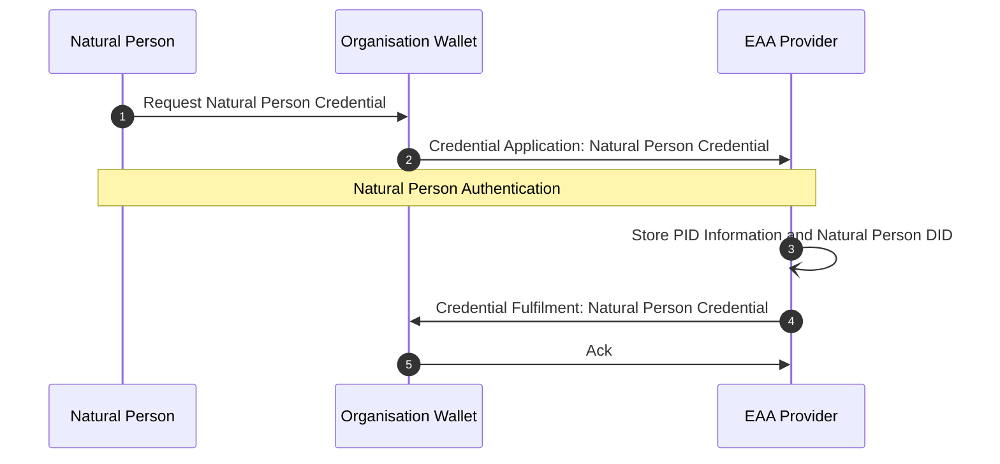

# EWC RFC010: Issue and Present Organisational Credentials - v0.1

**Authors:** 
* Mr Ronald Koenig (Spherity, Germany)
* Mr Ricky Thiermann  (Spherity, Germany)
* Mr Martin Westerkamp  (Spherity, Germany)

**Reviewers:** 
* ???

**Status:** Ready for review

notes:
* exchange of organisation credentials - issue and present
* organisation credentials are credentials about legal entities and their relationships
* legal entities are legal persons (companies) or natural persons (humans related to the company - employee, shareholder, ultimate beneficiary owners, ...)
* enterprise wallets holds organisational credentials and are operated by the company
  * used by a group a persons (employees of the company)
  * creates and holds identity for every user (DID)
  * company is liable for misuse of issued credentials
  * internal role model (visibility of credentials and claims)
  * running 24/7
* complex enterprise credentials  
* signatory rights based on enterprise credentials
* delegation of rights based on power of attorney credentials

structure:
* summary
* motivation
* trust model
  * DIDs
  * trust list (issuer, verifier)
  * credentials and holder binding
  * signatory rights
  * power of attorney
* issue natural person credential
* issue enterprise credential
* issue power of attorney credential
* present organisational credentials


# 1	Summary

This specification defines the workflows for issuing and presenting organisational credentials.
Compared to personal wallets, organisational wallets have a different mode of operation and different requirements.
Organisational wallets are expected to run in managed server environments and be in continuous operation.
They also manage multiple identities, including the organisation's identity and the identities of its representatives.
Therefore, a specific trust model and protocols are required.
The trust model describes the root of trust and the actors and identifiers involved.
It also expresses how entities are authorised to act in a particular role on behalf of an organisation and how these rights can be delegated.
To prove these relationships, three types of credentials are introduced: enterprise credentials, natural person credentials and power of attorney credentials.
We also describe the issuance process of these three types of credentials and how they are used for verifiable presentations.

# 2	Motivation

The EWC LSP handles a variety of credentials that are exchanged between different types of organisations.
The goal of this RFC is to provide a standard protocol for requesting and issuing organisational credentials.
Depending on the use case, organisations need certain information about their business partners, such as authorised signatories, tax numbers or ultimate beneficial owners.
This data needs to be validated and kept up to date.
To simplify the management of this master data, we propose the use of organisational credentials, for example issued by an Attestation Provider verifying data from an authentic source such as the relevant commercial register.

We aim to provide greater flexibility in terms of authentication methods and credential types.
Since the credentials in scope are exchanged with a focus on organisations, we anticipate the use of server-based organisational wallets, which have different requirements than personal mobile wallets.
Therefore, we propose the use of legal entity identifiers that represent legal persons or natural persons.
This will significantly simplify the handling of organisational credentials and enable a wide range of use cases.
Organisational wallets can handle processes automatically without human interaction and present the required credentials independently.
In addition, processes that require the verifiable liability of a responsible person are enabled by signing such requests using the representative's organisation-specific identity.
This process does not require natural persons to interact with a personal wallet.

The defined protocols and standards serve as a foundation for enabling interoperability between organisations throughout the EWC ecosystem.
This RFC assumes that users are familiar with the chosen EWC protocols and standards, and can reference the original specifications when required. 

# 3 Trust Model

## 3.1 DIDs

Organisational wallets manage two types of identities: legal person and natural person.
Each legal person and natural person is identified by a unique identifier.
The use of Decentralised Identifiers (DIDs) permits the implementation of self-sovereign digital identities.
Each DID is associated with a DID Document that may contains public keys, service endpoints, and other metadata needed for interactions.
DIDs can be used across various platforms and services, fostering interoperability and user autonomy in the digital identity landscape.
In the context of this RFC, the DID of a natural person is only used in the context of the organisation and managed using the organisational wallet.

DID Documents are resolved using a DID method.
While the workflows presented in this RFC are agnostic to the used DID method, we use two types of DID methods as examples: `DID:key` and `DID:peer`.
Legal and natural persons are identified using the `DID:key` method.
The `DID:key` method allows for the creation of DIDs directly from cryptographic key pairs without relying on a trust infrastructure.
Therefore, this RFC is independent from the selection of a concrete trust infrastructure and can be adjusted flexibly.
The `DID:peer` method is used for establishing secure bilateral communication channels for requesting and presenting credentials.
The method encodes an ephemeral key bound to specific a DIDComm connection.

## 3.2 Trust Lists

In order to verify verifiable credentials, the Relying Party needs a trust relationship with the Attestation Provider.
This RFC is independent of the trust infrastructure that provides the trust anchor.
It is expected that a trust infrastructure providing trust lists is available.
Trust lists provide the DIDs of trusted Attestation Providers and Relying Parties.
As a result, the wallet can verify the authenticity of the Relying Party before presenting a verifiable credential, and the Relying Party can verify the authenticity of the Attestation Provider upon presentation of the credential.

## 3.3 Credentials and Holder Binding

It is expected that organisational credentials exhibit a high degree of complexity and interdependencies.
The W3C Credential Format [2] utilizes JSON-LD for expressing complex semantics in a concise but specific way.
JSON-LD enables semantic interoperability by utilizing schemas that participants have agreed upon.
As a result, present vocabularies such as the SEMIC Core Vocabularies [5] can be reused to ensure cross-border interoperability.
In addition, W3C Verifiable Credentials provide cryptographic flexibility so that we can take advantage of well-established signature schemes such as ECDSA-SD, while retaining the flexibility to use modern schemes such as BBS.

Verifiable Credentials include claims about legal or natural persons and are requested, stored, and presented using the organisational wallet.
An enterprise credential is bound to a legal person by its DID.
The organisational wallet can be configured to act autonomously by signing and presenting the enterprise credential.
Furthermore, enterprise credentials may express the roles of natural persons in the enterprise by referencing their organisation-specific DID.
As a result, natural persons can sign and present enterprise credentials to prove certain roles or rights (see sections [3.4 Signatory Rights](#34-signatory-rights) and [3.5 Power of Attorney](#35-power-of-attorney)).

One of the key differences between organisational wallets and personal wallets is their availability and the need to operate autonomously.
This requires protocols that do not require human intervention.
The Decentralized Identity Foundation's (DIF) Wallet And Credential Interactions (WACI) DIDComm Interop Profile [1] enables autonomous credential exchange.
In addition, it does not require an existing connection for secure communication between organisational agents.

## 3.4 Signatory Rights

Organisations have associated natural persons who are authorised to act on behalf of the organisation.
These signatory rights are notified by the organisation to national commercial registers.
The national commercial registers issue enterprise credentials to organisations including the relevant signatory rights (see section [6. Issue Enterprise Credential](#6-issue-enterprise-credential).
Therefore, the national commercial registers act as Attestation Providers.
For authorisation purposes, natural persons may present the enterprise credential to Relying Parties.
The enterprise credential contains a list of natural persons with signatory rights.
This list also includes the unique identifiers of the natural persons in the form of a DID.
By signing the credential presentation using the private key associated with a natural person DID that is part of the signatory list, users of the organisational wallet can prove to Relying Parties, that they have signatory rights.
The Relying Party verifies the signature and associates the DID used with the signatory entry in the enterprise credential.

In order to include the DID in the enterprise credential, the relevant natural persons must first register with the commercial register.
This process involves the authentication and communication of the natural person DID, which is managed in the organisational wallet.
Further, a natural person credential is issued to enable authentication and proof of certain attributes, such as name and date of birth (see section [5. Issue Natural Person Credential](#5-issue-natural-person-credential)).

## 3.5 Power of Attorney

Natural persons can delegate certain rights to another natural person by issuing a power of attorney credential (see section [7. Issue Power of Attorney Credential](#7-issue-power-of-attorney-credential)).
In this case, the delegator acts as an Attestation Provider within the organisational wallet.
Delegates can be natural persons or machines identified by a DID.
Typically, but not necessarily, the delegate's identity will be managed in the same organisational wallet as the delegator's identity if they belong to the same organisation.

Power of attorney credentials contain information about the delegation rights, such as which actions are delegated, and a provenance proof of the delegation rights.
For this purpose, a credential proving the delegator's rights is embedded into the power of attorney credential.
For example, to delegate signatory rights, the delegator would need to embed the enterprise credential that proves his or her signatory rights.
In addition, power of attorney can be chained by including a power of attorney credential that delegates the relevant rights.

# 4 Prerequisites

The organisational wallet is expected to provide users with their own DID and namespace.
Users in the system are members of the organisation and cannot access or use the credentials of other users in the same organisational wallet.
Note that the DID generated for a user in the organisational wallet is different from the DID a user may have in a personal wallet.
As a result, members of an organisation do not need their personal wallet to present their organisational credentials.
In addition, the generated key material is securely stored in the organisation's key management system and can only be accessed by the assigned user.

# 5 Issue Natural Person Credential

Natural persons with signatory rights in the organisation are issued with a Natural Person Credential, which can be used to prove their registration with a trusted authority such as a business registry.
This credential can also be used for authentication purposes, for example when requesting an Organisation Credential.
The Natural Person Credential is linked to the Natural Person's DID generated in the Organisation Wallet.
The credential is stored in the Organisation Wallet and can only be presented by the authenticated natural person.

Signatory rights refer to the legal entitlements and responsibilities held by individuals or entities that sign a document or agreement.
These rights typically include the authority to enter into binding agreements, the responsibility to adhere to the terms and conditions of the agreement, and the ability to enforce the agreement against other parties.
Signatory rights ensure that the signer is recognized as a legitimate party to the contract, with the capacity to fulfill the obligations and claim benefits stipulated within the agreement.
In legal contexts, these rights are crucial for validating the enforceability of contracts and other legal documents.

## 5.1 Process
In order for users to demonstrate their signatory rights on behalf of the organisation to business partners, they must possess a credential that has been issued by a reliable authority.
To obtain this credential, the user must request it from a trustworthy authority such as a business registry (EAA Provider).
Prior to the issuance of the credential, the credential provider must authenticate the user by requesting the user's PID.
Once the provider has verified the PID, they will review the user's role within the organisation according to a registry, such as the business registry.
If the requested role can be attested, the credential is issued to the user's organisation-specific DID and stored in the organisational wallet.
Consequently, the credential can be used to authenticate to business partners and perform authorised actions.

The following process presumes the Organisation Wallet to provide a list of trustworthy authorities natural persons can use to request signatory rights credentials.



**Sequence diagram steps:**
1. The Natural Person instructs the Organisation Wallet to request a Natural Person Credential from the relevant authority (EAA Provider).
2. The Organisation Wallet sends a 'Credential Application' message to the EAA Provider.
This message is preferably a DIDComm message sent via an established DIDComm channel.
If no channel exists, the Organisation Wallet resolves the EAA Provider's DID configured in the Wallet to obtain the DID document.
The DID document contains the EAA Provider's accepted protocols and endpoints.
The 'Credential Application' is sent to the endpoint and includes a connection specific Peer DID.
The Peer-DID encodes an ephemeral key specific to the connection and the Organisation Wallet endpoint.
3. Before the EAA Provider can issue the requested credential, the Natural Person must authenticate.
This authentication is outside the scope of this RFC and may be implemented, for example, by presenting a PID using the Natural Person Wallet.
Upon successful authentication, the EAA Provider stores the Natural Person's PID and DID for possible matching in future organisation credential requests.
4. The EAA Provider issues the requested credential via a Credential Fulfilment message sent to the Organisation Wallet.
The Organisation Wallet stores the received credential.
It may then be used by the Natural Person for authentication purposes.
5. The Organisation Wallet acknowledges receipt of the Natural Person Credential.

## 5.2 Messages
The message flow for obtaining a natural person credential consists of the request and issuance of the actual credential ([3.2.1 Issue Credential](#321-issue-credential)) as well as a sub-message flow that enables the authentication of the applicant ([3.2.2 Present PID](#322-present-pid)).
It should be noted that the main message flow is controlled by the organisational wallet, while the authentication message flow is carried out by the personal user wallet.
Both workflows are described according to the DIF-WACI protocol [1].

### 5.2.1 Credential Manifest
The DIF Credential Manifest is designed to standardize and streamline the issuance and verification of digital credentials.
It specifies a common structure for defining what information (credentials) an issuer needs from a holder, how this information should be presented, and the criteria for validation.
This framework enables interoperability across different systems and providers by ensuring that digital credentials can be easily understood and processed regardless of the issuing entity.
The Credential Manifest facilitates secure, trustworthy, and user-centric identity verification processes, enhancing the efficiency and reliability of digital interactions.

In the following, the Credential Manifest defines the credentials issued by the EAA Provider.
In this case, a Natural Person Credential is offered as defined in the corresponding JSON-LD schema.
The credential manifest also provides information about the provider's DID and the credential formats offered, including the signature algorithms supported.

The Credential Manifest of the provider is assumed to be known to the Organisation Wallet.
If it is not known, it must first be requested by sending a `Propose Credential` message to the provider and receiving the manifest in the subsequent `Offer Credential` message, as defined in the DIF-WACI protocol [1].

```json
{
  "id": "natural-person-manifest",
  "spec_version": "https://identity.foundation/credential-manifest/spec/v1.0.0/",
  "issuer": {
    "id": "did:example:provider",
    "name": "Example EAA Provider"
  },
  "outputDescriptors": [
    {
      "id": "natural-person-credential",
      "schema": "https://spherity.github.io/oid/credentials/v1/schema.jsonld"
      ]
    }
  ],
  "format": {
    "ldp_vc": {
      "proof_type": [
        "JsonWebSignature2020",
        "Ed25519Signature2018",
        "EcdsaSecp256k1Signature2019",
        "ecdsa-sd-2023"
      ]
    }
  }
}
```

### 5.2.2 Credential Application (Request)
The `Credential Application` message is sent from the Organisation Wallet to the EAA Provider after the credential request has been made by the user.

If a communication channel exists between the Organisation Wallet and the EAA Provider, the channel specific Peer DIDs are used in the `from` and `to` fields of the DIDComm message.
In this example, we assume that no communication channel exists and a new one needs to be established by generating new Peer DIDs on each side of the channel.
Therefore, the Organisation Wallet generates a new key pair for secure communication with the specific provider.
It then encodes the generated public key and connection information, such as the endpoint being offered, into the Peer DID and places it in the `from` field of the request.
To initiate the channel, the message is delivered to the provider using its public DID.
The provider then announces its Peer DID in the response message for further communication.

The Credential Application references the Credential Manifest of the Provider to indicate what type of credential the Organisational Wallet is requesting.
Furthermore, the applicant is defined by the identity of the user managed by the Organisation Wallet, here `did:key:zDnaeVXmpeF4fafnTY44Fba4yCUMgxhPf85XEoajZbsBxPnEC`.

```json
{
  "type": "https://didcomm.org/issue-credential/3.0/request-credential",
  "id": "c6686159-ef49-45b2-938f-51818da14723",
  "pthid": "6346b86f-c216-42f1-a0dc-ff733de2708d",
  "from": "did:peer:2.VzDnaeXJT2DCDJyzRPXGErHYevjvZw85UT8GKnVxVBieH2mSmi.SeyJ0IjoiZG0iLCJzIjp7InVyaSI6Imh0dHA6Ly9sb2NhbGhvc3Q6MzAwMC9kaWRjb21tIiwiYSI6WyJkaWRjb21tL3YyIl0sInIiOlsiZGlkOmtleTp6RG5hZVhKVDJEQ0RKeXpSUFhHRXJIWWV2anZadzg1VVQ4R0tuVnhWQmllSDJtU21pI2tleS0xIl19fQ",
  "to": "did:peer:2.VzDnaeVQ53PrRWHhijjTCwRhez7927X92evThvdnHYQVz6mt4i.SeyJ0IjoiZG0iLCJzIjp7InVyaSI6Imh0dHA6Ly9sb2NhbGhvc3Q6MzAwMC9kaWRjb21tIiwiYSI6WyJkaWRjb21tL3YyIl0sInIiOlsiZGlkOmtleTp6RG5hZVZRNTNQclJXSGhpampUQ3dSaGV6NzkyN1g5MmV2VGh2ZG5IWVFWejZtdDRpI2tleS0xIl19fQ",
  "body": {},
  "attachments": [
    {
      "id": "e00e11d4-906d-4c88-ba72-7c66c7113a78",
      "format": "dif/credential-manifest/application@v1.0",
      "media_type": "application/json",
      "data": {
        "json": {
          "id": "c407be9a-6a17-4577-91c7-ed327c8fa8ea",
          "@context": [
            "https://www.w3.org/ns/credentials/v2",
            "https://identity.foundation/credential-manifest/application/v1"
          ],
          "credential_application": {
            "id": "888963b8-c087-4e70-afbb-11fba91e66b3",
            "spec_version": "https://identity.foundation/credential-manifest/spec/v1.0.0/",
            "applicant": "did:key:zDnaeVXmpeF4fafnTY44Fba4yCUMgxhPf85XEoajZbsBxPnEC",
            "manifest_id": "075c7ccf-db02-42fd-bedb-d9fc369438c4",
            "format": {
              "ldp_vc": {
                "proof_type": ["ecdsa-sd-2023"]
              }
            }
          },
          "type": ["CredentialApplication"]
        }
      }
    }
  ]
}
```

### 5.2.3 Credential Fulfilment (Issue)
If the applicant is authorised to receive a Natural Person Credential, it will be issued by the EAA Provider and sent to the Organisation Wallet.

In the `Credential Fulfilment` message, the provider indicates which credential has been issued according to the Credential Manifest.

```json
{
  "type": "https://didcomm.org/issue-credential/3.0/issue-credential",
  "id": "7a476bd8-cc3f-4d80-b784-caeb2ff265da",
  "thid": "c6686159-ef49-45b2-938f-51818da14723",
  "from": "did:peer:connection-1-provider",
  "to": ["did:peer:connection-1-organisation"],
  "body": {},
  "attachments": [
    {
      "id": "e00e11d4-906d-4c88-ba72-7c66c7113a79",
      "media_type": "application/json",
      "format": "dif/credential-manifest/fulfillment@v1.0",
      "data": {
        "json": {
          "@context": [
            "https://www.w3.org/2018/credentials/v1",
            "https://identity.foundation/credential-manifest/fulfillment/v1"
          ],
          "type": ["VerifiablePresentation", "CredentialFulfillment"],
          "credential_fulfillment": {
            "id": "a30e3b91-fb77-4d22-95fa-871689c322e2",
            "manifest_id": "natural-person-manifest",
            "descriptor_map": [
              {
                "id": "natural-person-credential",
                "format": "ldp_vc",
                "path": "$.verifiableCredential[0]"
              }
            ]
          },
          "verifiableCredential": [
            {
              "@context": [
                "https://www.w3.org/2018/credentials/v1",
                "https://spherity.github.io/oid/credentials/v1/schema.jsonld"
              ],
              "type": ["VerifiableCredential", "NaturalPerson"],
              "id": "urn:uuid:f086cced-1153-4540-993b-b4d52ca499c2",
              "issuanceDate": "2019-12-03T12:19:52Z",
              "expirationDate": "2029-12-03T12:19:52Z",
              "issuer": "did:key:z6MkiY62766b1LJkExWMsM3QG4WtX7QpY823dxoYzr9qZvJ3",
              "credentialSubject": {
                "id": "did:example:natural-person-1",
                "type": "NaturalPerson",
                "givenName": "John",
                "familyName": "Doe",
                "birthDate": "1970-01-01"
              },
              "proof": {
                "created": "2021-06-07T20:02:44.730614315Z",
                "jws": "eyJhbGciOiJFZERTQSIsImI2NCI6ZmFsc2UsImNyaXQiOlsiYjY0Il19..NVum9BeYkhzwslZXm2cDOveQB9njlrCRSrdMZgwV3zZfLRXmZQ1AXdKLLmo4ClTYXFX_TWNyB8aFt9cN6sSvCg",
                "proofPurpose": "assertionMethod",
                "type": "Ed25519Signature2018",
                "verificationMethod": "did:orb:EiA3Xmv8A8vUH5lRRZeKakd-cjAxGC2A4aoPDjLysjghow#tMIstfHSzXfBUF7O0m2FiBEfTb93_j_4ron47IXPgEo"
              }
            }
          ],
          "proof": {
            "created": "2021-06-07T20:02:44.730614315Z",
            "jws": "eyJhbGciOiJFZERTQSIsImI2NCI6ZmFsc2UsImNyaXQiOlsiYjY0Il19..NVum9BeYkhzwslZXm2cDOveQB9njlrCRSrdMZgwV3zZfLRXmZQ1AXdKLLmo4ClTYXFX_TWNyB8aFt9cN6sSvCg",
            "proofPurpose": "authentication",
            "type": "Ed25519Signature2018",
            "verificationMethod": "did:orb:EiA3Xmv8A8vUH5lRRZeKakd-cjAxGC2A4aoPDjLysjghow#tMIstfHSzXfBUF7O0m2FiBEfTb93_j_4ron47IXPgEo"
          }
        }
      }
    }
  ]
}
```


# 6 Issue Enterprise Credential

## 6.1 Process

## 6.2 Messages

## 6.2.1 Credential Manifest

```json
{
  "id": "organisation-credential-manifest",
  "spec_version": "https://identity.foundation/credential-manifest/spec/v1.0.0/",
  "issuer": {
    "id": "did:example:provider",
    "name": "Example EAA Provider"
  },
  "outputDescriptors": [
    {
      "id": "organisation-credential",
      "schema": [
        {
          "uri": "https://spherity.github.io/oid#LegalEntityCertificate",
          "required": true
        }
      ],
      "name": "Organisation Credential"
    }
  ],
  "format": {
    "jwt": {
      "alg": ["EdDSA", "ES256K", "ES384"]
    },
    "jwt_vc": {
      "alg": ["ES256K", "ES384"]
    },
    "jwt_vp": {
      "alg": ["EdDSA", "ES256K"]
    },
    "ldp_vc": {
      "proof_type": [
        "JsonWebSignature2020",
        "Ed25519Signature2018",
        "EcdsaSecp256k1Signature2019",
        "RsaSignature2018"
      ]
    },
    "ldp_vp": {
      "proof_type": ["Ed25519Signature2018"]
    },
    "ldp": {
      "proof_type": ["RsaSignature2018"]
    }
  }
}
```

## 6.2.2 Credential Application (Request)

```json
{
  "type": "https://didcomm.org/issue-credential/3.0/request-credential",
  "id": "c6686159-ef49-45b2-938f-51818da14723",
  "thid": "c6686159-ef49-45b2-938f-51818da14723",
  "from": "did:example:organisation",
  "to": ["did:example:provider"],
  "body": {},
  "attachments": [
    {
      "id": "e00e11d4-906d-4c88-ba72-7c66c7113a78",
      "media_type": "application/json",
      "format": "dif/credential-manifest/application@v1.0",
      "data": {
        "json": {
          "@context": [
            "https://www.w3.org/2018/credentials/v1",
            "https://identity.foundation/credential-manifest/application/v1"
          ],
          "type": "CredentialApplication",
          "credential_application": {
            "id": "9b1deb4d-3b7d-4bad-9bdd-2b0d7b3dcb6d",
            "spec_version": "https://identity.foundation/credential-manifest/spec/v1.0.0/",
            "applicant": "did:example:organisation",
            "manifest_id": "organisation-credential-manifest",
            "format": {
              "ldp_vc": {
                "proof_type": [
                  "JsonWebSignature2020",
                  "EcdsaSecp256k1Signature2019"
                ]
              }
            }
          }
        }
      }
    }
  ]
}
```

## 6.2.3 Credential Fulfilment (Issue)

```json
{
  "type": "https://didcomm.org/issue-credential/3.0/issue-credential",
  "id": "7a476bd8-cc3f-4d80-b784-caeb2ff265da",
  "thid": "c6686159-ef49-45b2-938f-51818da14723",
  "from": "did:example:provider",
  "to": ["did:example:organisation"],
  "body": {},
  "attachments": [
    {
      "id": "e00e11d4-906d-4c88-ba72-7c66c7113a79",
      "media_type": "application/json",
      "format": "dif/credential-manifest/fulfillment@v1.0",
      "data": {
        "json": {
          "@context": [
            "https://www.w3.org/2018/credentials/v1",
            "https://identity.foundation/credential-manifest/fulfillment/v1"
          ],
          "type": ["VerifiablePresentation", "CredentialFulfillment"],
          "credential_fulfillment": {
            "id": "a30e3b91-fb77-4d22-95fa-871689c322e2",
            "manifest_id": "dcc75a16-19f5-4273-84ce-4da69ee2b7fe",
            "descriptor_map": [
              {
                "id": "driver_license_output",
                "format": "ldp_vc",
                "path": "$.verifiableCredential[0]"
              }
            ]
          },
          "verifiableCredential": [
            {
              "@context": [
                "https://www.w3.org/2018/credentials/v1",
                "https://spherity.github.io/oid/credentials/v1/schema.jsonld"
              ],
              "type": ["VerifiableCredential", "LegalEntityCertificate"],
              "id": "urn:uuid:f086cced-1153-4540-993b-b4d52ca499c2",
              "issuanceDate": "2019-12-03T12:19:52Z",
              "expirationDate": "2029-12-03T12:19:52Z",
              "issuer": "did:example:provider",
              "credentialSubject": {
                "id": "did:example:organisation",
                "type": ["LegalPersonId", "LegalPersonBaseData"],
                "euid": "DEPLPOAG.123456789",
                "companyName": "Flower Power AG",
                "address": {
                  "postalCode": "10119",
                  "addressCountry": "Germany",
                  "addressLocality": "Berlin"
                },
                "registerIdentification": {
                  "registerType": "ABC123",
                  "registerTypeDescription": "Amtsgericht Tiergarten",
                  "registerLocation": "Berlin, Moabit",
                  "registerNumber": "123AVB",
                  "companyId": "ACDC",
                  "companyIdCountryCode": "DE"
                },
                "previousName": ["AL", "DI"],
                "status": "active",
                "liquidationStatus": "none",
                "insolvencyStatus": "none",
                "legalForm": "GmbH",
                "isFoundation": false,
                "isNfrdObligated": false,
                "isTrust": false,
                "businessObject": "Trading Company",
                "registrationDate": "2010-01-01",
                "exchange": {
                  "name": "Boerse Stuttgart",
                  "country": "Germany",
                  "marketIdentificationCode": "AA",
                  "tickerSymbol": "BB"
                },
                "isin": "1234567890",
                "vatId": "22222ABC",
                "lei": "ABC988",
                "leiStatus": "active",
                "leiNextIssuance": "2027-01-10"
              },
              "proof": {
                "created": "2021-06-07T20:02:44.730614315Z",
                "jws": "eyJhbGciOiJFZERTQSIsImI2NCI6ZmFsc2UsImNyaXQiOlsiYjY0Il19..NVum9BeYkhzwslZXm2cDOveQB9njlrCRSrdMZgwV3zZfLRXmZQ1AXdKLLmo4ClTYXFX_TWNyB8aFt9cN6sSvCg",
                "proofPurpose": "assertionMethod",
                "type": "Ed25519Signature2018",
                "verificationMethod": "did:orb:EiA3Xmv8A8vUH5lRRZeKakd-cjAxGC2A4aoPDjLysjghow#tMIstfHSzXfBUF7O0m2FiBEfTb93_j_4ron47IXPgEo"
              }
            }
          ],
          "proof": {
            "created": "2021-06-07T20:02:44.730614315Z",
            "jws": "eyJhbGciOiJFZERTQSIsImI2NCI6ZmFsc2UsImNyaXQiOlsiYjY0Il19..NVum9BeYkhzwslZXm2cDOveQB9njlrCRSrdMZgwV3zZfLRXmZQ1AXdKLLmo4ClTYXFX_TWNyB8aFt9cN6sSvCg",
            "proofPurpose": "authentication",
            "type": "Ed25519Signature2018",
            "verificationMethod": "did:orb:EiA3Xmv8A8vUH5lRRZeKakd-cjAxGC2A4aoPDjLysjghow#tMIstfHSzXfBUF7O0m2FiBEfTb93_j_4ron47IXPgEo"
          }
        }
      }
    }
  ]
}
```

# 7 Issue Power of Attorney Credential

## 7.1 Process

## 7.2 Messages

# 8 Present Organisation Credentials

# 9	Reference


1. Decentralized Identity Foundation (DIF) (2023), Wallet And Credential Interactions (WACI) DIDComm Interop Profile, Available at: https://identity.foundation/waci-didcomm/ (Accessed at: July 9, 2024).
2. World Wide Web Consortium (W3C) (2024), Verifiable Credentials Data Model v2.0, Available at: https://www.w3.org/TR/vc-data-model-2.0/ (Accessed at: July 9, 2024).
3. European Commission (2023), The European Digital Identity Wallet Architecture and Reference Framework (2024-04, v1.3.0)  [Online]. Available at: [https://github.com/eu-digital-identity-wallet/eudi-doc-architecture-and-reference-framework/releases](https://github.com/eu-digital-identity-wallet/eudi-doc-architecture-and-reference-framework/releases) (Accessed: May 14, 2024).
4. Decentralized Identity Foundation (DIF) (2023), Credential Manifest, Available at: https://identity.foundation/credential-manifest (Accessed at: July 15, 2024).
5. European Commission (2024), ISA² - Interoperability solutions for public administrations, businesses and citizens - Core Vocabularies, Available at: https://ec.europa.eu/isa2/solutions/core-vocabularies_en/ (Accessed: July 31, 2024)