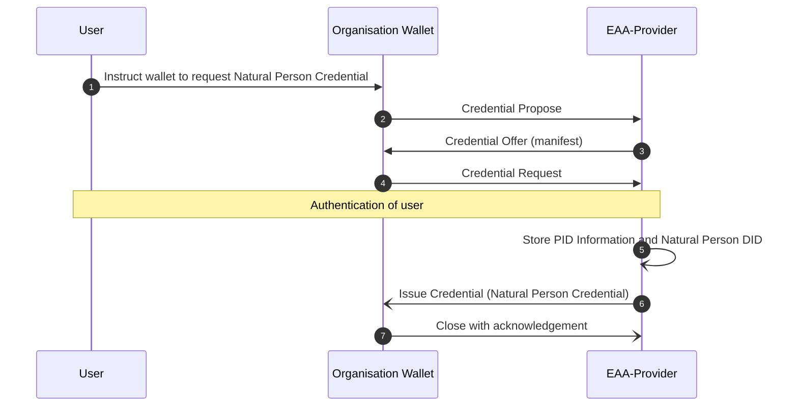
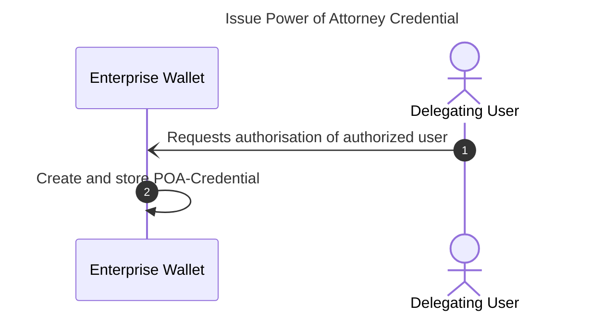
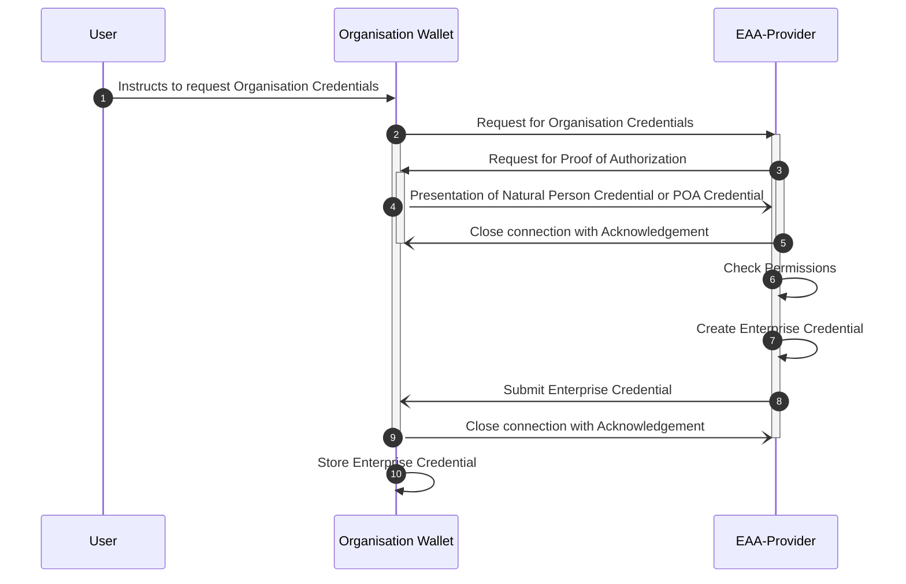

# EWC RFC010: Issue and Present Organisational Credentials - v0.1

**Authors:** 
* Mr Ronald Koenig (Spherity, Germany)
* Mr Ricky Thiermann  (Spherity, Germany)
* Mr Martin Westerkamp  (Spherity, Germany)

**Reviewers:** 
* ???

**Status:** Ready for review

notes:
* exchange of organisation credentials - issue and present
* organisation credentials are credentials about legal entities and their relationships
* legal entities are legal persons (companies) or natural persons (humans related to the company - employee, shareholder, ultimate beneficiary owners, ...)
* enterprise wallets holds organisational credentials and are operated by the company
  * used by a group a persons (employees of the company)
  * creates and holds identity for every user (DID)
  * company is liable for misuse of issued credentials
  * internal role model (visibility of credentials and claims)
  * running 24/7
* complex organisation credentials  
* signatory rights based on organisation credentials
* delegation of rights based on power of attorney credentials

structure:
* summary
* motivation
* trust model
  * DIDs
  * trust list (issuer, verifier)
  * credentials and holder binding
  * signatory rights
  * power of attorney
* issue natural person credential
* issue organisation credential
* issue power of attorney credential
* present organisational credentials


# 1	Summary

This specification defines the workflow for issuing an Organisation Credential.
Because the exchange of credentials between organisational server wallets has unique requirements compared to personal wallets, dedicated workflows are required to ensure streamlined processes.
In particular, organisational server wallets are expected to operate autonomously under certain conditions.
Further, actors (human or machine) within organisations need to authenticate and provide authorisation when interacting with remote organisations.
Therefore, protocols with greater informative value and flexibility are required in order to be able to express the complex organisational structures.
For this purpose, this RFC utilizes the Decentralized Identity Foundation's (DIF) Wallet And Credential Interactions (WACI) DIDComm Interop Profile [1] for exchanging credentials.
We also propose to define credentials using the W3C Credential Format [2], which is based on JSON-LD.
This allows the complex semantics of organisational credentials to be expressed in a concise but specific way.
In addition, W3C Verifiable Credentials provide cryptographic flexibility so that we can take advantage of well-established signature schemes such as ECDSA-SD, while retaining the flexibility to use modern schemes such as BBS.
The presented standard processes and formats ensure interoperability across the European Wallet Ecosystem with a standard specification in the EUDI Wallet Ecosystem according to the requirements of the ARF [3].


# 2	Motivation

The EWC LSP handles a variety of credentials that are exchanged between different types of organisations.
The goal of this RFC is to provide a standard protocol for requesting and issuing organisational credentials.
Depending on the use case, organisations need certain information about their business partners, such as authorised signatories, tax numbers or ultimate beneficial owners.
This data needs to be validated and kept up to date.
To simplify the management of this master data, we propose the use of organisational credentials, for example issued by an Attestation Provider verifying data from an authentic source such as the relevant commercial register.
We aim to provide greater flexibility in terms of authentication methods and credential types.
Since the credentials in scope are exchanged with a focus on organisations, we anticipate the use of server-based organisational wallets, which have different requirements than personal mobile wallets.
Therefore, we propose the introduction of an organisation-specific identity for natural persons that allows requesting and presenting organisational credentials without the need to interact with a personal wallet.
This will significantly simplify the handling of organisational credentials and enable a wide range of use cases.
Organisation wallets can handle processes automatically without human interaction and present the required credentials independently.
In addition, processes that require the verifiable liability of a responsible person are enabled by signing such requests using the representative's organisation-specific identity.

The defined protocols and standards serve as a foundation for enabling interoperability between organisations throughout the EWC ecosystem.
This RFC assumes that users are familiar with the chosen EWC protocols and standards, and can reference the original specifications when required. 

# 3 Trust Model

## 3.1 DIDs

## 3.2 Trust List

## 3.3 Credentials and Holder Binding

## 3.4 Signatory Rights

## 3.5 Power of Attorney

# 4. General concept

An organisation wallet is used by a user to request, receive and presents organizational credentials by interacting with issuers (EAA-provioder) and verifiers (service-providers).  
Users of the organisation wallet are members of the organisation. Users can be human or system users. System users are defined for handling automatic use cases. Each user added to an organisation wallet gets an identity by assigning a decentralized identifier (DID). Cryptographic material is managed by the Organisation Wallet through a key management system. The user is the controller of the DID, i.e. only he has access to the private key related to his DID. The user's organisation-specific DID can be used to issue, request and present credentials. There are three types of organisational credentials hold in the organisation wallet:
* Legal person credential: The subject of this type of credential is a legal person, i.e. a company, organisation, ...
* Natural person credential: The subject of this type of credential is a human being. Please note that this credential is only valid in the context of the organisation. It isn't the PID as defined by the EUDI-wallet, but can be derived from the PID.
* Power of attorney credential: The subject of this type of credential is a delegation of authority from one user of the enterprise wallet to another user.
It is possible to refer from within one credential to another. This allows to describe very complex organisation structures. Referencing is done using the id of the subject information property.

## 4.2 Organisation wallet initialisation
Before an organisational wallet can be used, it must be initialised.
In this process, the user management procedures are defined and an organisation-specific DID and key material are generated.
The organisation-specific DID enables the implementation of actions that do not require the traceability of a responsible person.
Such actions can be either part of automated processes or triggered by authorised persons.

Once the Organisation Wallet has been initialised, users (natural persons) can be enrolled.
Enrolling a user involves generating a user-specific DID and key material.
Note that the generated DID is different from the DID a user may have in a personal wallet.
As a result, members of an organisation benefit from role-specific credentials in their day-to-day work without having to rely on their personal wallet.
In addition, the generated material is securely stored in the organisation's key management system and can only be accessed by the assigned user for credential requests and presentations.

# 5 Issue Natural Person Credential

## 5.1 General

Signatory rights ensure that the signer is recognized as a legitimate party to the contract, with the capacity to fulfill the obligations and claim benefits stipulated within the agreement.
In legal contexts, these rights are crucial for validating the enforceability of contracts and other legal documents.

Signatory rights are asserted by EAA-provider within the organisation credential.

snippet of the organisation credential asserting signatory rights to a natural person:
```json
"functionary": {
  "legalEntityId": "did:key:...",  // DID of the user with signatory rights 
  "role": "CEO",
  "isAuthorizedRepresentative": true,
  "isExclusionOfParagraph181": false,
  "authorizationExtent": "full"
}
```

In order to assign the rights to a specific user of the organisation wallet the EAA-provider needs the DID of this specific user.

For this purpose the EAA-provider accepts a credential request from the user, authenticates him and issues a natural person credential bound to his DID. Afterward, the DID is known to the EAA-Provider and can be used within the organisation credential to assign signatory rights to a natural person.


**_NOTE:_**
When requesting the Organisation Credential from the EAA-Provider for every reference to a Natural Person, that has already requested a Natural Person Credential and consequently registered his DID at the EAA-Provider, the DID of the Natural Person is used. If a Natural Person referenced by an Organisation Credential is not yet registered at the time the credential is issued, a unique identifier (`urn:uuid:5042da0d-3675-4739-8c60-1c58390540a0`) is used for the reference instead of a DID.

## 5.2 Prerequisite

- User was added to the Organisational Wallet and got assigned a DID

## 5.3 Workflow

The flow is represented by a basic credential issuance flow.



## 5.4 Steps

1. The user instructs the Organisation Wallet to request a Natural Person Credential from the relevant authority (EAA Provider).
2. The Organisation Wallet triggers the credential issuing process by sending a Credential Propose message. The request establishes a new DID-Comm connection between the EAA-Provider and the Organisation Wallet. The DID-Comm OOB invitation is pre-configured in the wallet.
   preconfigured invite:
    ```json
    {
      "type":"https://didcomm.org/out-of-band/2.0/invitation",
      "id":"f137e0db-db7b-4776-9530-83c808a34a42",
      "from":"did:peer:2...", // did of EAA-Provider
      "body":{
        "goal-code":"issue natural person certificate",
        "accept":[
          "didcomm/v2"
        ]
      }
    }   
    ```
   ***_NOTE_***
   Alternatively, if the invitation isn't known it needs to be received out of band (QR-Code, deep-link, email, ...).

    credential propose message:
    ```json
    {
       "type":"https://didcomm.org/issue-credential/3.0/propose-credential",
       "id":"7f62f655-9cac-4728-854a-775ba6944593",
       "pthid":"f137e0db-db7b-4776-9530-83c808a34a42", //invite id
       "from":"did:peer:2...", // peer did EAA-Provider
       "to":[
          "did:example:issuer"
       ]
    }
    ```
   
3. The EAA-Provider sends credential offer message to the Organisation Wallet. The manifest offers to issue Natural Person Credential. Natural Person Credentials are only issued in the context of an Organisation. Therefore, the manifest of the EAA-Provider also requests the presentation of an Organisation Credential.

```json
{
  "type": "https://didcomm.org/issue-credential/3.0/offer-credential",
  "id": "c6686159-ef49-45b2-938f-51818da14723",
  "pthid": "6346b86f-c216-42f1-a0dc-ff733de2708d",
  "from": "did:peer:2...", // peer did EAA-Provider
  "to": "did:peer:2...", // peer did Organisation Wallet
  "body": {},
  "attachments": [
    {
      "id": "e00e11d4-906d-4c88-ba72-7c66c7113a78",
      "data": {
        "json": {
          "options":{
            "challenge":"508adef4-b8e0-4edf-a53d-a260371c1423",
            "domain":"9rf25a28rs96"
          },
          "credential_manifest": {
            "id": "075c7ccf-db02-42fd-bedb-d9fc369438c4",
            "spec_version": "https://identity.foundation/credential-manifest/spec/v1.0.0/",
            "issuer": {
              "id": "did:key:zDnaexEHa3xyCcG1pNCj65VPcbrYrrxVfxMW2qCsDN3XzqzxP",
              "name": "Bundesanzeiger Verlag"
            },
            "output_descriptors": [
              {
                "id": "NaturalPersonCredential",
                "schema": "https://oid.spherity.com/contexts/oid/v1.jsonld"
              }
            ],
            "presentation_definition": {
              "id": "8246867e-fdce-48de-a825-9d84ec16c6c9",
              "input_descriptors": [
                {
                  "id:": "LegalPersonId",
                  "frame": {
                    "@context": [
                      "https://www.w3.org/ns/credentials/v2",
                      "https://spherity.github.io/oid/credentials/v1/schema.jsonld"
                    ],
                    "type": [
                      "VerifiableCredential",
                      "LegalEntityCertificate"
                    ],
                    "credentialSubject": {
                      "@explicit": true,
                      "type": [
                        "LegalPersonId"
                      ],
                      "companyName": {},
                      "euid": {}
                    }
                  }
                }
              ]
            }
          }
        }
      },
      "format": "dif/credential-manifest/application@v1.0",
      "media_type": "application/json"
    }
  ]
}
```

4. The Organisation Wallet sends a credential request for a Natural Person Credential to the EAA-Provider. The DID-Comm OOB invitation and the credential manifest are pre-configured in the Enterprise Wallet. 

    ```json
    {
      "type": "https://didcomm.org/issue-credential/3.0/request-credential",
      "id": "c6686159-ef49-45b2-938f-51818da14723",
      "thid": "7f62f655-9cac-4728-854a-775ba6944593",
      "from": "did:peer:2...", // peer did Organisation Wallet
      "to": "did:peer:2...", // peer did EAA-Provider
      "body": {},
      "attachments": [
        {
          "id": "e00e11d4-906d-4c88-ba72-7c66c7113a78",
          "data": {
            "json": {
              "@context": [
                "https://www.w3.org/ns/credentials/v2",
                "https://identity.foundation/credential-manifest/application/v1"
              ],
              "id": "c407be9a-6a17-4577-91c7-ed327c8fa8ea",
              "credential_application": {
                "id": "888963b8-c087-4e70-afbb-11fba91e66b3",
                "spec_version": "https://identity.foundation/credential-manifest/spec/v1.0.0/",
                "format": {
                  "ldp_vc": {
                    "proof_type": [
                      "ecdsa-sd-2023"
                    ]
                  }
                },
                "applicant": "did:key:...", // natural person DID
                "manifest_id": "075c7ccf-db02-42fd-bedb-d9fc369438c4" // id of pre-configured manifest
              },
              "presentation_submission":{
                "id":"2e161b2c-606b-416f-b04f-7f06edac55a1",
                "definition_id":"8246867e-fdce-48de-a825-9d84ec16c6c9",
                "descriptor_map":[
                  {
                    "id":"LegalPersonId",
                    "format":"ldp_vp",
                    "path":"$.verifiableCredential[0]"
                  }
                ]
              },
              "verifiableCredential":[
                {
                  "@context": [
                    "https://www.w3.org/ns/credentials/v2",
                    "https://oid.spherity.com/contexts/oid/v1.jsonld"
                  ],
                  "type": [
                    "VerifiableCredential",
                    "LegalEntityCertificate"
                  ],
                  "issuer": "did:key:...", // did of organisation - self issued credential
                  "validFrom": "2024-07-30T10:15:32.859Z",
                  "validUntil": "2034-07-30T10:15:32.858Z",
                  "credentialSubject": {
                    "id": "did:key:...", //did of organisation                
                    "type": "LegalPersonId",
                    "companyName": "Flower Power AG",
                    "euid": "ANY EUID"
                  },
                  "proof": {
                    "created": "2024-07-30T10:15:32Z",
                    "cryptosuite": "ecdsa-sd-2023",
                    "proofPurpose": "assertionMethod",
                    "proofValue": "u2V0AhVh ...",
                    "type": "DataIntegrityProof",
                    "verificationMethod": "did:key:..." // key of organisation - self signed
                  }
                }
              ],
              "type": [
                "CredentialApplication"
              ]
            }
          },
          "format": "dif/credential-manifest/application@v1.0",
          "media_type": "application/json"
        }
      ]
    }
    ```    

The EAA-Provider authenticates the user before issuing the Natural Person Credential. There are several options to authenticate the user depending on the local laws and the capabilities of the EAA-Provider:

* PID (Personal EUDI Wallet)
* Video-Ident 
* national eID (e.g. "Personalausweis" in Germany)
* federated IDs

5. The EAA-Provider verifies the authenticated claims of the user against the transparency register. He also verifies that the user is an employee of the company and finally stores the Natural Person DID, the DID of the organisation and a reference to the corresponding entry of the transparency register.
6. The EAA-Provider issues the Natural Person Credential to the Organisation.
    ```json
    {
      "type": "https://didcomm.org/issue-credential/3.0/issue-credential",
      "id": "015c54fb-f9d4-4bd8-a2ab-157ca4776b3e",
      "thid": "c6686159-ef49-45b2-938f-51818da14723",
      "from": "did:peer:2...", //did of EAA-Provider
      "to": "did:peer:2...", //did of organisational wallet
      "body": {},
      "attachments": [
        {
          "format": "dif/credential-manifest/fulfillment@v1.0",
          "id": "e00e11d4-906d-4c88-ba72-7c66c7113a78",
          "media_type": "application/json",
          "data": {
            "json": {
              "@context": [
                "https://www.w3.org/ns/credentials/v2",
                "https://identity.foundation/credential-manifest/response/v1"
              ],
              "credential_response": {
                "id": "fb61b375-0b0d-4715-ab2d-fe6b15874e64",
                "spec_version": "https://identity.foundation/credential-manifest/spec/v1.0.0/",
                "applicant": "did:key:...", // natural person DID,
                "manifest_id": "075c7ccf-db02-42fd-bedb-d9fc369438c4",
                "application_id": "888963b8-c087-4e70-afbb-11fba91e66b3",
                "fulfillment": {
                  "descriptor_map": [
                    {
                      "format": "ldp_vc",
                      "id": "NaturalPersonCredential",
                      "path": "$.verifiableCredential[0]"
                    }
                  ]
                }
              },
              "type": [
                "CredentialResponse",
                "VerifiablePresentation"
              ],
              "verifiableCredential": [
                {
                  "@context": [
                    "https://www.w3.org/ns/credentials/v2",
                    "https://oid.spherity.com/contexts/oid/v1.jsonld"
                  ],
                  "type": [
                    "VerifiableCredential",
                    "LegalEntityCertificate"
                  ],
                  "issuer": "did:key:...", // did of EAA-Provider
                  "validFrom": "2024-07-30T10:11:22.985Z",
                  "validUntil": "2034-07-30T10:11:22.985Z",
                  "credentialSubject": {
                    "type": "NaturalPerson",
                    "id": "did:key:...", // did of natural person
                    "birthDate": "1970-01-01",
                    "domicile": {
                      "addressCountry": "Germany",
                      "addressLocality": "Berlin",
                      "postalCode": "10119"
                    },
                    "familyName": "Doe",
                    "gender": "Male",
                    "givenName": "John",
                    "jobTitle": "CEO"
                  },
                  "proof": {
                    "created": "2024-07-30T10:11:22Z",
                    "cryptosuite": "ecdsa-sd-2023",
                    "proofPurpose": "assertionMethod",
                    "proofValue": "u2V0AhV...",
                    "verificationMethod": "did:key:..." // key of EAA-Provider
                  }
                }
              ]
            }
          }
        }
      ]
    }
    ```

7. The Organisation Wallet acknowledges the reception of the credential and closes the connection.
```json
{
  "type": "https://didcomm.org/present-proof/3.0/ack",
  "id": "a22ffba5-5524-4e28-ad83-f7eb5bac6a86",
  "thid": "c6686159-ef49-45b2-938f-51818da14723",
  "from": "did:peer:2...", // did of organisation wallet
  "to": "did:peer:2...", // did of EAA-provider
  "body": {
    "status": "OK"
  }
}
```
## 5.5 Result

* The Natural Person DID of the user is registered at the EAA-Provider.
* The Natural Person Credential is stored in the wallet workspace of the user.

# 6 Issue Power of Attorney Credential

## 6.1 Description

Certain processes require proof of authority from a representative who has signatory rights such as the CEO.
While this is currently done manually by presenting signed sheets of paper, we want to automate the process and increase the level of security.

A user of the Organisation Wallet can delegate his authority or parts of it to another user of the wallet by issuing a power of attorney credential (POA Credential). The POA Credential needs to contain claims defining the delegate rights, the DID of the receiver of the rights and a chain of credentials to establish trust. The trust anchor of the chain has to be a Natural Person Credential of a user with signatures rights. The Organisation Credential issued by the EAA-Provider proves the signature rights of the user acting as trust anchor.
By presenting the Organisation Credential and the POA Credentials to the verifier, the user of the wallet can prove that he or she is authorized.
The credentials are automatically verifiable, streamlining the authorisation process.

## 6.2 Prerequisite

* The delegating user has been added to the Organisation Wallet and has got assigned a DID.
* The delegating user needs to have the required signatory rights or a POA Credential with the required rights.
* The user to be authorized has been added to the Organisation Wallet and has got assigned a DID.

## 6.3 Workflow



## 6.4 Steps

1. The Delegating User instructs the Organisation Wallet to authorize another user.
2. The POA Credential is created and stored in the workspace of the Authorised User.
    
    POA Credential:
    ```json
    {
      "@context": [
        "https://www.w3.org/ns/credentials/v2",
        "https://oid.spherity.com/contexts/cc/v1.jsonld",
        "https://oid.spherity.com/contexts/poa/v1.jsonld"
      ],
      "type": [
        "VerifiableCredential",
        "ChainedCredential",
        "PowerOfAttorney"
      ],
      "issuer": "did:key:...", // did of delegating user who asserts the delegated right for the authorized user
      "validFrom": "2024-07-30T10:20:55.189Z",
      "validUntil": "2034-07-30T10:20:55.188Z",
      "credentialSubject": {
        "dateOfBirth": "1970-01-01",
        "familyName": "Mustermann",
        "givenName": "Max",
        "id": "did:key:...", // did of authorized user
        "proxiedPermissions": [ // delegated rights
          "opening a bank account"
        ],
        "type": "PowerOfAttorney"
      },
      "proof": {
        "created": "2024-07-30T10:20:55Z",
        "cryptosuite": "ecdsa-sd-2023",
        "proofPurpose": "assertionMethod",
        "proofValue": "u2V0AhVh..."
      },
      "provenanceProof": {
        "@context": [
          "https://www.w3.org/ns/credentials/v2",
          "https://oid.spherity.com/contexts/oid/v1.jsonld"
        ],
        "issuer": "did:key:...", // did of EAA-Provider who asserts the signatory rights of the delegating user
        "type": [
          "VerifiableCredential",
          "LegalEntityCertificate"
        ],
        "validFrom": "2024-07-30T10:15:32.859Z",
        "validUntil": "2034-07-30T10:15:32.858Z",
        "credentialSubject": {
          "companyIdentifier": "urn:mdms:12345678",
          "companyName": "Flower Power AG",
          "functionary": { // signatory rights
            "authorizationExtent": "full",
            "isAuthorizedRepresentative": true,
            "isExclusionOfParagraph181": false,
            "legalEntityId": "did:key:...", // did of delegating user
            "role": "CEO"
          },
          "id": "did:key:...", // did of organisation 
          "type": [
            "LegalPersonId",
            "LegalPersonBaseData",
            "LegalPerson"
          ]
        },
        "proof": {
          "created": "2024-07-30T10:15:32Z",
          "cryptosuite": "ecdsa-sd-2023",
          "proofPurpose": "assertionMethod",
          "proofValue": "u2V0BhVh...",
          "type": "DataIntegrityProof",
          "verificationMethod": "did:key:..." // key of EAA-Provider
        }
      }
    }
    ```
   
In this example the followng JSON-LD contexts are used:

* The context `https://oid.spherity.com/cc` extends the credential by the property `provenanceProof`. The credential hold in the property `provenanceProof` proofs the authority of the credential issuer. Trust chains can be established by recursive embedding POA credentials, e.g.:

    `EAAP <--OrganisationCredential-- Functionary <--POA-- Employee A <--POA-- Employ B`
    
    The trust chain always ends at the EAA-Provider that has issued the organisation credential. In order to delegate authority a organisation credential (first delegation in chain) or a POA-credential (subsequent delegation is chain) is embedded into a POA-credential using the new term `provenanceProof`.     
    
* The context `https://oid.spherity.com/poa` defines the semantic of the terms in the credential subject of the power of attorney credential. The example shows a very simple authorization. By using other contexts more comprehensive delegations of authorization can be expressed, e.g. counter signatures, multi signatures, 1-of-n-signatures, m-of-n-signatures, etc.   

In the above shown POA-Credential an organisation credential is embedded into the POA-Credential to proof the signatory rights of the delegating user. Please note that only the required information to proof the signatory rights are disclosed in the embedded organisation credential. The delegated rights of the authorized user are then asserted by the delegating user by providing the assertion proof of the POA-Credential.

## 6.5 Result

- The employee has received an PoA Credential that is stored in the Organisation Wallet and can be used for business partner presentations.

# 7 Issue organisation Credential

## 7.1 Description

The Organisation Wallet stores Organisation Credentials. Credentials contain claims about the enterprise which are asserted by a trusted issuer. By presenting this claims to business partners, the business partners can verify the authenticity of the claims if they trust the issuer. Before an enterprise can present credentials it has to request credentials from issuers.
Credentials can be requested by any user of the Organisation Wallet with specific rights. The user proofs his rights against the issuer by presenting an Natural Person Credential (signatory rights) or a POA-Credential (delegated rights). The issuer looks up the data of the organisation, verifies if the requesting user is authorized to request the Organisation Credentials and submits the credentials if the requesting user is authorized.   

## 6.1 Prerequisites

* The company is registered at the EAA-Provider.
* The user has the rights to request Organisation Credential either by signatories rights or by power of attorney

## 6.2 Workflow



## 6.3 Steps

1. The user instructs the wallet to requests the Organisation Credentials
2. The Organisation Wallet sends the request to the EAA-Provider. The invitation and the credential manifest of the EAA-Provider are pre-configured in the organisation wallet. The request establishes a new DIDComm thread between the EAAP-Provider and the Organisation Wallet.

    <JsonDisplay json={CredentialRequest} />

   pre-configured credential manifest:

    <JsonDisplay json={CredentialManifest} />

   :::info
   The WACI doesn't allow to select specific claims in `output_descriptor`
   :::
   :::info
   The manifest format specified above follows the WACI for better readability. It is not required for pre-configured manifests.
   :::

3. The %%Bundesanzeiger|EAAP%% requests credentials to verify authorisation. It sends a presentation requests and opens a new sub thread `0ac534c8-98ed-4fe3-8a41-3600775e1e92` within the existing DIDComm parent thread `c6686159-ef49-45b2-938f-51818da14723`.

    <JsonDisplay json={RequestPresentation} />

4. The user presents either the Natural Person Credential or %%POA-Credential|power-of-attorney-credential%% to the %%Bundesanzeiger|EAAP%%


# 7 Issue organisation Credential

## 7.1 Process

## 7.2 Messages

## 7.2.1 Credential Manifest

```json
{
  "id": "organisation-credential-manifest",
  "spec_version": "https://identity.foundation/credential-manifest/spec/v1.0.0/",
  "issuer": {
    "id": "did:example:provider",
    "name": "Example EAA Provider"
  },
  "outputDescriptors": [
    {
      "id": "organisation-credential",
      "schema": [
        {
          "uri": "https://spherity.github.io/oid#LegalEntityCertificate",
          "required": true
        }
      ],
      "name": "Organisation Credential"
    }
  ],
  "format": {
    "jwt": {
      "alg": ["EdDSA", "ES256K", "ES384"]
    },
    "jwt_vc": {
      "alg": ["ES256K", "ES384"]
    },
    "jwt_vp": {
      "alg": ["EdDSA", "ES256K"]
    },
    "ldp_vc": {
      "proof_type": [
        "JsonWebSignature2020",
        "Ed25519Signature2018",
        "EcdsaSecp256k1Signature2019",
        "RsaSignature2018"
      ]
    },
    "ldp_vp": {
      "proof_type": ["Ed25519Signature2018"]
    },
    "ldp": {
      "proof_type": ["RsaSignature2018"]
    }
  }
}
```

## 7.2.2 Credential Application (Request)

```json
{
  "type": "https://didcomm.org/issue-credential/3.0/request-credential",
  "id": "c6686159-ef49-45b2-938f-51818da14723",
  "thid": "c6686159-ef49-45b2-938f-51818da14723",
  "from": "did:example:organisation",
  "to": ["did:example:provider"],
  "body": {},
  "attachments": [
    {
      "id": "e00e11d4-906d-4c88-ba72-7c66c7113a78",
      "media_type": "application/json",
      "format": "dif/credential-manifest/application@v1.0",
      "data": {
        "json": {
          "@context": [
            "https://www.w3.org/2018/credentials/v1",
            "https://identity.foundation/credential-manifest/application/v1"
          ],
          "type": "CredentialApplication",
          "credential_application": {
            "id": "9b1deb4d-3b7d-4bad-9bdd-2b0d7b3dcb6d",
            "spec_version": "https://identity.foundation/credential-manifest/spec/v1.0.0/",
            "applicant": "did:example:organisation",
            "manifest_id": "organisation-credential-manifest",
            "format": {
              "ldp_vc": {
                "proof_type": [
                  "JsonWebSignature2020",
                  "EcdsaSecp256k1Signature2019"
                ]
              }
            }
          }
        }
      }
    }
  ]
}
```

## 7.2.3 Credential Fulfilment (Issue)

```json
{
  "type": "https://didcomm.org/issue-credential/3.0/issue-credential",
  "id": "7a476bd8-cc3f-4d80-b784-caeb2ff265da",
  "thid": "c6686159-ef49-45b2-938f-51818da14723",
  "from": "did:example:provider",
  "to": ["did:example:organisation"],
  "body": {},
  "attachments": [
    {
      "id": "e00e11d4-906d-4c88-ba72-7c66c7113a79",
      "media_type": "application/json",
      "format": "dif/credential-manifest/fulfillment@v1.0",
      "data": {
        "json": {
          "@context": [
            "https://www.w3.org/2018/credentials/v1",
            "https://identity.foundation/credential-manifest/fulfillment/v1"
          ],
          "type": ["VerifiablePresentation", "CredentialFulfillment"],
          "credential_fulfillment": {
            "id": "a30e3b91-fb77-4d22-95fa-871689c322e2",
            "manifest_id": "dcc75a16-19f5-4273-84ce-4da69ee2b7fe",
            "descriptor_map": [
              {
                "id": "driver_license_output",
                "format": "ldp_vc",
                "path": "$.verifiableCredential[0]"
              }
            ]
          },
          "verifiableCredential": [
            {
              "@context": [
                "https://www.w3.org/2018/credentials/v1",
                "https://spherity.github.io/oid/credentials/v1/schema.jsonld"
              ],
              "type": ["VerifiableCredential", "LegalEntityCertificate"],
              "id": "urn:uuid:f086cced-1153-4540-993b-b4d52ca499c2",
              "issuanceDate": "2019-12-03T12:19:52Z",
              "expirationDate": "2029-12-03T12:19:52Z",
              "issuer": "did:example:provider",
              "credentialSubject": {
                "id": "did:example:organisation",
                "type": ["LegalPersonId", "LegalPersonBaseData"],
                "euid": "DEPLPOAG.123456789",
                "companyName": "Flower Power AG",
                "address": {
                  "postalCode": "10119",
                  "addressCountry": "Germany",
                  "addressLocality": "Berlin"
                },
                "registerIdentification": {
                  "registerType": "ABC123",
                  "registerTypeDescription": "Amtsgericht Tiergarten",
                  "registerLocation": "Berlin, Moabit",
                  "registerNumber": "123AVB",
                  "companyId": "ACDC",
                  "companyIdCountryCode": "DE"
                },
                "previousName": ["AL", "DI"],
                "status": "active",
                "liquidationStatus": "none",
                "insolvencyStatus": "none",
                "legalForm": "GmbH",
                "isFoundation": false,
                "isNfrdObligated": false,
                "isTrust": false,
                "businessObject": "Trading Company",
                "registrationDate": "2010-01-01",
                "exchange": {
                  "name": "Boerse Stuttgart",
                  "country": "Germany",
                  "marketIdentificationCode": "AA",
                  "tickerSymbol": "BB"
                },
                "isin": "1234567890",
                "vatId": "22222ABC",
                "lei": "ABC988",
                "leiStatus": "active",
                "leiNextIssuance": "2027-01-10"
              },
              "proof": {
                "created": "2021-06-07T20:02:44.730614315Z",
                "jws": "eyJhbGciOiJFZERTQSIsImI2NCI6ZmFsc2UsImNyaXQiOlsiYjY0Il19..NVum9BeYkhzwslZXm2cDOveQB9njlrCRSrdMZgwV3zZfLRXmZQ1AXdKLLmo4ClTYXFX_TWNyB8aFt9cN6sSvCg",
                "proofPurpose": "assertionMethod",
                "type": "Ed25519Signature2018",
                "verificationMethod": "did:orb:EiA3Xmv8A8vUH5lRRZeKakd-cjAxGC2A4aoPDjLysjghow#tMIstfHSzXfBUF7O0m2FiBEfTb93_j_4ron47IXPgEo"
              }
            }
          ],
          "proof": {
            "created": "2021-06-07T20:02:44.730614315Z",
            "jws": "eyJhbGciOiJFZERTQSIsImI2NCI6ZmFsc2UsImNyaXQiOlsiYjY0Il19..NVum9BeYkhzwslZXm2cDOveQB9njlrCRSrdMZgwV3zZfLRXmZQ1AXdKLLmo4ClTYXFX_TWNyB8aFt9cN6sSvCg",
            "proofPurpose": "authentication",
            "type": "Ed25519Signature2018",
            "verificationMethod": "did:orb:EiA3Xmv8A8vUH5lRRZeKakd-cjAxGC2A4aoPDjLysjghow#tMIstfHSzXfBUF7O0m2FiBEfTb93_j_4ron47IXPgEo"
          }
        }
      }
    }
  ]
}
```

# 8 Present Organisation Credentials

# 9	Reference


1. Decentralized Identity Foundation (DIF) (2023), Wallet And Credential Interactions (WACI) DIDComm Interop Profile, Available at: https://identity.foundation/waci-didcomm/ (Accessed at: July 9, 2024).
2. World Wide Web Consortium (W3C) (2024), Verifiable Credentials Data Model v2.0, Available at: https://www.w3.org/TR/vc-data-model-2.0/ (Accessed at: July 9, 2024).
3. European Commission (2023), The European Digital Identity Wallet Architecture and Reference Framework (2024-04, v1.3.0)  [Online]. Available at: [https://github.com/eu-digital-identity-wallet/eudi-doc-architecture-and-reference-framework/releases](https://github.com/eu-digital-identity-wallet/eudi-doc-architecture-and-reference-framework/releases) (Accessed: May 14, 2024).
4. Decentralized Identity Foundation (DIF) (2023), Credential Manifest, Available at: https://identity.foundation/credential-manifest (Accessed at: July 15, 2024).