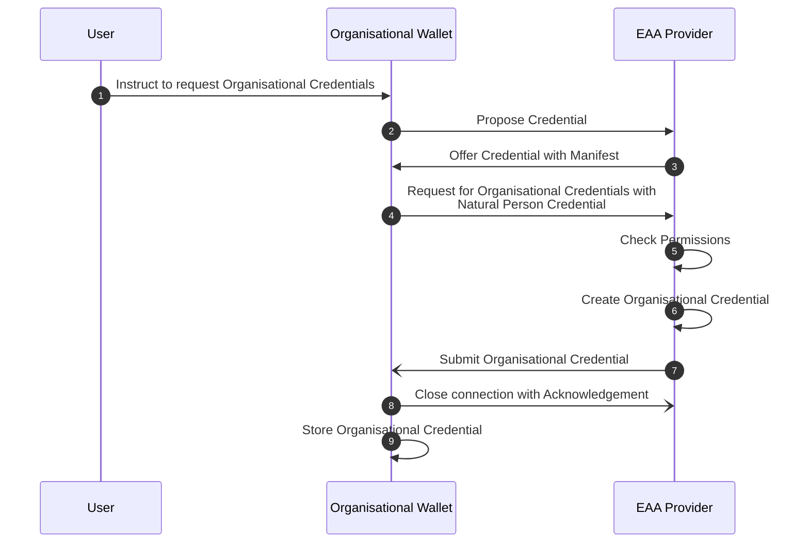
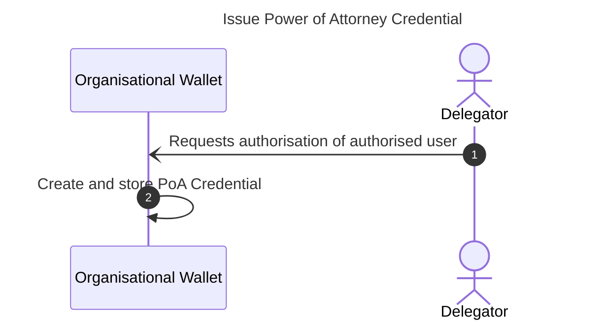
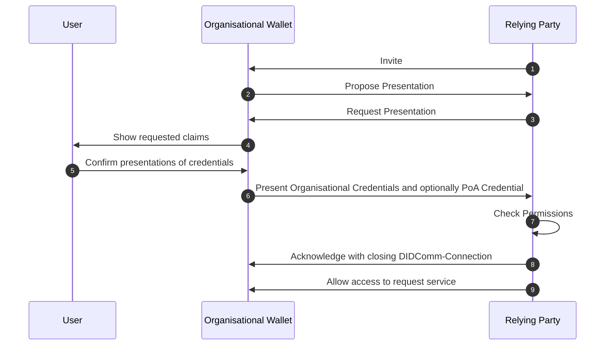

# EWC RFC010: Issue and Present Organisational Credentials - v0.1

**Authors:** 
* Mr Ronald Koenig (Spherity, Germany)
* Mr Martin Westerkamp  (Spherity, Germany)

**Reviewers:** 
* ???

**Status:** Ready for review

# 1	Summary

This specification defines the workflows for issuing and presenting Organisational Credentials.
Compared to Personal Wallets, Organisational Wallets have a different mode of operation and different requirements.
Organisational Wallets are expected to run in managed server environments and be in continuous operation.
They also manage multiple identities, including the organisation's identity and the identities of its representatives.
Therefore, a specific trust model and protocols are required.
The trust model describes the root of trust and the actors and identifiers involved.
It also expresses how entities are authorised to act in a particular role on behalf of an organisation and how these rights can be delegated.
To prove these relationships, three types of credentials are introduced: Organisational Credentials, Natural Person Credentials and Power of Attorney Credentials.
We also describe the issuance process of these three types of credentials and how they are used for verifiable presentations.

# 2	Motivation

The EWC LSP handles a variety of credentials that are exchanged between different types of organisations.
The goal of this RFC is to provide a standard protocol for issuing and presenting Organisational Credentials.
Depending on the use case, organisations need certain information about their business partners, such as authorised signatories, tax numbers or ultimate beneficial owners.
This data needs to be validated and kept up to date.
To simplify the management of this master data, we propose the use of Organisational Credentials, for example issued by an Attestation Provider asserting data from an authentic source such as the relevant commercial register.

Since the credentials in scope are exchanged with a focus on organisations, we anticipate the use of server-based Organisational Wallets, which have different requirements than Personal Mobile Wallets.
We aim to provide the best user experience by separating user identity proofing from authentication.
As a result of the identity proofing process, a Natural Person Credential is issued to the applicant and stored in the Organisational Wallet.
The cryptographic material associated with the Natural Person Credential is then used for authentication purposes.
This avoids "wallet dance" scenarios, greatly simplifies the handling of Organisational Credentials and enables a wide range of use cases.
Organisational Wallets can handle processes automatically without human interaction and present the required credentials independently.
In addition, processes that require the verifiable liability of a responsible person are enabled by signing such requests with the representative's organisation-specific identity.
This process requires no human interaction with a Personal Wallet.

Server-based Organisational Wallets are expected to be in continuous operation.
In order to process requests automatically, we propose the use of the DIDComm protocol for the issuance and presentation of verifiable credentials.
The DIDComm protocol provides persistent secure connections that allow messages to be exchanged without the need to re-establish connections.

The defined protocols and standards serve as a foundation for enabling interoperability between organisations throughout the EWC ecosystem.
This RFC assumes that users are familiar with the chosen EWC protocols and standards, and can reference the original specifications when required. 

# 3 Trust Model

## 3.1 DIDs

Organisational Wallets manage two types of identities: legal persons and natural persons.
Each legal person and natural person is identified by a unique identifier.
The use of Decentralised Identifiers (DIDs) permits the implementation of self-sovereign digital identities.
Each DID is associated with a DID Document, which may contain public keys, service endpoints, and other metadata required for interactions.
DIDs can be used across various platforms and services, promoting interoperability and user autonomy in the digital identity landscape.
In the context of this RFC, the a natural person's DID is used only in the context of the organisation and is managed using the Organisational Wallet.

DID Documents are resolved using a DID method.
While the workflows presented in this RFC are independent of the DID method used, we use two types of DID methods as examples: `DID:key` and `DID:peer`.
Legal and natural persons are identified using the `DID:key` method.
The `DID:key` method allows for the creation of DIDs directly from cryptographic key pairs without relying on a trust infrastructure.
Therefore, this RFC is independent of the choice of a concrete trust infrastructure and can be adapted flexibly.
The `DID:peer` method is used to establish secure bilateral communication channels for requesting and presenting credentials.
The method encodes an ephemeral key that is bound to a specific DIDComm connection.

## 3.2 Trust Lists

In order to verify verifiable credentials, the Relying Party needs a trust relationship with the Attestation Provider.
This RFC is independent of the trust infrastructure providing the trust anchor.
It is expected that a trust infrastructure is available to provide trust lists .
Trust lists provide the DIDs of trusted Attestation Providers and Relying Parties.
As a result, the wallet can verify the authenticity of the Relying Party before presenting a verifiable credential, and the Relying Party can verify the authenticity of the Attestation Provider upon presentation of the credential.

## 3.3 Credentials and Holder Binding

Organisational Credentials are expected to have a high degree of complexity and interdependency.
The W3C Credential Format [2] uses JSON-LD to express complex semantics in a concise but specific way.
JSON-LD enables semantic interoperability by using schemas agreed upon by the participants.
As a result, existing vocabularies such as the SEMIC Core Vocabularies [5] can be reused to ensure cross-border interoperability.
In addition, W3C Verifiable Credentials provide cryptographic flexibility so that we can take advantage of established signature schemes such as ECDSA-SD, while retaining the flexibility to use modern schemes such as BBS.

Verifiable Credentials contain claims about legal or natural persons and are requested, stored, and presented using the Organisational Wallet.
An Organisational Credential is bound to a legal person by its DID.
The Organisational Wallet can be configured to act autonomously by signing and presenting the Organisational Credential.
Furthermore, Organisational Credentials can express the roles of natural persons in the organisation by referencing their organisation-specific DID.
As a result, natural persons can sign and present Organisational Credentials to prove certain roles or rights (see Sections [3.4 Signatory Rights](#34-signatory-rights) and [3.5 Power of Attorney](#35-power-of-attorney)).

One of the key differences between Organisational Wallets and Personal Wallets is their availability and the need to operate autonomously.
This requires protocols that do not require human intervention.
The Decentralized Identity Foundation's (DIF) Wallet And Credential Interactions (WACI) DIDComm Interop Profile [1] enables autonomous credential exchange.
In addition, it establishes persistent connections for secure communication between organisational agents.

## 3.4 Signatory Rights

Organisations have associated natural persons who are authorised to act on behalf of the organisation.
These signatory rights are notified by the organisation to the national trade registers.
The national trade registers issue Organisational Credentials to organisations, including the corresponding signatory rights (see Section [6. Issue Organisational Credential](#6-issue-organisation-credential)).
Therefore, the national commercial registers act as Attestation Providers.
For authorisation purposes, natural persons may present the Organisational Credential to Relying Parties.
The Organisational Credential contains a list of natural persons with signatory rights and their DIDs.
By signing the credential presentation using the private key associated with a Natural Person DID that is part of the signatory list, users of the Organisational Wallet can prove to Relying Parties, that they have signatory rights.
The Relying Party verifies the signature and associates the DID used with the signatory entry in the Organisational Credential.

In order to include the DID in the Organisational Credential, the relevant natural persons must first register with the trade register.
This process involves the authentication and communication of the Natural Person DID, which is managed in the Organisational Wallet.
Further, a Natural Person Credential is issued to enable authentication and proof of certain attributes, such as name and date of birth (see Section [5. Issue Natural Person Credential](#5-issue-natural-person-credential)).

## 3.5 Power of Attorney

Natural persons can delegate certain rights to another natural person by issuing a Power of Attorney Credential (see Section [7. Issue Power of Attorney Credential](#7-issue-power-of-attorney-credential)).
In this case, the delegator acts as an Attestation Provider within the Organisational Wallet.
Delegates can be natural persons or machines identified by a DID.
The delegate's identity is expected to be managed in the same Organisational Wallet as the delegator's identity if they belong to the same organisation.

Power of Attorney Credentials contain information about the delegation rights, such as which actions are delegated, and a provenance proof of the delegation rights.
For this purpose, a credential that proves the delegator's rights is embedded into the Power of Attorney Credential.
For example, to delegate signatory rights, the delegator would need to embed the Organisational Credential that proves his or her signatory rights.
In addition, power of attorney can be chained by embedding a Power of Attorney Credential that delegates the relevant rights.

# 4. General concept

An Organisational Wallet is used by a user to request, receive and present credentials by interacting with EAA Providers and Relying Parties.
Users of the Organisational Wallet are members of the organisation. Users can be human or system users. System users are defined for handling automatic use cases. Each user added to an Organisational Wallet receives a Decentralised Identifier (DID). Cryptographic material is managed by the Organisational Wallet through a key management system. The user is the controller of the DID, i.e. only he has access to the private key associated with their DID. The user's organisation-specific DID can be used to issue, request and present credentials. There are three types of Organisational Credentials held in the Organisational Wallet:
* Organisational Credential: The subject of this type of credential is a legal person, i.e. a company, organisation, ...
* Natural Person Credential: The subject of this type of credential is a human being. Please note that this credential is only valid in the context of the organisation. The Natural Person Credential is different from the PID as defined by the EUDI Wallet. However, the PID can be used for authentication when requesting the credential.
* Power of Attorney Credential: The subject of this type of credential is a delegation of authority from one user of the Organisational Wallet to another user.
It is possible to refer from within one credential to another. This allows to describe very complex organisational structures. Referencing is done using the id of the subject information property.

# 5 Issue Natural Person Credential

## 5.1 General

Signatory rights ensure that the signer of a contract is recognised as a legitimate party, with the capacity to fulfil the obligations and claim the benefits set out in the agreement.
In legal contexts, these rights are essential to validate the enforceability of contracts and other legal documents.

Signatory rights are asserted by an EAA Provider within the Organisational Credential.

The following extract from an Organisational Credential shows the signing rights of a natural person:
```json
"functionary": {
  "legalEntityId": "did:key:...",  // DID of the user with signatory rights 
  "role": "CEO",
  "isAuthorizedRepresentative": true,
  "isExclusionOfParagraph181": false,
  "authorizationExtent": "full"
}
```

In order to assign the rights to a specific user of the Organisational Wallet, the EAA Provider needs the DID of that specific user.

For this purpose, the EAA Provider accepts a credential request from the user, authenticates the user and issues a Natural Person Credential bound to his or her DID. The DID is then known to the EAA Provider and can be used to assign signatory rights to a natural person in the Organisational Credential.


**_NOTE:_**
The EAA provider will use the Natural Person DID to reference them in the Organisational Credential if the natural person has previously registered.
If the natural person has not previously registered, a unique identifier (`urn:uuid:5042da0d-3675-4739-8c60-1c58390540a0`) shall be used for the reference in the Organisational Credential instead of a DID.

## 5.2 Prerequisite

The user has been added to the Organisational Wallet and has received a DID.

## 5.3 Workflow

The flow is represented by a basic credential issuance flow.


### Steps

1. The user instructs the Organisational Wallet to request a Natural Person Credential from the relevant authority (EAA Provider).
2. The Organisational Wallet triggers the credential issuing process by sending a `Propose Credential` message. The request establishes a new DIDComm connection between the EAA Provider and the Organisational Wallet. The DIDComm out of band invitation is pre-configured in the wallet.

   Pre-configured invite:
    ```json
    {
      "type": "https://didcomm.org/out-of-band/2.0/invitation",
      "id": "f137e0db-db7b-4776-9530-83c808a34a42",
      "from": "did:peer:2...", // peer DID of EAA Provider
      "body": {
        "goal-code": "issue natural person certificate",
        "accept": ["didcomm/v2"]
      }
    }
    ```
   ***_NOTE_:***
   If the invitation is unknown, it needs to be received out of band (QR-Code, deep-link, email, ...).

    `Propose Credential` message:
    ```json
    {
      "type": "https://didcomm.org/issue-credential/3.0/propose-credential",
      "id": "7f62f655-9cac-4728-854a-775ba6944593",
      "pthid": "f137e0db-db7b-4776-9530-83c808a34a42", // invite ID
      "from": "did:peer:2...", // peer DID of Organisational Wallet
      "to": "did:peer:2..." // peer DID of EAA Provider
    }
    ```
   
3. The EAA Provider sends a `Offer Credential` message to the Organisational Wallet that includes a `Credential Manifest`. The manifest describes the credentials being offered, in this case Natural Person Credentials. Natural Person Credentials are only issued in the context of an Organisation. Therefore, the manifest of the EAA Provider also requests the presentation of an Organisational Credential to prove the request is sent from the Organisational Wallet.

    `Offer Credential` message:
    ```json
    {
      "type": "https://didcomm.org/issue-credential/3.0/offer-credential",
      "id": "c6686159-ef49-45b2-938f-51818da14723",
      "thid": "7f62f655-9cac-4728-854a-775ba6944593",
      "from": "did:peer:2...", // peer DID of EAA Provider
      "to": "did:peer:2...", // peer DID of Organisational Wallet
      "body": {},
      "attachments": [
        {
          "id": "e00e11d4-906d-4c88-ba72-7c66c7113a78",
          "format": "dif/credential-manifest/application@v1.0",
          "media_type": "application/json",
          "data": {
            "json": {
              "options":{
                "challenge":"038adef4-b8e0-4edf-a53d-a260371c1956",
                "domain":"7rf25a28rs23"
              },
              "credential_manifest": {
                "id": "b72c7ccf-db02-42fd-bedb-d9fc369431c3",
                "spec_version": "https://identity.foundation/credential-manifest/spec/v1.0.0/",
                "issuer": {
                  "id": "did:key:...", // DID of EAA Provider
                  "name": "Bundesanzeiger Verlag"
                },
                "output_descriptors": [
                  {
                    "id": "NaturalPersonCredential",
                    "schema": "https://oid.spherity.com/contexts/oid/v1"
                  }
                ],
                "presentation_definition": {
                  "id": "8246867e-fdce-48de-a825-9d84ec16c6c9",
                  "input_descriptors": [
                    {
                      "id:": "LegalPersonId",
                      "frame": {
                        "@context": [
                          "https://www.w3.org/ns/credentials/v2",
                          "https://oid.spherity.com/contexts/oid/v1"
                        ],
                        "type": [
                          "VerifiableCredential",
                          "LegalEntityCertificate"
                        ],
                        "credentialSubject": {
                          "@explicit": true,
                          "type": [
                            "LegalPersonId"
                          ],
                          "companyName": {},
                          "euid": {}
                        }
                      }
                    }
                  ]
                }
              }
            }
          }
        }
      ]
    }
    ```

4. The Organisational Wallet requests a Natural Person Credential from the EAA Provider.

    `Request Credential` message:
    ```json
    {
      "type": "https://didcomm.org/issue-credential/3.0/request-credential",
      "id": "c6686159-ef49-45b2-938f-51818da14723",
      "thid": "7f62f655-9cac-4728-854a-775ba6944593",
      "from": "did:peer:2...", // peer DID of Organisational Wallet
      "to": "did:peer:2...", // peer DID of EAA Provider
      "body": {},
      "attachments": [
        {
          "id": "e00e11d4-906d-4c88-ba72-7c66c7113a78",
          "format": "dif/credential-manifest/application@v1.0",
          "media_type": "application/json",
          "data": {
            "json": {
              "@context": [
                "https://www.w3.org/ns/credentials/v2",
                "https://identity.foundation/credential-manifest/application/v1"
              ],
              "id": "c407be9a-6a17-4577-91c7-ed327c8fa8ea",
              "type": [
                "VerifiablePresentation",
                "CredentialApplication"
              ]
              "credential_application": {
                "id": "323963b8-c087-4e70-afbb-11fba91e67a2",
                "spec_version": "https://identity.foundation/credential-manifest/spec/v1.0.0/",
                "format": {
                  "ldp_vc": {
                    "proof_type": [
                      "ecdsa-sd-2023"
                    ]
                  }
                },
                "applicant": "did:key:...", // Natural Person DID
                "manifest_id": "b72c7ccf-db02-42fd-bedb-d9fc369431c3" // ID of pre-configured manifest
              },
              "presentation_submission":{
                "id":"2e161b2c-606b-416f-b04f-7f06edac55a1",
                "definition_id":"8246867e-fdce-48de-a825-9d84ec16c6c9",
                "descriptor_map":[
                  {
                    "id":"LegalPersonId",
                    "format":"ldp_vp",
                    "path":"$.verifiableCredential[0]"
                  }
                ]
              },
              "verifiableCredential":[
                {
                  "@context": [
                    "https://www.w3.org/ns/credentials/v2",
                    "https://oid.spherity.com/contexts/oid/v1"
                  ],
                  "type": [
                    "VerifiableCredential",
                    "LegalEntityCertificate"
                  ],
                  "issuer": "did:key:...", // DID of Organisation - self issued credential
                  "validFrom": "2024-07-30T10:15:32.859Z",
                  "validUntil": "2034-07-30T10:15:32.858Z",
                  "credentialSubject": {
                    "id": "did:key:...", // DID of Organisation                
                    "type": "LegalPersonId",
                    "companyName": "Flower Power AG",
                    "euid": "ANY EUID"
                  },
                  "proof": {
                    "created": "2024-07-30T10:15:32Z",
                    "cryptosuite": "ecdsa-sd-2023",
                    "proofPurpose": "assertionMethod",
                    "proofValue": "u2V0AhVh ...",
                    "type": "DataIntegrityProof",
                    "verificationMethod": "did:key:..." // DID of Organisation - self signed
                  }
                }
              ],
              "proof": {
                "type": "DataIntegrityProof",
                "created": "2024-07-30T20:26:37Z",
                "verificationMethod": "did:key:...",
                "cryptosuite": "ecdsa-sd-2023",
                "proofPurpose": "authentication",
                "challenge": "038adef4-b8e0-4edf-a53d-a260371c1956",
                "domain": "7rf25a28rs23",
                "proofValue": "u2V0AhVh..."
              }
            }
          }
        }
      ]
    }
    ```    

    The EAA Provider authenticates the user before issuing the Natural Person Credential. There are several options to authenticate the user depending on the local laws and the capabilities of the EAA Provider:

    * PID (Personal EUDI Wallet)
    * Video-Ident 
    * national eID
    * federated IDs

5. The EAA Provider verifies the authenticated claims of the user against the transparency register. The EAA Provider also verifies that the user is an employee of the company and finally stores the Natural Person DID, the DID of the organisation and a reference to the corresponding entry in the transparency register.
6. The EAA Provider issues the Natural Person Credential and sends it to the Organisational Wallet.

    `Issue Credential` message:
    ```json
    {
      "type": "https://didcomm.org/issue-credential/3.0/issue-credential",
      "id": "015c54fb-f9d4-4bd8-a2ab-157ca4776b3e",
      "thid": "c6686159-ef49-45b2-938f-51818da14723",
      "from": "did:peer:2...", // DID of EAA Provider
      "to": "did:peer:2...", // DID of Organisational Wallet
      "body": {},
      "attachments": [
        {
          "id": "e00e11d4-906d-4c88-ba72-7c66c7113a78",
          "format": "dif/credential-manifest/fulfillment@v1.0",
          "media_type": "application/json",
          "data": {
            "json": {
              "@context": [
                "https://www.w3.org/ns/credentials/v2",
                "https://identity.foundation/credential-manifest/response/v1"
              ],
               "type": [
                "CredentialResponse",
                "VerifiablePresentation"
              ],
              "credential_response": {
                "id": "fb61b375-0b0d-4715-ab2d-fe6b15874e64",
                "spec_version": "https://identity.foundation/credential-manifest/spec/v1.0.0/",
                "applicant": "did:key:...", // Natural Person DID
                "manifest_id": "b72c7ccf-db02-42fd-bedb-d9fc369431c3",
                "application_id": "323963b8-c087-4e70-afbb-11fba91e67a2",
                "fulfillment": {
                  "descriptor_map": [
                    {
                      "format": "ldp_vc",
                      "id": "NaturalPersonCredential",
                      "path": "$.verifiableCredential[0]"
                    }
                  ]
                }
              },
              "verifiableCredential": [
                {
                  "@context": [
                    "https://www.w3.org/ns/credentials/v2",
                    "https://oid.spherity.com/contexts/oid/v1"
                  ],
                  "type": [
                    "VerifiableCredential",
                    "LegalEntityCertificate"
                  ],
                  "issuer": "did:key:...", // DID of EAA Provider
                  "validFrom": "2024-07-30T10:11:22.985Z",
                  "validUntil": "2034-07-30T10:11:22.985Z",
                  "credentialSubject": {
                    "id": "did:key:...", // Natural Person DID
                    "type": "NaturalPerson",
                    "birthDate": "1970-01-01",
                    "domicile": {
                      "addressCountry": "Germany",
                      "addressLocality": "Berlin",
                      "postalCode": "10119"
                    },
                    "familyName": "Doe",
                    "gender": "Male",
                    "givenName": "John",
                    "jobTitle": "CEO"
                  },
                  "proof": {
                    "created": "2024-07-30T10:11:22Z",
                    "cryptosuite": "ecdsa-sd-2023",
                    "proofPurpose": "assertionMethod",
                    "proofValue": "u2V0AhV...",
                    "verificationMethod": "did:key:..." // DID of EAA Provider
                  }
                }
              ]
            }
          }
        }
      ]
    }
    ```

7. The Organisational Wallet acknowledges the reception of the credential and closes the connection.

    `Acknowledgement` message:
    ```json
    {
      "type": "https://didcomm.org/present-proof/3.0/ack",
      "id": "a22ffba5-5524-4e28-ad83-f7eb5bac6a86",
      "thid": "c6686159-ef49-45b2-938f-51818da14723",
      "from": "did:peer:2...", // DID of Organisational Wallet
      "to": "did:peer:2...", // DID of EAA Provider
      "body": {
        "status": "OK"
      }
    }
    ```
## 5.4 Result

* The Natural Person DID of the user is registered at the EAA Provider.
* The Natural Person Credential is stored in the wallet workspace of the user.

# 6 Issue Organisational Credential

## 6.1 Description

The Organisational Wallet stores Organisational Credentials. Organisational Credentials contain claims about the organisation which are asserted by a trusted EAA Provider. Relying Parties can verify the authenticity of presented claims if they trust the EAA Provider. Before an organisation can present credentials, it has to request credentials from EAA Providers.
Credentials can be requested by any user of the Organisational Wallet having specific rights. Users prove their entitlement to the EAA Provider by presenting a Natural Person Credential (signatory rights). The EAA provider looks up the organisation's details, verifies that the requesting user is authorised to request the Organisational Credentials, and submits the credentials if the requesting user is authorised.

## 6.2 Prerequisites

* The company is registered at the EAA Provider.
* The user has signatories rights and is authorised to request Organisational Credentials

## 6.3 Workflow



### Steps

1. The user instructs the Organisational Wallet to request Organisational Credentials
2. The Organisational Wallet triggers the credential issuing process by sending a `Propose Credential` message. The request establishes a new DIDComm connection between the EAA Provider and the Organisational Wallet. The DIDComm out of band invitation is pre-configured in the wallet.

    Pre-configured invite:
    ```json
    {
      "type": "https://didcomm.org/out-of-band/2.0/invitation",
      "id": "f137e0db-db7b-4776-9530-83c808a34a42",
      "from": "did:peer:2...", // peer DID of EAA Provider
      "body": {
        "goal-code": "issue organisational credential",
        "accept": ["didcomm/v2"]
      }
    }
    ```
    ***_NOTE_:***
    If the invitation is unknown, it needs to be received out of band (QR-Code, deep-link, email, ...).

    `Propose Credential` message:
    ```json
    {
      "type": "https://didcomm.org/issue-credential/3.0/propose-credential",
      "id": "7f62f655-9cac-4728-854a-775ba6944593",
      "pthid": "f137e0db-db7b-4776-9530-83c808a34a42", // invite ID
      "from": "did:peer:2...", // peer DID of Organisational Wallet
      "to": "did:peer:2..." // peer DID of EAA Provider
    }
    ```

3. The EAA Provider sends an `Offer Credential` message to the Organisational Wallet containing a Credential Manifest. The manifest describes the credentials being offered, in this case Organisational Credentials. Organisational Credentials are only issued if the applicant has the appropriate signatory rights. Therefore, the EAA Provider's Credential Manifest also prescribes the presentation of a Natural Person Credential to prove the right to request Organisational Credentials.

    `Offer Credential` message:
      ```json
      {
        "type": "https://didcomm.org/issue-credential/3.0/offer-credential",
        "id": "c6686159-ef49-45b2-938f-51818da14723",
        "thid": "7f62f655-9cac-4728-854a-775ba6944593",
        "from": "did:peer:2...", // peer DID of EAA Provider
        "to": "did:peer:2...", // peer DID of Organisational Wallet
        "body": {},
        "attachments": [
          {
            "id": "e00e11d4-906d-4c88-ba72-7c66c7113a78",
            "format": "dif/credential-manifest/application@v1.0",
            "media_type": "application/json",
            "data": {
              "json": {
                "options":{
                  "challenge":"508adef4-b8e0-4edf-a53d-a260371c1423",
                  "domain":"9rf25a28rs96"
                },
                "credential_manifest": {
                  "id": "075c7ccf-db02-42fd-bedb-d9fc369438c4",
                  "spec_version": "https://identity.foundation/credential-manifest/spec/v1.0.0/",
                  "issuer": {
                    "id": "did:key:...", // DID of EAA Provider
                    "name": "Bundesanzeiger Verlag"
                  },
                  "output_descriptors": [
                    {
                      "id": "LegalPersonCredential",
                      "schema": "https://oid.spherity.com/contexts/oid/v1"
                    }
                  ],
                  "presentation_definition": {
                    "id": "f8246867e-fdce-48de-a825-9d84ec16c6c9",
                    "input_descriptors": [
                      {
                        "id": "NaturalPersonCredential",
                        "constraints": {
                          "fields": [
                            {
                              "path": [
                                "$.type"
                              ],
                              "filter": {
                                "type": "array",
                                "contains": {
                                  "type": "string",
                                  "pattern": "NaturalPerson"
                                }
                              }
                            }
                          ]
                        }
                      }
                    ]
                  }
                }
              }
            }
          }
        ]
      }
      ```

4. The Organisational Wallet requests the Organisational Credentials from the EAA Provider.

   `Request Credential` message:
    ```json
    {
      "type": "https://didcomm.org/issue-credential/3.0/request-credential",
      "id": "c6686159-ef49-45b2-938f-51818da14723",
      "thid": "7f62f655-9cac-4728-854a-775ba6944593",
      "from": "did:peer:2...", // peer DID of Organisational Wallet
      "to": "did:peer:2...", // peer DID of EAA Provider
      "body": {},
      "attachments": [
        {
          "id": "e00e11d4-906d-4c88-ba72-7c66c7113a78",
          "format": "dif/credential-manifest/application@v1.0",
          "media_type": "application/json",
          "data": {
            "json": {
              "@context": [
                "https://www.w3.org/ns/credentials/v2",
                "https://identity.foundation/credential-manifest/application/v1"
              ],
              "id": "c407be9a-6a17-4577-91c7-ed327c8fa8ea",
              "type": [
                "VerifiablePresentation",
                "CredentialApplication"
              ],
              "credential_application": {
                "id": "888963b8-c087-4e70-afbb-11fba91e66b3",
                "spec_version": "https://identity.foundation/credential-manifest/spec/v1.0.0/",
                "format": {
                  "ldp_vc": {
                    "proof_type": [
                      "ecdsa-sd-2023"
                    ]
                  }
                },
                "applicant": "did:key:...", // Organisational DID
                "manifest_id": "075c7ccf-db02-42fd-bedb-d9fc369438c4" // ID of manifest
              },
              "presentation_submission":{
                "id":"2e161b2c-606b-416f-b04f-7f06edac55a1",
                "definition_id":"8246867e-fdce-48de-a825-9d84ec16c6c9",
                "descriptor_map":[
                  {
                    "id":"NaturalPersonCredential",
                    "format":"ldp_vp",
                    "path":"$.verifiableCredential[0]"
                  }
                ]
              },
              "verifiableCredential":[
                {
                  "@context": [
                    "https://www.w3.org/ns/credentials/v2",
                    "https://oid.spherity.com/contexts/oid/v1"
                  ],
                  "type": [
                    "VerifiableCredential",
                    "LegalEntityCertificate"
                  ],
                  "issuer": "did:key:...", // DID of EAA Provider
                  "validFrom": "2024-07-30T10:11:22.985Z",
                  "validUntil": "2034-07-30T10:11:22.985Z",
                  "credentialSubject": {
                    "id": "did:key:...", // Natural Person DID
                    "type": "NaturalPerson",
                    "birthDate": "1970-01-01",
                    "domicile": {
                      "addressCountry": "Germany",
                      "addressLocality": "Berlin",
                      "postalCode": "10119"
                    },
                    "familyName": "Doe",
                    "gender": "Male",
                    "givenName": "John",
                    "jobTitle": "CEO"
                  },
                  "proof": {
                    "created": "2024-07-30T10:11:22Z",
                    "cryptosuite": "ecdsa-sd-2023",
                    "proofPurpose": "assertionMethod",
                    "proofValue": "u2V0AhV...",
                    "verificationMethod": "did:key:..." // DID of EAA Provider
                  }
                }
              ],
              "proof": {
                "type": "DataIntegrityProof",
                "created": "2024-07-30T20:26:37Z",
                "verificationMethod": "did:key:...",
                "cryptosuite": "ecdsa-sd-2023",
                "proofPurpose": "authentication",
                "challenge": "508adef4-b8e0-4edf-a53d-a260371c1423",
                "domain": "4jt78h47fh47",
                "proofValue": "u2V0AhVh..."
              }
            }
          }
        }
      ]
    }
    ```
   
5. The EAA Provider checks the applicant's permissions to request Organisational Credentials.
6. The EAA Provider creates the Organisational Credentials.
7. The EAA Provider sends the credentials to the Organisational Wallet.

    ```json
    {
      "type": "https://didcomm.org/issue-credential/3.0/issue-credential",
      "id": "7a476bd8-cc3f-4d80-b784-caeb2ff265da",
      "thid": "c6686159-ef49-45b2-938f-51818da14723",
      "from": "did:peer:2...", // peer DID of EAA Provider
      "to": "did:peer:2...", // peer DID of Organisational Wallet
      "body": {},
      "attachments": [
        {
          "id": "e00e11d4-906d-4c88-ba72-7c66c7113a78",
          "format": "dif/credential-manifest/fulfillment@v1.0",
          "media_type": "application/json",
          "data": {
            "json": {
              "id": "a30e3b91-fb77-4d22-95fa-871689c322e2",
              "manifest_id": "dcc75a16-19f5-4273-84ce-4da69ee2b7fe",
              "@context": [
                "https://www.w3.org/ns/credentials/v2",
                "https://identity.foundation/credential-manifest/fulfillment/v1"
              ],
              "type": [
                "CredentialResponse",
                "VerifiablePresentation"
              ],
              "credential_response": {
                "id": "5631b375-0b0d-4715-ab2d-fe6b15874a49",
                "spec_version": "https://identity.foundation/credential-manifest/spec/v1.0.0/",
                "applicant": "did:key:...", // Organisational DID
                "manifest_id": "075c7ccf-db02-42fd-bedb-d9fc369438c4",
                "application_id": "888963b8-c087-4e70-afbb-11fba91e66b3",
                "fulfillment": {
                  "descriptor_map": [
                    {
                      "format": "ldp_vc",
                      "id": "Organisational Credential",
                      "path": "$.verifiableCredential[0]"
                    }
                  ]
                }
              },
              "verifiableCredential": [
                {
                  "@context": [
                    "https://www.w3.org/ns/credentials/v2",
                    "https://oid.spherity.com/contexts/oid/v1"
                  ],
                  "type": [
                    "VerifiableCredential",
                    "LegalEntityCertificate"
                  ],
                  "issuer": "did:key:...", // DID of EAA Provider
                  "validFrom": "2024-07-30T10:15:32.859Z",
                  "validUntil": "2034-07-30T10:15:32.858Z",
                  "credentialSubject": {
                    "id": "did:key:...", // Organisational DID
                    "type": [
                      "LegalPersonId",
                      "LegalPersonBaseData",
                      "LegalPerson"
                    ],
                    "address": {
                      "addressCountry": "Germany",
                      "addressLocality": "Berlin",
                      "postalCode": "10119"
                    },
                    "businessObject": "Trading Company",
                    "businessYear": {
                      "balance": {
                        "amount": "399399",
                        "currency": "EUR",
                        "type": "Balance"
                      },
                      "currency": "EUR",
                      "date": "2024-01-01",
                      "employeeCount": "39",
                      "revenue": "2933"
                    },
                    "companyIdentifier": "urn:mdms:12345678",
                    "companyName": "Flower Power AG",
                    "directParentCompany": "did:key:fictive-7",
                    "ekrn": "3333",
                    "euid": "ANY EUID",
                    "evidence": {
                      "source": "Transparency register",
                      "type": "Evidence",
                      "verificationDate": "2014-01-01",
                      "verifiedField": [
                        "CEO",
                        "CTO"
                      ]
                    },
                    "exchange": {
                      "country": "Germany",
                      "marketIdentificationCode": "AA",
                      "name": "Boerse Stuttgart",
                      "tickerSymbol": "BB"
                    },
                    "functionary": {
                      "authorizationExtent": "full",
                      "isAuthorizedRepresentative": true,
                      "isExclusionOfParagraph181": false,
                      "legalEntityId": "did:key:...", // DID of Natural Person
                      "role": "CEO"
                    },
                    "generalPartner": {
                      "legalEntityId": "did:key:fictive-6",
                      "share": {
                        "absolute": {
                          "amount": "399399",
                          "currency": "EUR",
                          "type": "Balance"
                        },
                        "absoluteInEur": {
                          "amount": "399399",
                          "currency": "EUR",
                          "type": "Balance"
                        },
                        "isDirectShare": true,
                        "relative": "20",
                        "type": "Share"
                      },
                      "type": "Shareholder"
                    },
                    "handoverDescription": "no flag",
                    "handoverFlag": false,
                    "insolvencyStatus": "none",
                    "isFoundation": false,
                    "isin": "1234567890",
                    "isNfrdObligated": false,
                    "isTrust": false,
                    "legalForm": "GmbH",
                    "lei": "ABC988",
                    "leiNextIssuance": "2027-01-10",
                    "leiStatus": "active",
                    "liquidationStatus": "none",
                    "nace020": {
                      "code": "IT",
                      "industryDescription": "Tech Int. Trade",
                      "type": "Industry"
                    },
                    "previousName": [
                      "AL",
                      "DI"
                    ],
                    "registerIdentification": {
                      "companyId": "ACDC",
                      "companyIdCountryCode": "DE",
                      "registerLocation": "Berlin, Moabit",
                      "registerNumber": "123AVB",
                      "registerType": "ABC123",
                      "registerTypeDescription": "Amtsgericht Tiergarten"
                    },
                    "registrationDate": "2010-01-01",
                    "regulator": {
                      "description": "Int. Trade",
                      "name": "BaFin",
                      "regulatorId": "DeBa"
                    },
                    "shareholder": {
                      "generalPartner": {
                        "legalEntityId": "did:key:fictive-5",
                        "share": {
                          "absolute": {
                            "amount": "399399",
                            "currency": "EUR",
                            "type": "Balance"
                          },
                          "absoluteInEur": {
                            "amount": "399399",
                            "currency": "EUR",
                            "type": "Balance"
                          },
                          "isDirectShare": true,
                          "relative": "20",
                          "type": "Share"
                        },
                        "type": "Shareholder"
                      },
                      "handover": false,
                      "handoverDescription": "none",
                      "legalEntityId": "did:key:fictive-4",
                      "share": {
                        "absolute": {
                          "amount": "399399",
                          "currency": "EUR",
                          "type": "Balance"
                        },
                        "absoluteInEur": {
                          "amount": "399399",
                          "currency": "EUR",
                          "type": "Balance"
                        },
                        "isDirectShare": true,
                        "relative": "20",
                        "type": "Share"
                      },
                      "shareholder": {
                        "legalEntityId": "did:key:fictive-5",
                        "share": {
                          "absolute": {
                            "amount": "399399",
                            "currency": "EUR",
                            "type": "Balance"
                          },
                          "absoluteInEur": {
                            "amount": "399399",
                            "currency": "EUR",
                            "type": "Balance"
                          },
                          "isDirectShare": true,
                          "relative": "20",
                          "type": "Share"
                        },
                        "type": "Shareholder"
                      },
                      "type": [
                        "Shareholder",
                        "ShareholderLegalPerson"
                      ],
                      "votingRightsRelative": "20"
                    },
                    "status": "active",
                    "ultimateBeneficiaryOwner": {
                      "capital": {
                        "share": {
                          "absolute": {
                            "amount": "399399",
                            "currency": "EUR",
                            "type": "Balance"
                          },
                          "absoluteInEur": {
                            "amount": "399399",
                            "currency": "EUR",
                            "type": "Balance"
                          },
                          "isDirectShare": true,
                          "relative": "20",
                          "type": "Share"
                        },
                        "shareRelativeDirect": "20",
                        "votingRightsRelativeDirect": "20"
                      },
                      "fictitious": {
                        "share": {
                          "absolute": {
                            "amount": "399399",
                            "currency": "EUR",
                            "type": "Balance"
                          },
                          "absoluteInEur": {
                            "amount": "399399",
                            "currency": "EUR",
                            "type": "Balance"
                          },
                          "isDirectShare": true,
                          "relative": "20",
                          "type": "Share"
                        },
                        "shareRelativeDirect": "20",
                        "votingRightsRelativeDirect": "20"
                      },
                      "naturalPersonId": "did:key:fictive-2",
                      "otherControl": {
                        "share": {
                          "absolute": {
                            "amount": "399399",
                            "currency": "EUR",
                            "type": "Balance"
                          },
                          "absoluteInEur": {
                            "amount": "399399",
                            "currency": "EUR",
                            "type": "Balance"
                          },
                          "isDirectShare": true,
                          "relative": "20",
                          "type": "Share"
                        },
                        "shareRelativeDirect": "20",
                        "votingRightsRelativeDirect": "20"
                      },
                      "votingRights": {
                        "otherControlReason": "20",
                        "share": {
                          "absolute": {
                            "amount": "399399",
                            "currency": "EUR",
                            "type": "Balance"
                          },
                          "absoluteInEur": {
                            "amount": "399399",
                            "currency": "EUR",
                            "type": "Balance"
                          },
                          "isDirectShare": true,
                          "relative": "20",
                          "type": "Share"
                        },
                        "shareRelativeDirect": "20",
                        "votingRightsRelative": "20",
                        "votingRightsRelativeDirect": "20"
                      }
                    },
                    "ultimateParentCompany": "did:key:fictive-8",
                    "vatId": "22222ABC",
                    "wz2008": {
                      "code": "IT",
                      "industryDescription": "Tech Int. Trade",
                      "type": "Industry"
                    }
                  },
                  "proof": {
                    "created": "2024-07-30T10:15:32Z",
                    "cryptosuite": "ecdsa-sd-2023",
                    "proofPurpose": "assertionMethod",
                    "proofValue": "u2V0AhVh...",
                    "type": "DataIntegrityProof",
                    "verificationMethod": "did:key:..."
                  }
                }
              ]
            }
          }
        }
      ]
    }
    ```

9. The Organisational Wallet acknowledges the reception of the credential and closes the DIDComm connection.
    ```json
    {
      "type": "https://didcomm.org/present-proof/3.0/ack",
      "id": "e2f3747b-41e8-4e46-abab-ba51472ab1c3",
      "thid": "c6686159-ef49-45b2-938f-51818da14723",
      "from": "did:peer:2...", // peer DID of Organisational Wallet
      "to": "did:peer:2...", // peer DID of EAA Provider
      "body": {
        "status": "OK"
      }
    }
    ```

# 7 Issue Power of Attorney Credential

## 7.1 Description

Certain processes require proof of authority from a representative who has signatory rights such as the CEO.
While this is currently done manually by presenting signed sheets of paper, we want to automate the process and increase the level of security.

A user of the Organisational Wallet can delegate his authority or parts of it to another user of the wallet by issuing a Power of Attorney Credential (PoA Credential). The PoA Credential needs to contain claims defining the delegate rights, the DID of the delegatee and a chain of credentials to establish trust. 
The trust chain terminates with the Organisational Credential issued by the EAA Provider asserting the signatory rights.
By presenting the Organisational Credential and the PoA Credentials to a Relying Party, the user of the wallet can prove that he or she is authorized.
The credentials are verifiable without requiring human interaction, streamlining the authorisation process.

## 7.2 Prerequisite

* The delegator has been added to the Organisational Wallet and has received a DID.
* The delegator has the required signatory rights or a PoA Credential with the required rights.
* The delegatee has been added to the Organisational Wallet and has received a DID.

## 7.3 Workflow



### Steps

1. The Delegating User instructs the Organisational Wallet to authorise another user.
2. The PoA Credential is created and stored in the workspace of the delegatee.
    
    PoA Credential:
    ```json
    {
      "@context": [
        "https://www.w3.org/ns/credentials/v2",
        "https://oid.spherity.com/contexts/cc/v1",
        "https://oid.spherity.com/contexts/poa/v1"
      ],
      "type": [
        "VerifiableCredential",
        "ChainedCredential",
        "PowerOfAttorneyCertificate"
      ],
      "issuer": "did:key:...", // DID of delegator asserting the rights for the delegatee
      "validFrom": "2024-07-30T10:20:55.189Z",
      "validUntil": "2034-07-30T10:20:55.188Z",
      "credentialSubject": {
        "id": "did:key:...", // DID of delegatee
        "type": "PowerOfAttorney",
        "dateOfBirth": "1970-01-01",
        "familyName": "Mustermann",
        "givenName": "Max",
        "proxiedPermissions": [ // delegated rights
          "opening a bank account"
        ]
      },
      "provenanceProof": {
        "@context": [
          "https://www.w3.org/ns/credentials/v2",
          "https://oid.spherity.com/contexts/oid/v1"
        ],
        "issuer": "did:key:...", // DID of EAA Provider who asserts the signatory rights of the delegator
        "type": [
          "VerifiableCredential",
          "LegalEntityCertificate"
        ],
        "validFrom": "2024-07-30T10:15:32.859Z",
        "validUntil": "2034-07-30T10:15:32.858Z",
        "credentialSubject": {
          "id": "did:key:...", // DID of Organisation 
          "type": [
            "LegalPersonId",
            "LegalPersonBaseData",
            "LegalPerson"
          ],
          "companyIdentifier": "urn:mdms:12345678",
          "companyName": "Flower Power AG",
          "functionary": { // signatory rights
            "authorizationExtent": "full",
            "isAuthorizedRepresentative": true,
            "isExclusionOfParagraph181": false,
            "legalEntityId": "did:key:...", // DID of delegator
            "role": "CEO"
          }
        },
        "proof": {
          "created": "2024-07-30T10:15:32Z",
          "cryptosuite": "ecdsa-sd-2023",
          "proofPurpose": "assertionMethod",
          "proofValue": "u2V0BhVh...",
          "type": "DataIntegrityProof",
          "verificationMethod": "did:key:..." // DID of EAA Provider
        }
      },
      "proof": {
        "created": "2024-07-30T10:20:55Z",
        "cryptosuite": "ecdsa-sd-2023",
        "proofPurpose": "assertionMethod",
        "proofValue": "u2V0AhVh...",
        "type": "DataIntegrityProof",
        "verificationMethod": "did:key:..." // DID of delegator
      }
    }
    ```
   
This example uses the following JSON-LD contexts:

* The chained credential context `https://oid.spherity.com/cc` extends the credential by the property `provenanceProof`. The credential presented in the `provenanceProof` property proofs the authority of the credential issuer. Trust chains can be established by recursively embedding PoA Credentials, e.g.:

    `EAAP <--OrganisationCredential-- Functionary <--PoA-- Employee A <--PoA-- Employee B`
    
    The trust chain always terminates at the EAA Provider that has issued the Organisational Credential. In order to delegate authority, an Organisational Credential (first delegation in chain) or a PoA Credential (subsequent delegation is chain) is embedded into a PoA Credential using the new term `provenanceProof`.     
    
* The context `https://oid.spherity.com/poa` defines the semantics of the terms in the credential subject of the PoA Credential. The example shows simple authorization. Other contexts can be used to express more extensive delegations of authorisation, e.g. counter-signatures, multi-signatures, 1-of-n-signatures, m-of-n-signatures, etc.

In the PoA Credential shown above, an Organisational Credential is embedded in the PoA Credential to prove the delegator's signatory rights. Please note that only the required information to prove the signatory rights are disclosed in the embedded Organisational Credential. The delegated rights of the delegatee are then asserted by the delegator by providing the assertion proof of the PoA Credential.

## 4 Result

- The employee has received a PoA Credential that is stored in the Organisational Wallet and can be used for presentations to Relying Parties.

# 8 Present Organisational Credentials

## 8.1 Description

The organisation can present Organisational Credentials to Relying Parties to prove certain claims about the organisation. In addition to proving the claims, the presenter also authenticates to the Relying Party using their DID. Users with signatory rights can prove their rights by presenting the Organisational Credentials. Users without signatory must present a Power of Attorney Credential together with the Organisational Credential.
The credential chain within the PoA Credential provides traceability to trusted entity. The starting point must be an Organisational Credential issued by a trusted EAA Provider defining the signatory rights.
Organisational Credentials are held by an organisation, i.e. by a group of persons. The Organisational Credentials are shared by the users of the Organisational Wallet. Any user can present the Organisational Credentials.

## 8.2 Prerequisites

* The user is signed in to the Organisational Wallet.
* The Organisational Credentials are stored in the Organisational Wallet.
* The user has the signatory rights or power of attorney to request a Relying Party's service.
* The user has requested a service.

## 8.3 Workflow



### Steps


1. The Relying Party sends an invitation to the Wallet to request proof of rights to access the specific service.
    ```json
      {
        "type": "https://didcomm.org/out-of-band/2.0/invitation",
        "id": "f137e0db-db7b-4776-9530-83c808a34a42",
        "from": "did:peer:2...", // peer DID of Relying Party
        "body": {
          "goal-code": "present proof",
          "accept": ["didcomm/v2"]
        }
      }
   ```
    ***_NOTE_:***
    The presentation is sent out of band, e.g. by a deep link.

2. The wallet proposes to send a presentation. The message establishes the DIDComm connection.

    `Propose Credential` message:
   ```json
   {
     "type": "https://didcomm.org/issue-credential/3.0/propose-presentation",
     "id": "4f62f655-9cac-4728-854a-775ba694464a",
     "pthid": "f137e0db-db7b-4776-9530-83c808a34a42", // invite ID
     "from": "did:peer:2...", // peer DID of Organisational Wallet
     "to": "did:peer:2..." // peer DID of Relying Party
   }
   ```
3. The Relying Party requests the presentation of an Organisational Credential along with a Natural Person or Power of Attorney Credential

    `Request Presentation` message:
    ```json
    {
      "type": "https://didcomm.org/present-proof/3.0/request-presentation",
      "id": "0ac534c8-98ed-4fe3-8a41-3600775e1e92",
      "thid": "4f62f655-9cac-4728-854a-775ba694464a",
      "from": "did:peer:2...", // peer DID of Relying Party
      "to": "did:peer:2..." // peer DID of Organisational Wallet
      "body": {},
      "attachments": [
        {
          "id": "ed7d9b1f-9eed-4bde-b81c-3aa7485cf947",
          "media_type": "application/json",
          "format": "dif/presentation-exchange/definitions@v1.0",
          "data": {
            "json": {
              "options": {
                "challenge": "31abea30-be5f-4ab2-99ae-6b7a0208ac76",
                "domain": "3et78h47fh48"
              },
              "presentation_definition": {
                "id": "f2346867e-fdce-48de-a825-9d84ec16c6a2",
                "input_descriptors": [
                  {
                    "id": "LegalEntityCredentials",
                    "constraints": {
                      "fields": [
                        {
                          "path": ["$.type"],
                          "filter": {
                            "type": "array",
                            "contains": {
                              "type": "string",
                              "pattern": "LegalEntityCertificate"
                            }
                          }
                        },
                        {
                          "path": ["$.type"],
                          "optional": true,
                          "filter": {
                            "type": "array",
                            "contains": {
                              "type": "string",
                              "pattern": "PowerOfAttorneyCertificate"
                            }
                          }
                        }
                      ]
                    }
                  }
                ]
              }
            }
          }
        }
      ]
    }
    ```

4. The Wallet shows the claims to the user.
5. The user confirms the presentation of the requested claims.
6. The wallet presents the Organisational Credentials. If the requester doesn't have signatory rights together with the PoA Credential proofing the rights.

    `Presentation` message:
    ```json
    {
      "type": "https://didcomm.org/present-proof/3.0/presentation",
      "id": "f1ca8245-ab2d-4d9c-8d7d-94bf310314ef",
      "thid": "4f62f655-9cac-4728-854a-775ba694464a",
      "from": "did:peer:2...", // peer DID of Organisational Wallet
      "to": "did:peer:2..." // peer DID of Relying Party
      "body": {},
      "attachments": [
        {
          "id": "2a3f1c4c-623c-44e6-b159-179048c51260",
          "media_type": "application/ld+json",
          "format": "dif/presentation-exchange/submission@v1.0",
          "data": {
            "json": {
              "@context": [
                "https://www.w3.org/ns/credentials/v2",
                "https://identity.foundation/presentation-exchange/submission/v1"
              ],
              "type": [
                "VerifiablePresentation",
                "PresentationSubmission"
              ],
              "presentation_submission": {
                "id": "1d257c50-454f-4c96-a273-c5368e01fe63",
                "definition_id": "32f54163-7166-48f1-93d8-ff217bdb0654",
                "descriptor_map": [
                  {
                    "id": "LegalEntityCredentials",
                    "format": "ldp_vp",
                    "path": "$.verifiableCredential[0]"
                  }
                ]
              },
              "proof": {
                "type": "DataIntegrityProof",
                "created": "2024-07-25T07:26:37Z",
                "verificationMethod": "did:key:...", // DID of Natural Person
                "cryptosuite": "ecdsa-sd-2023",
                "proofPurpose": "authentication",
                "challenge": "31abea30-be5f-4ab2-99ae-6b7a0208ac76",
                "domain": "3et78h47fh48",
                "proofValue": "u2V0AhVh..."
              },
              "verifiableCredential": [
                {
                  "@context": [
                    "https://www.w3.org/ns/credentials/v2",
                    "https://oid.spherity.com/contexts/oid/v1"
                  ],
                  "type": [
                    "VerifiableCredential",
                    "LegalEntityCertificate"
                  ],
                  "issuer": "did:key:...", // DID of EAA Provider
                  "validFrom": "2024-07-30T10:15:32.859Z",
                  "validUntil": "2034-07-30T10:15:32.858Z",
                  "credentialSubject": {
                    "id": "did:key:...", // Organisational DID
                    "type": [
                      "LegalPersonId",
                      "LegalPersonBaseData",
                      "LegalPerson"
                    ],
                    "address": {
                      "addressCountry": "Germany",
                      "addressLocality": "Berlin",
                      "postalCode": "10119"
                    },
                    "businessObject": "Trading Company",
                    "businessYear": {
                      "balance": {
                        "amount": "399399",
                        "currency": "EUR",
                        "type": "Balance"
                      },
                      "currency": "EUR",
                      "date": "2024-01-01",
                      "employeeCount": "39",
                      "revenue": "2933"
                    },
                    "companyIdentifier": "urn:mdms:12345678",
                    "companyName": "Flower Power AG",
                    "directParentCompany": "did:key:fictive-7",
                    "ekrn": "3333",
                    "euid": "ANY EUID",
                    "evidence": {
                      "source": "Transparency register",
                      "type": "Evidence",
                      "verificationDate": "2014-01-01",
                      "verifiedField": [
                        "CEO",
                        "CTO"
                      ]
                    },
                    "exchange": {
                      "country": "Germany",
                      "marketIdentificationCode": "AA",
                      "name": "Boerse Stuttgart",
                      "tickerSymbol": "BB"
                    },
                    "functionary": {
                      "authorizationExtent": "full",
                      "isAuthorizedRepresentative": true,
                      "isExclusionOfParagraph181": false,
                      "legalEntityId": "did:key:...", // DID of Natural Person
                      "role": "CEO"
                    },
                    "generalPartner": {
                      "legalEntityId": "did:key:fictive-6",
                      "share": {
                        "absolute": {
                          "amount": "399399",
                          "currency": "EUR",
                          "type": "Balance"
                        },
                        "absoluteInEur": {
                          "amount": "399399",
                          "currency": "EUR",
                          "type": "Balance"
                        },
                        "isDirectShare": true,
                        "relative": "20",
                        "type": "Share"
                      },
                      "type": "Shareholder"
                    },
                    "handoverDescription": "no flag",
                    "handoverFlag": false,
                    "insolvencyStatus": "none",
                    "isFoundation": false,
                    "isin": "1234567890",
                    "isNfrdObligated": false,
                    "isTrust": false,
                    "legalForm": "GmbH",
                    "lei": "ABC988",
                    "leiNextIssuance": "2027-01-10",
                    "leiStatus": "active",
                    "liquidationStatus": "none",
                    "nace020": {
                      "code": "IT",
                      "industryDescription": "Tech Int. Trade",
                      "type": "Industry"
                    },
                    "previousName": [
                      "AL",
                      "DI"
                    ],
                    "registerIdentification": {
                      "companyId": "ACDC",
                      "companyIdCountryCode": "DE",
                      "registerLocation": "Berlin, Moabit",
                      "registerNumber": "123AVB",
                      "registerType": "ABC123",
                      "registerTypeDescription": "Amtsgericht Tiergarten"
                    },
                    "registrationDate": "2010-01-01",
                    "regulator": {
                      "description": "Int. Trade",
                      "name": "BaFin",
                      "regulatorId": "DeBa"
                    },
                    "shareholder": {
                      "generalPartner": {
                        "legalEntityId": "did:key:fictive-5",
                        "share": {
                          "absolute": {
                            "amount": "399399",
                            "currency": "EUR",
                            "type": "Balance"
                          },
                          "absoluteInEur": {
                            "amount": "399399",
                            "currency": "EUR",
                            "type": "Balance"
                          },
                          "isDirectShare": true,
                          "relative": "20",
                          "type": "Share"
                        },
                        "type": "Shareholder"
                      },
                      "handover": false,
                      "handoverDescription": "none",
                      "legalEntityId": "did:key:fictive-4",
                      "share": {
                        "absolute": {
                          "amount": "399399",
                          "currency": "EUR",
                          "type": "Balance"
                        },
                        "absoluteInEur": {
                          "amount": "399399",
                          "currency": "EUR",
                          "type": "Balance"
                        },
                        "isDirectShare": true,
                        "relative": "20",
                        "type": "Share"
                      },
                      "shareholder": {
                        "legalEntityId": "did:key:fictive-5",
                        "share": {
                          "absolute": {
                            "amount": "399399",
                            "currency": "EUR",
                            "type": "Balance"
                          },
                          "absoluteInEur": {
                            "amount": "399399",
                            "currency": "EUR",
                            "type": "Balance"
                          },
                          "isDirectShare": true,
                          "relative": "20",
                          "type": "Share"
                        },
                        "type": "Shareholder"
                      },
                      "type": [
                        "Shareholder",
                        "ShareholderLegalPerson"
                      ],
                      "votingRightsRelative": "20"
                    },
                    "status": "active",
                    "ultimateBeneficiaryOwner": {
                      "capital": {
                        "share": {
                          "absolute": {
                            "amount": "399399",
                            "currency": "EUR",
                            "type": "Balance"
                          },
                          "absoluteInEur": {
                            "amount": "399399",
                            "currency": "EUR",
                            "type": "Balance"
                          },
                          "isDirectShare": true,
                          "relative": "20",
                          "type": "Share"
                        },
                        "shareRelativeDirect": "20",
                        "votingRightsRelativeDirect": "20"
                      },
                      "fictitious": {
                        "share": {
                          "absolute": {
                            "amount": "399399",
                            "currency": "EUR",
                            "type": "Balance"
                          },
                          "absoluteInEur": {
                            "amount": "399399",
                            "currency": "EUR",
                            "type": "Balance"
                          },
                          "isDirectShare": true,
                          "relative": "20",
                          "type": "Share"
                        },
                        "shareRelativeDirect": "20",
                        "votingRightsRelativeDirect": "20"
                      },
                      "naturalPersonId": "did:key:fictive-2",
                      "otherControl": {
                        "share": {
                          "absolute": {
                            "amount": "399399",
                            "currency": "EUR",
                            "type": "Balance"
                          },
                          "absoluteInEur": {
                            "amount": "399399",
                            "currency": "EUR",
                            "type": "Balance"
                          },
                          "isDirectShare": true,
                          "relative": "20",
                          "type": "Share"
                        },
                        "shareRelativeDirect": "20",
                        "votingRightsRelativeDirect": "20"
                      },
                      "votingRights": {
                        "otherControlReason": "20",
                        "share": {
                          "absolute": {
                            "amount": "399399",
                            "currency": "EUR",
                            "type": "Balance"
                          },
                          "absoluteInEur": {
                            "amount": "399399",
                            "currency": "EUR",
                            "type": "Balance"
                          },
                          "isDirectShare": true,
                          "relative": "20",
                          "type": "Share"
                        },
                        "shareRelativeDirect": "20",
                        "votingRightsRelative": "20",
                        "votingRightsRelativeDirect": "20"
                      }
                    },
                    "ultimateParentCompany": "did:key:fictive-8",
                    "vatId": "22222ABC",
                    "wz2008": {
                      "code": "IT",
                      "industryDescription": "Tech Int. Trade",
                      "type": "Industry"
                    }
                  },
                  "proof": {
                    "created": "2024-07-30T10:15:32Z",
                    "cryptosuite": "ecdsa-sd-2023",
                    "proofPurpose": "assertionMethod",
                    "proofValue": "u2V0AhVh...",
                    "type": "DataIntegrityProof",
                    "verificationMethod": "did:key:..." // DID of EAA Provider
                  }
                }
              ]
            }
          }
        }
      ]
    }
    ```

7. The Relying Party checks the permissions by verifying the signatory rights of the requester in the Organisational Credential or the PoA Credential.
8. The Relying Party acknowledges the reception of the proof and closes the DIDcomm connection.
9. The Relying Party gives access to the requested service (e.g. opening a Bank account).

### Result

- The user has access to the requested service at the service provider.


# 9	References


1. Decentralized Identity Foundation (DIF) (2023), Wallet And Credential Interactions (WACI) DIDComm Interop Profile, Available at: https://identity.foundation/waci-didcomm/ (Accessed at: July 9, 2024).
2. World Wide Web Consortium (W3C) (2024), Verifiable Credentials Data Model v2.0, Available at: https://www.w3.org/TR/vc-data-model-2.0/ (Accessed at: July 9, 2024).
3. European Commission (2023), The European Digital Identity Wallet Architecture and Reference Framework (2024-04, v1.3.0)  [Online]. Available at: [https://github.com/eu-digital-identity-wallet/eudi-doc-architecture-and-reference-framework/releases](https://github.com/eu-digital-identity-wallet/eudi-doc-architecture-and-reference-framework/releases) (Accessed: May 14, 2024).
4. Decentralized Identity Foundation (DIF) (2023), Credential Manifest, Available at: https://identity.foundation/credential-manifest (Accessed at: July 15, 2024).
5. European Commission (2024), ISA² - Interoperability solutions for public administrations, businesses and citizens - Core Vocabularies, Available at: https://ec.europa.eu/isa2/solutions/core-vocabularies_en/ (Accessed: July 31, 2024)