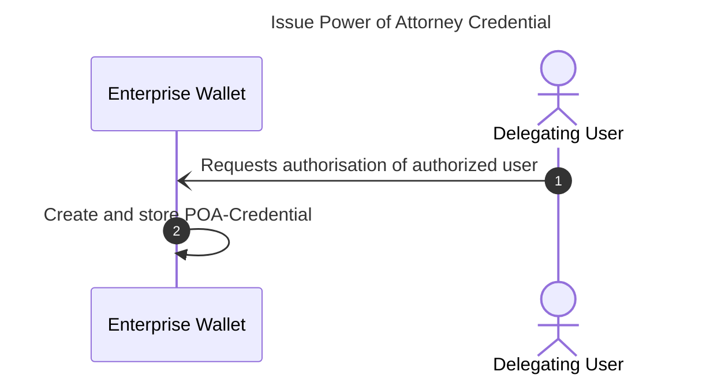
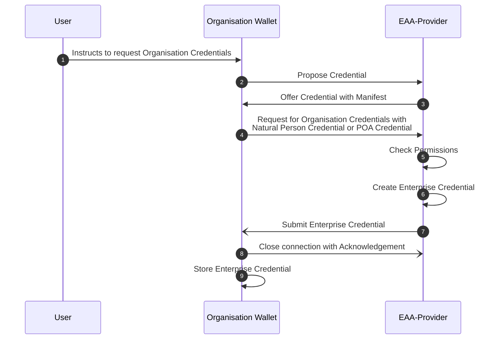
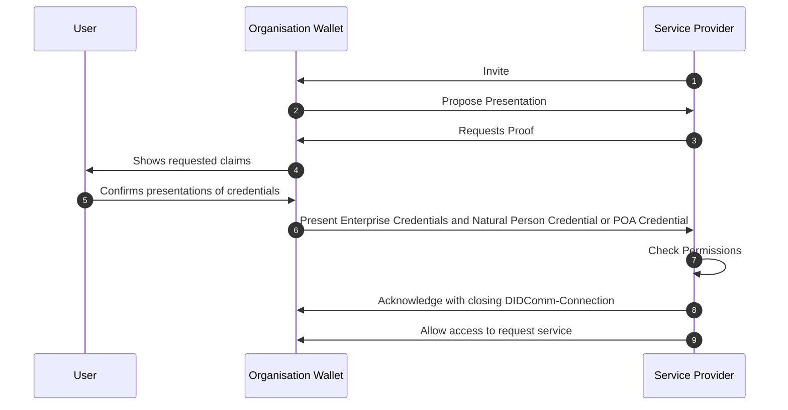

# EWC RFC010: Issue and Present Organisational Credentials - v0.1

**Authors:** 
* Mr Ronald Koenig (Spherity, Germany)
* Mr Ricky Thiermann  (Spherity, Germany)
* Mr Martin Westerkamp  (Spherity, Germany)

**Reviewers:** 
* ???

**Status:** Ready for review

notes:
* exchange of organisational credentials - issue and present
* organisational credentials are credentials about legal entities and their relationships
* legal entities are legal persons (companies) or natural persons (humans related to the company - employee, shareholder, ultimate beneficiary owners, ...)
* enterprise wallets holds organisational credentials and are operated by the company
  * used by a group a persons (employees of the company)
  * creates and holds identity for every user (DID)
  * company is liable for misuse of issued credentials
  * internal role model (visibility of credentials and claims)
  * running 24/7
* complex organisational credentials  
* signatory rights based on organisational credentials
* delegation of rights based on power of attorney credentials

structure:
* summary
* motivation
* trust model
  * DIDs
  * trust list (issuer, verifier)
  * credentials and holder binding
  * signatory rights
  * power of attorney
* issue natural person credential
* issue organisational credential
* issue power of attorney credential
* present organisational credentials


# 1	Summary

This specification defines the workflows for issuing and presenting organisational credentials.
Compared to personal wallets, organisational wallets have a different mode of operation and different requirements.
Organisational wallets are expected to run in managed server environments and be in continuous operation.
They also manage multiple identities, including the organisation's identity and the identities of its representatives.
Therefore, a specific trust model and protocols are required.
The trust model describes the root of trust and the actors and identifiers involved.
It also expresses how entities are authorised to act in a particular role on behalf of an organisation and how these rights can be delegated.
To prove these relationships, three types of credentials are introduced: organisational credentials, natural person credentials and power of attorney credentials.
We also describe the issuance process of these three types of credentials and how they are used for verifiable presentations.

# 2	Motivation

The EWC LSP handles a variety of credentials that are exchanged between different types of organisations.
The goal of this RFC is to provide a standard protocol for requesting and issuing organisational credentials.
Depending on the use case, organisations need certain information about their business partners, such as authorised signatories, tax numbers or ultimate beneficial owners.
This data needs to be validated and kept up to date.
To simplify the management of this master data, we propose the use of organisational credentials, for example issued by an Attestation Provider verifying data from an authentic source such as the relevant commercial register.

We aim to provide greater flexibility in terms of authentication methods and credential types.
Since the credentials in scope are exchanged with a focus on organisations, we anticipate the use of server-based organisational wallets, which have different requirements than personal mobile wallets.
Therefore, we propose the use of legal entity identifiers that represent legal persons or natural persons.
This will significantly simplify the handling of organisational credentials and enable a wide range of use cases.
Organisational wallets can handle processes automatically without human interaction and present the required credentials independently.
In addition, processes that require the verifiable liability of a responsible person are enabled by signing such requests using the representative's organisation-specific identity.
This process does not require natural persons to interact with a personal wallet.

The defined protocols and standards serve as a foundation for enabling interoperability between organisations throughout the EWC ecosystem.
This RFC assumes that users are familiar with the chosen EWC protocols and standards, and can reference the original specifications when required. 

# 3 Trust Model

## 3.1 DIDs

Organisational wallets manage two types of identities: legal person and natural person.
Each legal person and natural person is identified by a unique identifier.
The use of Decentralised Identifiers (DIDs) permits the implementation of self-sovereign digital identities.
Each DID is associated with a DID Document that may contains public keys, service endpoints, and other metadata needed for interactions.
DIDs can be used across various platforms and services, fostering interoperability and user autonomy in the digital identity landscape.
In the context of this RFC, the DID of a natural person is only used in the context of the organisation and managed using the organisational wallet.

DID Documents are resolved using a DID method.
While the workflows presented in this RFC are agnostic to the used DID method, we use two types of DID methods as examples: `DID:key` and `DID:peer`.
Legal and natural persons are identified using the `DID:key` method.
The `DID:key` method allows for the creation of DIDs directly from cryptographic key pairs without relying on a trust infrastructure.
Therefore, this RFC is independent from the selection of a concrete trust infrastructure and can be adjusted flexibly.
The `DID:peer` method is used for establishing secure bilateral communication channels for requesting and presenting credentials.
The method encodes an ephemeral key bound to specific a DIDComm connection.

## 3.2 Trust Lists

In order to verify verifiable credentials, the Relying Party needs a trust relationship with the Attestation Provider.
This RFC is independent of the trust infrastructure that provides the trust anchor.
It is expected that a trust infrastructure providing trust lists is available.
Trust lists provide the DIDs of trusted Attestation Providers and Relying Parties.
As a result, the wallet can verify the authenticity of the Relying Party before presenting a verifiable credential, and the Relying Party can verify the authenticity of the Attestation Provider upon presentation of the credential.

## 3.3 Credentials and Holder Binding

It is expected that organisational credentials exhibit a high degree of complexity and interdependencies.
The W3C Credential Format [2] utilizes JSON-LD for expressing complex semantics in a concise but specific way.
JSON-LD enables semantic interoperability by utilizing schemas that participants have agreed upon.
As a result, present vocabularies such as the SEMIC Core Vocabularies [5] can be reused to ensure cross-border interoperability.
In addition, W3C Verifiable Credentials provide cryptographic flexibility so that we can take advantage of well-established signature schemes such as ECDSA-SD, while retaining the flexibility to use modern schemes such as BBS.

Verifiable Credentials include claims about legal or natural persons and are requested, stored, and presented using the organisational wallet.
An organisational credential is bound to a legal person by its DID.
The organisational wallet can be configured to act autonomously by signing and presenting the organisational credential.
Furthermore, organisational credentials may express the roles of natural persons in the enterprise by referencing their organisation-specific DID.
As a result, natural persons can sign and present organisational credentials to prove certain roles or rights (see sections [3.4 Signatory Rights](#34-signatory-rights) and [3.5 Power of Attorney](#35-power-of-attorney)).

One of the key differences between organisational wallets and personal wallets is their availability and the need to operate autonomously.
This requires protocols that do not require human intervention.
The Decentralized Identity Foundation's (DIF) Wallet And Credential Interactions (WACI) DIDComm Interop Profile [1] enables autonomous credential exchange.
In addition, it does not require an existing connection for secure communication between organisational agents.

## 3.4 Signatory Rights

Organisations have associated natural persons who are authorised to act on behalf of the organisation.
These signatory rights are notified by the organisation to national commercial registers.
The national commercial registers issue organisational credentials to organisations including the relevant signatory rights (see section [6. Issue Organisational Credential](#6-issue-organisation-credential).
Therefore, the national commercial registers act as Attestation Providers.
For authorisation purposes, natural persons may present the organisational credential to Relying Parties.
The organisational credential contains a list of natural persons with signatory rights.
This list also includes the unique identifiers of the natural persons in the form of a DID.
By signing the credential presentation using the private key associated with a natural person DID that is part of the signatory list, users of the organisational wallet can prove to Relying Parties, that they have signatory rights.
The Relying Party verifies the signature and associates the DID used with the signatory entry in the organisational credential.

In order to include the DID in the organisational credential, the relevant natural persons must first register with the commercial register.
This process involves the authentication and communication of the natural person DID, which is managed in the organisational wallet.
Further, a natural person credential is issued to enable authentication and proof of certain attributes, such as name and date of birth (see section [5. Issue Natural Person Credential](#5-issue-natural-person-credential)).

## 3.5 Power of Attorney

Natural persons can delegate certain rights to another natural person by issuing a power of attorney credential (see section [7. Issue Power of Attorney Credential](#7-issue-power-of-attorney-credential)).
In this case, the delegator acts as an Attestation Provider within the organisational wallet.
Delegates can be natural persons or machines identified by a DID.
Typically, but not necessarily, the delegate's identity will be managed in the same organisational wallet as the delegator's identity if they belong to the same organisation.

Power of attorney credentials contain information about the delegation rights, such as which actions are delegated, and a provenance proof of the delegation rights.
For this purpose, a credential proving the delegator's rights is embedded into the power of attorney credential.
For example, to delegate signatory rights, the delegator would need to embed the organisational credential that proves his or her signatory rights.
In addition, power of attorney can be chained by including a power of attorney credential that delegates the relevant rights.

# 4. General concept

An organisational wallet is used by a user to request, receive and presents organizational credentials by interacting with EAA Providers and Relying Parties.  
Users of the organisational wallet are members of the organisation. Users can be human or system users. System users are defined for handling automatic use cases. Each user added to an organisational wallet gets an identity by assigning a decentralized identifier (DID). Cryptographic material is managed by the Organisational Wallet through a key management system. The user is the controller of the DID, i.e. only he has access to the private key related to his DID. The user's organisation-specific DID can be used to issue, request and present credentials. There are three types of organisational credentials hold in the organisational wallet:
* Legal person credential: The subject of this type of credential is a legal person, i.e. a company, organisation, ...
* Natural person credential: The subject of this type of credential is a human being. Please note that this credential is only valid in the context of the organisation. The natural person credential is different from the PID as defined by the EUDI-wallet. However, the PID can be used for authentication when requesting the credential.
* Power of attorney credential: The subject of this type of credential is a delegation of authority from one user of the organisational wallet to another user.
It is possible to refer from within one credential to another. This allows to describe very complex organisational structures. Referencing is done using the id of the subject information property.

# 5 Issue Natural Person Credential

## 5.1 General

Signatory rights ensure that the signer is recognized as a legitimate party to the contract, with the capacity to fulfill the obligations and claim benefits stipulated within the agreement.
In legal contexts, these rights are crucial for validating the enforceability of contracts and other legal documents.

Signatory rights are asserted by an EAA Provider within the organisational credential.

The following snippet shows an organisational credential asserting signatory rights to a natural person:
```json
"functionary": {
  "legalEntityId": "did:key:...",  // DID of the user with signatory rights 
  "role": "CEO",
  "isAuthorizedRepresentative": true,
  "isExclusionOfParagraph181": false,
  "authorizationExtent": "full"
}
```

In order to assign the rights to a specific user of the organisational wallet the EAA Provider needs the DID of this specific user.

For this purpose the EAA Provider accepts a credential request from the user, authenticates them and issues a natural person credential bound to his DID. The DID is then known to the EAA Provider and can be used to assign signatory rights to a natural person in the organisational credential.


**_NOTE:_**
The EAA provider will use the Natural Person's DID to reference them in them in the Organisational Credential if the Natural Person has previously registered.
If the Natural Person has not previously registered, a unique identifier (`urn:uuid:5042da0d-3675-4739-8c60-1c58390540a0`) will be used for the reference in the Organisational Credential instead of a DID.

## 5.2 Prerequisite

The user has been added to the Organisational Wallet and has received a DID.

## 5.3 Workflow

The flow is represented by a basic credential issuance flow.


## 5.4 Steps

1. The user instructs the Organisational Wallet to request a Natural Person Credential from the relevant authority (EAA Provider).
2. The Organisational Wallet triggers the credential issuing process by sending a `Propose Credential` message. The request establishes a new DIDComm connection between the EAA Provider and the Organisational Wallet. The DIDComm out of band invitation is pre-configured in the wallet.

   Pre-configured invite:
    ```json
    {
      "type": "https://didcomm.org/out-of-band/2.0/invitation",
      "id": "f137e0db-db7b-4776-9530-83c808a34a42",
      "from": "did:peer:2...", // peer DID of EAA Provider
      "body": {
        "goal-code": "issue natural person certificate",
        "accept": ["didcomm/v2"]
      }
    }
    ```
   ***_NOTE_:***
   If the invitation is unknown, it needs to be received out of band (QR-Code, deep-link, email, ...).

    `Propose Credential` message:
    ```json
    {
      "type": "https://didcomm.org/issue-credential/3.0/propose-credential",
      "id": "7f62f655-9cac-4728-854a-775ba6944593",
      "pthid": "f137e0db-db7b-4776-9530-83c808a34a42", // invite ID
      "from": "did:peer:2...", // peer DID of Organisational Wallet
      "to": "did:peer:2..." // peer DID of EAA Provider
    }
    ```
   
3. The EAA Provider sends a `Offer Credential` message to the Organisational Wallet that includes a `Credential Manifest`. The manifest describes the credentials being offered, in this case Natural Person Credentials. Natural Person Credentials are only issued in the context of an Organisation. Therefore, the manifest of the EAA Provider also requests the presentation of an Organisational Credential to prove the request is sent from the Organisational Wallet.

    `Offer Credential` message:
    ```json
    {
      "type": "https://didcomm.org/issue-credential/3.0/offer-credential",
      "id": "c6686159-ef49-45b2-938f-51818da14723",
      "thid": "7f62f655-9cac-4728-854a-775ba6944593",
      "from": "did:peer:2...", // peer DID of EAA Provider
      "to": "did:peer:2...", // peer DID of Organisational Wallet
      "body": {},
      "attachments": [
        {
          "id": "e00e11d4-906d-4c88-ba72-7c66c7113a78",
          "data": {
            "json": {
              "options":{
                "challenge":"508adef4-b8e0-4edf-a53d-a260371c1423",
                "domain":"9rf25a28rs96"
              },
              "credential_manifest": {
                "id": "075c7ccf-db02-42fd-bedb-d9fc369438c4",
                "spec_version": "https://identity.foundation/credential-manifest/spec/v1.0.0/",
                "issuer": {
                  "id": "did:key:...", // DID of EAA Provider
                  "name": "Bundesanzeiger Verlag"
                },
                "output_descriptors": [
                  {
                    "id": "NaturalPersonCredential",
                    "schema": "https://oid.spherity.com/contexts/oid/v1.jsonld"
                  }
                ],
                "presentation_definition": {
                  "id": "8246867e-fdce-48de-a825-9d84ec16c6c9",
                  "input_descriptors": [
                    {
                      "id:": "LegalPersonId",
                      "frame": {
                        "@context": [
                          "https://www.w3.org/ns/credentials/v2",
                          "https://spherity.github.io/oid/credentials/v1/schema.jsonld"
                        ],
                        "type": [
                          "VerifiableCredential",
                          "LegalEntityCertificate"
                        ],
                        "credentialSubject": {
                          "@explicit": true,
                          "type": [
                            "LegalPersonId"
                          ],
                          "companyName": {},
                          "euid": {}
                        }
                      }
                    }
                  ]
                }
              }
            }
          },
          "format": "dif/credential-manifest/application@v1.0",
          "media_type": "application/json"
        }
      ]
    }
    ```

4. The Organisational Wallet requests a Natural Person Credential from the EAA Provider.

    `Request Credential` message:
    ```json
    {
      "type": "https://didcomm.org/issue-credential/3.0/request-credential",
      "id": "c6686159-ef49-45b2-938f-51818da14723",
      "thid": "7f62f655-9cac-4728-854a-775ba6944593",
      "from": "did:peer:2...", // peer DID of Organisational Wallet
      "to": "did:peer:2...", // peer DID of EAA Provider
      "body": {},
      "attachments": [
        {
          "id": "e00e11d4-906d-4c88-ba72-7c66c7113a78",
          "data": {
            "json": {
              "@context": [
                "https://www.w3.org/ns/credentials/v2",
                "https://identity.foundation/credential-manifest/application/v1"
              ],
              "id": "c407be9a-6a17-4577-91c7-ed327c8fa8ea",
              "credential_application": {
                "id": "888963b8-c087-4e70-afbb-11fba91e66b3",
                "spec_version": "https://identity.foundation/credential-manifest/spec/v1.0.0/",
                "format": {
                  "ldp_vc": {
                    "proof_type": [
                      "ecdsa-sd-2023"
                    ]
                  }
                },
                "applicant": "did:key:...", // Natural Person DID
                "manifest_id": "075c7ccf-db02-42fd-bedb-d9fc369438c4" // ID of pre-configured manifest
              },
              "presentation_submission":{
                "id":"2e161b2c-606b-416f-b04f-7f06edac55a1",
                "definition_id":"8246867e-fdce-48de-a825-9d84ec16c6c9",
                "descriptor_map":[
                  {
                    "id":"LegalPersonId",
                    "format":"ldp_vp",
                    "path":"$.verifiableCredential[0]"
                  }
                ]
              },
              "verifiableCredential":[
                {
                  "@context": [
                    "https://www.w3.org/ns/credentials/v2",
                    "https://oid.spherity.com/contexts/oid/v1.jsonld"
                  ],
                  "type": [
                    "VerifiableCredential",
                    "LegalEntityCertificate"
                  ],
                  "issuer": "did:key:...", // DID of Organisation - self issued credential
                  "validFrom": "2024-07-30T10:15:32.859Z",
                  "validUntil": "2034-07-30T10:15:32.858Z",
                  "credentialSubject": {
                    "id": "did:key:...", // DID of Organisation                
                    "type": "LegalPersonId",
                    "companyName": "Flower Power AG",
                    "euid": "ANY EUID"
                  },
                  "proof": {
                    "created": "2024-07-30T10:15:32Z",
                    "cryptosuite": "ecdsa-sd-2023",
                    "proofPurpose": "assertionMethod",
                    "proofValue": "u2V0AhVh ...",
                    "type": "DataIntegrityProof",
                    "verificationMethod": "did:key:..." // DID of Organisation - self signed
                  }
                }
              ],
              "type": [
                "VerifiablePresentation",
                "CredentialApplication"
              ]
            }
          },
          "format": "dif/credential-manifest/application@v1.0",
          "media_type": "application/json"
        }
      ]
    }
    ```    

    The EAA Provider authenticates the user before issuing the Natural Person Credential. There are several options to authenticate the user depending on the local laws and the capabilities of the EAA Provider:

    * PID (Personal EUDI Wallet)
    * Video-Ident 
    * national eID (e.g. "Personalausweis" in Germany)
    * federated IDs

5. The EAA Provider verifies the authenticated claims of the user against the transparency register. The EAA Provider also verifies that the user is an employee of the company and finally stores the Natural Person DID, the DID of the organisation and a reference to the corresponding entry of the transparency register.
6. The EAA Provider issues the Natural Person Credential and sends it to the Organisational Wallet.

    `Issue Credential` message:
    ```json
    {
      "type": "https://didcomm.org/issue-credential/3.0/issue-credential",
      "id": "015c54fb-f9d4-4bd8-a2ab-157ca4776b3e",
      "thid": "c6686159-ef49-45b2-938f-51818da14723",
      "from": "did:peer:2...", // DID of EAA Provider
      "to": "did:peer:2...", // DID of Organisational Wallet
      "body": {},
      "attachments": [
        {
          "format": "dif/credential-manifest/fulfillment@v1.0",
          "id": "e00e11d4-906d-4c88-ba72-7c66c7113a78",
          "media_type": "application/json",
          "data": {
            "json": {
              "@context": [
                "https://www.w3.org/ns/credentials/v2",
                "https://identity.foundation/credential-manifest/response/v1"
              ],
              "credential_response": {
                "id": "fb61b375-0b0d-4715-ab2d-fe6b15874e64",
                "spec_version": "https://identity.foundation/credential-manifest/spec/v1.0.0/",
                "applicant": "did:key:...", // Natural Person DID
                "manifest_id": "075c7ccf-db02-42fd-bedb-d9fc369438c4",
                "application_id": "888963b8-c087-4e70-afbb-11fba91e66b3",
                "fulfillment": {
                  "descriptor_map": [
                    {
                      "format": "ldp_vc",
                      "id": "NaturalPersonCredential",
                      "path": "$.verifiableCredential[0]"
                    }
                  ]
                }
              },
              "type": [
                "CredentialResponse",
                "VerifiablePresentation"
              ],
              "verifiableCredential": [
                {
                  "@context": [
                    "https://www.w3.org/ns/credentials/v2",
                    "https://oid.spherity.com/contexts/oid/v1.jsonld"
                  ],
                  "type": [
                    "VerifiableCredential",
                    "LegalEntityCertificate"
                  ],
                  "issuer": "did:key:...", // DID of EAA Provider
                  "validFrom": "2024-07-30T10:11:22.985Z",
                  "validUntil": "2034-07-30T10:11:22.985Z",
                  "credentialSubject": {
                    "type": "NaturalPerson",
                    "id": "did:key:...", // Natural Person DID
                    "birthDate": "1970-01-01",
                    "domicile": {
                      "addressCountry": "Germany",
                      "addressLocality": "Berlin",
                      "postalCode": "10119"
                    },
                    "familyName": "Doe",
                    "gender": "Male",
                    "givenName": "John",
                    "jobTitle": "CEO"
                  },
                  "proof": {
                    "created": "2024-07-30T10:11:22Z",
                    "cryptosuite": "ecdsa-sd-2023",
                    "proofPurpose": "assertionMethod",
                    "proofValue": "u2V0AhV...",
                    "verificationMethod": "did:key:..." // DID of EAA Provider
                  }
                }
              ]
            }
          }
        }
      ]
    }
    ```

7. The Organisational Wallet acknowledges the reception of the credential and closes the connection.

    `Acknowledgement` message:
    ```json
    {
      "type": "https://didcomm.org/present-proof/3.0/ack",
      "id": "a22ffba5-5524-4e28-ad83-f7eb5bac6a86",
      "thid": "c6686159-ef49-45b2-938f-51818da14723",
      "from": "did:peer:2...", // DID of Organisational Wallet
      "to": "did:peer:2...", // DID of EAA Provider
      "body": {
        "status": "OK"
      }
    }
    ```
## 5.5 Result

* The Natural Person DID of the user is registered at the EAA Provider.
* The Natural Person Credential is stored in the wallet workspace of the user.

# 6 Issue Power of Attorney Credential

## 6.1 Description

Certain processes require proof of authority from a representative who has signatory rights such as the CEO.
While this is currently done manually by presenting signed sheets of paper, we want to automate the process and increase the level of security.

A user of the Organisation Wallet can delegate his authority or parts of it to another user of the wallet by issuing a power of attorney credential (POA Credential). The POA Credential needs to contain claims defining the delegate rights, the DID of the receiver of the rights and a chain of credentials to establish trust. The trust anchor of the chain has to be a Natural Person Credential of a user with signatures rights. The Organisation Credential issued by the EAA-Provider proves the signature rights of the user acting as trust anchor.
By presenting the Organisation Credential and the POA Credentials to the verifier, the user of the wallet can prove that he or she is authorized.
The credentials are automatically verifiable, streamlining the authorisation process.

## 6.2 Prerequisite

* The delegating user has been added to the Organisation Wallet and has got assigned a DID.
* The delegating user needs to have the required signatory rights or a POA Credential with the required rights.
* The user to be authorized has been added to the Organisation Wallet and has got assigned a DID.

## 6.3 Workflow



## 6.4 Steps

1. The Delegating User instructs the Organisation Wallet to authorize another user.
2. The POA Credential is created and stored in the workspace of the Authorised User.
    
    POA Credential:
    ```json
    {
      "@context": [
        "https://www.w3.org/ns/credentials/v2",
        "https://oid.spherity.com/contexts/cc/v1.jsonld",
        "https://oid.spherity.com/contexts/poa/v1.jsonld"
      ],
      "type": [
        "VerifiableCredential",
        "ChainedCredential",
        "PowerOfAttorneyCredential"
      ],
      "issuer": "did:key:...", // did of delegating user who asserts the delegated right for the authorized user
      "validFrom": "2024-07-30T10:20:55.189Z",
      "validUntil": "2034-07-30T10:20:55.188Z",
      "credentialSubject": {
        "dateOfBirth": "1970-01-01",
        "familyName": "Mustermann",
        "givenName": "Max",
        "id": "did:key:...", // did of authorized user
        "proxiedPermissions": [ // delegated rights
          "opening a bank account"
        ],
        "type": "PowerOfAttorney"
      },
      "proof": {
        "created": "2024-07-30T10:20:55Z",
        "cryptosuite": "ecdsa-sd-2023",
        "proofPurpose": "assertionMethod",
        "proofValue": "u2V0AhVh..."
      },
      "provenanceProof": {
        "@context": [
          "https://www.w3.org/ns/credentials/v2",
          "https://oid.spherity.com/contexts/oid/v1.jsonld"
        ],
        "issuer": "did:key:...", // did of EAA-Provider who asserts the signatory rights of the delegating user
        "type": [
          "VerifiableCredential",
          "LegalEntityCertificate"
        ],
        "validFrom": "2024-07-30T10:15:32.859Z",
        "validUntil": "2034-07-30T10:15:32.858Z",
        "credentialSubject": {
          "companyIdentifier": "urn:mdms:12345678",
          "companyName": "Flower Power AG",
          "functionary": { // signatory rights
            "authorizationExtent": "full",
            "isAuthorizedRepresentative": true,
            "isExclusionOfParagraph181": false,
            "legalEntityId": "did:key:...", // did of delegating user
            "role": "CEO"
          },
          "id": "did:key:...", // did of organisation 
          "type": [
            "LegalPersonId",
            "LegalPersonBaseData",
            "LegalPerson"
          ]
        },
        "proof": {
          "created": "2024-07-30T10:15:32Z",
          "cryptosuite": "ecdsa-sd-2023",
          "proofPurpose": "assertionMethod",
          "proofValue": "u2V0BhVh...",
          "type": "DataIntegrityProof",
          "verificationMethod": "did:key:..." // key of EAA-Provider
        }
      }
    }
    ```
   
In this example the followng JSON-LD contexts are used:

* The context `https://oid.spherity.com/cc` extends the credential by the property `provenanceProof`. The credential hold in the property `provenanceProof` proofs the authority of the credential issuer. Trust chains can be established by recursive embedding POA credentials, e.g.:

    `EAAP <--OrganisationCredential-- Functionary <--POA-- Employee A <--POA-- Employ B`
    
    The trust chain always ends at the EAA-Provider that has issued the organisation credential. In order to delegate authority a organisation credential (first delegation in chain) or a POA-credential (subsequent delegation is chain) is embedded into a POA-credential using the new term `provenanceProof`.     
    
* The context `https://oid.spherity.com/poa` defines the semantic of the terms in the credential subject of the power of attorney credential. The example shows a very simple authorization. By using other contexts more comprehensive delegations of authorization can be expressed, e.g. counter signatures, multi signatures, 1-of-n-signatures, m-of-n-signatures, etc.   

In the above shown POA-Credential an organisation credential is embedded into the POA-Credential to proof the signatory rights of the delegating user. Please note that only the required information to proof the signatory rights are disclosed in the embedded organisation credential. The delegated rights of the authorized user are then asserted by the delegating user by providing the assertion proof of the POA-Credential.

## 6.5 Result

- The employee has received an PoA Credential that is stored in the Organisation Wallet and can be used for business partner presentations.

# 7 Issue organisation Credential

## 7.1 Description

The Organisation Wallet stores Organisation Credentials. Credentials contain claims about the enterprise which are asserted by a trusted issuer. By presenting this claims to business partners, the business partners can verify the authenticity of the claims if they trust the issuer. Before an enterprise can present credentials it has to request credentials from issuers.
Credentials can be requested by any user of the Organisation Wallet with specific rights. The user proofs his rights against the issuer by presenting an Natural Person Credential (signatory rights) or a POA-Credential (delegated rights). The issuer looks up the data of the organisation, verifies if the requesting user is authorized to request the Organisation Credentials and submits the credentials if the requesting user is authorized.   

## 7.2 Prerequisites

* The company is registered at the EAA-Provider.
* The user has the rights to request Organisation Credential either by signatories rights or by power of attorney

## 7.3 Workflow



## 6.3 Steps

1. The user instructs the wallet to requests the Organisation Credentials
2. The Organisational Wallet triggers the credential issuing process by sending a `Propose Credential` message. The request establishes a new DIDComm connection between the EAA Provider and the Organisational Wallet. The DIDComm out of band invitation is pre-configured in the wallet.

  Pre-configured invite:
   ```json
   {
     "type": "https://didcomm.org/out-of-band/2.0/invitation",
     "id": "f137e0db-db7b-4776-9530-83c808a34a42",
     "from": "did:peer:2...", // peer DID of EAA Provider
     "body": {
       "goal-code": "issue organisational credential",
       "accept": ["didcomm/v2"]
     }
   }
   ```
  ***_NOTE_:***
  If the invitation is unknown, it needs to be received out of band (QR-Code, deep-link, email, ...).

  `Propose Credential` message:
   ```json
   {
     "type": "https://didcomm.org/issue-credential/3.0/propose-credential",
     "id": "7f62f655-9cac-4728-854a-775ba6944593",
     "pthid": "f137e0db-db7b-4776-9530-83c808a34a42", // invite ID
     "from": "did:peer:2...", // peer DID of Organisational Wallet
     "to": "did:peer:2..." // peer DID of EAA Provider
   }
   ```

   3. The EAA Provider sends a `Offer Credential` message to the Organisational Wallet that includes a `Credential Manifest`. The manifest describes the credentials being offered, in this case Organisational Credentials. Organisational credentials are only issued to Natural Persons which have corresponding signatory rights or Power of Attorney. Therefore, the manifest of the EAA Provider also requests the presentation of an Natural Person Credential or a PoA-Credential to prove the rights to request the organisational credentials.

      `Offer Credential` message:
       ```json
       {
         "type": "https://didcomm.org/issue-credential/3.0/offer-credential",
         "id": "c6686159-ef49-45b2-938f-51818da14723",
         "thid": "7f62f655-9cac-4728-854a-775ba6944593",
         "from": "did:peer:2...", // peer DID of EAA Provider
         "to": "did:peer:2...", // peer DID of Organisational Wallet
         "body": {},
         "attachments": [
           {
             "id": "e00e11d4-906d-4c88-ba72-7c66c7113a78",
             "data": {
               "json": {
                 "options":{
                   "challenge":"508adef4-b8e0-4edf-a53d-a260371c1423",
                   "domain":"9rf25a28rs96"
                 },
                 "credential_manifest": {
                   "id": "075c7ccf-db02-42fd-bedb-d9fc369438c4",
                   "spec_version": "https://identity.foundation/credential-manifest/spec/v1.0.0/",
                   "issuer": {
                     "id": "did:key:...", // DID of EAA Provider
                     "name": "Bundesanzeiger Verlag"
                   },
                   "output_descriptors": [
                     {
                       "id": "LegalPersonCredential",
                       "schema": "https://oid.spherity.com/contexts/oid/v1.jsonld"
                     }
                   ],
                   "presentation_definition": {
                     "id": "8246867e-fdce-48de-a825-9d84ec16c6c9",
                     "input_descriptors": [
                       {
                         "id:": "NaturalPersonCredentialOrPoACredential",
                         "frame": {
                           "@context": [
                             "https://www.w3.org/ns/credentials/v2",
                             "https://spherity.github.io/oid/credentials/v1/schema.jsonld"
                           ],
                           "type": [
                             "VerifiableCredential",
                             "LegalEntityCertificate",
                             "PowerOfAttorneyACertificate"
                           ],
                           "credentialSubject": {
                             "@explicit": true,
                             "type": [
                               "NaturalPerson",
                               "PowerOfAttorney"
                             ],
                             "id": {},
                             "companyName": {},
                             "euid": {},
                             "dateOfBirth": {},
                             "familyName": {},
                             "givenName": {},
                             "proxiedPermissions": {}
                           } 
                         }
                       }
                     ]
                   }
                 }
               }
             },
             "format": "dif/credential-manifest/application@v1.0",
             "media_type": "application/json"
           }
         ]
       }
       ```

4. The Organisational Wallet requests the Organsational Credentials from the EAA Provider.

   `Request Credential` message:
    ```json
    {
      "type": "https://didcomm.org/issue-credential/3.0/request-credential",
      "id": "c6686159-ef49-45b2-938f-51818da14723",
      "thid": "7f62f655-9cac-4728-854a-775ba6944593",
      "from": "did:peer:2...", // peer DID of Organisational Wallet
      "to": "did:peer:2...", // peer DID of EAA Provider
      "body": {},
      "attachments": [
        {
          "id": "e00e11d4-906d-4c88-ba72-7c66c7113a78",
          "data": {
            "json": {
              "@context": [
                "https://www.w3.org/ns/credentials/v2",
                "https://identity.foundation/credential-manifest/application/v1"
              ],
              "id": "c407be9a-6a17-4577-91c7-ed327c8fa8ea",
              "credential_application": {
                "id": "888963b8-c087-4e70-afbb-11fba91e66b3",
                "spec_version": "https://identity.foundation/credential-manifest/spec/v1.0.0/",
                "format": {
                  "ldp_vc": {
                    "proof_type": [
                      "ecdsa-sd-2023"
                    ]
                  }
                },
                "applicant": "did:key:...", // Natural Person DID
                "manifest_id": "075c7ccf-db02-42fd-bedb-d9fc369438c4" // ID of pre-configured manifest
              },
              "presentation_submission":{
                "id":"2e161b2c-606b-416f-b04f-7f06edac55a1",
                "definition_id":"8246867e-fdce-48de-a825-9d84ec16c6c9",
                "descriptor_map":[
                  {
                    "id":"LegalPersonId",
                    "format":"ldp_vp",
                    "path":"$.verifiableCredential[0]"
                  }
                ]
              },
              "verifiableCredential":[
                {
                  "@context": [
                    "https://www.w3.org/ns/credentials/v2",
                    "https://oid.spherity.com/contexts/oid/v1.jsonld"
                  ],
                  "type": [
                    "VerifiableCredential",
                    "LegalEntityCertificate"
                  ],
                  "issuer": "did:key:...", // DID of EAA Provider
                  "validFrom": "2024-07-30T10:11:22.985Z",
                  "validUntil": "2034-07-30T10:11:22.985Z",
                  "credentialSubject": {
                    "type": "NaturalPerson",
                    "id": "did:key:...", // Natural Person DID
                    "birthDate": "1970-01-01",
                    "domicile": {
                      "addressCountry": "Germany",
                      "addressLocality": "Berlin",
                      "postalCode": "10119"
                    },
                    "familyName": "Doe",
                    "gender": "Male",
                    "givenName": "John",
                    "jobTitle": "CEO"
                  },
                  "proof": {
                    "created": "2024-07-30T10:11:22Z",
                    "cryptosuite": "ecdsa-sd-2023",
                    "proofPurpose": "assertionMethod",
                    "proofValue": "u2V0AhV...",
                    "verificationMethod": "did:key:..." // DID of EAA Provider
                  }
                }
              ],
              "type": [
                "VerifiablePresentation",
                "CredentialApplication"
              ]
            }
          },
          "format": "dif/credential-manifest/application@v1.0",
          "media_type": "application/json"
        }
      ]
    }
    ```
   
5. The EAA proofs the permissions of the requester to request organisation credentials.
6. The EAA creates the oranisational credentials.
7. The EAA subbmits the credentials

    ```json
    {
      "type": "https://didcomm.org/issue-credential/3.0/issue-credential",
      "id": "7a476bd8-cc3f-4d80-b784-caeb2ff265da",
      "thid": "c6686159-ef49-45b2-938f-51818da14723",
      "from": "did:peer:2.VzDnaeVQ53PrRWHhijjTCwRhez7927X92evThvdnHYQVz6mt4i.SeyJ0IjoiZG0iLCJzIjp7InVyaSI6Imh0dHA6Ly9sb2NhbGhvc3Q6MzAwMC9kaWRjb21tIiwiYSI6WyJkaWRjb21tL3YyIl0sInIiOlsiZGlkOmtleTp6RG5hZVZRNTNQclJXSGhpampUQ3dSaGV6NzkyN1g5MmV2VGh2ZG5IWVFWejZtdDRpI2tleS0xIl19fQ",
      "to": "did:peer:2.VzDnaeXJT2DCDJyzRPXGErHYevjvZw85UT8GKnVxVBieH2mSmi.SeyJ0IjoiZG0iLCJzIjp7InVyaSI6Imh0dHA6Ly9sb2NhbGhvc3Q6MzAwMC9kaWRjb21tIiwiYSI6WyJkaWRjb21tL3YyIl0sInIiOlsiZGlkOmtleTp6RG5hZVhKVDJEQ0RKeXpSUFhHRXJIWWV2anZadzg1VVQ4R0tuVnhWQmllSDJtU21pI2tleS0xIl19fQ",
      "body": {},
      "attachments": [
        {
          "id": "e00e11d4-906d-4c88-ba72-7c66c7113a78",
          "format": "dif/credential-manifest/fulfillment@v1.0",
          "media_type": "application/json",
          "data": {
            "json": {
              "id": "a30e3b91-fb77-4d22-95fa-871689c322e2",
              "manifest_id": "dcc75a16-19f5-4273-84ce-4da69ee2b7fe",
              "@context": [
                "https://www.w3.org/ns/credentials/v2",
                "https://identity.foundation/credential-manifest/fulfillment/v1"
              ],
              "credential_fulfillment": {
                "descriptor_map": [
                  {
                    "format": "ldp_vc",
                    "id": "Enterprise Credential",
                    "path": "$.verifiableCredential[0]"
                  }
                ]
              },
              "type": [
                "CredentialResponse",
                "VerifiablePresentation"
              ],
              "verifiableCredential": [
                {
                  "@context": [
                    "https://www.w3.org/ns/credentials/v2",
                    "https://oid.spherity.com/contexts/oid/v1.jsonld"
                  ],
                  "type": [
                    "VerifiableCredential",
                    "LegalEntityCertificate"
                  ],
                  "issuer": "did:key:zDnaexEHa3xyCcG1pNCj65VPcbrYrrxVfxMW2qCsDN3XzqzxP",
                  "validFrom": "2024-07-30T10:15:32.859Z",
                  "validUntil": "2034-07-30T10:15:32.858Z",
                  "credentialSubject": {
                    "address": {
                      "addressCountry": "Germany",
                      "addressLocality": "Berlin",
                      "postalCode": "10119"
                    },
                    "businessObject": "Trading Company",
                    "businessYear": {
                      "balance": {
                        "amount": "399399",
                        "currency": "EUR",
                        "type": "Balance"
                      },
                      "currency": "EUR",
                      "date": "2024-01-01",
                      "employeeCount": "39",
                      "revenue": "2933"
                    },
                    "companyIdentifier": "urn:mdms:12345678",
                    "companyName": "Flower Power AG",
                    "directParentCompany": "did:key:fictive-7",
                    "ekrn": "3333",
                    "euid": "ANY EUID",
                    "evidence": {
                      "source": "Transparency register",
                      "type": "Evidence",
                      "verificationDate": "2014-01-01",
                      "verifiedField": [
                        "CEO",
                        "CTO"
                      ]
                    },
                    "exchange": {
                      "country": "Germany",
                      "marketIdentificationCode": "AA",
                      "name": "Boerse Stuttgart",
                      "tickerSymbol": "BB"
                    },
                    "functionary": {
                      "authorizationExtent": "full",
                      "isAuthorizedRepresentative": true,
                      "isExclusionOfParagraph181": false,
                      "legalEntityId": "did:key:zDnaeVXmpeF4fafnTY44Fba4yCUMgxhPf85XEoajZbsBxPnEC",
                      "role": "CEO"
                    },
                    "generalPartner": {
                      "legalEntityId": "did:key:fictive-6",
                      "share": {
                        "absolute": {
                          "amount": "399399",
                          "currency": "EUR",
                          "type": "Balance"
                        },
                        "absoluteInEur": {
                          "amount": "399399",
                          "currency": "EUR",
                          "type": "Balance"
                        },
                        "isDirectShare": true,
                        "relative": "20",
                        "type": "Share"
                      },
                      "type": "Shareholder"
                    },
                    "handoverDescription": "no flag",
                    "handoverFlag": false,
                    "id": "did:key:zDnaedjxqnoS2jK7RsNmRgbVNGsGnj7zSr74Y71NAMrAPZa6Q",
                    "insolvencyStatus": "none",
                    "isFoundation": false,
                    "isin": "1234567890",
                    "isNfrdObligated": false,
                    "isTrust": false,
                    "legalForm": "GmbH",
                    "lei": "ABC988",
                    "leiNextIssuance": "2027-01-10",
                    "leiStatus": "active",
                    "liquidationStatus": "none",
                    "nace020": {
                      "code": "IT",
                      "industryDescription": "Tech Int. Trade",
                      "type": "Industry"
                    },
                    "previousName": [
                      "AL",
                      "DI"
                    ],
                    "registerIdentification": {
                      "companyId": "ACDC",
                      "companyIdCountryCode": "DE",
                      "registerLocation": "Berlin, Moabit",
                      "registerNumber": "123AVB",
                      "registerType": "ABC123",
                      "registerTypeDescription": "Amtsgericht Tiergarten"
                    },
                    "registrationDate": "2010-01-01",
                    "regulator": {
                      "description": "Int. Trade",
                      "name": "BaFin",
                      "regulatorId": "DeBa"
                    },
                    "shareholder": {
                      "generalPartner": {
                        "legalEntityId": "did:key:fictive-5",
                        "share": {
                          "absolute": {
                            "amount": "399399",
                            "currency": "EUR",
                            "type": "Balance"
                          },
                          "absoluteInEur": {
                            "amount": "399399",
                            "currency": "EUR",
                            "type": "Balance"
                          },
                          "isDirectShare": true,
                          "relative": "20",
                          "type": "Share"
                        },
                        "type": "Shareholder"
                      },
                      "handover": false,
                      "handoverDescription": "none",
                      "legalEntityId": "did:key:fictive-4",
                      "share": {
                        "absolute": {
                          "amount": "399399",
                          "currency": "EUR",
                          "type": "Balance"
                        },
                        "absoluteInEur": {
                          "amount": "399399",
                          "currency": "EUR",
                          "type": "Balance"
                        },
                        "isDirectShare": true,
                        "relative": "20",
                        "type": "Share"
                      },
                      "shareholder": {
                        "legalEntityId": "did:key:fictive-5",
                        "share": {
                          "absolute": {
                            "amount": "399399",
                            "currency": "EUR",
                            "type": "Balance"
                          },
                          "absoluteInEur": {
                            "amount": "399399",
                            "currency": "EUR",
                            "type": "Balance"
                          },
                          "isDirectShare": true,
                          "relative": "20",
                          "type": "Share"
                        },
                        "type": "Shareholder"
                      },
                      "type": [
                        "Shareholder",
                        "ShareholderLegalPerson"
                      ],
                      "votingRightsRelative": "20"
                    },
                    "status": "active",
                    "type": [
                      "LegalPersonId",
                      "LegalPersonBaseData",
                      "LegalPerson"
                    ],
                    "ultimateBeneficiaryOwner": {
                      "capital": {
                        "share": {
                          "absolute": {
                            "amount": "399399",
                            "currency": "EUR",
                            "type": "Balance"
                          },
                          "absoluteInEur": {
                            "amount": "399399",
                            "currency": "EUR",
                            "type": "Balance"
                          },
                          "isDirectShare": true,
                          "relative": "20",
                          "type": "Share"
                        },
                        "shareRelativeDirect": "20",
                        "votingRightsRelativeDirect": "20"
                      },
                      "fictitious": {
                        "share": {
                          "absolute": {
                            "amount": "399399",
                            "currency": "EUR",
                            "type": "Balance"
                          },
                          "absoluteInEur": {
                            "amount": "399399",
                            "currency": "EUR",
                            "type": "Balance"
                          },
                          "isDirectShare": true,
                          "relative": "20",
                          "type": "Share"
                        },
                        "shareRelativeDirect": "20",
                        "votingRightsRelativeDirect": "20"
                      },
                      "naturalPersonId": "did:key:fictive-2",
                      "otherControl": {
                        "share": {
                          "absolute": {
                            "amount": "399399",
                            "currency": "EUR",
                            "type": "Balance"
                          },
                          "absoluteInEur": {
                            "amount": "399399",
                            "currency": "EUR",
                            "type": "Balance"
                          },
                          "isDirectShare": true,
                          "relative": "20",
                          "type": "Share"
                        },
                        "shareRelativeDirect": "20",
                        "votingRightsRelativeDirect": "20"
                      },
                      "votingRights": {
                        "otherControlReason": "20",
                        "share": {
                          "absolute": {
                            "amount": "399399",
                            "currency": "EUR",
                            "type": "Balance"
                          },
                          "absoluteInEur": {
                            "amount": "399399",
                            "currency": "EUR",
                            "type": "Balance"
                          },
                          "isDirectShare": true,
                          "relative": "20",
                          "type": "Share"
                        },
                        "shareRelativeDirect": "20",
                        "votingRightsRelative": "20",
                        "votingRightsRelativeDirect": "20"
                      }
                    },
                    "ultimateParentCompany": "did:key:fictive-8",
                    "vatId": "22222ABC",
                    "wz2008": {
                      "code": "IT",
                      "industryDescription": "Tech Int. Trade",
                      "type": "Industry"
                    }
                  },
                  "proof": {
                    "created": "2024-07-30T10:15:32Z",
                    "cryptosuite": "ecdsa-sd-2023",
                    "proofPurpose": "assertionMethod",
                    "proofValue": "u2V0AhVh...",
                    "type": "DataIntegrityProof",
                    "verificationMethod": "did:key:zDnaexEHa3xyCcG1pNCj65VPcbrYrrxVfxMW2qCsDN3XzqzxP#zDnaexEHa3xyCcG1pNCj65VPcbrYrrxVfxMW2qCsDN3XzqzxP"
                  }
                }
              ]
            }
          }
        }
      ]
    }
    ```

9. The Organisational Wallet aknowledge the reception of the credential and closes the DIDComm connection.
    ```json
    {
      "type": "https://didcomm.org/present-proof/3.0/ack",
      "id": "e2f3747b-41e8-4e46-abab-ba51472ab1c3",
      "thid": "c6686159-ef49-45b2-938f-51818da14723",
      "from": "did:peer:2.VzDnaeXJT2DCDJyzRPXGErHYevjvZw85UT8GKnVxVBieH2mSmi.SeyJ0IjoiZG0iLCJzIjp7InVyaSI6Imh0dHA6Ly9sb2NhbGhvc3Q6MzAwMC9kaWRjb21tIiwiYSI6WyJkaWRjb21tL3YyIl0sInIiOlsiZGlkOmtleTp6RG5hZVhKVDJEQ0RKeXpSUFhHRXJIWWV2anZadzg1VVQ4R0tuVnhWQmllSDJtU21pI2tleS0xIl19fQ",
      "to": "did:peer:2.VzDnaeVQ53PrRWHhijjTCwRhez7927X92evThvdnHYQVz6mt4i.SeyJ0IjoiZG0iLCJzIjp7InVyaSI6Imh0dHA6Ly9sb2NhbGhvc3Q6MzAwMC9kaWRjb21tIiwiYSI6WyJkaWRjb21tL3YyIl0sInIiOlsiZGlkOmtleTp6RG5hZVZRNTNQclJXSGhpampUQ3dSaGV6NzkyN1g5MmV2VGh2ZG5IWVFWejZtdDRpI2tleS0xIl19fQ",
      "body": {
        "status": "OK"
      }
    }
    ```

# 8 Present Organisation Credentials

## 8.1 Description

The enterprise can use Organisation Credentials to prove certain claims about legal entities. In addition to proving the claims, the presenter also authenticates to the verifier using their DID. Users with signatory rights can proof their rights just by presenting the Organisation Credentials. Users without signatory must present a Power of Attorney Credential together with the Organisation Credential.
The credential chain within PoA Credential provides the trust. The starting point (trust anchor) must be a Legal Person Credential defining the signatory rights.
Organisation Credentials are held by an Enterprise, i.e. by a group of persons. The Organisation Credentials are shared by the users of the Organisation Wallet. Any user can present the Organisation Credentials.

## 8.2 Prerequisites

* The is signed in to the Organisation Wallet
* The Organisation Credentials are stored in the Organisation Wallet
* The user has the signatory rights or power of attorney to request the service.
* The user has requested the service.

## 8.3 Workflow



### Steps


1. The Service Provider sends an invitation to the Wallet to request proof of rights to access the specific service.
```json
   {
     "type": "https://didcomm.org/out-of-band/2.0/invitation",
     "id": "f137e0db-db7b-4776-9530-83c808a34a42",
     "from": "did:peer:2...", // peer DID of Service Provider
     "body": {
       "goal-code": "present proof",
       "accept": ["didcomm/v2"]
     }
   }
   ```
***_NOTE_:***
The presentation is sent out of band, e.g. by a deep link.

2. The wallet proposes to send a presentation. The message establishes the DIDComm connection.

`Propose Credential` message:
   ```json
   {
     "type": "https://didcomm.org/issue-credential/3.0/propose-presentation",
     "id": "7f62f655-9cac-4728-854a-775ba6944593",
     "pthid": "f137e0db-db7b-4776-9530-83c808a34a42", // invite ID
     "from": "did:peer:2...", // peer DID of Organisational Wallet
     "to": "did:peer:2..." // peer DID of Service Provider
   }
   ```

4. The Wallet shows the claims to the user.
5. The user confirms the presentation of the requested claims.
6. The wallet presents the Organisation Credentials. If the requester doesn't have signatory rights together with the POA-Credential proofing the rights.

```json
{
  "type": "https://didcomm.org/present-proof/3.0/presentation",
  "id": "f1ca8245-ab2d-4d9c-8d7d-94bf310314ef",
  "thid": "0ac534c8-98ed-4fe3-8a41-3600775e1e92",
  "from": "did:peer:2...",
  "to": "did:peer:2...",
  "body": {},
  "attachments": [
    {
      "id": "2a3f1c4c-623c-44e6-b159-179048c51260",
      "media_type": "application/ld+json",
      "format": "dif/presentation-exchange/submission@v1.0",
      "data": {
        "json": {
          "@context": [
            "https://www.w3.org/ns/credentials/v2",
            "https://identity.foundation/presentation-exchange/submission/v1"
          ],
          "type": [
            "VerifiablePresentation",
            "PresentationSubmission"
          ],
          "presentation_submission": {
            "id": "1d257c50-454f-4c96-a273-c5368e01fe63",
            "definition_id": "32f54163-7166-48f1-93d8-ff217bdb0654",
            "descriptor_map": [
              {
                "id": "LegalEntityCredentials",
                "format": "ldp_vp",
                "path": "$.verifiableCredential[0]"
              }
            ]
          },
          "proof": {
            "type": "DataIntegrityProof",
            "created": "2024-07-25T07:26:37Z",
            "verificationMethod": "did:key:zDnaeVXmpeF4fafnTY44Fba4yCUMgxhPf85XEoajZbsBxPnEC#zDnaeVXmpeF4fafnTY44Fba4yCUMgxhPf85XEoajZbsBxPnEC",
            "cryptosuite": "ecdsa-sd-2023",
            "proofPurpose": "authentication",
            "challenge": "31abea30-be5f-4ab2-99ae-6b7a0208ac76",
            "domain": "4jt78h47fh47",
            "proofValue": "u2V0AhVh..."
          },
          "verifiableCredential": [
            {
              "@context": [
                "https://www.w3.org/ns/credentials/v2",
                "https://oid.spherity.com/contexts/oid/v1.jsonld"
              ],
              "type": [
                "VerifiableCredential",
                "LegalEntityCertificate"
              ],
              "issuer": "did:key:zDnaexEHa3xyCcG1pNCj65VPcbrYrrxVfxMW2qCsDN3XzqzxP",
              "validFrom": "2024-07-30T10:15:32.859Z",
              "validUntil": "2034-07-30T10:15:32.858Z",
              "credentialSubject": {
                "address": {
                  "addressCountry": "Germany",
                  "addressLocality": "Berlin",
                  "postalCode": "10119"
                },
                "businessObject": "Trading Company",
                "businessYear": {
                  "balance": {
                    "amount": "399399",
                    "currency": "EUR",
                    "type": "Balance"
                  },
                  "currency": "EUR",
                  "date": "2024-01-01",
                  "employeeCount": "39",
                  "revenue": "2933"
                },
                "companyIdentifier": "urn:mdms:12345678",
                "companyName": "Flower Power AG",
                "directParentCompany": "did:key:fictive-7",
                "ekrn": "3333",
                "euid": "ANY EUID",
                "evidence": {
                  "source": "Transparency register",
                  "type": "Evidence",
                  "verificationDate": "2014-01-01",
                  "verifiedField": [
                    "CEO",
                    "CTO"
                  ]
                },
                "exchange": {
                  "country": "Germany",
                  "marketIdentificationCode": "AA",
                  "name": "Boerse Stuttgart",
                  "tickerSymbol": "BB"
                },
                "functionary": {
                  "authorizationExtent": "full",
                  "isAuthorizedRepresentative": true,
                  "isExclusionOfParagraph181": false,
                  "legalEntityId": "did:key:zDnaeVXmpeF4fafnTY44Fba4yCUMgxhPf85XEoajZbsBxPnEC",
                  "role": "CEO"
                },
                "generalPartner": {
                  "legalEntityId": "did:key:fictive-6",
                  "share": {
                    "absolute": {
                      "amount": "399399",
                      "currency": "EUR",
                      "type": "Balance"
                    },
                    "absoluteInEur": {
                      "amount": "399399",
                      "currency": "EUR",
                      "type": "Balance"
                    },
                    "isDirectShare": true,
                    "relative": "20",
                    "type": "Share"
                  },
                  "type": "Shareholder"
                },
                "handoverDescription": "no flag",
                "handoverFlag": false,
                "id": "did:key:zDnaedjxqnoS2jK7RsNmRgbVNGsGnj7zSr74Y71NAMrAPZa6Q",
                "insolvencyStatus": "none",
                "isFoundation": false,
                "isin": "1234567890",
                "isNfrdObligated": false,
                "isTrust": false,
                "legalForm": "GmbH",
                "lei": "ABC988",
                "leiNextIssuance": "2027-01-10",
                "leiStatus": "active",
                "liquidationStatus": "none",
                "nace020": {
                  "code": "IT",
                  "industryDescription": "Tech Int. Trade",
                  "type": "Industry"
                },
                "previousName": [
                  "AL",
                  "DI"
                ],
                "registerIdentification": {
                  "companyId": "ACDC",
                  "companyIdCountryCode": "DE",
                  "registerLocation": "Berlin, Moabit",
                  "registerNumber": "123AVB",
                  "registerType": "ABC123",
                  "registerTypeDescription": "Amtsgericht Tiergarten"
                },
                "registrationDate": "2010-01-01",
                "regulator": {
                  "description": "Int. Trade",
                  "name": "BaFin",
                  "regulatorId": "DeBa"
                },
                "shareholder": {
                  "generalPartner": {
                    "legalEntityId": "did:key:fictive-5",
                    "share": {
                      "absolute": {
                        "amount": "399399",
                        "currency": "EUR",
                        "type": "Balance"
                      },
                      "absoluteInEur": {
                        "amount": "399399",
                        "currency": "EUR",
                        "type": "Balance"
                      },
                      "isDirectShare": true,
                      "relative": "20",
                      "type": "Share"
                    },
                    "type": "Shareholder"
                  },
                  "handover": false,
                  "handoverDescription": "none",
                  "legalEntityId": "did:key:fictive-4",
                  "share": {
                    "absolute": {
                      "amount": "399399",
                      "currency": "EUR",
                      "type": "Balance"
                    },
                    "absoluteInEur": {
                      "amount": "399399",
                      "currency": "EUR",
                      "type": "Balance"
                    },
                    "isDirectShare": true,
                    "relative": "20",
                    "type": "Share"
                  },
                  "shareholder": {
                    "legalEntityId": "did:key:fictive-5",
                    "share": {
                      "absolute": {
                        "amount": "399399",
                        "currency": "EUR",
                        "type": "Balance"
                      },
                      "absoluteInEur": {
                        "amount": "399399",
                        "currency": "EUR",
                        "type": "Balance"
                      },
                      "isDirectShare": true,
                      "relative": "20",
                      "type": "Share"
                    },
                    "type": "Shareholder"
                  },
                  "type": [
                    "Shareholder",
                    "ShareholderLegalPerson"
                  ],
                  "votingRightsRelative": "20"
                },
                "status": "active",
                "type": [
                  "LegalPersonId",
                  "LegalPersonBaseData",
                  "LegalPerson"
                ],
                "ultimateBeneficiaryOwner": {
                  "capital": {
                    "share": {
                      "absolute": {
                        "amount": "399399",
                        "currency": "EUR",
                        "type": "Balance"
                      },
                      "absoluteInEur": {
                        "amount": "399399",
                        "currency": "EUR",
                        "type": "Balance"
                      },
                      "isDirectShare": true,
                      "relative": "20",
                      "type": "Share"
                    },
                    "shareRelativeDirect": "20",
                    "votingRightsRelativeDirect": "20"
                  },
                  "fictitious": {
                    "share": {
                      "absolute": {
                        "amount": "399399",
                        "currency": "EUR",
                        "type": "Balance"
                      },
                      "absoluteInEur": {
                        "amount": "399399",
                        "currency": "EUR",
                        "type": "Balance"
                      },
                      "isDirectShare": true,
                      "relative": "20",
                      "type": "Share"
                    },
                    "shareRelativeDirect": "20",
                    "votingRightsRelativeDirect": "20"
                  },
                  "naturalPersonId": "did:key:fictive-2",
                  "otherControl": {
                    "share": {
                      "absolute": {
                        "amount": "399399",
                        "currency": "EUR",
                        "type": "Balance"
                      },
                      "absoluteInEur": {
                        "amount": "399399",
                        "currency": "EUR",
                        "type": "Balance"
                      },
                      "isDirectShare": true,
                      "relative": "20",
                      "type": "Share"
                    },
                    "shareRelativeDirect": "20",
                    "votingRightsRelativeDirect": "20"
                  },
                  "votingRights": {
                    "otherControlReason": "20",
                    "share": {
                      "absolute": {
                        "amount": "399399",
                        "currency": "EUR",
                        "type": "Balance"
                      },
                      "absoluteInEur": {
                        "amount": "399399",
                        "currency": "EUR",
                        "type": "Balance"
                      },
                      "isDirectShare": true,
                      "relative": "20",
                      "type": "Share"
                    },
                    "shareRelativeDirect": "20",
                    "votingRightsRelative": "20",
                    "votingRightsRelativeDirect": "20"
                  }
                },
                "ultimateParentCompany": "did:key:fictive-8",
                "vatId": "22222ABC",
                "wz2008": {
                  "code": "IT",
                  "industryDescription": "Tech Int. Trade",
                  "type": "Industry"
                }
              },
              "proof": {
                "created": "2024-07-30T10:15:32Z",
                "cryptosuite": "ecdsa-sd-2023",
                "proofPurpose": "assertionMethod",
                "proofValue": "u2V0AhVh..."
              }
            }
          ]
        }
      }
    }
  ]
}
```

7. Service Provider checks permissions by verifying the signatory rights of the requester in the Organisation credential or the PoA-Credential.
8. Service Provider aknowledges the reception of the proof and closes the DIDcomm connection.
9. Service Provider gives access to the requested service (e.g. opening a Bank account)

### Result

- The user has access to the requested service at the service provider.


# 9	Reference


1. Decentralized Identity Foundation (DIF) (2023), Wallet And Credential Interactions (WACI) DIDComm Interop Profile, Available at: https://identity.foundation/waci-didcomm/ (Accessed at: July 9, 2024).
2. World Wide Web Consortium (W3C) (2024), Verifiable Credentials Data Model v2.0, Available at: https://www.w3.org/TR/vc-data-model-2.0/ (Accessed at: July 9, 2024).
3. European Commission (2023), The European Digital Identity Wallet Architecture and Reference Framework (2024-04, v1.3.0)  [Online]. Available at: [https://github.com/eu-digital-identity-wallet/eudi-doc-architecture-and-reference-framework/releases](https://github.com/eu-digital-identity-wallet/eudi-doc-architecture-and-reference-framework/releases) (Accessed: May 14, 2024).
4. Decentralized Identity Foundation (DIF) (2023), Credential Manifest, Available at: https://identity.foundation/credential-manifest (Accessed at: July 15, 2024).
5. European Commission (2024), ISA² - Interoperability solutions for public administrations, businesses and citizens - Core Vocabularies, Available at: https://ec.europa.eu/isa2/solutions/core-vocabularies_en/ (Accessed: July 31, 2024)