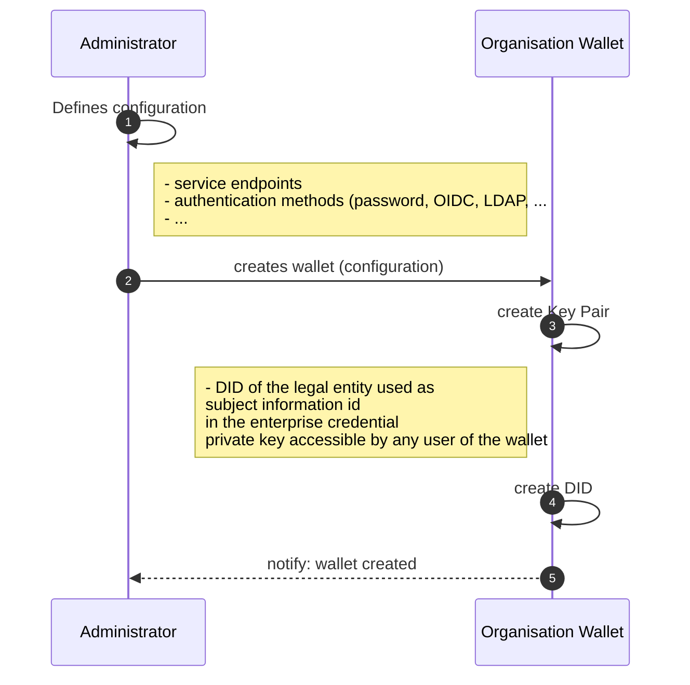
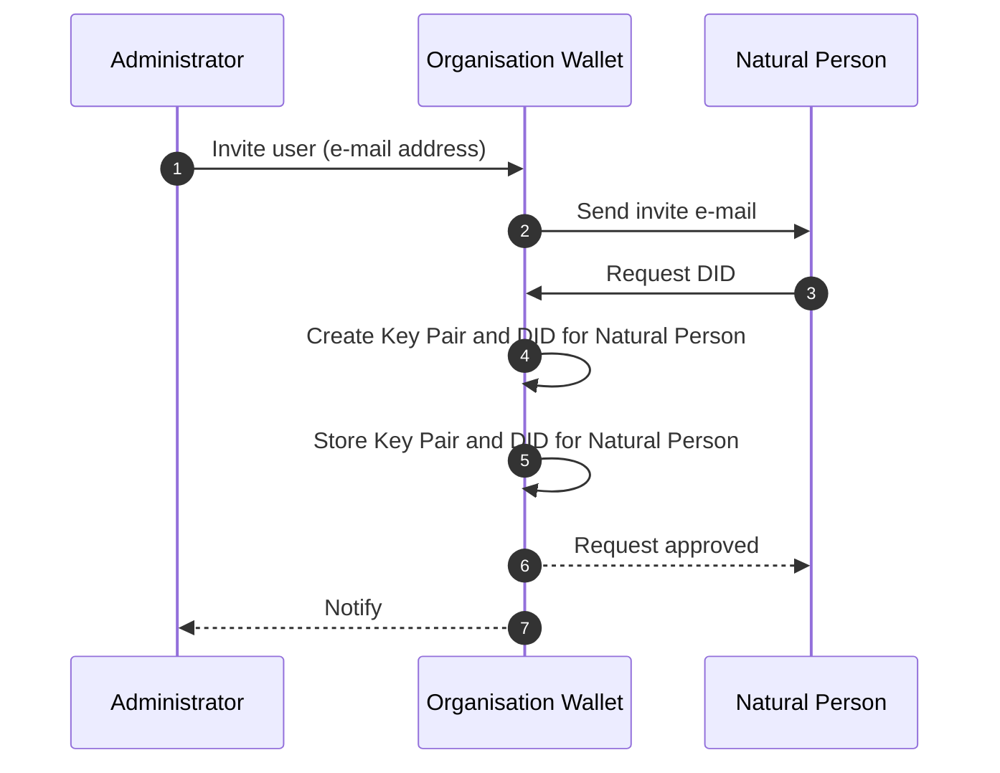
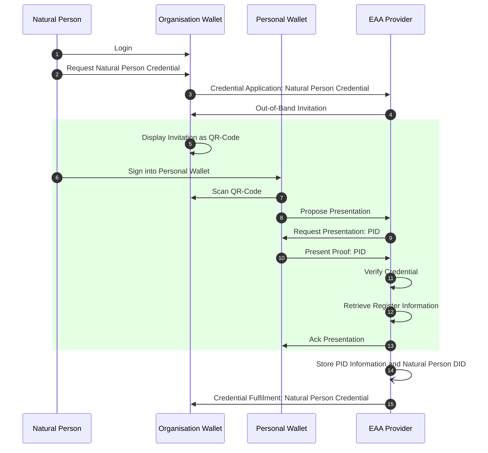

# EWC RFC010: Issue and Present Organisational Credentials - v0.1

**Authors:** 
* Mr Ronald Koenig (Spherity, Germany)
* Mr Ricky Thiermann  (Spherity, Germany)
* Mr Martin Westerkamp  (Spherity, Germany)

**Reviewers:** 
* ???

**Status:** Ready for review


# 1.0	Summary

This specification defines the workflow for issuing an Organisation Credential.
As the exchange of credentials between organisational server wallets has unique requirements, dedicated workflows are required to provide streamlined processes.
While this RFC utilizes the Decentralized Identity Foundation's (DIF) Wallet And Credential Interactions (WACI) DIDComm Interop Profile [1] for exchanging credentials, it is open to alternative message exchange protocols.
We also propose to define credentials using the W3C Credential Format [2], which is based on JSON-LD.
This allows the complex semantics of organisational credentials to be expressed in a concise but specific way.
In addition, W3C Verifiable Credentials provide cryptographic flexibility so that we can take advantage of well-established signature schemes such as ECDSA-SD, while retaining the flexibility to use modern schemes such as BBS.
The presented standard processes and formats ensure interoperability across the European Wallet Ecosystem with a standard specification in the EUDI Wallet Ecosystem according to the requirements of the ARF [3].


# 2.0	Motivation

The EWC LSP handles a variety of credentials that are exchanged between different types of organisations.
The goal of this RFC is to provide a standard protocol for requesting and issuing organisational credentials.
Depending on the use case, organisations need certain information about their business partners, such as authorised signatories, tax numbers or ultimate beneficial owners.
This data needs to be validated and kept up to date.
To simplify the management of this master data, we propose the introduction of organisational credentials, for example issued by an Attestation Provider verifying data from an authentic source such as the relevant commercial register.
We aim to provide greater flexibility in terms of authentication methods and credential types.
Since the credentials in scope are exchanged with a focus on organisations, we anticipate the use of server-based organisational wallets, which have different requirements than personal mobile wallets.
Therefore, we propose the introduction of an organisation-specific identity for natural persons that allows requesting and presenting organisational credentials without the need to interact with a personal wallet.
This will significantly simplify the handling of organisational credentials and enable a wide range of use cases.
Organisation wallets can handle processes automatically without human interaction and present the required credentials independently.
In addition, processes that require the verifiable liability of a responsible person are enabled by signing such requests using the representative's organisation-specific identity.

The defined protocols and standards serve as a foundation for enabling interoperability between organisations throughout the EWC ecosystem.
This RFC assumes that users are familiar with the chosen EWC protocols and standards, and can reference the original specifications when required. 

# 3.0 Initialisation
This section describes the requirements for setting up the organisational wallet and adding users to the system.
Users in the system are members of the organisation.
Cryptographic material is managed by the Organisation Wallet through a key management system.
In addition, the wallet implementation shall ensure that only the authorised user has access to the private key.
Private keys shall not be retrievable and shall only be used for cryptographic operations such as signing credentials or decrypting messages.
In addition, each user is assigned a unique Decentralised Identifier (DID).
The user's organisation-specific DID can be used to issue, request and present credentials.

## 3.1 Organisation wallet initialisation
Before an organisational wallet can be used, it must be initialised.
In this process, the user management procedures are defined and an organisation-specific DID and key material are generated.
The organisation-specific DID enables the implementation of actions that do not require the traceability of a responsible person.
Such actions can be either part of automated processes or triggered by authorised persons.



## 3.2 User enrollment
Once the Organisation Wallet has been initialised, users (natural persons) can be enrolled.
Enrolling a user involves generating a user-specific DID and key material.
Note that the generated DID is different from the DID a user may have in a personal wallet.
As a result, members of an organisation benefit from role-specific credentials in their day-to-day work without having to rely on their personal wallet.
In addition, the generated material is securely stored in the organisation's key management system and can only be accessed by the assigned user for credential requests and presentations.

In the following sample workflow, an administrator invites a user to create a dedicated account in the Organisation Wallet.
Alternatively, user management can be performed remotely.
Either way, the Organisation Wallet maintains a dedicated DID and key material for each user.



# 3.0 Issuing Natural Person Credentials
Natural persons with signatory rights in the organisation are issued with a Natural Person Credential, which can be used to prove their registration with a trusted authority such as a business registry.
This credential can also be used for authentication purposes, for example when requesting an Organisation Credential.
The Natural Person Credential is linked to the Natural Person's DID generated in the Organisation Wallet.
The credential is stored in the Organisation Wallet and can only be presented by the authenticated natural person.

Signatory rights refer to the legal entitlements and responsibilities held by individuals or entities that sign a document or agreement.
These rights typically include the authority to enter into binding agreements, the responsibility to adhere to the terms and conditions of the agreement, and the ability to enforce the agreement against other parties.
Signatory rights ensure that the signer is recognized as a legitimate party to the contract, with the capacity to fulfill the obligations and claim benefits stipulated within the agreement.
In legal contexts, these rights are crucial for validating the enforceability of contracts and other legal documents.

# 3.1 Process
In order for users to demonstrate their signatory rights on behalf of the organisation to business partners, they must possess a credential that has been issued by a reliable authority.
To obtain this credential, the user must request it from a trustworthy authority such as a business registry (EAA Provider).
Prior to the issuance of the credential, the credential provider must authenticate the user by requesting the user's PID.
Once the provider has verified the PID, they will review the user's role within the organisation according to a registry, such as the business registry.
If the requested role can be attested, the credential is issued to the user's organisation-specific DID and stored in the organisational wallet.
Consequently, the credential can be used to authenticate to business partners and perform authorised actions.

The following process presumes the Organisation Wallet to provide a list of trustworthy authorities natural persons can use to request signatory rights credentials.



**Sequence diagram steps:**
1. The Natural Person logs into the Organisation Wallet. This step can be implemented using the OIDC protocol, for example.
2. The Natural Person instructs the Organisation Wallet to request a Natural Person Credential from the relevant authority (EAA Provider).
3. The Organisation Wallet sends a 'Credential Application' message to the EAA Provider.
This message is preferably a DIDComm message sent via an established DIDComm channel.
If no channel exists, the Organisation Wallet resolves the EAA Provider's DID configured in the Wallet to obtain the DID document.
The DID document contains the EAA Provider's accepted protocols and endpoints.
The 'Credential Application' is sent to the endpoint and includes a connection specific Peer DID.
The Peer-DID encodes an ephemeral key specific to the connection and the Organisation Wallet endpoint.
4. Before the EAA Provider can issue the requested credential, the Natural Person must authenticate.
For this purpose, the EAA Provider creates an out-of-band credential presentation invitation.
This invitation is sent to the Organisation Wallet for presentation to the Natural Person.
5. The Organisation Wallet generates a QR code from the received Invitation URL and displays it to the Natural Person.
6. Before scanning the QR code, the Natural Person logs in to their Personal (Mobile) Wallet.
7. Using their Personal Wallet, the Natural Person scans the QR code.
8. The Personal Wallet extracts the invitation object and creates a 'Propose Presentation' message.
As it also embeds the ID of the EAA Provider's invitation as a Parent Thread ID, the EAA Provider can associate the proposal with the Credential Application request.
In addition, the Personal Wallet generates a Peer DID, including an ephemeral connection-specific key, and includes it in the message to establish a secure DIDComm channel.
9. The EAA Provider responds with a 'Request Presentation' message.
The message indicates the type of credential and the specific fields that need to be presented to the EAA Provider.
In this case, the Provider will request the applicant's PID.
The EAA Provider also generates a connection specific Peer DID to be used for further secure communication.
The message also contains a challenge to prevent replay attacks.
10. The Personal Wallet prepares a credential presentation according to the requirements defined in the `Request Presentation` message.
It then generates an assertion proof to enable the EAA provider to ensure the correctness of the revealed fields according to the issuer and an authentication proof to ensure that the credential is presented by the holder.
11. The EAA Provider verifies both proofs and whether the requested fields have been revealed.
12. The EAA provider obtains information about the Natural Person from trusted sources.
Only if the EAA Provider can confirm the existence of the Natural Person in a company statement will it proceed to issue a Credential.
13. A confirmation message is sent to the Natural Person's personal wallet.
14. The EAA Provider stores the Natural Person's PID and DID for possible matching in future organisation credential requests.
15. The EAA Provider issues the requested credential via a Credential Fulfilment message sent to the Organisation Wallet.
The Organisation Wallet stores the received credential.
It may then be used by the Natural Person for authentication purposes.

# 3.2 Messages

## 3.2.1 Issue Credential
### 3.2.1.1 Credential Manifest

```json
{
  "id": "natural-person-manifest",
  "spec_version": "https://identity.foundation/credential-manifest/spec/v1.0.0/",
  "issuer": {
    "id": "did:example:provider",
    "name": "Example EAA Provider"
  },
  "outputDescriptors": [
    {
      "id": "natural-person-credential",
      "schema": [
        {
          "uri": "https://spherity.github.io/oid/#NaturalPerson",
          "required": true
        }
      ],
      "name": "Natural Person Credential"
    }
  ],
  "format": {
    "jwt": {
      "alg": ["EdDSA", "ES256K", "ES384"]
    },
    "jwt_vc": {
      "alg": ["ES256K", "ES384"]
    },
    "jwt_vp": {
      "alg": ["EdDSA", "ES256K"]
    },
    "ldp_vc": {
      "proof_type": [
        "JsonWebSignature2020",
        "Ed25519Signature2018",
        "EcdsaSecp256k1Signature2019",
        "RsaSignature2018"
      ]
    },
    "ldp_vp": {
      "proof_type": ["Ed25519Signature2018"]
    },
    "ldp": {
      "proof_type": ["RsaSignature2018"]
    }
  }
}
```

### 3.2.1.2 Credential Application (Request)

```json
{
  "type": "https://didcomm.org/issue-credential/3.0/request-credential",
  "id": "c6686159-ef49-45b2-938f-51818da14723",
  "thid": "c6686159-ef49-45b2-938f-51818da14723",
  "from": "did:peer:connection-1-organisation",
  "to": ["did:example:provider"],
  "body": {},
  "attachments": [
    {
      "id": "e00e11d4-906d-4c88-ba72-7c66c7113a78",
      "media_type": "application/json",
      "format": "dif/credential-manifest/application@v1.0",
      "data": {
        "json": {
          "@context": [
            "https://www.w3.org/2018/credentials/v1",
            "https://identity.foundation/credential-manifest/application/v1"
          ],
          "type": "CredentialApplication",
          "credential_application": {
            "id": "9b1deb4d-3b7d-4bad-9bdd-2b0d7b3dcb6d",
            "spec_version": "https://identity.foundation/credential-manifest/spec/v1.0.0/",
            "applicant": "did:example:natural-person-1",
            "manifest_id": "natural-person-manifest",
            "format": {
              "ldp_vc": {
                "proof_type": [
                  "JsonWebSignature2020",
                  "EcdsaSecp256k1Signature2019"
                ]
              }
            }
          }
        }
      }
    }
  ]
}
```

### 3.2.1.3 Credential Fulfilment (Issue)

```json
{
  "type": "https://didcomm.org/issue-credential/3.0/issue-credential",
  "id": "7a476bd8-cc3f-4d80-b784-caeb2ff265da",
  "thid": "c6686159-ef49-45b2-938f-51818da14723",
  "from": "did:peer:connection-1-provider",
  "to": ["did:peer:connection-1-organisation"],
  "body": {},
  "attachments": [
    {
      "id": "e00e11d4-906d-4c88-ba72-7c66c7113a79",
      "media_type": "application/json",
      "format": "dif/credential-manifest/fulfillment@v1.0",
      "data": {
        "json": {
          "@context": [
            "https://www.w3.org/2018/credentials/v1",
            "https://identity.foundation/credential-manifest/fulfillment/v1"
          ],
          "type": ["VerifiablePresentation", "CredentialFulfillment"],
          "credential_fulfillment": {
            "id": "a30e3b91-fb77-4d22-95fa-871689c322e2",
            "manifest_id": "natural-person-manifest",
            "descriptor_map": [
              {
                "id": "natural-person-credential",
                "format": "ldp_vc",
                "path": "$.verifiableCredential[0]"
              }
            ]
          },
          "verifiableCredential": [
            {
              "@context": [
                "https://www.w3.org/2018/credentials/v1",
                "https://spherity.github.io/oid/credentials/v1/schema.jsonld"
              ],
              "type": ["VerifiableCredential", "NaturalPerson"],
              "id": "urn:uuid:f086cced-1153-4540-993b-b4d52ca499c2",
              "issuanceDate": "2019-12-03T12:19:52Z",
              "expirationDate": "2029-12-03T12:19:52Z",
              "issuer": "did:key:z6MkiY62766b1LJkExWMsM3QG4WtX7QpY823dxoYzr9qZvJ3",
              "credentialSubject": {
                "id": "did:example:natural-person-1",
                "type": "NaturalPerson",
                "givenName": "John",
                "familyName": "Doe",
                "birthDate": "1970-01-01"
              },
              "proof": {
                "created": "2021-06-07T20:02:44.730614315Z",
                "jws": "eyJhbGciOiJFZERTQSIsImI2NCI6ZmFsc2UsImNyaXQiOlsiYjY0Il19..NVum9BeYkhzwslZXm2cDOveQB9njlrCRSrdMZgwV3zZfLRXmZQ1AXdKLLmo4ClTYXFX_TWNyB8aFt9cN6sSvCg",
                "proofPurpose": "assertionMethod",
                "type": "Ed25519Signature2018",
                "verificationMethod": "did:orb:EiA3Xmv8A8vUH5lRRZeKakd-cjAxGC2A4aoPDjLysjghow#tMIstfHSzXfBUF7O0m2FiBEfTb93_j_4ron47IXPgEo"
              }
            }
          ],
          "proof": {
            "created": "2021-06-07T20:02:44.730614315Z",
            "jws": "eyJhbGciOiJFZERTQSIsImI2NCI6ZmFsc2UsImNyaXQiOlsiYjY0Il19..NVum9BeYkhzwslZXm2cDOveQB9njlrCRSrdMZgwV3zZfLRXmZQ1AXdKLLmo4ClTYXFX_TWNyB8aFt9cN6sSvCg",
            "proofPurpose": "authentication",
            "type": "Ed25519Signature2018",
            "verificationMethod": "did:orb:EiA3Xmv8A8vUH5lRRZeKakd-cjAxGC2A4aoPDjLysjghow#tMIstfHSzXfBUF7O0m2FiBEfTb93_j_4ron47IXPgEo"
          }
        }
      }
    }
  ]
}
```

## 3.2.2 Present PID

### 3.2.2.1 Presentation Invitation
The following JSON object allows initiating the credential presentation flow [4, Section 7.2.1].
It is generated by the Provider, encoded and send to the Organisational Wallet.
The Organisational wallet creates an QR code that is presented to the user who scan it using the personal device.

TODO: outer DIDComm envelop required to send the message to the organisation wallet.

```json
{
  "type": "https://didcomm.org/out-of-band/2.0/invitation",
  "id": "599f3638-b563-4937-9487-dfe55099d900",
  "from": "did:peer:connection-2-provider",
  "body": {
      "goal_code": "streamlined-vp",
      "accept": ["didcomm/v2"]
  }
}
```

### 3.2.2.2 Propose Presentation
The invitation's `id` serves as a thread id `pthid` in the following and enables the provider to link the presentation to Power od Attorney Credential request.

```json
{
    "type": "https://didcomm.org/present-proof/3.0/propose-presentation",
    "id": "95e63a5f-73e1-46ac-b269-48bb22591bfa",
    "pthid": "599f3638-b563-4937-9487-dfe55099d900",
    "from": "did:peer:connection-2-natural-person-1-personal-id",
    "to": ["did:peer:connection-2-provider"]
}
```

### 3.2.2.3 Request Presentation

```json
{
  "type": "https://didcomm.org/present-proof/3.0/request-presentation",
  "id": "0ac534c8-98ed-4fe3-8a41-3600775e1e92",
  "thid": "95e63a5f-73e1-46ac-b269-48bb22591bfa",
  "from": "did:peer:connection-2-provider",
  "to": ["did:peer:connection-2-natural-person-1-personal-id"],
  "body": {},
  "attachments": [
    {
      "id": "ed7d9b1f-9eed-4bde-b81c-3aa7485cf947",
      "media_type": "application/json",
      "format": "dif/presentation-exchange/definitions@v1.0",
      "data": {
        "json": {
          "options": {
            "challenge": "3fa85f64-5717-4562-b3fc-2c963f66afa7",
            "domain": "eudi/pid"
          },
          "presentation_definition": {
            "id": "32f54163-7166-48f1-93d8-ff217bdb0654",
            "input_descriptors": [
              {
                "id": "pid_input",
                "name": "EU PID",
                "schema": [
                  {
                    "uri": "https://ec.eu/eudi.json"
                  }
                ],
                "constraints": {
                  "fields": [
                    {
                      "path": ["$.credentialSubject.family_name"]
                    },
                    {
                      "path": ["$.credentialSubject.given_name"]
                    },
                    {
                      "path": ["$.credentialSubject.birth_date"]
                    },
                    {
                      "path": ["$.credentialSubject.issuance_date"]
                    },
                    {
                      "path": ["$.credentialSubject.expiry_date"]
                    },
                    {
                      "path": ["$.credentialSubject.issuing_authority"]
                    }
                  ]
                }
              }
            ],
            "format": {
              "ldp_vp": {
                "proof_type": ["Ed25519Signature2018"]
              }
            }
          }
        }
      }
    }
  ]
}
```

### 3.2.2.4 Present Proof
```json
{
  "type": "https://didcomm.org/present-proof/3.0/presentation",
  "id": "f1ca8245-ab2d-4d9c-8d7d-94bf310314ef",
  "thid": "599f3638-b563-4937-9487-dfe55099d900",
  "from": "did:peer:connection-2-natural-person-1-personal-id",
  "to": ["did:peer:connection-2-provider"],
  "body": {},
  "attachments": [
    {
      "id": "2a3f1c4c-623c-44e6-b159-179048c51260",
      "media_type": "application/ld+json",
      "format": "dif/presentation-exchange/submission@v1.0",
      "data": {
        "json": {
          "@context": [
            "https://www.w3.org/2018/credentials/v1",
            "https://identity.foundation/presentation-exchange/submission/v1"
          ],
          "type": ["VerifiablePresentation", "PresentationSubmission"],
          "holder": "did:example:natural-person-1-personal-id",
          "verifiableCredential": [
            {
              "@context": [
                "https://www.w3.org/2018/credentials/v1",
                "https://ec.eu/eudi.json",
                "https://w3id.org/security/bbs/v1"
              ],
              "id": "urn:uvci:af5vshde843jf831j128fj",
              "type": ["VerifiableCredential", "Pid"],
              "name": "EU PID",
              "expirationDate": "2029-12-03T12:19:52Z",
              "issuanceDate": "2019-12-03T12:19:52Z",
              "issuer": "did:example:pid-provider",
              "credentialSubject": {
                "id": "urn:bnid:_:c14n2",
                "type": "Pid",
                "family_name": "Doe",
                "given_name": "John",
                "birth_date": "1970-01-01",
                "issuance_date": "2022-06-01",
                "expiry_date": "2030-06-01",
                "issuing_authority": "FR"
              },
              "proof": {
                "type": "BbsBlsSignatureProof2020",
                "created": "2021-02-18T23:04:28Z",
                "nonce": "JNGovx4GGoi341v/YCTcZq7aLWtBtz8UhoxEeCxZFevEGzfh94WUSg8Ly/q+2jLqzzY=",
                "proofPurpose": "assertionMethod",
                "proofValue": "AB0GQA//jbDwMgaIIJeqP3fRyMYi6WDGhk0JlGJc/sk4ycuYGmyN7CbO4bA7yhIW/YQbHEkOgeMy0QM+usBgZad8x5FRePxfo4v1dSzAbJwWjx87G9F1lAIRgijlD4sYni1LhSo6svptDUmIrCAOwS2raV3G02mVejbwltMOo4+cyKcGlj9CzfjCgCuS1SqAxveDiMKGAAAAdJJF1pO6hBUGkebu/SMmiFafVdLvFgpMFUFEHTvElUQhwNSp6vxJp6Rs7pOVc9zHqAAAAAI7TJuDCf7ramzTo+syb7Njf6ExD11UKNcChaeblzegRBIkg3HoWgwR0hhd4z4D5/obSjGPKpGuD+1DoyTZhC/wqOjUZ03J1EtryZrC+y1DD14b4+khQVLgOBJ9+uvshrGDbu8+7anGezOa+qWT0FopAAAAEG6p07ghODpi8DVeDQyPwMY/iu2Lh7x3JShWniQrewY2GbsACBYOPlkNNm/qSExPRMe2X7UPpdsxpUDwqbObye4EXfAabgKd9gCmj2PNdvcOQAi5rIuJSGa4Vj7AtKoW/2vpmboPoOu4IEM1YviupomCKOzhjEuOof2/y5Adfb8JUVidWqf9Ye/HtxnzTu0HbaXL7jbwsMNn5wYfZuzpmVQgEXss2KePMSkHcfScAQNglnI90YgugHGuU+/DQcfMoA0+JviFcJy13yERAueVuzrDemzc+wJaEuNDn8UiTjAdVhLcgnHqUai+4F6ONbCfH2B3ohB3hSiGB6C7hDnEyXFOO9BijCTHrxPv3yKWNkks+3JfY28m+3NO0e2tlyH71yDX0+F6U388/bvWod/u5s3MpaCibTZEYoAc4sm4jW03HFYMmvYBuWOY6rGGOgIrXxQjx98D0macJJR7Hkh7KJhMkwvtyI4MaTPJsdJGfv8I+RFROxtRM7RcFpa4J5wF/wQnpyorqchwo6xAOKYFqCqKvI9B6Y7Da7/0iOiWsjs8a4zDiYynfYavnz6SdxCMpHLgplEQlnntqCb8C3qly2s5Ko3PGWu4M8Dlfcn4TT8YenkJDJicA91nlLaE8TJbBgsvgyT+zlTsRSXlFzQc+3KfWoODKZIZqTBaRZMft3S/",
                "verificationMethod": "did:example:123#key-1"
              }
            }
          ],
          "presentation_submission": {
            "id": "1d257c50-454f-4c96-a273-c5368e01fe63",
            "definition_id": "32f54163-7166-48f1-93d8-ff217bdb0654",
            "descriptor_map": [
              {
                "id": "pid_input",
                "format": "ldp_vp",
                "path": "$.verifiableCredential[0]"
              }
            ]
          },
          "proof": {
            "type": "Ed25519Signature2018",
            "verificationMethod": "did:example:123#key-0",
            "created": "2021-05-14T20:16:29.565377",
            "proofPurpose": "authentication",
            "challenge": "3fa85f64-5717-4562-b3fc-2c963f66afa7",
            "jws": "eyJhbGciOiAiRWREU0EiLCAiYjY0IjogZmFsc2UsICJjcml0IjogWyJiNjQiXX0..7M9LwdJR1_SQayHIWVHF5eSSRhbVsrjQHKUrfRhRRrlbuKlggm8mm_4EI_kTPeBpalQWiGiyCb_0OWFPtn2wAQ"
          }
        }
      }
    }
  ]
}
```
### 3.2.2.5 Ack Presentation
```json
{
  "type":"https://didcomm.org/present-proof/3.0/ack",
  "id":"e2f3747b-41e8-4e46-abab-ba51472ab1c3",
  "pthid":"599f3638-b563-4937-9487-dfe55099d900",
  "from":"did:peer:connection-2-provider",
  "to":["did:peer:connection-2-natural-person-1-personal-id"],
  "body":{
    "status":"OK"
  }
}

```
# 4.0 Issuing Organisational Credentials

# 4.1 Process

# 4.2 Messages

## 4.2.1 Credential Manifest

```json
{
  "id": "organisation-credential-manifest",
  "spec_version": "https://identity.foundation/credential-manifest/spec/v1.0.0/",
  "issuer": {
    "id": "did:example:provider",
    "name": "Example EAA Provider"
  },
  "outputDescriptors": [
    {
      "id": "organisation-credential",
      "schema": [
        {
          "uri": "https://spherity.github.io/oid#LegalEntityCertificate",
          "required": true
        }
      ],
      "name": "Organisation Credential"
    }
  ],
  "format": {
    "jwt": {
      "alg": ["EdDSA", "ES256K", "ES384"]
    },
    "jwt_vc": {
      "alg": ["ES256K", "ES384"]
    },
    "jwt_vp": {
      "alg": ["EdDSA", "ES256K"]
    },
    "ldp_vc": {
      "proof_type": [
        "JsonWebSignature2020",
        "Ed25519Signature2018",
        "EcdsaSecp256k1Signature2019",
        "RsaSignature2018"
      ]
    },
    "ldp_vp": {
      "proof_type": ["Ed25519Signature2018"]
    },
    "ldp": {
      "proof_type": ["RsaSignature2018"]
    }
  }
}
```

## 4.2.2 Credential Application (Request)

```json
{
  "type": "https://didcomm.org/issue-credential/3.0/request-credential",
  "id": "c6686159-ef49-45b2-938f-51818da14723",
  "thid": "c6686159-ef49-45b2-938f-51818da14723",
  "from": "did:example:organisation",
  "to": ["did:example:provider"],
  "body": {},
  "attachments": [
    {
      "id": "e00e11d4-906d-4c88-ba72-7c66c7113a78",
      "media_type": "application/json",
      "format": "dif/credential-manifest/application@v1.0",
      "data": {
        "json": {
          "@context": [
            "https://www.w3.org/2018/credentials/v1",
            "https://identity.foundation/credential-manifest/application/v1"
          ],
          "type": "CredentialApplication",
          "credential_application": {
            "id": "9b1deb4d-3b7d-4bad-9bdd-2b0d7b3dcb6d",
            "spec_version": "https://identity.foundation/credential-manifest/spec/v1.0.0/",
            "applicant": "did:example:organisation",
            "manifest_id": "organisation-credential-manifest",
            "format": {
              "ldp_vc": {
                "proof_type": [
                  "JsonWebSignature2020",
                  "EcdsaSecp256k1Signature2019"
                ]
              }
            }
          }
        }
      }
    }
  ]
}
```

## 4.2.3 Credential Fulfilment (Issue)

```json
{
  "type": "https://didcomm.org/issue-credential/3.0/issue-credential",
  "id": "7a476bd8-cc3f-4d80-b784-caeb2ff265da",
  "thid": "c6686159-ef49-45b2-938f-51818da14723",
  "from": "did:example:provider",
  "to": ["did:example:organisation"],
  "body": {},
  "attachments": [
    {
      "id": "e00e11d4-906d-4c88-ba72-7c66c7113a79",
      "media_type": "application/json",
      "format": "dif/credential-manifest/fulfillment@v1.0",
      "data": {
        "json": {
          "@context": [
            "https://www.w3.org/2018/credentials/v1",
            "https://identity.foundation/credential-manifest/fulfillment/v1"
          ],
          "type": ["VerifiablePresentation", "CredentialFulfillment"],
          "credential_fulfillment": {
            "id": "a30e3b91-fb77-4d22-95fa-871689c322e2",
            "manifest_id": "dcc75a16-19f5-4273-84ce-4da69ee2b7fe",
            "descriptor_map": [
              {
                "id": "driver_license_output",
                "format": "ldp_vc",
                "path": "$.verifiableCredential[0]"
              }
            ]
          },
          "verifiableCredential": [
            {
              "@context": [
                "https://www.w3.org/2018/credentials/v1",
                "https://spherity.github.io/oid/credentials/v1/schema.jsonld"
              ],
              "type": ["VerifiableCredential", "LegalEntityCertificate"],
              "id": "urn:uuid:f086cced-1153-4540-993b-b4d52ca499c2",
              "issuanceDate": "2019-12-03T12:19:52Z",
              "expirationDate": "2029-12-03T12:19:52Z",
              "issuer": "did:example:provider",
              "credentialSubject": {
                "id": "did:example:organisation",
                "type": ["LegalPersonId", "LegalPersonBaseData"],
                "euid": "DEPLPOAG.123456789",
                "companyName": "Flower Power AG",
                "address": {
                  "postalCode": "10119",
                  "addressCountry": "Germany",
                  "addressLocality": "Berlin"
                },
                "registerIdentification": {
                  "registerType": "ABC123",
                  "registerTypeDescription": "Amtsgericht Tiergarten",
                  "registerLocation": "Berlin, Moabit",
                  "registerNumber": "123AVB",
                  "companyId": "ACDC",
                  "companyIdCountryCode": "DE"
                },
                "previousName": ["AL", "DI"],
                "status": "active",
                "liquidationStatus": "none",
                "insolvencyStatus": "none",
                "legalForm": "GmbH",
                "isFoundation": false,
                "isNfrdObligated": false,
                "isTrust": false,
                "businessObject": "Trading Company",
                "registrationDate": "2010-01-01",
                "exchange": {
                  "name": "Boerse Stuttgart",
                  "country": "Germany",
                  "marketIdentificationCode": "AA",
                  "tickerSymbol": "BB"
                },
                "isin": "1234567890",
                "vatId": "22222ABC",
                "lei": "ABC988",
                "leiStatus": "active",
                "leiNextIssuance": "2027-01-10"
              },
              "proof": {
                "created": "2021-06-07T20:02:44.730614315Z",
                "jws": "eyJhbGciOiJFZERTQSIsImI2NCI6ZmFsc2UsImNyaXQiOlsiYjY0Il19..NVum9BeYkhzwslZXm2cDOveQB9njlrCRSrdMZgwV3zZfLRXmZQ1AXdKLLmo4ClTYXFX_TWNyB8aFt9cN6sSvCg",
                "proofPurpose": "assertionMethod",
                "type": "Ed25519Signature2018",
                "verificationMethod": "did:orb:EiA3Xmv8A8vUH5lRRZeKakd-cjAxGC2A4aoPDjLysjghow#tMIstfHSzXfBUF7O0m2FiBEfTb93_j_4ron47IXPgEo"
              }
            }
          ],
          "proof": {
            "created": "2021-06-07T20:02:44.730614315Z",
            "jws": "eyJhbGciOiJFZERTQSIsImI2NCI6ZmFsc2UsImNyaXQiOlsiYjY0Il19..NVum9BeYkhzwslZXm2cDOveQB9njlrCRSrdMZgwV3zZfLRXmZQ1AXdKLLmo4ClTYXFX_TWNyB8aFt9cN6sSvCg",
            "proofPurpose": "authentication",
            "type": "Ed25519Signature2018",
            "verificationMethod": "did:orb:EiA3Xmv8A8vUH5lRRZeKakd-cjAxGC2A4aoPDjLysjghow#tMIstfHSzXfBUF7O0m2FiBEfTb93_j_4ron47IXPgEo"
          }
        }
      }
    }
  ]
}
```

# 5.0 Presenting Organisation Credentials

# 5.1 Process

# 5.2 Messages

# 6.0	Reference


1. Decentralized Identity Foundation (DIF) (2023), Wallet And Credential Interactions (WACI) DIDComm Interop Profile, Available at: https://identity.foundation/waci-didcomm/ (Accessed at: July 9, 2024).
2. World Wide Web Consortium (W3C) (2024), Verifiable Credentials Data Model v2.0, Available at: https://www.w3.org/TR/vc-data-model-2.0/ (Accessed at: July 9, 2024).
3. European Commission (2023), The European Digital Identity Wallet Architecture and Reference Framework (2024-04, v1.3.0)  [Online]. Available at: [https://github.com/eu-digital-identity-wallet/eudi-doc-architecture-and-reference-framework/releases](https://github.com/eu-digital-identity-wallet/eudi-doc-architecture-and-reference-framework/releases) (Accessed: May 14, 2024).