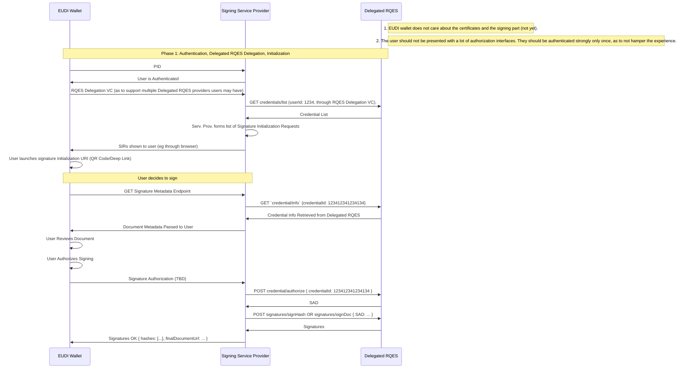
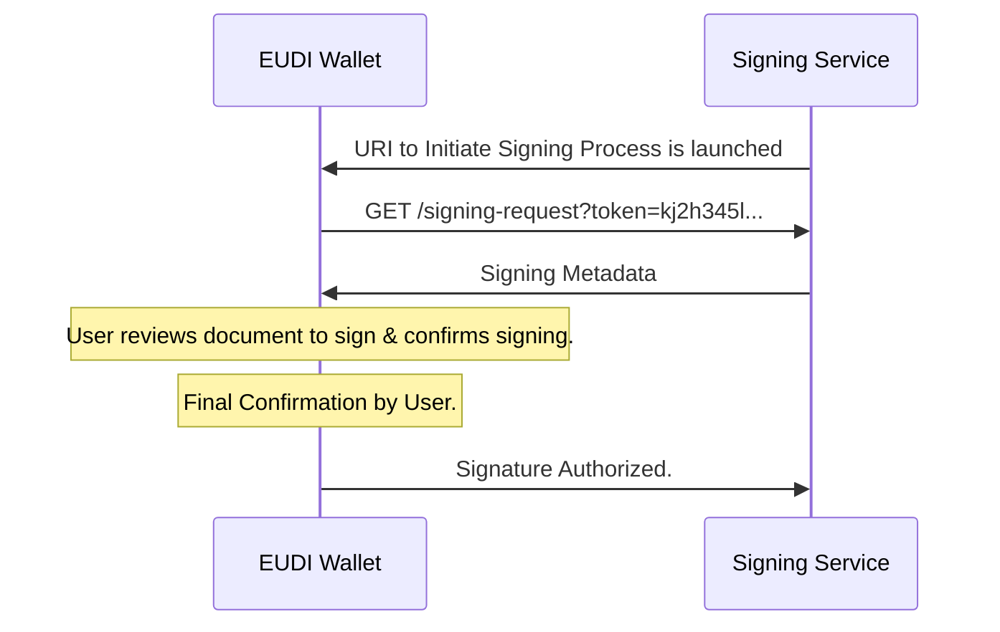

# RFC-010 Synchronous Document Signing using Long-Term Certificates and the EUDI Wallet - Draft 1

## 1.0 Summary:

This Specification defines the procedures for using the EUDI wallet to digitally sign a document, using Long-Term certificates. It specifies a new protocol for executing digital signing, that will ensure successful communication and interoperability with the EUDI wallet, Signing Service Providers, and will support multiple Remote QES Services as per the ARF specification.

### Authors:

- Mr. Kyriakos Giannakis (Intesi Group, Italy)

## 2.0: Motivation:

The primary motivation for this specification is to establish a standardized protocol for digitally signing documents using the EUDI wallet and Long-Term certificates. At present, there are no standardized procedures and interfaces for digitally presenting a document to the signer using the EUDI wallet, no procedures for authenticating the signing party to the Signing Signing Service Provider, and no specifications for the communication protocols between the involved parties.

## 2.1 Changelog:

- Jul. 19 2024: Initialization of authoring process. Initial draft.
- Sep. 10 2024: Addition of multiple RQES service support through RQES Access VC concept. Further Enrichment of RFC.
- Oct 1 2024: Addition of SSP discovery endpoint. Addition of RQESAC token example. Misc corrections.

## 3.0 The Signing Architecture:

The architecture covered in this specification follows the process of remotely signing a document using long-term certificates, handled by a Remote QES (or AES) Service, as detailed in D4.8.

The architecture will be broken down in 3 main parts:
1.	Signing Request (Authentication, RQES Delegation, Initialization)
2.	Signature Application & SS to RQES Communications 
3.	Signature Confirmation & Final Document Retrieval and Storage


Figure 1: Signing Procedure diagram.

## 3.1: Phase 1: User Authentication & RQES Delegation

### Overview:



### 3.1.1: Signing Service Provider Discovery Endpoint

TBA

### 3.1.2: User Authentication & Multiple RQES Service Support

The user is authenticated through a Presentation Request requesting 2 credentials:

1. The User's PID, contains the user's personal identification record.
2. An RQES Access Credential (RQESAC): Serves as an access and configuration credential to the user's RQES service. Through the presented RQES Access Credential, the user can choose their preferred RQES service. Example provided in Annex A.

The Signing Service Provider must then query the user's preferred RQES to request the user's available credentials and construct the final Signing Request URIs.

Remote QES services shall adhere to the [CSC (Cloud Signature Consortium)](https://cloudsignatureconsortium.org/wp-content/uploads/2023/04/csc-api-v2.0.0.2.pdf) specifications that are also the basis for the JSON part of the ETSI TS 119 432 standard on protocols for remote digital signature creation.

The Signing Service Provider must query the RQES service using the `rqes_provider.api` parameter to acquire information about the service and its supported authentication methods.

> TBA: CSC API Calls to get credentials.

> TBA: Decide on best practices regarding Service Authentication

## 3.1.3 Signing Request URI:

After service authentication and authorization, the Signing Service Provider can form the "Signature Request" URIs (SRU), responsible for **initiation of the signing process**.

Each SRU contains a reference to the Signing Service Provider's **Signature Metadata Endpoint** with a token, authenticating the user and their credential. Each token MUST be bound to the user's profile and ONE specific credential of the user,
obtained through the CSC compatible endpoints `credentials/list` and `credentials/info`.

A one-time-use, secret token is embedded in the URL, to authenticate the user and to bind the signature to the user and their credential. Signing services should keep track of these tokens and delete them after some time being unused. This token should not have any other purpose and must be kept secret from other users.

The signing process is initiated by the user either clicking a link or scanning a QR code with a SRU, provided by the Signing Service Provider, after acquiring the available credentials of the user.

Sample Signature Request URI:

```
eudi-sig-request://?signature_url=https://signing_server_url/signing?token=<signature_access_token>
```

## 3.1.4 Signing Metadata:

The EUDI Wallet executes the following GET request to obtain the metadata about the signature and to draw the final preview and approval UI, to show the user.

```
GET https://signing_server_url/signing?token=<signature_access_token>
```

```json
{
   "document_id": "bf1d1e65-b8cd-4f88-b334-18740380ca38",
   "document_url": "https://...",
   "document_type": "pdf",
   "document_hash": "lk1j23h45l34jkth234...",
   "access_type": "sign",
   "author_details": {
      "given_name": "Kyriakos",
      "family_name": "Giannakis",
      "phone_number": "+30695...",
      "affiliated_with": "IntesiGroup",
      "affiliate_url": "https://www.intesigroup.com/en/"
   },
   "signature_request_metadata": {
      "created_at": "2024-07-18T15:13:56Z",
      "expires_at": "2024-07-18T15:25:56Z",
      "reason": "Please sign this NDA to gain demo access to IG Sign",
      "signing_alg": "RS256",
      "hashing_alg": "SHA-256"
   },
   "document_pages_no": 4,
   "signature_fields": [
      {
         "id": "7fd8bd7b-be35-4f0a-8edc-9d11f159a032",
         "page_number": 4
      }
   ],
   "qes_provider_information": {
      "provider": "TrustedSig LLC",
      "provider_homepage": "https://...",
      // more details TBD
   },
   "credential_info": {
      // TBD
   }
}
```

The EUDI Wallet app can use the attributes of the response to provide a WYSIWYS (What You See Is What You Sign) preview to the user, helping them visualize the final document. 

> Author's Note: More needs TBA regarding signature preview support.

## 3.2 Phase 2: Signature Approval & SSP to RQES communication

### 3.2.1: Signature Approval

TBA

### 3.2.2: Signature Service Provider to RQES Communication to Finalize Signing

TBA

> Author's note: Should be kept vague as to allow different handling of documents for different providers.

## 3.3 Phase 3: Signature Confirmation and Final Document Retrieval and Storage

TBA

## Annex 1: RQES Access Credential Schema and Example

### Example:

```json
{
  "id": "76b0184c-ac8e-4484-a9e1-9f0a0d68fe0b",
  "holder_name": "Kyriakos Giannakis",
  "rqes_provider": {
    "api": "https://services.test4mind.com/csc/v1/",
    "title": "Intesi Group SPA",
    "location": "Milan, IT"
  },
  "service_auth": {
    "grant": "client_credentials",
    "client_id": "...",
    "client_secret": "..."
  }
}
```

### Schema:

TBD