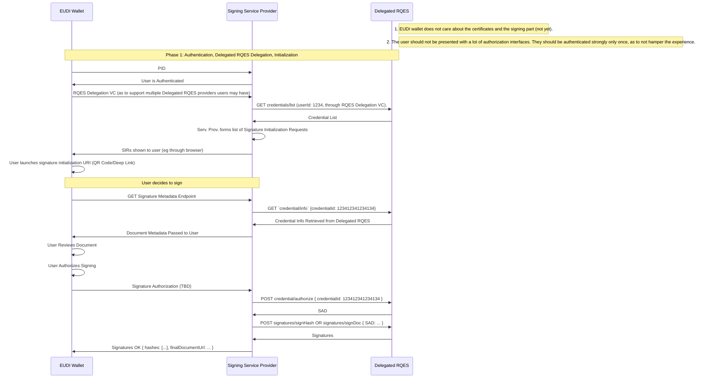
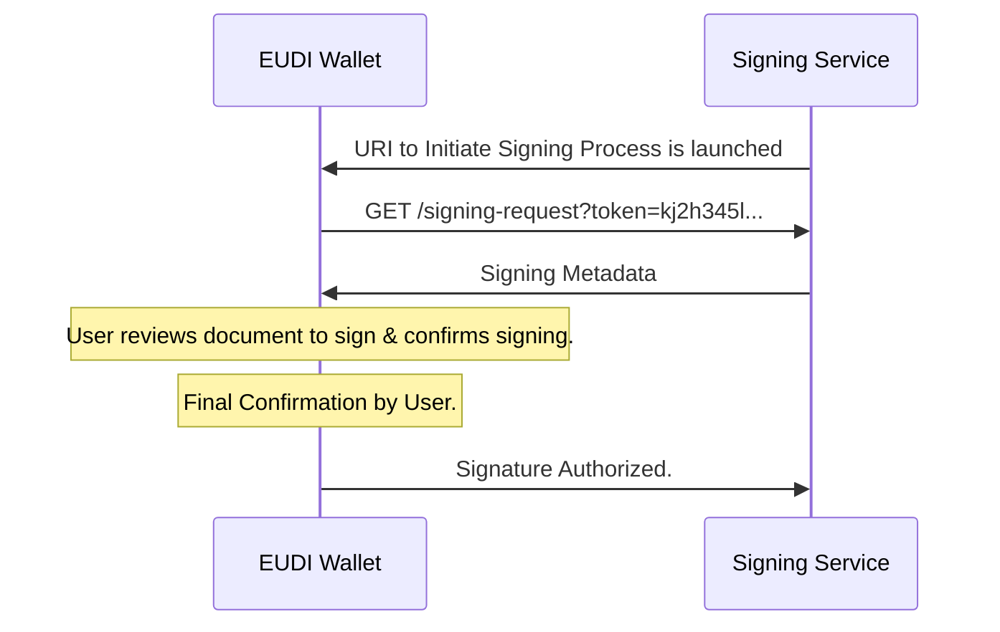
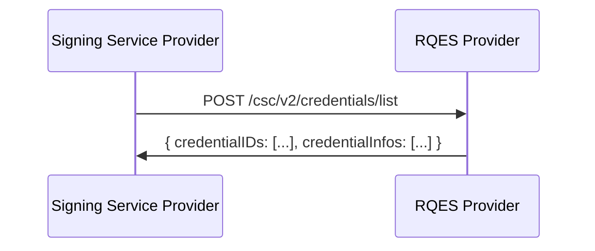
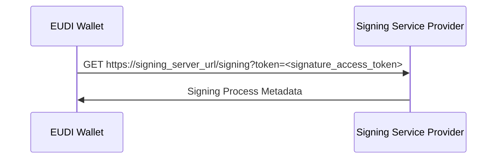

# RFC-010 Synchronous Document Signing on a Remote Signing Service Provider using Long-Term Certificates and the EUDI Wallet - Draft 1

## 1.0 Summary:

This Specification defines the procedures for using the EUDI wallet to digitally sign a document, using Long-Term certificates, on a Remote Signing Service Provider (SSP). It specifies a new protocol for executing digital signing, that will ensure successful communication and interoperability with the EUDI wallet, Signing Service Providers, and will support multiple Remote QES (RQES) Providers as per the ARF specification.

### Authors:

- Mr. Kyriakos Giannakis (Intesi Group, Italy)

## 2.0: Motivation:

The primary motivation for this specification is to establish a standardized protocol for authorizing the digital signing of documents using the EUDI wallet and Long-Term certificates, on a Remote Signing Service Provider. 
At present, there are no standardized procedures and interfaces for digitally presenting a document to the signer using the EUDI wallet, no procedures for authenticating the signing party to the Signing Signing Service Provider.

## 2.1 Changelog:

- Jul. 19 2024: Initialization of authoring process. Initial draft.
- Sep. 10 2024: Addition of multiple RQES service support through RQES Access VC concept. Further Enrichment of RFC.
- Oct 1 2024: Addition of SSP discovery endpoint. Addition of RQESAC token example. Misc corrections.
- Oct 18, 2024: Addition of Pre-enrollment process. Addition of CSC API call examples on `credentials/list`, `credentials/info`. Refinement of RQESAC. Changes to Signing Process Metadata endpoint to support multiple credentials. Addition of credential selection screen.

## 3.0 The Signing Architecture:

The architecture covered in this specification follows the process of remotely signing a document using long-term certificates, handled by a Remote QES (or AES) Service, as detailed in D4.8.

The architecture will be broken down in 4 main parts:
1. Provider Pre-enrollment (off scope)
2. Signing Request (Authentication, RQES Delegation, Initialization)
3. Signature Application & SS to RQES Communications 
4. Signature Confirmation & Final Document Retrieval and Storage

## 3.1 Signing Service Provider Pre-enrollment to Remote Qualified Electronic Signature Service (off-scope)

Remote QES services shall adhere to the [CSC (Cloud Signature Consortium)](https://cloudsignatureconsortium.org/wp-content/uploads/2023/04/csc-api-v2.0.0.2.pdf) specifications that are also the basis for the JSON part of the ETSI TS 119 432 standard on protocols for remote digital signature creation.

Pre-enrollment is **required** in order for SSPs to be able to access the CSC API of the RQES Provider.

Pre-enrollment is facilitated through a contractual agreement, outside the scope of this RFC.

Upon pre-enrollment, **OAuth2 Client Credentials** for access to the [CSC Specification Compatible API (v2)](https://cloudsignatureconsortium.org/wp-content/uploads/2023/04/csc-api-v2.0.0.2.pdf) exposed by the RQES provider are issued to the SSP, to facilitate communication between the parties.

## 3.2 Signing Process:


Figure 1: Signing Procedure diagram.

### 3.2.1: Phase 1: User Authentication & RQES Delegation

#### Overview:



#### 3.2.1.1: User Authentication & Multiple RQES Service Support

The user is authenticated through a Presentation Request requesting 2 credentials:

1. The User's PID or LPID, which contains the user's personal (or business) identification record.
2. An RQES Access Credential (RQESAC): Serves as an access and configuration credential to the user's RQES service. Through the presented RQES Access Credential, the user can choose their preferred RQES service. Example provided in Annex A.

##### RQES Provider Support Check:

If the RQES service is supported (pre-enrollment has been performed) by the SSP, the process continues. If the SSP has not 
performed the pre-enrollment step (and does not have access to the RQES Provider's API), the process stops at this point.

##### Listing of the User's Credentials and SRU Preparation:

The Signing Service Provider must then query the user's preferred RQES Provider to request the user's available credentials and construct the final Signing Request URIs.

The Signing Service Provider must query the RQES service using the `rqes_provider.api` parameter to acquire information about the service and its supported authentication methods.

**credentials/list**



**Sample Request**:
```http request
POST /csc/v2/credentials/list HTTP/1.1
Host: rqes.example.com
Authorization: Bearer ...
Content-Type: application/json
{
    "credentialInfo": true,
    "certificates": "chain",
    "certInfo": true,
    "authInfo": true
}
```

**Sample Response**:

```http request
HTTP/1.1 200 OK
Content-Type: application/json;charset=UTF-8

{
  "credentialIDs": [
    "GX0112348",
    "HX0224685"
  ],
  "credentialInfos": [
    {
      "credentialID": "GX0112348",
      "key": {
        "status": "enabled",
        "algo": [
          "1.2.840.113549.1.1.11",
          "1.2.840.113549.1.1.10"
        ],
        "len": 2048
      },
      "cert": {
        "status": "valid",
        "certificates": [
          "<Base64-encoded_X.509_end_entity_certificate>",
          "<Base64-encoded_X.509_intermediate_CA_certificate>",
          "<Base64-encoded_X.509_root_CA_certificate>"
        ],
        "issuerDN": "<X.500_issuer_DN_printable_string>",
        "serialNumber": "5AAC41CD8FA22B953640",
        "subjectDN": "<X.500_subject_DN_printable_string>",
        "validFrom": "20200101100000Z",
        "validTo": "20230101095959Z"
      },
      "auth": {
        "mode": "explicit",
        "expression": "PIN AND OTP",
        "objects": [
          {
            "type": "Password",
            "id": "PIN",
            "format": "N",
            "label": "PIN",
            "description": "Please enter the signature PIN"
          },
          {
            "type": "Password",
            "id": "OTP",
            "format": "N",
            "generator": "totp",
            "label": "Mobile OTP",
            "description": "Please enter the 6 digit code you received by SMS"
          }
        ]
      },
      "multisign": 5,
      "lang": "en-US"
    }
  ]
}
```

**credentials/info (optional)**:

SSPs can utilize the `credentials/info` endpoint to receive info about a specific credential:

**Sample Request**:
```http request
POST /csc/v2/credentials/info HTTP/1.1
Host: rqes.example.com
Authorization: Bearer ...
Content-Type: application/json
{
    "credentialID": "GX0112348",
    "certificates": "chain",
    "certInfo": true,
    "authInfo": true
}
```

#### 3.2.1.2 Signing Request URI:

After service authentication and authorization, the Signing Service Provider can form the "Signature Request" URIs (SRU), responsible for **initiation of the signing process**.

Each SRU contains a reference to the Signing Service Provider's **Signature Metadata Endpoint** with a token, authenticating the user and their credential. Each token MUST be bound to the user's profile and their specific credentials,
obtained through the CSC compatible endpoints `credentials/list` and `credentials/info`.

A one-time-use, secret token is embedded in the URL, to authenticate the user and to bind the signature to the user and their credentials. Signing services should keep track of these tokens and delete them after some time being unused. This token should not have any other purpose and must be kept secret from other users.

The signing process is initiated by the user either clicking a link or scanning a QR code with a SRU, provided by the Signing Service Provider, after acquiring the available credentials of the user.

Sample Signature Request URI:

```
eudi-sig-request://?signature_url=https://signing_server_url/signing?token=<signature_access_token>
```

#### 3.2.1.3 Signing Process Metadata:

The EUDI Wallet executes the following GET request to obtain the metadata about the signing process and to draw the final preview and approval UI, to show the user.



```
GET https://signing_server_url/signing?token=<signature_access_token>
```

```http request
GET /signing?token=<signature_access_token> HTTP/1.1
Host: signing_server_url
Content-Type: "application/json"
{
   "document_id": "bf1d1e65-b8cd-4f88-b334-18740380ca38",
   "document_url": "https://...",
   "document_type": "pdf",
   "document_hash": "lk1j23h45l34jkth234...",
   "access_type": "sign",
   "author_details": {
      "given_name": "Kyriakos",
      "family_name": "Giannakis",
      "phone_number": "+30695...",
      "affiliated_with": "IntesiGroup",
      "affiliate_url": "https://www.intesigroup.com/en/"
   },
   "signature_request_metadata": {
      "created_at": "2024-07-18T15:13:56Z",
      "expires_at": "2024-07-18T15:25:56Z",
      "reason": "Please sign this NDA to gain demo access to IG Sign",
      "signing_alg": "RS256",
      "hashing_alg": "SHA-256"
   },
   "document_pages_no": 4,
   "signature_fields": [
      {
         "id": "7fd8bd7b-be35-4f0a-8edc-9d11f159a032",
         "page_number": 4
      }
   ],
   "rqes_provider": {
      "title": "TrustedSig LLC",
      "homepage": "https://...",
      "title_short": "INTESI_GRP_ITA",
      // more details TBD
   },
   "credential_info": [
     {
       // Credential 1
     },
     {
       // Credential 2
     }
   ]
}
```

#### 3.2.1.4: Credential Selection:

Should the user own more than one credential, the wallet will need to present the user with a selection screen for the user to pick
the credential they wish to use to sign the document.

#### 3.2.1.5: What You See is What You Sign (WYSIWYS):

The EUDI Wallet app can use the attributes of the metadata response to provide a WYSIWYS (What You See Is What You Sign) preview to the user, helping them visualize the final document. 

> Author's Note: More needs TBA regarding signature preview support.

### 3.2.2 Phase 2: Signature Approval & SSP to RQES communication

### 3.2.2.1: Signature Approval

TBA

### 3.2.2.2: Signature Service Provider to RQES Communication to Finalize Signing

TBA

> Author's note: Should be kept vague as to allow different handling of documents for different providers.

## 3.3 Phase 3: Signature Confirmation and Final Document Retrieval and Storage

TBA

## Annex 1: RQES Access Credential Schema and Example

### Example:

```json
{
  "id": "76b0184c-ac8e-4484-a9e1-9f0a0d68fe0b",
  "holder_name": "Kyriakos Giannakis",
  "rqes_provider": {
    "id": "2cea80dd-18b8-4e6c-9964-f11fc0bc4423",
    "api": "https://services.test4mind.com/csc/v1/",
    "title": "Intesi Group SPA",
    "title_short": "INTESI_GRP_ITA",
    "location": "Milan, IT"
  }
}
```

### Schema:

TBD