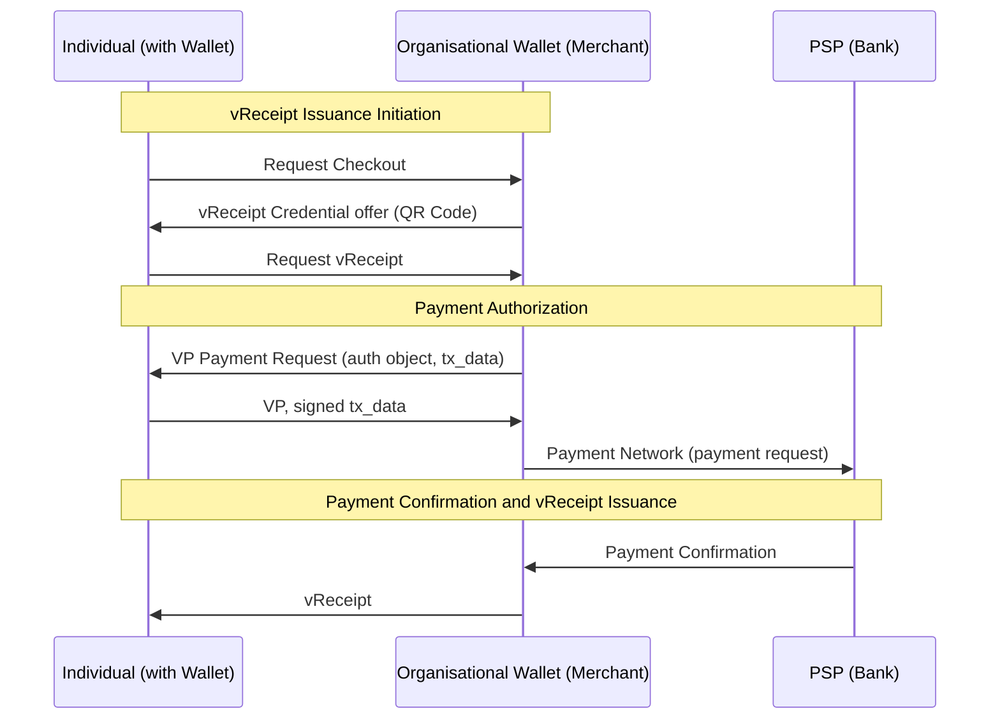
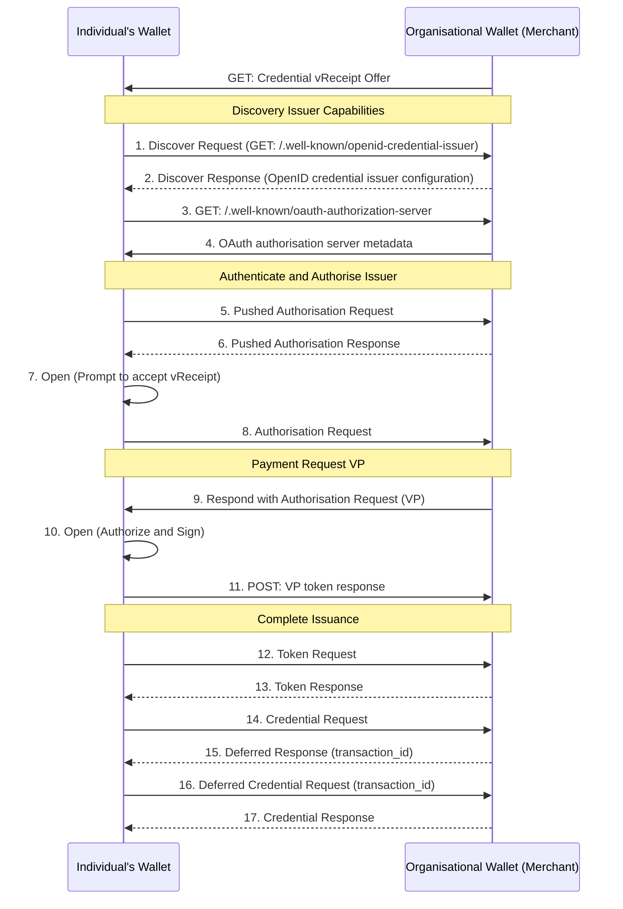
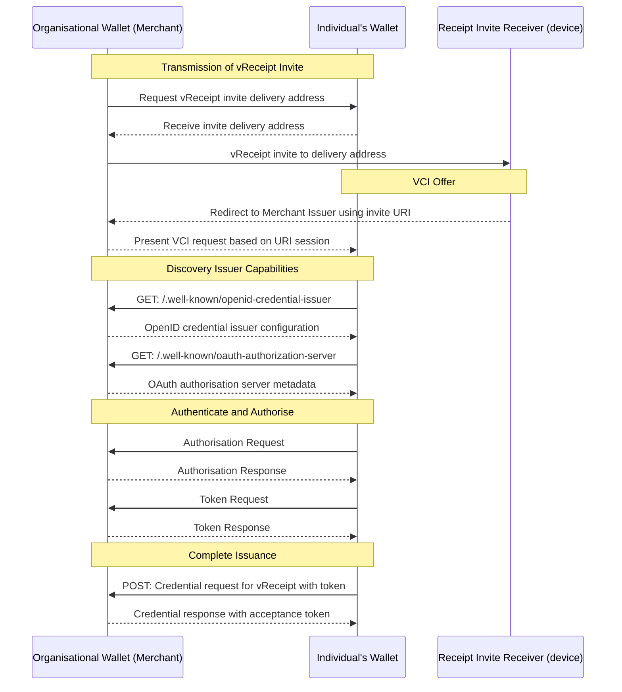

# EWC RFC011: Payments With Verifiable Receipts - v1.0

**Authors:**

- Dr Triantafyllou Nikos (University of the Aegean)
- Mr Lal Chandran (iGrant.io, Sweden)
- Dr Kavassalis Petros (University of the Aegean)
- Dr Mikael Linden (Gofore / Finnish Tax Administration)
- Mr Antti Kettunen (Tietoevry / Finnish Tax Administration)
- Mr Mikael Hallstrom (Finnish Tax Administration)

**Reviewers:**

* Dr Andreas Abraham (ValidatedID, Spain)
* Mr. Sebastian Bickerle (Lissi ID, Germany)

**Status:** Approved

## Table of Contents

- [EWC RFC011: Payments With Verifiable Receipts - v1.0](#ewc-rfc011-payments-with-verifiable-receipts---v10)
  - [Table of Contents](#table-of-contents)
  - [1.0 Summary](#10-summary)
  - [2.0 Motivation](#20-motivation)
  - [3.0 Pre-requisites](#30-pre-requisites)
  - [4.0 Workflows](#40-workflows)
  - [4.1 Embedded Method High-Level Flow](#41-embedded-method-high-level-flow)
    - [4.1.2	Receipt issued to the individual EUDI wallet](#412receipt-issued-to-the-individual-eudi-wallet)
  - [4.2 Pull-method High-Level Flow](#42-pull-method-high-level-flow)
    - [4.2.1 Receipt issued to the individual’s EUDI wallet](#421-receipt-issued-to-the-individuals-eudi-wallet)
  - [5.0 Messages](#50-messages)
  - [6.0 Data Model](#60-data-model)
  - [7.0 Conclusions](#70-conclusions)
  - [8.0 References](#80-references)

## 1.0 Summary

This specification outlines the essential processes, data models, and protocols for creating a Verifiable Receipt (vReceipt) as an Electronic Attribute Attestation (EAA). After a successful payment transaction, the vReceipt is intended for seamless transmission and storage in the EUDI Wallet.

The document defines two distinct approaches for issuing a vReceipt to an EUDI Wallet:

1. Embedded Flow: This process integrates the issuance of the vReceipt directly into an EUDI Wallet-enabled payment transaction, as specified in RFC007 [3] and RFC008 [4].
2. Detached Flow: This process operates independently of the payment method, enabling the issuance of a vReceipt even when the payment itself is not EUDI Wallet-enabled.

While this specification primarily addresses vReceipts for travel tickets, the methodology is versatile and can be adapted to other types of purchases.

## 2.0 Motivation

The EWC Large Scale Pilot (LSP) seeks to explore the potential and address the challenges of leveraging the EUDI Wallet across the travel, payment, and organisational identity domains. For the EUDI Wallet to gain widespread adoption, it must offer clear advantages over existing identification and payment solutions.

These advantages become particularly evident in cross-domain applications. For instance, using a single application (the EUDI Wallet) to complete multiple steps—such as identifying oneself during the booking of a travel ticket, paying for the ticket, and storing the receipt in the individual’s wallet or an organisational wallet—eliminates the need for separate apps for each step. This streamlined experience provides significant value to users, encouraging EUDI Wallet adoption.

Buyer purchases products either for personal or business use. For business use, the products are frequently paid for by the employer, who requires a receipt for accounting purposes. Two main mechanisms are identified for delivering the receipt to the employer:

- Buyer presents the receipt using EUDI Wallet: After payment, the merchant issues a verifiable Receipt (vReceipt) to the Individual’s (buyer’s) wallet. For example, the Individual (buyer) then submits the vReceipt to their employer as part of a travel expense report. This flow relies on the Individual’s (buyer’s) EUDI Wallet to carry receipts into the expense system, introducing manual steps for reimbursement.  

- Merchant issues the receipt directly to organization: The merchant issues the vReceipt to the individual’s (buyer’s) organisational wallet. This approach eliminates the need to scan or upload receipts, simplifying the reimbursement process for both individuals (buyers) and employers.

The proposed solution supports both methods.

## 3.0 Pre-requisites

The following are the prerequisites for this RFC:

1. The individual (buyer) is in control of a valid instance of the EUDI wallet unit.
2. (Optional) The individual’s (buyer’s) organisation is in control of a valid instance of an EUDI organisational wallet.
3. For Detached flow:  
   - The individual has completed a purchase.
   - The individual provides the merchant with a receipt invite delivery address (that is controlled either by them or by the organisation they represent).
4. For Embedded flow:  
   - The individual (buyer) intends to authorise the payment with their EUDI Wallet at the merchant in a merchant-led flow (RFC008 [4]).
5. Prerequisites from RFC001 [1], RFC002[2], RFC007[3], and RFC008[4].

## 4.0 Workflows

For efficient receipt delivery, the issuer (i.e., the merchant) must have the information needed to issue the receipt at the time of the purchase, but receipt delivery may happen later (for example, if the receipt is to be stored in the wallet of the buyer's employer).

From the merchant’s (receipt issuer) perspective, there are three alternatives for delivery of the receipt:

1. Pull-delivery method (Implemented via Detached Flows): Where the individual (buyer) “pulls” the receipt by initiating the issuance process through a link provided by the issuer. The merchant can do this by sending a website link via any channel (e.g., text message, email, push message) or presenting a QR code, which the buyer then scans.

2. Embedded method: Where an EUDIW payment flow is embedded into the flow of issuing a vReceipt to the individual’s (buyer’s) wallet, with the completion of the issuance of the vReceipt being deferred until the payment confirmation reaches the merchant that acts as the vReceipt issuer.

3. Push-delivery method: After payment confirmation, the merchant automatically pushes the receipt to the individual’s (buyer’s) wallet.

All methods have optimal use cases and thus do not exclude each other; however, push-delivery and the embedded methods offer the highest level of automation and significantly improve the UX compared to today's practices.

Each of these two methods operates on a different premise:

- A mechanism must be implemented for push delivery to discover the delivery endpoints of wallets where the vReceipt will be sent. An eAddress serves as a technical identifier, such as an endpoint or email address, enabling individuals to specify the digital service they wish to use in various transactions and life events. The selection of the appropriate eAddress depends on the transaction context (e.g., whether the individual pays for the goods themselves or the employer pays and requires a receipt). Regardless of the context, the individual retains control over selecting the eAddress.

- In the embedded flow, the EUDI Wallet must be used as the means of payments in a merchant-led flow to enable the payment process within the vReceipt issuance, requiring, as a result, a single interaction by the individual with the EUDI Wallet to authorize the payment request and receive the vReceipt.

Given that the current version of the ARF (v1.4) does not support an automated eAddress mechanism pointing to the endpoints controlled by the wallet of a specific entity (following the OIDC4VCI protocol), this document primarily describes the embedded and the pull methods.

## 4.1 Embedded Method High-Level Flow

The issuance of a vReceipt can be conceptualised as a three-part process, as presented in the following figure and explained in the subsequent table.

| **Event Name**                                     | **Description**                                                                                                                                                                                                                                                                                                                                                                                                                                                                                                                                                                                                                                                                                                                                                                                                                                   |
| -------------------------------------------------- | ------------------------------------------------------------------------------------------------------------------------------------------------------------------------------------------------------------------------------------------------------------------------------------------------------------------------------------------------------------------------------------------------------------------------------------------------------------------------------------------------------------------------------------------------------------------------------------------------------------------------------------------------------------------------------------------------------------------------------------------------------------------------------------------------------------------------------------------------- |
| **vReceipt Issuance Initiation**                   | - The individual (buyer) arrives at the merchant's checkout point.  - The individual (buyer) selects one of the EUDI Wallet payment options based on merchant-captured authentication data (See Chapter 3.3 in Payment Authentication (SCA) using EUDI Wallets Implementation Guide).  - The merchant calculates the exact payment amount and initiates issuing a verifiable receipt (vReceipt) to the individual’s EUDIW via the OIDC4VCI protocol.  - The individual (buyer) interacts with their EUDI Wallet to accept the merchant's vReceipt offer (by scanning a QR code or tapping a deep link).                                                                                                                                                                                                                                  |
| **Payment Authorization**                          | - As part of the vReceipt issuance flow, the merchant sends a Payment Authorization Request to the individual’s (buyer’s) EUDI Wallet without requiring additional interaction from the individual (buyer).  - This request is implemented as a dynamic credential request using the OIDC4VP protocol, as described in RFC008 [4].  - The payment request includes all necessary transaction details to ensure dynamic linking and supports any required verifications (e.g., applying discounts or validating the buyer's PID) needed to determine the specific price for the requested goods.  - The individual’s (buyer’s) EUDI Wallet processes the merchant's authorization request in accordance with RFC008 [4] and sends the appropriate response back to the merchant.                                                          |
| **Payment Confirmation and vReceipt Transmission** | - Upon receiving the Verifiable Presentation (VP) from the individual’s (buyer’s) EUDI Wallet, the merchant validates it and forwards the signed payment authorization (containing the payment transaction data) to the payment network (e.g., 3DS).  - The merchant responds to the buyer's wallet with a Credential Response in a deferred flow.  - After receiving the Credential Response, the individual’s (buyer’s) EUDI Wallet periodically sends Deferred Credential Requests to the merchant to check the status of the vReceipt issuance.  - The merchant MUST respond with one of the following:    - `issuance_pending`: If the merchant is awaiting payment verification from the payment network.    - `invalid_transaction_id`: If the payment fails.    - The vReceipt credential: If the payment is completed. |

### 4.1.2	Receipt issued to the individual EUDI wallet

The flow above describes Steps 1 to 8 in RFC001 [1]. Steps 9 to 11 are defined in RFC007 [3]  and RFC008 [4]. Finally, Steps 12 to 17 are described again in RFC001 [1]. 

## 4.2 Pull-method High-Level Flow

The issuance of a vReceipt can be conceptualised as a three-part process, as presented in the following table. 

Using this approach, the receipt can be stored in the individual’s (or their employer’s) EUDI wallet, progressively replacing the current practices of sending the receipt as a PDF or paper-based document. The next section presents the case for issuing the vReceipt to the individual’s EUDI Wallet, however the flow for issuing the vReceipt to the of organisational EUDI Wallet of the individual -buyer- is identical with the only change being that the eAddress must be controlled by the individuals organisation. 

| **Event Name**                                 | **Description**                                                                                                                                                                                                                                                                                                                                                                                                                                                                                                      |
| ---------------------------------------------- | -------------------------------------------------------------------------------------------------------------------------------------------------------------------------------------------------------------------------------------------------------------------------------------------------------------------------------------------------------------------------------------------------------------------------------------------------------------------------------------------------------------------- |
| **Payment Confirmation and Invite Generation** | - The merchant receives a payment confirmation from their payment service provider (PSP) that the customer's payment has been processed successfully.  - The merchant generates a vReceipt invitation, a URI directing the customer to the merchant's vReceipt issuing service. This invitation is uniquely tied to the specific payment transaction through a session identifier embedded within the URI.                                                                                                        |
| **vReceipt Invitation Transmission**           | - The merchant provides this invite (URI) to the individual (buyer) potentially using an out-of-band method (e.g., text message, email, QR code) as part of the payment flow.                                                                                                                                                                                                                                                                                                                                        |
| **vReceipt Issuance**                          | - The customer accesses the vReceipt invitation (URI), redirecting them to the merchant's vReceipt issuance service.  - The service retrieves the relevant receipt details (e.g., using the session ID). It generates an OIDC4VCI request to issue the vReceipt as an Electronic Attribute Attestation (EAA) to the EUDI wallet.  - The system then presents the credential issuance invitation to the individual via a QR code or deep link.  - The individual receives the vReceipt in their EUDI wallet. |

### 4.2.1 Receipt issued to the individual’s EUDI wallet

The individual selects to have the vReceipt issued to their personal EUDI wallet by denoting an eAddress they control, the delivery address for the vReceipt. In the following flow the transmission of the vReceipt invite takes place by the Merchant to the Individual and may be implemented over the EUDI wallet (by having the individual present an appropriate credential) but can also be implemented by any other means (e.g. typing of the eAddress by the individual at the Merchants portal) 

## 5.0 Messages

For details about the specific OIDC4VCI messages supported, please review EWC RFC001 [1].

## 6.0 Data Model

Any implementation of eReceipts must ensure compatibility across different systems and platforms by supporting at least one commonly available standard data model. Implementations can also use other available data models according to their business needs. This specification uses the CEN/TS 16931-8:2022 (E) “Electronic invoicing - Part 8: Semantic data model of the elements of an e-receipt or a simplified electronic invoice” as the commonly supported data model, which is used to create a vReceipt attestation data model.

The schema of the vReceipt in SD-JWT format is available [here](https://github.com/EWC-consortium/eudi-wallet-rulebooks-and-schemas/blob/wp2-schemas/data-schemas/ds007-vReceipt.json).

## 7.0 Conclusions

This specification has outlined a foundation for creating verifiable Receipts (vReceipts) as Electronic Attribute Attestations (EAAs) within the EUDI Wallet ecosystem. By defining the necessary flows, data models, and protocols, we have established a clear methodology for generating and managing vReceipts, tailored explicitly for travel ticket transactions. Furthermore, this document states the differences between the different delivery methods of the vReceipt - pull, push and embedded - and justifies the requirements for each.

As this is an initial approach, several challenges remain to be addressed. User experience (UX) constraints must be carefully considered to ensure seamless interactions between individuals (buyers), merchants, and organisations. Additionally, security implications associated with issuing and storing vReceipts require thorough evaluation to maintain trust and integrity within the system. Future iterations of this specification may explore alternative technological stacks, such as DIDcomm, to enhance interoperability and functionality, even if they extend beyond the current ARF compliance framework. These advancements aim to refine the vReceipt issuance process, addressing existing limitations and paving the way for broader application across diverse domains.

## 8.0 References

[1] [EWC RFC 001: Issue Verifiable Credential - v2.0](https://github.com/EWC-consortium/eudi-wallet-rfcs/blob/main/ewc-rfc001-issue-verifiable-credential.md)

[2] [EWC RFC 002: Present Verifiable Credentials - v1.0](https://github.com/EWC-consortium/eudi-wallet-rfcs/blob/main/ewc-rfc002-present-verifiable-credentials.md)

[3] [EWC RFC 007: Payment Wallet Attestation - v1.0](https://github.com/EWC-consortium/eudi-wallet-rfcs/blob/main/ewc-rfc007-payment-wallet-attestation.md)

[4] [EWC RFC008: Payment Data Confirmation - v0.9](https://github.com/EWC-consortium/eudi-wallet-rfcs/blob/main/ewc-rfc008-payment-data-confirmation.md)
