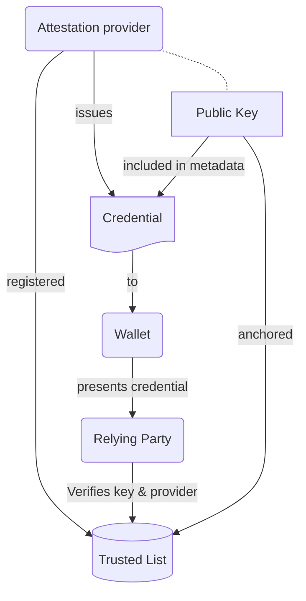

# **EWC RFC 012: Trust Mechanism - v1.0**

**Authors:**
* Antti Kettunen, Tietoevry, Finland
* Lal Chandran, iGrant.io, Sweden

**Reviewers:**
* Viky Manaila, Intesi Group
* George J Padayatti, iGrant.io, Sweden
* Malin Norlander, Bolagsverket, Sweden
* Werner Folkendt, Bosch, Germany
* Quentin Drouot, Archipels, France

**Status:** Approved

**Table of contents**
- [**EWC RFC 012: Trust Mechanism - v1.0**](#ewc-rfc-012-trust-mechanism---v10)
- [1. Introduction and scope](#1-introduction-and-scope)
  - [1.1 Trust model](#11-trust-model)
  - [1.2 Trusted list use](#12-trusted-list-use)
- [2. Requirements](#2-requirements)
  - [2.1 Credential providers](#21-credential-providers)
  - [2.2 Holders and Relying Parties](#22-holders-and-relying-parties)
- [3. EWC Trusted List](#3-ewc-trusted-list)
  - [3.1 EWC Trusted List contents](#31-ewc-trusted-list-contents)
  - [3.2 List of service type URIs](#32-list-of-service-type-uris)
- [4. Messages](#4-messages)
  - [4.1 Trust validation and verification](#41-trust-validation-and-verification)
  - [4.2 Verification process](#42-verification-process)
    - [4.2.1 Extracting metadata and signature validation](#421-extracting-metadata-and-signature-validation)
    - [4.2.2 Resolving public keys and trust validation](#422-resolving-public-keys-and-trust-validation)
  - [4.3 Role-specific responsibilities](#43-role-specific-responsibilities)
    - [4.3.1 Issuers](#431-issuers)
    - [4.3.2 Holders](#432-holders)
      - [4.3.2.1 Receiving credentials](#4321-receiving-credentials)
      - [4.3.2.2 Sharing credentials](#4322-sharing-credentials)
    - [4.3.3 Relying Parties](#433-relying-parties)
- [References](#references)

# 1. Introduction and scope

The EWC Large Scale Pilot (LSP) must ensure secure, verifiable, and interoperable trust relationships between entities within the ecosystem. Trust infrastructures provide the foundation for secure interactions by enabling the verification of authorised entities in compliance with the trust framework in which they operate.

This specification defines the content of the EWC Trusted List and the requirements and interfaces for its use. It enables wallets, issuers, and relying parties to use the EWC trust infrastructure within the scope of the eIDAS Trust Framework, which in this document includes the eIDAS regulation, Implementing Acts (IA), and the Architecture and Reference Framework (ARF).

The specification covers using trusted lists in the context of EWC Pilots to verify the issuer’s public key, which is used to sign the credential.

Note that this document is not authoritative outside of the pilot projects and that it may make choices and definitions that are not fully aligned with the eIDAS Trust Framework. These choices are made primarily for implementation simplicity purposes.

## 1.1 Trust model

The eIDAS regulation defines the EU Trusted Lists as the authoritative records of entities authorised to provide services within the eIDAS ecosystem.

The authoritative entities defined in the governance framework maintain the trusted lists. In eIDAS, these authorities are EU Member States (through Supervisory Bodies) or third countries with a Mutual Recognition Agreement (MRA) with the European Union. For piloting purposes, the **EWC consortium acts as an authoritative entity** maintaining an EWC Trusted List based on the **ETSI TS 119 612** [1] standard.

In EWC pilots, all wallet providers, PID issuers, EAA issuers, and certificate providers must be registered in a Trusted List to obtain the authorised status. Once an entity is listed in the trusted list with an active service status, they have legal authorisation to operate as a service provider for the given service type. The service type can be wallet provider, PID issuer, etc. According to the ARF, the Trusted List identifies the registered entity using a service-specific, unique trust anchor. A trust anchor is a combination of a public key and the identifier of the associated entity and may be used to verify signatures created by that entity [Chapter 3.5 ARF 1.5]. However, as ARF is not yet clear about what that entity identifier is, it is omitted in the EWC Trust Mechanism for now. In EWC Trusted List, the trust anchor is primarily the issuer's public key, signing certificate or a Decentralized Identifier (DID). This is specified in Chapter 4.2.2.

The registered entity must have as many unique trust anchors as the services it is authorised to provide. For example, the same organisation can simultaneously provide multiple service types.

## 1.2 Trusted list use

The Trusted List verifies the authorization of the service provider to provide the selected type of service. The trusted list also provides verification of the cryptographic material used to sign a credential or other document. The public key is present in the credential metadata and can be used to verify the key's authenticity and the provider's authorisation from the trust list. The figure below shows the basic premise of anchoring and verifying the attestation provider using trusted lists. 

*Figure: Anchoring and Verification of Attestation Providers Using Trusted Lists*

# 2. Requirements

The following role-specific requirements apply only in the context of the EWC Trusted List. Unless specifically noted, the requirements apply to all types of attestation providers (PID, WUA, QEAA, EAA, Pub-EAA).

## 2.1 Credential providers

The providers of attestations MUST comply with the following requirements:

1. The provider must register its business information to the EWC Trusted List (See [EWC Trust List Github](https://github.com/EWC-consortium/ewc-trust-list) for details).

2. The provider must register all services it provides and a single unique trust anchor for each service (see possible service types in chapter 3.2)
    1. The trust anchor is either a public key, certificate, certificate chain or decentralized identifier. Whatever the chosen format, it MUST be the same as the anchor available in the metadata of the credential. 

3. The provider must sign the credential using the signing key linked to the registered trust anchor corresponding to the service type.

4. The credential metadata must include the same trust anchor registered in the Trusted List.

5. The credential metadata must include the URI of the Trusted List where the attestation provider is registered.
    2. The URI for the EWC Trusted List is [https://ewc-consortium.github.io/ewc-trust-list/EWC-TL](https://ewc-consortium.github.io/ewc-trust-list/EWC-TL)

6. If the provider updates the keys to their registered service, the trust anchor in the trusted list MUST be updated. The trusted list will automatically retain historical keys.

## 2.2 Holders and Relying Parties

The following requirements apply to all actors verifying or validating credentials (e.g., holders and relying parties). For simplicity, the term “verifier” refers to both roles.

In addition to the requirements below, the verifier must perform credential-specific verifications according to the requirements of the respective RFCs.

1. The verifier must extract the trust anchor and the Trusted List URI from the credential metadata.

2. The verifier must verify that the Trusted List URI is  [https://ewc-consortium.github.io/ewc-trust-list/EWC-TL](https://ewc-consortium.github.io/ewc-trust-list/EWC-TL)

3. The verifier must verify that an entry matching the trust anchor is found in the trusted list and make the following verifications against the information retrieved from the trusted list.

    1. The trust anchor MUST be resolved to only one service type for one service provider.
    2. The resolved service type MUST match the credential type being verified. (e.g. Wallet Provider is only authorised to issue WUAs, nothing else). See service type to object mapping in chapter 3.2 
    3. The StatusStartingTime must be earlier than the issuance time of the credential being verified.
    4. If the trust anchor is matched with a historical service entry (i.e. within ServiceHistory - subtree), then the verifier must also verify that the credential issuance time is between the StatusStartingTime of the matched record and the StatusStartingTime of the next historical or currently active record.
    5. The service status MUST be valid (i.e. “granted”). (See specific URI values for Service Status)

4. If any of the verifications fail, the whole credential verification MUST fail and be considered untrustworthy.

# 3. EWC Trusted List

The EWC Trusted List is based on a subset of information defined in ETSI TS 119 612. All providers are on the same trusted list to simplify implementation and adoption in EWC Pilots. This means that in addition to the trust service providers (QEAA, QC, etc.), the trusted list will include other EUDI providers, such as wallet providers, PID Providers and Pub-EAA providers, which may not normally exist in the same trusted list.

## 3.1 EWC Trusted List contents

The EWC Trusted List provides the following information for each registrant.

<table border="1">
  <tr>
    <th>Name</th>
    <th>Field name</th>
    <th>Description</th>
  </tr>
  <tr>
    <td>Provider name</td>
    <td>TSPName</td>
    <td>Name of the legal entity providing the service.</td>
  </tr>
  <tr>
    <td>Provider tradename</td>
    <td>TSPTradeName</td>
    <td>Official registration identifier or alternative name that uniquely identifies the provider.</td>
  </tr>
  <tr>
    <td>Street address</td>
    <td>StreetAddress</td>
    <td>Street address of the provider.</td>
  </tr>
  <tr>
    <td>City</td>
    <td>Locality</td>
    <td>City of the provider.</td>
  </tr>
  <tr>
    <td>Postal Code</td>
    <td>PostalCode</td>
    <td>Postal code of the provider.</td>
  </tr>
  <tr>
    <td>Country (code)</td>
    <td>CountryName</td>
    <td>
      Country where the provider is registered. 
      Format: ISO 3166-1 Alpha-2 codes with exceptions: 
      1. United Kingdom = "UK" 
      2. Greece = "EL"
    </td>
  </tr>
  <tr>
    <td>Email</td>
    <td>ElectronicAddress</td>
    <td>Contact email of the provider.</td>
  </tr>
  <tr>
    <td>Information URI</td>
    <td>TSPInformationURI</td>
    <td>URI(s) where users (e.g., relying parties) can obtain provider-specific information.</td>
  </tr>
  <tr>
    <td>Service Type URI</td>
    <td>ServiceTypeIdentifier</td>
    <td>URI describing the type of the service. See chapter 3.2 for a list of possible service type URIs.</td>
  </tr>
  <tr>
    <td>Service current status</td>
    <td>ServiceStatus</td>
    <td>
      The current status of the service as a URI identifier: 
      <b>Granted</b>: <a href="http://uri.etsi.org/TrstSvc/TrustedList/Svcstatus/granted">http://uri.etsi.org/TrstSvc/TrustedList/Svcstatus/granted</a> 
      <b>Withdrawn</b>: <a href="http://uri.etsi.org/TrstSvc/TrustedList/Svcstatus/withdrawn">http://uri.etsi.org/TrstSvc/TrustedList/Svcstatus/withdrawn</a>
    </td>
  </tr>
  <tr>
    <td>Service Status Starting time</td>
    <td>StatusStartingTime</td>
    <td>Date-time character string formatted according to ISO 8601 (UTC).</td>
  </tr>
  <tr>
    <td>Service name</td>
    <td>ServiceName</td>
    <td>Name of the service.</td>
  </tr>
  <tr>
    <td>Service endpoint (supply point) URI</td>
    <td>ServiceEndpointURI</td>
    <td>One or more URIs where relying parties can access the service or related services.</td>
  </tr>
  <tr>
    <td>Service definition URI</td>
    <td>ServiceDefinitionURI</td>
    <td>URIs where relying parties can obtain service-specific information.</td>
  </tr>
  <tr>
    <td>Service Digital Identity (Trust Anchor)</td>
    <td>DigitalIdentity</td>
    <td>Specifies a unique service digital identifier/public key identifying the service.</td>
  </tr>
</table>

## 3.2 List of service type URIs

The trusted list includes providers and all the services a provider is authorised to provide within the scope of the governance framework. Each service has a service type, denoted with a unique type URI. Please note that for Service Provider types not yet covered by the ETSI 119 612 standard, a URI definition following the standard syntax is marked with “EWC” as the source. These URIs will be updated if a future version of the standard (or a dedicated one) is released.

<table border="1">
  <tr>
    <th>Service</th>
    <th>Object</th>
    <th>URI</th>
    <th>Source</th>
  </tr>
  <tr>
    <td>QES Provider</td>
    <td>QC</td>
    <td><a href="http://uri.etsi.org/TrstSvc/Svctype/CA/QC">http://uri.etsi.org/TrstSvc/Svctype/CA/QC</a></td>
    <td>ETSI 119 612</td>
  </tr>
  <tr>
    <td>QEAA Provider</td>
    <td>QEAA</td>
    <td><a href="http://uri.etsi.org/TrstSvc/Svctype/EAA/Q">http://uri.etsi.org/TrstSvc/Svctype/EAA/Q</a></td>
    <td>ETSI 119 612</td>
  </tr>
  <tr>
    <td>EAA Provider</td>
    <td>EAA</td>
    <td><a href="http://uri.etsi.org/TrstSvc/Svctype/EAA">http://uri.etsi.org/TrstSvc/Svctype/EAA</a></td>
    <td>ETSI 119 612</td>
  </tr>
  <tr>
    <td>Pub-EAA Provider</td>
    <td>Pub-EAA</td>
    <td><a href="http://uri.etsi.org/TrstSvc/Svctype/EAA/Pub-EAA">http://uri.etsi.org/TrstSvc/Svctype/EAA/Pub-EAA</a></td>
    <td>ETSI 119 612</td>
  </tr>
  <tr>
    <td>Qualified Electronic Ledger</td>
    <td>Ledger record</td>
    <td><a href="http://uri.etsi.org/TrstSvc/Svctype/Ledgers/Q">http://uri.etsi.org/TrstSvc/Svctype/Ledgers/Q</a></td>
    <td>ETSI 119 612</td>
  </tr>
  <tr>
    <td>Non-qualified Electronic Ledger</td>
    <td>Ledger record</td>
    <td><a href="http://uri.etsi.org/TrstSvc/Svctype/Ledgers">http://uri.etsi.org/TrstSvc/Svctype/Ledgers</a></td>
    <td>ETSI 119 612</td>
  </tr>
  <tr>
    <td>Natural Person PID Provider</td>
    <td>PID</td>
    <td><a href="https://ewc-consortium.github.io/ewc-trust-list/TrstSvc/Svctype/PID">https://ewc-consortium.github.io/ewc-trust-list/TrstSvc/Svctype/PID</a></td>
    <td><strong>EWC</strong></td>
  </tr>
  <tr>
    <td>Legal Person PID Provider</td>
    <td>LPID</td>
    <td><a href="https://ewc-consortium.github.io/ewc-trust-list/TrstSvc/Svctype/LPID">https://ewc-consortium.github.io/ewc-trust-list/TrstSvc/Svctype/LPID</a></td>
    <td><strong>EWC</strong></td>
  </tr>
  <tr>
    <td>Natural Person Wallet Provider</td>
    <td>NPWP</td>
    <td><a href="https://ewc-consortium.github.io/ewc-trust-list/TrstSvc/Svctype/NPWP">https://ewc-consortium.github.io/ewc-trust-list/TrstSvc/Svctype/NPWP</a></td>
    <td><strong>EWC</strong></td>
  </tr>
  <tr>
    <td>Legal Person Wallet Provider</td>
    <td>LPWP</td>
    <td><a href="https://ewc-consortium.github.io/ewc-trust-list/TrstSvc/Svctype/LPWP">https://ewc-consortium.github.io/ewc-trust-list/TrstSvc/Svctype/LPWP</a></td>
    <td><strong>EWC</strong></td>
  </tr>
</table>

# 4. Messages

## 4.1 Trust validation and verification

The European Wallet Consortium (EWC) trust list is published on the [EWC Trust List](https://ewc-consortium.github.io/ewc-trust-list/EWC-TL) and used to validate trust. The service definitions referenced align with Chapter 3.2. Trust validation occurs when the wallet unit (WU) interacts with the relying party or issuer (attestation provider) in the following scenarios:

* When a credential is received in the wallet, the WU checks if the issuer is valid. The issuer ensures that the wallet provider and wallet unit are valid. 
* Before a credential is presented to any relying party (verifier), the wallet unit ensures that the relying party is valid and the relying party ensures that the wallet provider is valid.
* After receiving the credential, the relying party verifies that the issuer of the credentials is valid.

>**NOTE:** During verification of an incoming credential, the WU or the RP shall consult the issuer’s service history (as per ETSI TS 119 612) to validate signatures against historical signing keys, ensuring trust continuity even when issuers rotate or update cryptographic keys.

## 4.2 Verification process

### 4.2.1 Extracting metadata and signature validation

Each credential contains metadata in its headers (for JWT-based credentials) or as part of SD-JWT. The key fields that assist in verification are:

* **<code>kid</code> (Key Identifier):** Allows key lookup without needing the full certificate. This is used if DID or other mechanisms are used. 
* **<code>x5c</code> (X.509 Certificate Chain):** This is when an X.509 certificate is used for signing. This provides the verification chain, where the first entry verifies the credential’s signature while the remaining certificates establish trust in the first certificate.

### 4.2.2 Resolving public keys and trust validation

When a Wallet Unit interacts with another service provider, trust validation must take place. A service provider can be an Issuer, Wallet Unit, or a Verifier (Relying Party). This validation involves checking the certificate of the interacting service provider against the EWC Trust List (EWC TL) [9] using the steps outlined below:

1. **Certificate or Key ID Matching:** When **<code>x5c</code>** is used, the service provider’s certificate is queried and matched using the X.509 Certificate.

    If a **<code>kid</code>** is used instead, it can be either a DID (Decentralised Identifier) or a non-DID. If it uses DID, the following mechanism is used to resolve the keys:

   * Parse the DID – Extract the DID method and identifier.
   * Identify the Resolver – Select the appropriate resolver based on the DID method.
   * Fetch the DID Document: Retrieve the DID document from the registry or network.
   * Verify the Document: Confirm the document's authenticity and cryptographic integrity.  
    

2. **Service Status Validation:** Once the issuer is located in the **EWC Trust List (EWC TL)**, the **current status** of the trust service provider is validated by checking the **ServiceStatus** field. The possible values are:
    * **Granted:** The trust service provider is currently active and trusted: <code>[http://uri.etsi.org/TrstSvc/TrustedList/Svcstatus/granted](http://uri.etsi.org/TrstSvc/TrustedList/Svcstatus/granted)</code>. If the issuer is **listed and accredited**, and its **ServiceStatus is "granted"**, the relying party can **trust the issuer as a valid trust service provider**. This indicates that credentials issued by this provider can be considered valid.
    * **Withdrawn:** The trust service provider is no longer valid or trusted: <code>[http://uri.etsi.org/TrstSvc/TrustedList/Svcstatus/withdrawn](http://uri.etsi.org/TrstSvc/TrustedList/Svcstatus/withdrawn)</code>. If the **trust service provider** is present but **marked as "withdrawn"**, the relying party **must not trust the issuer**. This means that any credentials issued by this provider should be treated cautiously, as the provider is no longer recognised as trusted.

By following these steps, the relying party ensures the interacting service provider is recognised, trusted, and actively valid. This process helps maintain the integrity and reliability of the verification procedure.

## 4.3 Role-specific responsibilities

### 4.3.1 Issuers

In the OpenID4VCI protocol, issuers ensure credential authenticity through:

   * **Protocol-specific checks:**
      * Credentials are signed to maintain integrity and authenticity.
      * Public key details are included in credential headers (via **<code>kid</code>**,<code> <strong>jwk</strong></code>,<code> <strong>x5c</strong></code>).
      * Revocation details are embedded if applicable.
   * **Trust List:** When the issuer or relying party interacts with the wallet unit, it must:
     * Authenticate the wallet provider who issued the wallet unit attestation by ensuring the wallet provider is anchored to the trust list and has the service status ‘granted’.
     * Validate the digital signature using the wallet provider's public key to verify the wallet unit's attestation integrity and authenticity.

These measures ensure credentials are cryptographically valid and trusted.

### 4.3.2 Holders

#### 4.3.2.1 Receiving credentials

Holders validate received credentials using the following:

* **Protocol-specific checks:**
  * Digital signature resolution: Public key details are resolved from the credential headers (via <code><strong>kid</strong></code>, <code><strong>jwk</strong></code>,<code> <strong>x5c</strong></code>).
  * Revocation and expiration details are used as required to obtain the credential status.

* **Trust List:** The following mechanisms verify credential integrity and authenticity. When the wallet unit receives the credentials from the issuer in the form of ISO 18013-5 mDL/mDOC, IETF SD-JWT, or JWT, it must:

  1. Ensure the issuer is anchored to the trust list and has service status ‘granted’, indicating permission to issue such credentials.
  2. Verify the credential’s integrity and authenticity by validating its digital signature.

#### 4.3.2.2 Sharing credentials

Before sharing a credential, the holder's wallet ensures the relying party is trustworthy:

* **Trust List:**
  * Public keys and certificate issuer details are retrieved from a trusted list.
* **User feedback:**
  * The wallet informs the user about the relying party’s trust status, enabling an informed sharing decision. The wallet provider decides whether to send explicit messages or visual indications. 

This approach ensures credentials are only shared with legitimate entities.

### 4.3.3 Relying Parties

In the OpenID4VP protocol, relying parties must:

* **Protocol-specific checks:**
  * Digital Signature Resolution: Resolve public key details from credential headers using parameters such as <code><strong>kid</strong></code>, <code><strong>jwk</strong></code>, or <code><strong>x5c</strong></code>.
  * Key Binding: Verify the holder possesses the private keys corresponding to those associated with the credential issued by the issuer. This step forms part of the key binding check.
  * credential Status: Validate revocation and expiration details to confirm the credential’s current status.

* **Trust List:**

    When the wallet unit receives credentials from the issuer (formats include ISO 18013-5 mDL/mDOC, IETF SD-JWT, or JWT), it must:
    * Ensure the issuer is on the EWC Trust List with a service status <code><strong>granted</strong></code>, indicating authorisation to issue credentials.
    * Validate the credential’s digital signature to verify its integrity and authenticity.
    * Retrieve public keys, service types, and other issuer details from the trust list.
    * Validate the credential signature and confirm that the credential type (e.g., PID, EAA, QEAA, Pub-EAA) aligns with the issuer’s service type.

Additionally, when the relying party receives credentials from the wallet unit, it must:

  * Authenticate the wallet provider responsible for the wallet unit attestation, confirming its status as `granted` on the trust list.
  * Validate the wallet unit attestation’s digital signature to ensure its integrity and authenticity.

Adhering to these processes ensures credentials received by relying parties are valid, trustworthy, and issued by authorised entities.

# References

1. ETSI TS 119 612 v2.3.1, Electronic Signatures and Trust Infrastructures (ESI); Trusted Lists, [https://www.etsi.org/deliver/etsi_ts/119600_119699/119612/02.03.01_60/ts_119612v020301p.pdf](https://www.etsi.org/deliver/etsi_ts/119600_119699/119612/02.03.01_60/ts_119612v020301p.pdf)

2. Trusted List Manager for non-EU countries, available at [https://ec.europa.eu/digital-building-blocks/sites/display/TLSO/Trusted+List+Manager+non-EU](https://ec.europa.eu/digital-building-blocks/sites/display/TLSO/Trusted+List+Manager+non-EU) 

3. EWC RFC001, Issue Verifiable Credential - v1.0, Available at: [https://github.com/EWC-consortium/eudi-wallet-rfcs/blob/main/ewc-rfc001-issue-verifiable-credential.md](https://github.com/EWC-consortium/eudi-wallet-rfcs/blob/main/ewc-rfc001-issue-verifiable-credential.md) (Accessed: 23-January, 2025).

4. OpenID Foundation (2023) *OpenID for Verifiable Credential Issuance 1.0 - Draft 1*. Available at:[ https://openid.net/specs/openid-4-verifiable-credential-issuance-1_0-ID1.htm](https://openid.net/specs/openid-4-verifiable-credential-issuance-1_0-ID1.htm) (Accessed: 23-January, 2025)

5. EWC RFC004, Individual Wallet Unit Attestation - v1.0, Available at: [https://github.com/EWC-consortium/eudi-wallet-rfcs/blob/main/ewc-rfc004-individual-wallet-attestation.md](https://github.com/EWC-consortium/eudi-wallet-rfcs/blob/main/ewc-rfc004-individual-wallet-attestation.md) (Accessed: 09-February, 2025)

6. EWC RFC002, Present Verifiable Credential - v1.0, Available at: [https://github.com/EWC-consortium/eudi-wallet-rfcs/blob/main/ewc-rfc002-present-verifiable-credentials.md](https://github.com/EWC-consortium/eudi-wallet-rfcs/blob/main/ewc-rfc002-present-verifiable-credentials.md) (Accessed: 29-January, 2025)

7. OpenID Foundation, 2023. OpenID for Verifiable Presentations (OpenID4VP) Draft 18. [online] Available at: [https://openid.net/specs/openid4vp-18](https://openid.net/specs/openid4vp-18) [Accessed 2 February 2025].

8. IETF (2015) OAuth 2.0 Dynamic Client Registration Protocol, Available at: [https://www.rfc-editor.org/rfc/rfc7591.html#section-2](https://www.rfc-editor.org/rfc/rfc7591.html#section-2) [The client metadata  could be reused]

9. EWC Trust List, 2025, Available at: [https://ewc-consortium.github.io/ewc-trust-list/EWC-TL](https://ewc-consortium.github.io/ewc-trust-list/EWC-TL) (Accessed: 14, Mar, 2025) 