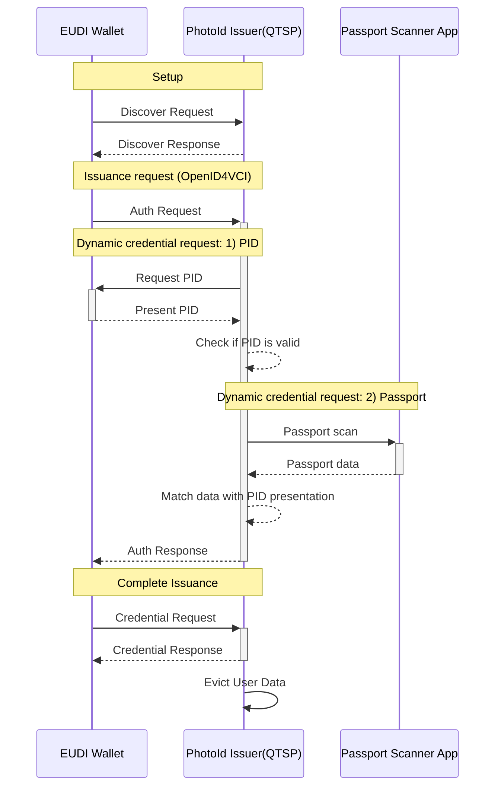
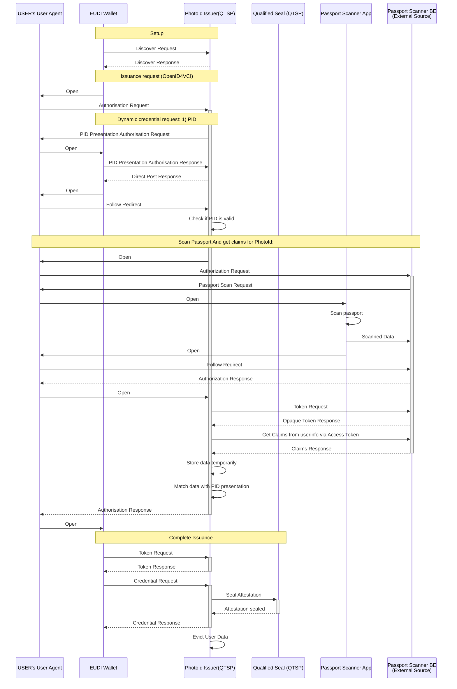

# EWC RFC013: Issuing Photo ID Verifiable Credential - v1.0

**Authors:**

* Matteo Marangoni, SICPA, Spain
* Xavi Vila, SICPA, Spain
* Dimitroglo, Veaceslav, SICPA, Spain
* Mr. Daniele Ribaudo, Intesi Group, Italy

**Reviewers:**

* Viky Manaila, Intesi Group, Italy

**Status:** Draft v1.0

Copyright © 2025 All Rights Reserved  
Published under a Creative Commons Attribution 4.0 International License

---

## **Table of Contents**
- [1.0 Summary](#10-summary)
- [2.0 Motivation](#20-motivation)
- [3.0 Pre-requisites](#30-pre-requisites)
- [4.0 Issuance Flow](#40-issuance-flow)
  - [4.1 Actors](#41-actors)
  - [4.2 Flow Details](#42-flow-details)
    - [4.2.1 Setup Phase](#421-setup-phase)
    - [4.2.2 Credential Issuance Request (OpenID4VCI)](#422-credential-issuance-request-openid4vci)
    - [4.2.3 Dynamic Credential Request - Step 1: PID Validation](#423-dynamic-credential-request---step-1-pid-validation)
    - [4.2.4 Dynamic Credential Request - Step 2: Passport Validation](#424-dynamic-credential-request---step-2-passport-validation)
- [5.0 Verifiable Credential Type](#50-verifiable-credential-type)
- [6.0 References](#60-references)

---

## **1.0 Summary**
This specification defines the implementation of the "Photo ID profile" defined in Annex C of ISO/IEC TS 23220-4, in mdoc and SD-JWT. The attestation issued is derived from an **electronic Machine-Readable Travel Document (eMRTD)** by a Qualified Trust Service Provider (QTP).

The issuance process includes verifying an eID attestation issued with a high Level of Assurance (LoA High), such as a **Personal ID (PID) credential** and may include additional steps, such as biometric checks. The issuance follows the **OpenID4VC** framework, ensuring interoperability with **EUDI Wallets**.

### **Key Benefits:**

- **Enhancing digital identity verification** while maintaining strong security and privacy guarantees.
- **Facilitating travel and remote identity proofing**, reducing the need for physical document checks.
- **Complying with international standards** such as **SD-JWT**, and **mDoc (ISO/IEC TS 23220-4 Annex C, 2024-08-14)**.
- **Enabling selective disclosure**, allowing users to share only necessary attributes (e.g., verifying age without revealing full birthdate), enhancing privacy and data minimization.

---

## **2.0 Motivation**

A **Photo ID** is a document type used for identity documents that perform the function of a photo-based eID. In practical terms, a **Photo ID attestation** provides a **digital representation of a passport** that can be used for **identity verification** in various online and offline use cases where the biometric verification of the photo is required.

There are 2 possible scenarios for issuing a Photo ID attestation:

1. **Direct issuance by Passport issuing authority**
    - The **Issuance Authority** has all the necessary data required to issue a valid photo ID credential.
    - The **Issuance Authority** performs the required identity verification before issuing the attestation to the citizen (this might include remote identity proofing, authentication using PID or in-person verification).

2. **Issuance by a Qualified Trust Service Provider**  
    - The QTSP requests the required data from the citizen at the moment of issuing the Photo ID attestation.
    - The QTSP performs the required identity verification before issuing the attestation to the citizen (this might include remote identity proofing, authentication using PID or in-person verification).

### 2.1 Scenario 2: Issuance by a Qualified Trust Service Provider

In this RFC we will be focusing on the **scenario 2)**, where the QTSP will:

- Request the required electronic Machine-Readable Travel Document (eMRTD) data from the citizen at the moment of issuing the Photo ID attestation.
- Authenticate the citizen's identity using EUDI Wallet and **PID**.
- Verify that the eMRTD is issued by a trusted authority and has a valid expiration date.
- Perform user binding verification by comparing attributes from the PID such as first and last name and date of birth, to those in the identity document. 

---

## **3.0 Pre-requisites**

In the scope of this RFC, the following conditions should be met before issuing a **Photo ID Electronic Attestation of Attributes (EAA)**:

1. **Personal ID Verification**  
   - The user MUST hold a valid **Personal ID (PID)** issued by a trusted authority on an EUDI Wallet.
   
2. **Passport Scan**  
   - The QTSP MUST be registered with the Passport reader application (client credentials or any other method).
   - The user MUST hold a valid **Passport** issued by a trusted authority on an eMRTD (Biometric passport).

3. **Liveness Check (Optional)**  
   - The system MAY require a **selfie** or a **short video** to detect liveness and compare it against the document portrait.

4. **EUDI Wallet Support**  
   - The wallet requesting the credential MUST support **OpenID4VCI** and **ISO/IEC 18013-5** display properties.

---

## **4.0 Issuance Flow**

The issuance process follows **OpenID4VCI** Authorisation Code flow as described in the [EWC RFC001: Issue Verifiable Credential - v2.0](https://github.com/EWC-consortium/eudi-wallet-rfcs/blob/main/ewc-rfc001-issue-verifiable-credential.md), and extends it by implementing Dynamic Credential Request (OpenID4VCI draft 13), ensuring a standardized method for **credential issuance**.

It follows the OpenID4VC High Assurance Interop profile, where it is recommended that the Credential Issuer and the Wallet MUST support the authorization code flow. So no pre-authorized code flow is used.

### High-level flow diagram.

This diagram provides a high-level overview of the credential issuance process, highlighting the main steps involved.



### Detailed flow diagram

This diagram provides a more detailed breakdown of the credential issuance process, highlighting the individual steps and interactions involved.



## 4.1 Actors

| Actor | Description |
|--------|------------|
| **UA (User Agent)** | The user's browser used to interact with different entities. |
| **W (EUDI Wallet)** | The user's digital wallet storing credentials. |
| **IS (PhotoID Issuer - QTSP)** | A Qualified Trust Service Provider (QTSP) issuing the attestations. |
| **QS (Qualified Seal - QTSP)** | The QTSP responsible for digitally sealing/verifying the issued attestations. |
| **PS (Passport Scanner App)** | The app used to scan the user's passport and extract relevant data. |
| **ES (External Source - Passport Scanner BE)** | A backend service for processing and validating scanned passport data. |

---

## 4.2 Flow Details

### 4.2.1. Setup Phase
Before any attestations are issued, the **EUDI Wallet (W)** and the **PhotoID Issuer (IS)** establish a connection.

1. **Wallet (W) discovers Issuer (IS)**
   - **W → IS:** Discover Request
   - **IS → W:** Discover Response

   The Wallet and Issuer exchange metadata to establish connection endpoints and cryptographic parameters necessary for secure communication. This typically includes OpenID discovery mechanisms.

### 4.2.2. Credential Issuance Request (OpenID4VCI)

The issuance process starts when the user (UA) scans an OpenID4VCI credential offer QR or clicks on a deeplink.
**Wallet** will invoke **UA (User Agent)** to send Authorisation Request to the **Authorization Server (QTSP ISSUER)**.

```json
//TODO add credential offer example
```

After receiving Authorisation Request the **IS (PhotoID Issuer - QTSP)** will start the dynamic credential request to obtain the required data ( PID and Passport) to obtain PhotoID attestation.

```json
//TODO add Authorisation Request example
```

Dynamic credential request will consist of two steps, described in the following sections.

### 4.2.3. Dynamic Credential Request - Step 1: PID Validation

First steps will use OPENID4VP – as described in [EWC RFC002: Present Verifiable Credentials - v1.0
](https://github.com/EWC-consortium/eudi-wallet-rfcs/blob/main/ewc-rfc002-present-verifiable-credentials.md) to request and verify the user’s PID.

```json
//TODO add Authorisation Request example with redirect uri
```

### 4.2.4. Dynamic Credential Request - Step 2: Passport Validation

After PID validation, the second step of the **Dynamic Credential Request** triggers an OAuth2-like flow to obtain Passport Data.

```json
//TODO add redirect request example
```

The user will be redirected to a Passport Reading Service application and prompted to scan their Passport alongside additional biometric checks to ensure the holder of the physical document is managing the application. Finally, the user will grant permission to share Passport data with the issuer.

### 4.2.5. Credential Issuance Completion

Issuer performs an attribute-based verification to ensure PID data corresponds and matches a subset of the Passport’s claims. 
Once identity is verified, the **attestation is issued and sealed**.

## **5.0 Electronic Attestation Type**
The attestation is issued in one of the follows:
- **SD-JWT format**, as defined in **[`ds013-photo-id.json`](https://github.com/EWC-consortium/eudi-wallet-rulebooks-and-schemas/blob/main/data-schemas/ds013-photo-id.json)**.
- **mDoc format**, as specified in **ISO/IEC TS 23220-4 Annex C (2024-08-14)**.

## **6.0 References**
1. **EUDI Wallet JSON Schema**: [`ds013-photo-id.json`](https://github.com/EWC-consortium/eudi-wallet-rulebooks-and-schemas/blob/main/data-schemas/ds013-photo-id.json)
2. **ISO/IEC TS 23220-4 (E) Annex C** *(2024-08-14)*: Defines the **mDoc format** for Photo ID.
3. **ISO/IEC 18013-5**: Specifies **mobile driving licenses and digital identity display properties**.
4. **OpenID4VCI**: [Draft Specification](https://openid.net/specs/openid-4-verifiable-credential-issuance-1_0.html).

