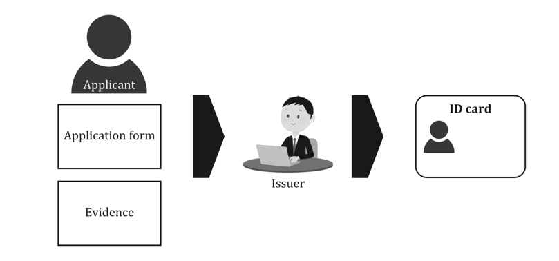
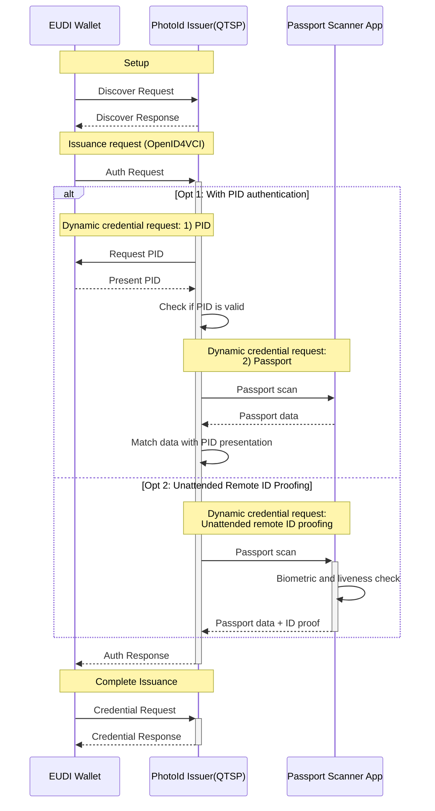

# EWC RFC013: Issuing Photo ID Verifiable Credential - v1.0

**Authors:**

* Matteo Marangoni, SICPA, Spain
* Xavi Vila, SICPA, Spain
* Dimitroglo, Veaceslav, SICPA, Spain

**Reviewers:**

* Mr. Lal Chandran, iGrant.io, Sweden
* Viky Manaila, Intesi Group, Italy

**Status:** pre-approve v1.0

Copyright © 2025 All Rights Reserved  
Published under a Creative Commons Attribution 4.0 International License

---

## **Table of Contents**

1. [Summary](#10-summary)
2. [Motivation](#20-motivation)  
   2.1 [The need of a photo ID](#21-the-need-of-a-photo-id)  
   2.2 [ISO/IEC TS 23220 and Photo ID Issuance Process](#22-isoiec-ts-23220-and-photo-id-issuance-process)  
   2.3 [ETSI TS 119 461 and Identity Proofing Requirements](#23-etsi-ts-119-461-and-identity-proofing-requirements)
3. [Scope](#30-scope)  
   3.1 [Photo ID as an Electronic Attestation of Attributes](#31-photo-id-as-an-electronic-attestation-of-attributes)
4. [Pre-requisites](#40-pre-requisites)  
   4.1 [Photo ID as a EAA](#41-photo-id-as-a-eaa)  
   4.2 [Photo ID as a QEAA](#42-photo-id-as-a-qeaa)
5. [Issuance Flow](#50-issuance-flow)  
   5.1 [Actors](#51-actors)  
   5.2 [Flow Details](#52-flow-details)  
      5.2.1 [Setup Phase](#521-setup-phase)  
      5.2.2 [Credential Issuance Request (OpenID4VCI)](#522-credential-issuance-request-openid4vci)  
      5.2.3 [Dynamic Credential Request](#523-dynamic-credential-request)  
      5.2.4 [Credential Issuance Completion](#525-credential-issuance-completion)
6. [Electronic Attestation Type](#60-electronic-attestation-type)
7. [Schema definition](#70-schema-definition)
8. [References](#80-references)
---

## **1.0 Summary**
This specification defines the implementation of the "Photo ID profile" defined in Annex C of ISO/IEC TS 23220-4, in mdoc and SD-JWT. The attestation issued is derived from an **electronic Machine-Readable Travel Document (eMRTD)** by a Qualified Trust Service Provider (QTSP).

The issuance process includes verifying the identity of the subject using eID means issued with a high Level of Assurance (LoA High), such as a **Personal ID (PID) credential**, or alternatively conducting an unnattended remote identity proofing using identity documents. The issuance follows the **OpenID4VC** framework, ensuring interoperability with **EUDI Wallets**.

### **Key Benefits:**

- **Enhancing digital identity verification** while maintaining strong security and privacy guarantees.
- **Facilitating travel and remote identity proofing**, reducing the need for physical document checks.
- **Complying with international standards** such as **SD-JWT**, and **mDoc (ISO/IEC TS 23220)**.
- **Enabling selective disclosure**, allowing users to share only necessary attributes (e.g., verifying age without revealing full birthdate), enhancing privacy and data minimization.

## 2.0 Motivation

### 2.1 The need of a photo ID

The need for a photo ID arises from the limitations of the current Personal ID (PID) issued within the European Digital Identity Wallet (EUDI Wallet) ecosystem. Specifically, PIDs may not always include a photo, which is a required attribute in certain use cases where biometric verification is necessary or a physical presence of the individual is required. 

Furthermore, some use cases, such as traveling, require specific documentation (e.g., passport) that includes a document number, which is not included in the PID schema. Therefore, a separate photo ID attestation is necessary to fulfill these requirements.

#### 2.1.1 Use cases: registration and communication of information in hospitality and short-term accommodation in Spain (Real Decreto 933/2021)

RD 933/2021 is a national regulation aimed at improving public security by obliging accommodation providers (like hotels, hostels, vacation rentals, and vehicle rentals) to collect and share data on their guests or users with law enforcement authorities.

Real Decreto 933/2021 specifies that for traveller registration, the identification document provided must be an official, recognized form of ID. Accepted documents include:

- Spanish National Identity Document (DNI)
- Passport (for both Spanish citizens and foreigners)
- Residence permits or cards (e.g., NIE or equivalent valid documentation)

### 2.2 ISO/IEC TS 23220 and Photo ID Issuance Process

The ISO/IEC TS 23220 series provides a comprehensive framework for identity management via mobile devices. Specifically, in ISO/IEC TS 23220-2, the standard outlines the data model and encoding rules required for generic eID systems, which forms the foundation for our Photo ID implementation.

Section 5 of ISO/IEC TS 23220-2 describes the identity data collection and confirmation process, highlighting how "ID documents are issued by binding an applicant with a real-life identity." The standard emphasizes that "an issuer collects evidence to verify the attributes provided by the applicant, and this process is called identity proofing." This corresponds directly to the identity verification procedures an issuer will perform when issuing Photo ID attestations.

ISO/IEC TS 23220-2 Figure 1 illustrates the issuing process of an eID document, showing how an applicant provides an application form and evidence (such as ID cards issued by an Authority) to the issuer. The issuer then collects other evidence if needed, proves the applicant's identity, binds that identity with the holder, and confirms the applicant through photo ID or by person of authority.

Furthermore, Section 6 of ISO/IEC TS 23220-2 defines the data model specification that photo ID profile is based on (Section 6.3) which includes the data elements that express attributes for describing a natural person, including crucial elements like family name, given names, date of birth, portrait, and biometric templates.

Finally, Annex C of ISO/IEC TS 23220-4 describes the photo ID profile, including data elements as defined in ISO/IEC 23220-2 and specific ones under the namespace `org.iso.23220.photoid.1` and `org.iso.23220.dtc.1` (see [Schema definition](#70-schema-definition)).

### 2.3 ETSI TS 119 461 and Identity Proofing Requirements

The identity proofing and verification procedures mentioned above are further elaborated and standardized in ETSI TS 119 461, which specifies "policy and security requirements for trust service components providing identity proofing of trust service subjects." This standard is particularly relevant to our implementation as it defines the requirements for identity proofing at two levels: Baseline and Extended Level of Identity Proofing (LoIP).

The Baseline level of assurance is sufficient for use cases where the risk of identity fraud is low, such as online services that require a basic level of identity verification. In contrast, the Extended level of assurance could be required for use cases where the risk of identity fraud is higher, such as online services that require a high level of identity verification, or where the user is requesting access to sensitive information.

Section 9 of ETSI TS 119 461 defines various use cases for identity proofing, including:

* Physical presence (Section 9.2.1)
* Attended remote identity proofing using identity documents (Section 9.2.2)
* Unattended remote identity proofing using identity documents (Section 9.2.3)
* Identity proofing using eID means (Section 9.2.4)
* Identity proofing using digital signature with certificate (Section 9.2.5)

In our implementation, the passport validation step described in Section 4.2.4 of this RFC will follow the unattended remote identity proofing requirements specified in Section 9.2.3 of ETSI TS 119 461. This includes requirements related to automated validation of digital identity documents (VAL-8.3.2 requirements) and binding to applicant by automated face biometrics (BIN-8.4.3 requirements).

By adhering to both the ISO/IEC TS 23220 data model and the ETSI TS 119 461 identity proofing requirements, the Photo ID issuance process ensures a high level of interoperability within the European identity ecosystem.

## 3.0 Scope

We consider 2 possible scenarios when issuing a Photo ID attestation:

1. The **Issuer**, a public sector body that is responsible for the authentic source or a public sector body that is designated by the Member State, directly issues a photo ID credential. This **Issuance Authority** performs the required identity proofing before issuing the attestation to the citizen (this might include remote identity proofing, authentication using PID or in-person verification). This would be the scenario of an Electronic attestation of attributes issued by or on behalf of a public sector body (**PuB-EAA**).

2. **Issuer** requests the required data from the citizen at the moment of issuing the photo ID attestation. In this case the Issuer (e.g. a **QTSP**) performs the required identity verification before issuing the attestation to the citizen. This would be the scenario of a Qualified Electronic Attestation of Attributes (**QEAA**).

In this RFC we will be focusing on the **scenario 2)**.

## 4.0 Pre-requisites

### 4.1 Photo ID as a EAA

For the scope of this RFC we are considering PhotoIDs as QEAAs.

### 4.2 Photo ID as a QEAA

Besides the requirements laid down in Annex V of Regulation (EU) 2024/1183, when issuing a QEAA, the following requirements must be met:

* **Issuer**: QEAA must be issued by a Qualified Trust Service Provider (QTSP).
* **Identity Proofing**: The QTSP must verify the identity of the natural person to whom the QEAA is to be issued.
* **Attribute Verification**: The QTSP must ensure with complete certainty the correctness and accuracy of the attested attributes of the person to whom the QEAA is issued. 

Annex C of the ETSI TS 119 461 specifies requirements for identity proofing targeted explicitly to fulfil requirements of the amended eIDAS regulation for issuing of qualified certificates and qualified electronic attestation of attributes.

In this RFC, 2 identity proofing use cases (of the Annex C.3 - Use cases for issuing of QEAA) are considered:

- ID proofing with PID: Use case for identity proofing by authentication using eID means (C.3.2):

  - Requires Extended LoIP.
  - Requires a notified eID with level **high** (EUDI Wallet with PID).
  - The other attributes would be obtained from the Machine-Readable Travel Document (eMRTD) data, authenticated by the SOD signature.
  - Perform user binding verification by comparing attributes from the PID such as first and last name and date of birth, to those in the identity document.

- ID proofing without PID: Use case for identity proofing by other identification means (C.3.4):

  - Perform an unattended remote identity proofing using a digital identity document (eMRTD).
  - Requires Extended LoIP.
  - The ID proofing process must follow the unattended remote identity proofing requirements specified in Section 9.2.3 of ETSI TS 119 461. This includes requirements related to automated validation of digital identity documents and binding to applicant by automated face biometrics.

## **5.0 Issuance Flow**

The issuance process follows **OpenID4VCI** Authorisation Code flow as described in the [EWC RFC001: Issue Verifiable Credential - v2.0](https://github.com/EWC-consortium/eudi-wallet-rfcs/blob/main/ewc-rfc001-issue-verifiable-credential.md), and extends it by implementing Dynamic Credential Request (OpenID4VCI draft 13), ensuring a standardized method for **credential issuance**.

It follows the OpenID4VC High Assurance Interop profile, where it is recommended that the Credential Issuer and the Wallet MUST support the authorization code flow. So no pre-authorized code flow is used.

### High-level flow diagram.

This diagram provides a high-level overview of the credential issuance process, highlighting the main steps involved.

## 5.1 Actors

| Actor | Description |
|--------|------------|
| **EUDI Wallet** | The user's digital wallet storing credentials. |
| **PhotoID Issuer - QTSP** | A Qualified Trust Service Provider (QTSP) issuing the attestations. |
| **Passport Scanner App** | The app used to scan the user's passport and extract relevant data. |

---

## 5.2 Flow Details

### 5.2.1. Setup Phase
Before any attestations are issued, the **EUDI Wallet (W)** and the **PhotoID Issuer (IS)** establish a connection.

The Wallet and Issuer exchange metadata to establish connection endpoints and cryptographic parameters necessary for secure communication. This typically includes OpenID discovery mechanisms.

### 5.2.2. Credential Issuance Request (OpenID4VCI)

The issuance process starts when the user (UA) scans an OpenID4VCI credential offer QR or clicks on a deeplink.
**Wallet** will invoke **UA (User Agent)** to send Authorisation Request to the **Authorization Server (QTSP ISSUER)**.

After receiving Authorisation Request the **IS (PhotoID Issuer - QTSP)** will start the dynamic credential request to obtain the required data ( PID and Passport) to obtain PhotoID attestation.

Dynamic credential request will consist of two steps, described in the following sections.

### 5.2.3. Dynamic Credential Request – Option A: ID proofing with PID

#### Step 1: User authentication with PID

First steps will use OPENID4VP – as described in [EWC RFC002: Present Verifiable Credentials - v1.0
](https://github.com/EWC-consortium/eudi-wallet-rfcs/blob/main/ewc-rfc002-present-verifiable-credentials.md) to request and verify the user’s PID.

#### Step 2: Passport attributes Validation

After PID validation, the second step of the **Dynamic Credential Request** should trigger a flow to obtain Passport data.

It is out of the scope of this document to describe the details of the passport reading process, but we expect the flow to be close to some OAuth2-based flow.

If using OAuth2 authorization code flow, the user would be redirected to a Passport Reading Service application and prompted to scan their Passport alongside additional biometric checks to ensure the holder of the physical document is managing the application. Finally, the user would grant permission to share Passport data with the issuer.

### 5.2.4. Dynamic Credential Request - Option B: Unattended remote ID Proofing using eMRTD 

This step is analogous to the previous step, but in this case the id proofing process should include the unattended remote identity proofing requirements specified in Section 9.2.3 of ETSI TS 119 461.

### 5.2.5. Credential Issuance Completion

Issuer performs an attribute-based verification to ensure PID data corresponds and matches a subset of the Passport’s claims. 
Once identity is verified, the **attestation is issued and sealed**.

## **6.0 Electronic Attestation Type**
The attestation is issued in one of the follows:
- **SD-JWT format**, as defined in **[`ds013-photo-id.json`](https://github.com/EWC-consortium/eudi-wallet-rulebooks-and-schemas/blob/main/data-schemas/ds013-photo-id.json)**.
- **mDoc format**, as specified in **ISO/IEC TS 23220-4 Annex C (2024-08-14)**.

## **7.0 Schema definition**

### 7.1. ISO 23220 - Photo ID Data model

### Credential Type / DocType for PhotoID

| Format  | attribute | Description |
|---------|------|-------------|
| mDOC    | `DocType` | `eu.europa.ec.eudi.photoid.1` |
| SD-JWT  |    `vct`   | `eu.europa.ec.eudi.photoid.1` |

#### Top-Level Attributes / mDOC namespaces

| SD-JWT Attribute  | mDOC namespace  | Required/Optional | Description |
|------------|-------------------|-----------------|-------------|
| `iso23220` |  org.iso.23220.1  | Required        | ISO/IEC 23220-1 claims |
| `photoid`  | org.iso.23220.photoid.1  | Required        | PhotoId claims |
| `dtc`      | org.iso.23220.dtc.1 | Optional          | DTC |

#### `org.iso.23220.1` data elements

| Attribute | Required/Optional | Description |
|----------|-------------------|-------------|
| `family_name_unicode` | Required | Unicode-encoded family name of the document holder. |
| `given_name_unicode` | Required | Unicode-encoded first name of the document holder. |
| `birth_date` | Required | Date of birth in ISO 8601 format. |
| `portrait` | Required | A portrait image encoded as a Data URI. |
| `issue_date` | Required | Date when the document was issued. |
| `expiry_date` | Required | The date when the document expires. |
| `issuing_authority_unicode` | Required | The authority responsible for issuing the document. |
| `issuing_country` | Required | The country issuing the document. |
| `sex` | Optional | Holder's sex using ISO/IEC 5218. 0=Unknown, 1=Male, 2=Female, 9=Not applicable |
| `nationality` | Optional | Nationality (ISO 3166-1 alpha-2 or alpha-3 code). |
| `document_number` | Optional | Unique number identifying the document. |
| `name_at_birth` | Optional | The name of the individual at birth. |
| `birthplace` | Optional | Place of birth (country and city/state). |
| `portrait_capture_date` | Optional | Date when the portrait was taken. |
| `resident_address_unicode` | Optional | Unicode-encoded resident address. |
| `resident_city_unicode` | Optional | Unicode-encoded city of residence. |
| `resident_postal_code` | Optional | Postal code of the residence. |
| `resident_country` | Optional | Country of residence. |
| `age_over_18` | Required | Indicates if the individual is over 18. |
| `age_in_years` | Optional | The age of the individual in years. |
| `age_birth_year` | Optional | The birth year of the individual. |
| `family_name_latin1` | Optional | Latin1-encoded family name. |
| `given_name_latin1` | Optional | Latin1-encoded given name. |

#### `org.iso.23220.photoid.1` data elements

| Attribute | Required/Optional | Description |
|----------|-------------------|-------------|
| `person_id` | Optional | Unique personal identifier. |
| `birth_country` | Optional | Country where the individual was born. |
| `birth_state` | Optional | State/province where the individual was born. |
| `birth_city` | Optional | City where the individual was born. |
| `administrative_number` | Optional | Audit/control number assigned by issuer. |
| `resident_street` | Optional | Street address of residence. |
| `resident_house_number` | Optional | House number of residence. |
| `travel_document_number` | Optional | Travel document (e.g., passport) number. |
| `resident_state` | Optional | State/province/district of residence. |

#### `org.iso.23220.dtc.1` data elements

| Attribute | Required/Optional | Description |
|----------|-------------------|-------------|
| `dtc_version` | Optional | Version of the DTC definition |
| `dtc_dg1` | Required | Full MRZ data, base64-encoded string |
| `dtc_dg2` | Required | Biometric data (e.g., facial image), base64 |
| `dtc_dg3` | Optional | Binary data for Data Group 3 |
| `dtc_dg4` | Optional | Binary data for Data Group 4 |
| `dtc_dg5` | Optional | Binary data for Data Group 5 |
| `dtc_dg6` | Optional | Binary data for Data Group 6 |
| `dtc_dg7` | Optional | Binary data for Data Group 7 |
| `dtc_dg8` | Optional | Binary data for Data Group 8 |
| `dtc_dg9` | Optional | Binary data for Data Group 9 |
| `dtc_dg10` | Optional | Binary data for Data Group 10 |
| `dtc_dg11` | Optional | Binary data for Data Group 11 |
| `dtc_dg12` | Optional | Binary data for Data Group 12 |
| `dtc_dg13` | Optional | Binary data for Data Group 13 |
| `dtc_dg14` | Optional | Binary data for Data Group 14 |
| `dtc_dg15` | Optional | Binary data for Data Group 15 |
| `dtc_dg16` | Optional | Binary data for Data Group 16 |
| `dtc_sod` | Required | Security Object Document (SOD), base64 |
| `dg_content_info` | Optional | Binary data of DTCContentInfo |

## **8.0 References**
1. **EUDI Wallet JSON Schema**: [`ds013-photo-id.json`](https://github.com/EWC-consortium/eudi-wallet-rulebooks-and-schemas/blob/main/data-schemas/ds013-photo-id.json)
2. [ISO/IEC TS 23220-2]: Data objects and encoding rules for generic eID systems
2. [**ISO/IEC TS 23220-4 (E) Annex C** *(2024-08-14)*: Defines the specific data attributes for Photo ID.
3. **ISO/IEC 18013-5**: Specifies **mobile driving licenses and digital identity display properties**.
4. **OpenID4VCI**: [Draft Specification](https://openid.net/specs/openid-4-verifiable-credential-issuance-1_0.html).
5. [RD 933/2021]: [Real Decreto 933/2021](https://www.boe.es/eli/es/rd/2021/10/26/933), de 26 de octubre, por el que se establecen las obligaciones de registro documental e información de las personas físicas o jurídicas que ejercen actividades de hospedaje y alquiler de vehículos a motor.

