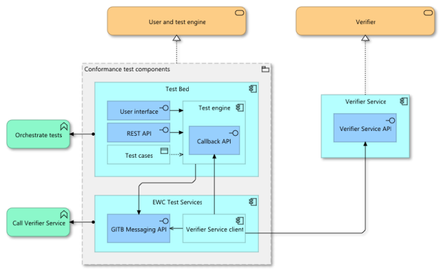

# EWC RFC100: Interoperability Profile Towards ITB - v2.0

**Authors:**

- Dr Nikos Triantafyllou (University of the Aegean, Greece)
- Mr George Padaytti (iGrant.io, Sweden)
- Mr Lal Chandran (iGrant.io, Sweden)

<Please add if you wish to be an author>

**Reviewers:**

- Mr Florin Coptil (Bosch, Germany)
- Mr Matteo Mirabelli (Infocert, Italy)
- Dr Mikael Linden (Vero, Finland)
- Dr Andreas Abraham (ValidatedID, Spain)
- Mr Renaud Murat (Archipels, France)
- Mr Sebastian Bickerle (Lissi ID, Germany)

<Please add your name as a reviewer once you review>

**Status:** Ready for review

**Table of Contents**

- [EWC RFC100: Interoperability Profile Towards ITB - v2.0](#ewc-rfc100-interoperability-profile-towards-itb---v20)
- [1.0 Summary](#10-summary)
  - [1.1 Background](#11-background)
  - [1.2 Introduction to ITB](#12-introduction-to-itb)
- [2.0 Motivation](#20-motivation)
- [3.0 Holder Wallet Conformance](#30-holder-wallet-conformance)
  - [3.1 Steps to Conformance](#31-steps-to-conformance)
  - [3.2 Interoperable Profile](#32-interoperable-profile)
- [4.0 Issuer Conformance](#40-issuer-conformance)
  - [4.1 Steps to Conformance](#41-steps-to-conformance)
  - [4.2 Interoperable Profile](#42-interoperable-profile)
- [5.0 Verifier Conformance](#50-verifier-conformance)
  - [5.1 Steps to Conformance](#51-steps-to-conformance)
  - [5.2 Interoperable Profile](#52-interoperable-profile)
- [6.0 Implementers](#60-implementers)
- [7.0 RFC v2.0 Compliance Details](#70-rfc-v20-compliance-details)
- [8.0 Reference](#80-reference)


# 1.0 Summary

## 1.1 Background

This specification describes the actions required by the EWC Holder Wallet Providers, Issuers and Verifiers to perform to validate their implementations against the EWC Reference Model [1]. This ensures that the entities mentioned above are interoperable with each other at a technical level and can be used to pilot the EWC use cases.

## 1.2 Introduction to ITB

The EWC parties' implementation is validated via the EC Interoperability TestBed (ITB) platform. The Interoperability TestBed is an open-source platform developed by the EC [2] for self-service conformance testing against semantic and technical specifications. The ITB is deployed to implement the EWC Operational Testing Environment, offering a mature and streamlined testing solution. Using this EWC Operational Testing Environment:

1. **Holder Wallet Providers** can validate their solutions versus the EWC's latest technical specifications (defined in this document) by executing conformance testing against certified EWC Issuers and Verifiers.
2. **Issuers** can expose their services for testing by the various Holder Wallet providers. Once an EWC conformant wallet successfully tests an Issuer service, the Issuer is considered conformant as well according to the EWC adopted specifications
3. **Verifiers** can likewise expose their services for testing by the various Holder Wallet providers. Verifier conformance follows the same criteria as the Issuers.
4. **Different LSP** Relying Parties and Wallet Providers can test their solutions for interoperability with EWC with respect to the EWC-adopted specifications

For a service (e.g. Issuer or Verifier) to become exposed over the EWC Operational Testing Environment, the following steps need to be followed (these steps are explained in detail in the subsequent sections):

1. **Expose a Service Rest API:** This API must be public and expose only the service's core functionality, abstracting away any service business logic specificities, so that it can be used in isolation. In other words, this REST API aims to enable testing concerning the implementation of the EUDI wallet protocols, data models, and trust frameworks. It should not be used to verify the full functional flows of the service.
2. **Build and deploy an ITB Service Client:** An ITB Service Client is a specific service built to broker the interaction of the ITB test engine with the Service under test. The Service Client consumes the REST API (exposed by the Relying Part - RP) and integrates with a Messaging API Service capable of communicating with the ITB Test engine using a predefined protocol.
3. **Test Case deployment and user roles:** The test cases implemented by the ITB service need to be defined using the [GITB Test Description Language](https://www.itb.ec.europa.eu/docs/tdl/latest/) after being defined as “a test script”, these test cases are deployed to the ITB test engine via a secure REST API.
4. **User creation:** Generate the necessary user accounts to execute the tests. The ITB instance administrator must define the required organisations as entities inside the ITB service and issue them appropriate user credentials depending on their roles:

   - **Administrators**: ITB admins
   - **Users**: Wallet providers and/or LSP Service providers

   Using these credentials, the end user will be able to login to the ITB platform and, depending on their role, execute (some) of the following actions:

   - Receive reports about the executions on their test cases (EUDI Service operator)
   - Execute a test case for one of the available test suites (EUDI Wallet provider, LSP Service provider, EUDI Service operator)



Figure 1. ITB Service Integration Architecture

# 2.0 Motivation

The EWC LSP must align with standard protocols for issuing and verifying credentials. This is the basis of interoperability between **Issuers**, **Relying Parties (RPs)** (Verifiers) and **Holders** across the EWC LSPs. The assumption is that the user is familiar with the EWC-chosen protocols and standards and can refer to original standards references when necessary.

# 3.0 Holder Wallet Conformance

## 3.1 Steps to Conformance

EWC wallets will implement the EWC RFCs for OIDC4VC [3][4] two “official” EWC testing RP services: An Issuer and a Verifier. These services are integrated into the EWC Operational Testing environment as a test suite.

To check the conformance of a Holder wallet solution as a wallet provider, the following steps must be followed:

- Become onboarded to the EWC Operational Testing environment by being provisioned with an ITB account

- Login to the EWC Operational Testing environment instance ([https://dss.aegean.gr/itb](https://dss.aegean.gr/itb))

- Navigate to the test suite “**EWC RFC v2 | RFC v2 test suite for OIDC4VCI v13 and OIDC4VP v20**”
  


- Execute the test cases:

  - Issuing test case
  - Verification test case

- Communicate the test results with WP4 stakeholders (email: [triantafyllou.ni@aegean.gr](mailto:triantafyllou.ni@aegean.gr), [esther.makaay@signicat.com](mailto:esther.makaay@signicat.com), [lal@igrant.io](mailto:lal@igrant.io)). The result of a test execution can be downloaded either as a PDF file [5] or an XML document [6].

The Issuing test case issues to the Holder Wallet a credential containing mock PID data following [3] and MUST be executed first.

The Verification test case generates a request for the credential mentioned above following [4] and MUST be executed second.

The messages sent from the Issuer and Verifier back to the Holder Wallet follow the specifications [3][4].

## 3.2 Interoperable Profile

For a Holder Wallet to conform to the EWC Operational Testing Environment, the following RFCs MUST be followed [3] [4].

Additionally, for Phase 2, support for sd-jwt is mandatory.

# 4.0 Issuer Conformance

## 4.1 Steps to Conformance

For an Issuer service to become integrated for testing with the EWC Operational Testing Environment, the following steps MUST be followed:

1. Onboard the EWC Operational Testing Environment by communicating with WP4 stakeholders (email: [triantafyllou.ni@aegean.gr](mailto:triantafyllou.ni@aegean.gr), [esther.makaay@signicat.com](mailto:esther.makaay@signicat.com), [lal@igrant.io](mailto:lal@igrant.io))

2. Define based on the piloting requirements the credential issuing use cases from this service using the following template: [https://docs.google.com/document/d/1nZ5Fv-Vtj8xlr9fZSzxSQ-6xs5mU7ZaCxvbmnhaN2Tc/edit?usp=sharing](https://docs.google.com/document/d/1nZ5Fv-Vtj8xlr9fZSzxSQ-6xs5mU7ZaCxvbmnhaN2Tc/edit?usp=sharing)

3. Expose a REST endpoint for requesting the creation of a Credential Offer. This should be a GET endpoint as follows:

```sh
Request:
curl -X 'GET' \
'https://issuer-service.com/credentialIssuanceRequest?sessionId=123&credentialType=myCredential' \
 -H 'accept: application/json'

Response:
HTTP/1.1 200 OK
Content-Type: application/json
{
  "qr": "data:image/PNG;base64,iVBORw0KGgoAAAA...",
  "sessionId": "123"
}

Error Response:
HTTP/1.1 500 Internal Server Error
Content-Type: application/json
{
  "status": "fail",
  "reason": "credential type not supported",
  "sessionId": "123"
}
```

    Where [https://issuer-service.com/credentialIssuanceRequest](https://issuer-service.com/credentialIssuanceRequest) denotes the Issuer exposed endpoint, **sessionId** denotes a unique session ID generated by the Issuer Service. The Issuer MUST keep track of this sessionId and notify via a second endpoint the progress of the issuance flow based on it. Finally, **credentialType** is a string identifier denoting the credential type the Issuer can issue based on the piloting requirements of this service, such that when the appropriate value is passed, the Issuer will generate the corresponding Credential Offer. Furthermore, the Issuer service MUST respond with a JSON object containing the fields:

    * **qr**: Base64 encoded value of the image resulting from encoding as a QR code the Credential Issue request (as that is defined in RFC [3])

    * **sessionId**: the aforementioned sessionId

4. Expose a REST endpoint for polling the status of the Issuance process. The ITB service will query this endpoint every 10 seconds and will stop after 1 minute (in which case a timeout occurs and the issuance process is considered failed). Specifically, this status endpoint MUST operate as follows:

```sh
Request:
curl -X 'GET' \
'https://issuer-service.com/issueStatus?sessionId=123' \
  -H 'accept: application/json'

Response:
HTTP/1.1 200 OK
Content-Type: application/json
{
  "status": "pending",
  "reason": "ok",
  "sessionId": "123"
}

Response:
HTTP/1.1 200 OK
Content-Type: application/json
{
  "status": "success",
  "reason": "ok",
  "sessionId": "123"
}

Error Response:
HTTP/1.1 500 Internal Server Error
Content-Type: application/json
{
  "status": "fail",
  "reason": "no issuance session found",
  "sessionId": "123"
}
```

Where [https://issuer-service.com/issueStatus](https://issuer-service.com/issueStatus) denotes the Issuer polling endpoint and **sessionId** denotes a specific testing session that the ITB queries the status of. The issuer MUST verify the issuance process based on this sessionId ensuring its correlation with the issuance requests made in the credential offer endpoint using the same ID. Furthermore, the Issuer service MUST respond with a JSON object containing the fields:

- **status**: a string representing the status of the issuance enumerating over the values “pending”, “ok”, “failed”.
- **reason**: a string denoting the reasons for the failure of the issuance (if any, ok in success cases).
- **sessionId**: the aforementioned sessionId

The WP4 team will handle the integration of these endpoints into the EWC Operational testing environment. The only responsibility of the Issuer is to build the endpoints mentioned above, document them in the provided template and share the filled-in template with the UAegean team ([triantafyllou.ni@aegean.gr](triantafyllou.ni@aegean.gr) or [esther.makaay@signicat.com](esther.makaay@signicat.com), [lal@igrant.io](lal@igrant.io)).

## 4.2 Interoperable Profile

The Issuer service MUST follow the EWC RFC [3] in its implementation.

# 5.0 Verifier Conformance

## 5.1 Steps to Conformance

For a Verifier service to become integrated for testing with the EWC Operational Testing Environment, the following steps MUST be followed:

1. Onboard the EWC Operational Testing Environment by communicating with WP4 stakeholders (email: [triantafyllou.ni@aegean.gr](mailto:triantafyllou.ni@aegean.gr), [esther.makaay@signicat.com](mailto:esther.makaay@signicat.com), [lal@igrant.io](mailto:lal@igrant.io))
2. Define based on the piloting requirements the credential verification use cases from this service using the following template: [https://docs.google.com/document/d/1nZ5Fv-Vtj8xlr9fZSzxSQ-6xs5mU7ZaCxvbmnhaN2Tc/edit?usp=sharing](https://docs.google.com/document/d/1nZ5Fv-Vtj8xlr9fZSzxSQ-6xs5mU7ZaCxvbmnhaN2Tc/edit?usp=sharing)
3. Expose a REST endpoint for requesting the creation of a VP request. This should be a GET endpoint as follows:

   Where [https://verifier-service.com/](https://issuer-service.com/credentialIssuanceRequest) denotes the Verifier service exposed endpoint, and **sessionId** denotes a unique session ID generated by the Verifier Service. The Issuer MUST keep track of this sessionId and notify via a polling endpoint the status of the presentation flow.

   The **credentialType** is a string identifier denoting the credential type(s) the Verifier Service is requesting the presentation of based on the piloting requirements of this service, such that when the appropriate value is passed, the Verifier will generate the corresponding VP request. Suppose selective disclosure is required in a test case. In that case, the credentialType should denote the requested attestations and credentials in such a way that is meaningful to the verifier to generate the appropriate VP request. However, the definition of these credentialType strings and their semantics are the sole responsibility of the Verifier service onboarding the Operational Testing Environment. As a result, their definition is outside the scope of this specification.

   Finally, the verifier service MUST respond with a JSON object containing the fields:

   - **qr**: Base64 encoded value of the image resulting from encoding as a QR code the VP request (as that is defined in RFC [4])
   - **sessionId**: the aforementioned sessionId

4. Expose a REST endpoint for polling the status of the Verification process. The ITB service will query this endpoint every 10 seconds and will stop after 1 minute (in which case a timeout occurs and the verification process is considered failed). Specifically, this status endpoint MUST operate as follows:

```sh
Request:
curl -X 'GET' \
'https://verifier-service.com/validationStatus?sessionId=123' \
  -H 'accept: application/json'

Response:
HTTP/1.1 200 OK
Content-Type: application/json
{
  "status": "pending",
  "reason": "ok",
  "sessionId": "123",
  "attributes": ""
}

Response:
HTTP/1.1 200 OK
Content-Type: application/json
{
  "status": "success",
  "reason": "ok",
  "sessionId": "123",
  "attributes": {"name":"test1","surname":"test2"}
}

Error Response:
HTTP/1.1 500 Internal Server Error
Content-Type: application/json
{
  "status": "fail",
  "reason": "no verification session found",
  "sessionId": "123",
  "attributes": ""
}
```

Where [https://verifier-service.com/validationStatus](https://verifier-service.com/validationStatus) denotes the verifier polling endpoint and **sessionId** denotes a specific testing session that the ITB queries the status of. The Verifier MUST validate the verification process based on this sessionId, ensuring its correlation with any pre-existing presentation requests under the same ID. Furthermore, the Verifier service MUST respond with a JSON object containing fields:

- **status:** a string representing the status of the issuance enumerating over the values “pending”, “ok”, and “failed”.
- **reason:** a string denoting the reasons for the failure of the verification (if any, ok in success cases).
- **sessionId:** the aforementioned sessionId
- **attributes:** JSON containing the attributes successfully disclosed from the Wallet to the Verifier service

The WP4 team will handle the integration of these endpoints into the EWC Operational testing environment. The only responsibility of the Verifier is to build the endpoints mentioned above, document them in the provided template and share the filled-in template with the UAegean team ([triantafyllou.ni@aegean.gr](triantafyllou.ni@aegean.gr) or [esther.makaay@signicat.com](esther.makaay@signicat.com), [lal@igrant.io](lal@igrant.io).

## 5.2 Interoperable Profile

The Verifier service MUST follow the EWC RFC [4] in its implementation.

# 6.0 Implementers

Please refer to the [implementers table](https://github.com/EWC-consortium/eudi-wallet-rfcs?tab=readme-ov-file#implementers).

# 7.0 RFC v2.0 Compliance Details

In order to ensure interoperability across the phase 2 piloting in EWC the implementers (Holder Wallet, Issuers and Verifiers)
must support the following RFCs :

1. [EWC RFC 001: Issue Verifiable Credential - v2.0](https://github.com/EWC-consortium/eudi-wallet-rfcs/blob/main/ewc-rfc001-issue-verifiable-credential.md)
2. [EWC RFC002: Present Verifiable Credentials - v2.0](https://github.com/EWC-consortium/eudi-wallet-rfcs/blob/main/ewc-rfc002-present-verifiable-credentials.md)

Furthermore, for EWC Phase 2.0 piloting support for:
1. [Selective Disclosure - JSON Web Token Verifiable Credential	dc+sd-jwt](https://datatracker.ietf.org/doc/html/draft-ietf-oauth-sd-jwt-vc-01)
2. [Selective Disclosure - JSON Web Token Verifiable Presentation	vp+sd-jwt](https://datatracker.ietf.org/doc/html/draft-ietf-oauth-sd-jwt-vc-01)

is mandatory. 

**Holder Wallet** providers, MUST login to the ITB and successfully pass the tests in the RFCv2.0 test suite.
**Relying Parties** (Issuers/Verifiers) MUST integrate with the ITB (as described in this document) and validate their flows with 
and EWC RFC v2.0 Compliant Holder Wallet. 


# 8.0 Reference

1. EWC Technological Focus: [https://github.com/EWC-consortium/ewc-wiki/wiki/Focus](https://github.com/EWC-consortium/ewc-wiki/wiki/Focus)

2. European Commission’s DIGIT Interoperability Testbed [https://joinup.ec.europa.eu/collection/interoperability-test-bed-repository/solution/interoperability-test-bed](https://joinup.ec.europa.eu/collection/interoperability-test-bed-repository/solution/interoperability-test-bed)

3. EWC RFC 001: Issue Verifiable Credential - v2.0 [https://github.com/EWC-consortium/eudi-wallet-rfcs/blob/main/ewc-rfc001-issue-verifiable-credential.md](https://github.com/EWC-consortium/eudi-wallet-rfcs/blob/main/ewc-rfc001-issue-verifiable-credential.md)

4. EWC RFC002: Present Verifiable Credentials - v2.0 [https://github.com/EWC-consortium/eudi-wallet-rfcs/blob/main/ewc-rfc002-present-verifiable-credentials.md](https://github.com/EWC-consortium/eudi-wallet-rfcs/blob/main/ewc-rfc002-present-verifiable-credentials.md)

5. ITB [PDF report](docs/itb_report.pdf)
6. ITB [XML report](docs/itb_repoort.xml)
