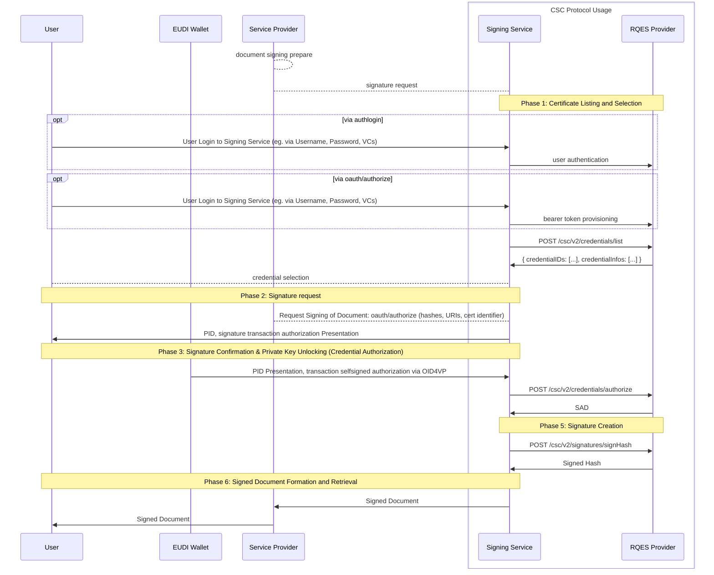

```mermaid
   sequenceDiagram
    participant User
    participant EUDI Wallet
    participant Service Provider
    box CSC Protocol Usage
    participant Signing Service 
    participant RQES Provider
    end

    Service Provider-->Service Provider: document signing prepare
    Service Provider-->Signing Service: signature request
    
    Note over Signing Service, RQES Provider: Phase 1: Certificate Listing and Selection
    opt via authlogin
    User->>Signing Service: User Login to Signing Service (eg. via Username, Password, VCs)
    Signing Service->>RQES Provider: user authentication 
    end 
    
    opt via oauth/authorize
    User->>Signing Service: User Login to Signing Service (eg. via Username, Password, VCs)
    Signing Service->>RQES Provider: bearer token provisioning
    end 
    
    Signing Service->>RQES Provider: POST /csc/v2/credentials/list
    RQES Provider->>Signing Service: { credentialIDs: [...], credentialInfos: [...] }
    User-->Signing Service: credential selection

    Note over User, Signing Service: Phase 2: Signature request
    Service Provider-->Signing Service: Request Signing of Document: oauth/authorize (hashes, URIs, cert identifier)
    Signing Service->>User: PID, signature transaction authorization Presentation
    
    Note over User, Signing Service: Phase 3: Signature Confirmation & Private Key Unlocking (Credential Authorization)
    EUDI Wallet->>Signing Service: PID Presentation, transaction selfsigned authorization via OID4VP
    
    
    
    
    
    Signing Service->>RQES Provider: POST /csc/v2/credentials/authorize
    RQES Provider->>Signing Service: SAD
    
    Note over Signing Service, RQES Provider: Phase 5: Signature Creation
    Signing Service->>RQES Provider: POST /csc/v2/signatures/signHash
    RQES Provider->>Signing Service: Signed Hash

    Note over User, Signing Service: Phase 6: Signed Document Formation and Retrieval
    Signing Service->>Service Provider: Signed Document
    Service Provider->>User: Signed Document
```
