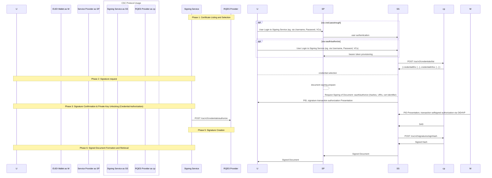

```mermaid
   sequenceDiagram
    participant User as U
    participant EUDI Wallet as W
    participant Service Provider as SP
    box CSC Protocol Usage
    participant Signing Service as SS
    participant RQES Provider as cp
    end

    Note over Signing Service, RQES Provider: Phase 1: Certificate Listing and Selection

    opt via cred passtrough
    U->>SP: User Login to Signing Service (eg. via Username, Password, VCs)
    SP->>SS: user authentication 
    end 
    
    opt via oauth/authorize
    U->>SS: User Login to Signing Service (eg. via Username, Password, VCs)
    SS->>SP: bearer token provisioning
    end 
    
    SS->>cp: POST /csc/v2/credentials/list
    cp->>SS: { credentialIDs: [...], credentialInfos: [...] }
    U-->SS: credential selection

    Note over User, Signing Service: Phase 2: Signature request
    SP-->SP: document signing prepare
    SP-->SS: Request Signing of Document: oauth/authorize (hashes, URIs, cert identifier)
    SS->>U: PID, signature transaction authorization Presentation
    
    Note over User, Signing Service: Phase 3: Signature Confirmation & Private Key Unlocking (Credential Authorization)
    W->>SS: PID Presentation, transaction selfsigned authorization via OID4VP
    
    
    
    
    
    Signing Service->>RQES Provider: POST /csc/v2/credentials/authorize
    cp->>SS: SAD
    
    Note over Signing Service, RQES Provider: Phase 5: Signature Creation
    SS->>cp: POST /csc/v2/signatures/signHash
    cp->>SS: Signed Hash

    Note over User, Signing Service: Phase 6: Signed Document Formation and Retrieval
    SS->>SP: Signed Document
    SP->>U: Signed Document
```
