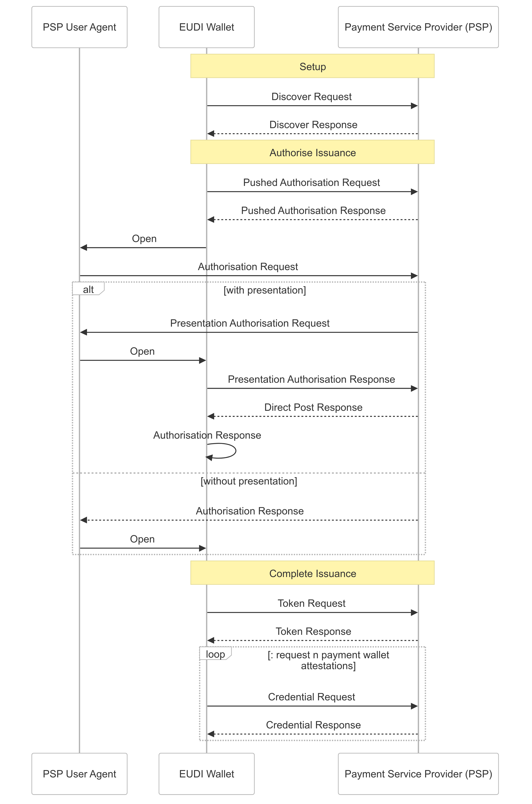
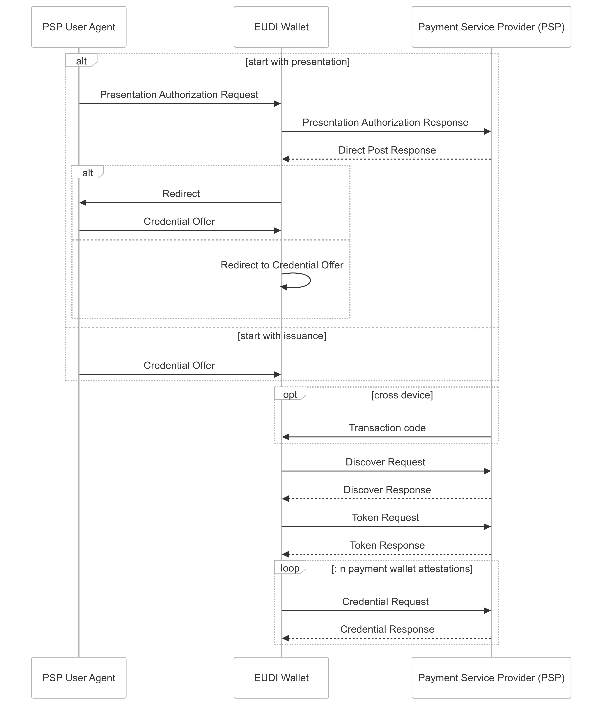
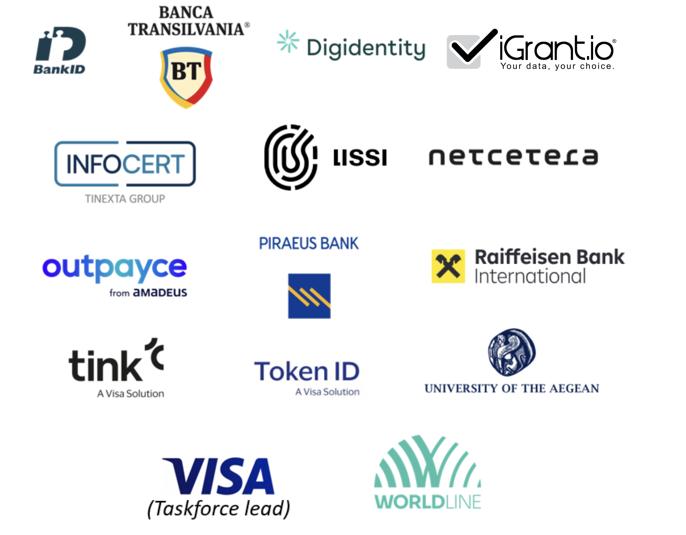

# EWC RFC007: Payment Wallet Attestation - v1.0

**Authors:** 
* Lal Chandran, iGrant.io, Sweden
* George Padayatti, iGrant.io, Sweden
* Sebastian Bickerle, Lissi GmbH, Germany
* Edward Curran, Lissi GmbH, Germany
* Ranjiva Prasad, Visa Europe, UK
* Stefan Kauhaus, Visa Europe, Germany

**Reviewers:**
* Marie Austenaa, Visa Europe, UK
* Laurent Bailly, Visa Europe, France

**Status:** Approved, 22-Oct-2024

Copyright © 2024 All Rights Reserved
Published under a Creative Commons Attribution 4.0 International License

**Table of Contents**
- [EWC RFC007: Payment Wallet Attestation - v1.0](#ewc-rfc007-payment-wallet-attestation---v10)
- [1.0	Summary](#10summary)
- [2.0	Motivation](#20motivation)
- [3.0	Pre-requisites](#30pre-requisites)
- [4.0	Wallet initiated](#40wallet-initiated)
  - [4.1  Credential offer](#41--credential-offer)
  - [4.2	Credential offer response](#42credential-offer-response)
  - [4.3	Discover response](#43discover-response)
  - [4.4	Authorisation request (using PAR)](#44authorisation-request-using-par)
  - [4.5 Opt: Presentation authorisation request](#45-opt-presentation-authorisation-request)
  - [4.6 Opt: Presentation Authorisation Response](#46-opt-presentation-authorisation-response)
  - [4.7 Opt: Direct post response](#47-opt-direct-post-response)
  - [4.8	Authorisation  response](#48authorisation--response)
  - [4.9	Token request](#49token-request)
  - [4.10 Token response](#410-token-response)
  - [4.11	Credential request](#411credential-request)
  - [4.12 Credential response](#412-credential-response)
- [5.0   PSP initiated](#50---psp-initiated)
  - [5.1 Presentation authorization request](#51-presentation-authorization-request)
  - [5.2 Presentation authorization response](#52-presentation-authorization-response)
  - [5.3 Direct Post response](#53-direct-post-response)
  - [5.4 Credential offer](#54-credential-offer)
  - [5.5 Transaction code](#55-transaction-code)
  - [5.6 Discover request and response](#56-discover-request-and-response)
  - [5.7 Token request and response](#57-token-request-and-response)
  - [5.8 Credential request and response](#58-credential-request-and-response)
- [6.0	Alternate response format](#60alternate-response-format)
- [7.0 Verifiable credential type](#70-verifiable-credential-type)
- [8.0	Schema definitions - Payment Wallet Attestation](#80schema-definitions---payment-wallet-attestation)
- [9.0	Reference](#90reference)
- [Appendix: EWC Payment Taskforce](#appendix-ewc-payment-taskforce)


# 1.0	Summary

This specification implements payment wallet attestation and is based on SCA for online payments using the EUDI Wallet Implementation Guide [1], which was developed collectively by the EWC Payment Task Force, led by Visa Europe [1].

As per payments standards (PSD2), before an EUDI Wallet instance can perform SCA during a transaction, it must be registered with the User’s  Payment Service Provider (PSP). This is also required as per eiDAS2 regulation [2].

# 2.0	Motivation

The EWC Large Scale Pilot (LSP) must meet payment standards, protocols, and EUDI wallet requirements. The user is assumed to be familiar with the EWC-chosen protocols and standards and can refer to original standards references when necessary.

# 3.0	Pre-requisites

The following are the pre-requisites for this RFC:

1. The individual wallet instance supports attestation based on RFC004 or its subsequent versions. It must support device-bound keys to bind the payment wallet attestation to a key that enables it to act as a possession factor for  SCA. E.g. bound to mobile, tablet, or security token.

2. The EUDI Wallet solution must have been certified by an accredited public or private body designated by a Member State, added to a Trusted List, and have a “valid” status (i.e., it cannot have a suspended status).

3. The EUDI wallet user has an account with the PSP that can be used to authenticate during a payment wallet attestation process.

4. For the PSP Initiated Flow, the EUDI wallet user logged into the PSP portal before initiating the flow.

5. The wallet provider has a list of available PSPs for the Wallet Initiated Flow. For each PSP, a URL is known that can be used to derive the opened-credential-issuer and oauth-authorization-server endpoints. Before the flow is initiated, the user has selected a PSP.

# 4.0	Wallet initiated


*Figure 1: PSP Issues Payment Wallet Attestation to Individual*

Source code for the diagram:

```
sequenceDiagram
    participant UA as PSP User Agent
    participant W as EUDI Wallet
    participant O as Payment Service Provider (PSP)

    Note over W,O: Setup

    W->>O: Discover Request
    O-->>W: Discover Response

   
    Note over W,O: Authorise Issuance
    W->>O: Pushed Authorisation Request
    O-->>W: Pushed Authorisation Response 
    W->>UA: Open
    UA->>O: Authorisation Request
    alt with presentation
        O->>UA: Presentation Authorisation Request 
        UA->>W: Open
        W->>O: Presentation Authorisation Response
        O-->>W: Direct Post Response
        W->>W: Authorisation Response
    else without presentation
        O-->>UA: Authorisation Response
        UA->>W: Open
    end

    Note over W,O: Complete Issuance

    W->>O: Token Request
    O-->>W: Token Response
   
    loop: request n payment wallet attestations
    W->>O: Credential Request
    O-->>W: Credential Response
    end
```

## 4.1  Credential offer

This step will follow the [RFC001 Chapter 3.1](https://github.com/EWC-consortium/eudi-wallet-rfcs/blob/main/ewc-rfc001-issue-verifiable-credential.md#31credential-offer).

## 4.2	Credential offer response

This step will follow the [RFC001 Chapter 3.2](https://github.com/EWC-consortium/eudi-wallet-rfcs/blob/main/ewc-rfc001-issue-verifiable-credential.md#32credential-offer-response). The holder wallet obtains the issuance parameters by scanning a QR code for cross-device workflows or via a deeplink for same-device workflows. 4.3	Discover request

The holder's wallet initiates a request to discover the payment service provider’s authorisation server configurations, which are essential for payment wallet attestation.

To obtain the issuer's configurations, the wallet resolves the `/.well-known/openid-credential-issuer` endpoint using the credential_issuer URI found in the credential offer response (as per EWC RFC001):

```
GET https://identity-provider.gov/.well-known/openid-credential-issuer
```

Subsequently, the wallet requests the `/.well-known/oauth-authorization-server` endpoint to retrieve the authorization server metadata:

```
GET https://identity-provider.gov/.well-known/oauth-authorization-server
```
## 4.3	Discover response

Upon resolving the `.well-known` endpoints, the PSP responds with its configuration, tailored to support payment wallet attestation credential issuance. The response includes details about supported credentials endpoints for issuing and managing credentials. It also specifies the cryptographic methods and trust frameworks applicable for payment wallet attestation credentials, as per [4]. This discovery response, as defined in Chapter 3.4 of RFC 001 [2], also delineates the Verifiable Credential Type and Credential Definition, detailed further in Chapter 6 and Chapter 7 respectively.

## 4.4	Authorisation request (using PAR)

The authorisation request must be made using a [Pushed Authorization Request](https://datatracker.ietf.org/doc/html/rfc9126). This means that:

1. First, the authorization request content is pushed to a Pushed Authorization Endpoint by the wallet. This will return a `request_uri`.

2. Next, the actual authorization request is made by, this request will include the `request_uri` from the previous step as a parameter.

The content of the authorization request to be pushed is defined in [RFC001](https://github.com/EWC-consortium/eudi-wallet-rfcs/blob/main/ewc-rfc001-issue-verifiable-credential.md#35-authorisation-request). Note that this will be sent in the body of the Pushed Authorization Request, using the `application/x-www-form-urlencoded` format. Not as parameters in the authorization request.

## 4.5 Opt: Presentation authorisation request

The PSP may use a verifiable presentation during authorisation for the issuance. In [OpenID 4 Verifiable Credential Issuance,](https://openid.net/specs/openid-4-verifiable-credential-issuance-1_0.html#name-binding-the-issued-credenti) this is known as a dynamic credential request. In the context of payment wallet attestation, it may be useful to authenticate the wallet holder.

Steps 4.5, 4.6, and 4.7 describe how a presentation can be used to conclude the authorisation. Completing the presentation leads directly to the continuation of the issuance without the user having to leave the wallet. It is possible to perform any desired authentication method (e.g., a login form) before the presentation is initiated, or the presentation can be skipped entirely by proceeding directly to 4.8.

The presentation request should follow [RFC 002 Chapter 3.1](https://github.com/EWC-consortium/eudi-wallet-rfcs/blob/main/ewc-rfc002-present-verifiable-credentials.md#31authorisation-request); the PSP can request any credentials they want here using a presentation definition. To perform wallet *holder *authentication, the PSP may later require that the issued payment wallet attestation is bound to the same key as one used by the holder during the presentation. For example, the PSP might request a PID and require that the payment wallet attestation is bound to the same key as the presented PID.

## 4.6 Opt: Presentation Authorisation Response

The presentation response should follow [RFC 002 Chapter 3.2](https://github.com/EWC-consortium/eudi-wallet-rfcs/blob/main/ewc-rfc002-present-verifiable-credentials.md#32authorisation-response)

## 4.7 Opt: Direct post response

If the presentation was completed successfully, the PSP could proceed with the issuance by returning a response containing a redirect_uri where the URI is an authorisation response. The wallet should redirect itself to this URI and continue with the issuance flow from 4.9.

```json
{
 "redirect_uri": "https://wallet.example.org/cb?code=SplxlOBeZQQYbYS6WxSbIA"
}
```

To abort the issuance, the PSP should respond with an error response. The response should include the error and error_description query parameters appended to the redirect_uri and return a status code of 400. An example of the error response is given below:

```json
{
  "redirect_uri": "https://wallet.example.org/cb?error=access_denied&error_description=The+authorization+server+denied+the+request"
}
```

## 4.8	Authorisation  response

A redirect to the redirect URI with a code query parameter containing the short-lived authorisation code. 

```
HTTP/1.1 302 Found
Location: https://wallet.example.org/cb?code=SplxlOBeZQQYbYS6WxSbIA
```

**Note:** The above can be deeplinked to the EUDI wallet as well. 

## 4.9	Token request

This step will follow the [RFC001 Chapter 3.7.1 Authorization code flow](https://github.com/EWC-consortium/eudi-wallet-rfcs/blob/main/ewc-rfc001-issue-verifiable-credential.md#372-pre-authorised-code-flow) [using RFC004 Individual Wallet Attestation (Chapter 3.1.2)](https://www.ietf.org/archive/id/draft-ietf-oauth-attestation-based-client-auth-02.html#name-client-authentication).

## 4.10 Token response

This step will follow the [RFC001 Chapter 3.8](https://github.com/EWC-consortium/eudi-wallet-rfcs/blob/main/ewc-rfc001-issue-verifiable-credential.md#38-token-response). The returned token should allow the user to be issued payment wallet attestations for all the accounts that they selected prior to this flow being initiated. The authorization_details parameter must be present in the token response body, it must contain an entry for the payment wallet attestation credential configuration, which includes credential_identifers, one for each desired payment wallet attestation. An example of the returned authorization details is provided below:

```json
[
  {
    "type": "openid_credential",
    "credential_configuration_id": "PaymentWalletAttestation",
    "credential_identifiers": [
      "PaymentWalletAttestationAccountA",
      "PaymentWalletAttestationAccountB"
    ]
  }
]
```

## 4.11	Credential request

This step will follow the [RFC001 Chapter 3.9](https://github.com/EWC-consortium/eudi-wallet-rfcs/blob/main/ewc-rfc001-issue-verifiable-credential.md#39-credential-request) using an in-time response, and using the `credential_identifier` parameter. The credential identifier values are obtained from the token response in 4.10. The wallet should make as many credential requests as needed to issue all the desired payment wallet attestations.

For each credential, proof of possession of the `cnf` key used in the wallet attestation (from 4.4 and 4.9) must be included. Optionally, the key may also be required to be the same as one discovered during the presentation (if performed) so that the presentation can be used for wallet holder authentication.

## 4.12 Credential response

This step will follow the [RFC001 Chapter 3.10](https://github.com/EWC-consortium/eudi-wallet-rfcs/blob/main/ewc-rfc001-issue-verifiable-credential.md#310-credential-response).

# 5.0   PSP initiated

In a PSP-initiated flow, the user starts in the PSP frontend, which they interact with using the “PSP User Agent.” The user is assumed to have selected the accounts for which they want to receive payment wallet attestations and to be either already authorized or required to present credentials for the attestations to be issued. The Pre-Authorized Code Flow is used for issuance.


*Figure 2: PSP Initiated Payment Wallet Attestation to Individual*
```
sequenceDiagram
    participant UA as PSP User Agent
    participant W as EUDI Wallet
    participant O as Payment Service Provider (PSP)

    alt start with presentation
        UA->>W: Presentation Authorization Request
        W->>O: Presentation Authorization Response
        O-->>W: Direct Post Response
        alt
            W->>UA:Redirect
            UA->>W:  Credential Offer
        else
            W->>W: Redirect to Credential Offer
        end

    else start with issuance
        UA->>W:  Credential Offer
    end
    opt cross device
        O->>W:  Transaction code 
    end
    
    W->>O: Discover Request
    O-->>W: Discover Response

    W->>O: Token Request
    O-->>W: Token Response

    loop: n payment wallet attestations
    W->>O: Credential Request
    O-->>W: Credential Response
    end
```

## 5.1 Presentation authorization request

As described in [RFC002 3.1](https://github.com/EWC-consortium/eudi-wallet-rfcs/blob/main/ewc-rfc002-present-verifiable-credentials.md).

## 5.2 Presentation authorization response

As described in [RFC002 3.2](https://github.com/EWC-consortium/eudi-wallet-rfcs/blob/main/ewc-rfc002-present-verifiable-credentials.md).

## 5.3 Direct Post response

The direct post response follows the format described in [OID4VP 6.2](https://openid.net/specs/openid-4-verifiable-presentations-1_0.html#name-response-mode-direct_post). A successful direct post response must include a redirect_uri in the body. This redirect uri can either send the user back to the PSP user agent or directly initiate the issuance.

**Redirect to the user agent**

The PSP may send the user back to the PSP user agent so that they can perform some additional steps before starting the issuance. In this case, the PSP should set the value of the redirect_uri to the location they want to send the user; they should also include a unique cryptographic code.

```
HTTP/1.1 200 OK
Content-Type: application/json;charset=UTF-8
Cache-Control: no-store

{   "redirect_uri":"https://mypsp.com/cb#response_code=091535f699ea575c7937fa5f0f454aee"
}
```

**Initiate issuance**

The PSP can have the user stay in the wallet by sending a credential offer in the redirect_uri. This offer should be as described in “Credential Offer”.

```
HTTP/1.1 200 OK
Content-Type: application/json;charset=UTF-8
Cache-Control: no-store

{
"redirect_uri":"openid-credential-offer://?credential_offer_uri=https://server.example.com/credential-offer"
}
```

## 5.4 Credential offer

This step will follow the [RFC001 Chapter 3.1 - 3.2](https://github.com/EWC-consortium/eudi-wallet-rfcs/blob/main/ewc-rfc001-issue-verifiable-credential.md#31credential-offer) using the pre-authorized code grant. The offer may require a transaction code (see section Transaction Code).

## 5.5 Transaction code

The PSP may require a transaction code to accept the issuance. A transaction code should only be used in cross-device flows and communicated via a channel different from the PSP User-Agent used to communicate the credential offer.

## 5.6 Discover request and response

This step will follow  [RFC001 Chapter 3.3 - 3.4](https://github.com/EWC-consortium/eudi-wallet-rfcs/blob/main/ewc-rfc001-issue-verifiable-credential.md).

## 5.7 Token request and response

This step will follow  [RFC001 Chapter 3.7.2 - 3.8](https://github.com/EWC-consortium/eudi-wallet-rfcs/blob/main/ewc-rfc001-issue-verifiable-credential.md#372-pre-authorised-code-flow) using [RFC004 Wallet Authentication Chapter 3.1.2](https://docs.google.com/document/d/13ahzU7z0HNhEW60_cYnqfXb7-VORIOgIshyfBA-05gI/edit?usp=sharing). The returned token must grant the user access to be issued payment wallet attestations for all the accounts that they selected prior to the flow. The authorization_details parameter must be present in the token response body, it must contain an entry for the payment wallet attestation credential configuration, which includes credential_identifers, one for each desired payment wallet attestation. An example of the returned authorization details is provided below:

```json
[
   {
      "type":"openid_credential",
      "credential_configuration_id":"PaymentWalletAttestation",
      "credential_identifiers":[
         "PaymentWalletAttestationAccountA",
         "PaymentWalletAttestationAccountB"
      ]
   }
]
```

## 5.8 Credential request and response

This step will follow [RFC001 Chapter 3.9 - 3.10](https://github.com/EWC-consortium/eudi-wallet-rfcs/blob/main/ewc-rfc001-issue-verifiable-credential.md#39-credential-request) using an in-time response and the `credential_identifier` parameter. The credential identifier values are obtained from the token response in 5.7. The wallet should make as many credential requests as needed to issue all the desired payment wallet attestations. \


For each credential, proof of possession of the `cnf` key used in the wallet instance attestation (from 5.7) must be included. Optionally, the key may also be required to be the same as one discovered during the presentation (if performed) so that the presentation can be used for wallet holder authentication.

# 6.0	Alternate response format

Same as in [RFC001](https://github.com/EWC-consortium/eudi-wallet-rfcs/blob/main/ewc-rfc001-issue-verifiable-credential.md).

# 7.0 Verifiable credential type

The value of the verifiable credential type or `vct` claim for payment wallet attestation should be `PaymentWalletAttestation`.

# 8.0	Schema definitions - Payment Wallet Attestation

Non-normative example:

```json
{
  "iss": "https://mypsp.com",
  "aud": "https://mypsp.com/.well-known/oauth-authorization-server",
  "sub": "<PSP account identifier>",
  "iat": 1541493724,
  "exp": 1516247022,
  "accounts": [
    {
      "card": "45126*****1234"
    },
    {
      "iban": "NL76RABO0359400371"
    }
  ],
  "account_holder_id": "<PSP customer identifier>",
  "cnf": {
    "jwk": {
      "kty": "EC",
      "crv": "P-256",
      "x": "TCAER19Zvu3OHF4j4W4vfSVoHIP1ILilDls7vCeGemc",
      "y": "ZxjiWWbZMQGHVWKVQ4hbSIirsVfuecCE6t4jT9F2HZQ"
    }
  }
}
```

# 9.0	Reference

1. SCA for online payments using the EUDI Wallet - Implementation guide (currently available as EWC-internal draft; yet to be published). 

2. EWC RFC001, Issue Verifiable Credential - v1.0, Available at: [https://github.com/EWC-consortium/eudi-wallet-rfcs/blob/main/ewc-rfc001-issue-verifiable-credential.md](https://github.com/EWC-consortium/eudi-wallet-rfcs/blob/main/ewc-rfc001-issue-verifiable-credential.md) (Accessed: April 20, 2024).

3. eIDAS2 regulation, Available at: [https://www.europarl.europa.eu/doceo/document/TA-9-2024-0117_EN.pdf](https://www.europarl.europa.eu/doceo/document/TA-9-2024-0117_EN.pdf) (Accessed: April 20, 2024).

4. OpenID4VC High Assurance Interoperability Profile with SD-JWT VC - draft 00, Available at [https://openid.net/specs/openid4vc-high-assurance-interoperability-profile-sd-jwt-vc-1_0.html](https://openid.net/specs/openid4vc-high-assurance-interoperability-profile-sd-jwt-vc-1_0.html) (Accessed: April 10, 2024)

5. EWC RFC004, Individual Wallet Instance attestation, Available at xxx (TBC) (Accessed: April 10, 2024)

6. DIF Presentation Exchange: [https://identity.foundation/presentation-exchange](https://identity.foundation/presentation-exchange)  (Accessed: April 20, 2024)

7. EWC RFC002: Present Verifiable Credentials - v1.0, Available at: [https://github.com/EWC-consortium/eudi-wallet-rfcs/blob/main/ewc-rfc002-present-verifiable-credentials.md](https://github.com/EWC-consortium/eudi-wallet-rfcs/blob/main/ewc-rfc002-present-verifiable-credentials.md#311-scope-parameter-usage) (Accessed, April 20, 2024)

8. OAuth 2.0 Attestation-Based Client Authentication, Available at: [https://www.ietf.org/archive/id/draft-ietf-oauth-attestation-based-client-auth-02.html](https://www.ietf.org/archive/id/draft-ietf-oauth-attestation-based-client-auth-02.html) (Accessed: 20-Apr-2024)  

# Appendix: EWC Payment Taskforce

Starting with a strong belief that Payment is a key use case to drive usage and therefore adoption of EUDI Wallets, EWC has formed in 2023 its Payment Taskforce, led by Visa, with the objective of:

* defining the EUDI Wallet payment specifications, build and pilot selected payment use cases
* identify barriers to adoption and evaluate opportunities in payment beyond SCA, in particular by provisioning a card or account token in the EUDI Wallet and initiate an online or in-store payment
* use those specifications and findings to give feedback and offer inputs to the European Commission and future Payment and/or Digital Identity standards

Our guiding principles have been:

* include both card and account payments
* minimize the impact on existing payment infrastructure
* innovation by bringing together payment and identity credential (e.g age verification in one SCA)

**<span style="text-decoration:underline;"> </span>**

**<span style="text-decoration:underline;">List of EWC Payment Taskforce active members (as of 21<sup>st</sup> October 2024)</span>**



**<span style="text-decoration:underline;">Wallet providers:</span>**

* BankID (Sweden)
* Digidentity (Germany)
* iGrant.io (Sweden)
* Infocert (Italy)
* Lissi (Germany)
* University of the Aegean (Greece)

**<span style="text-decoration:underline;">Banks</span>**

* Banca Transilvania (Romania)
* Piraeus Bank (Greece)
* Raiffeisen Bank (Austria)

**<span style="text-decoration:underline;">Payment experts</span>**

* Netcetera (Switzerland)
* Outpayce by Amadeus (UK)
* Tink (Sweden)
* Token ID (Netherlands)
* Visa (UK)
* Worldline (France)
